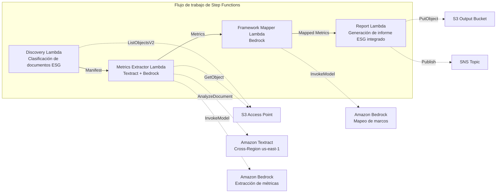

# UC23: Sostenibilidad y ESG — Extracción de métricas / Mapeo de marcos

🌐 **Language / 言語**: [日本語](README.md) | [English](README.en.md) | [한국어](README.ko.md) | [简体中文](README.zh-CN.md) | [繁體中文](README.zh-TW.md) | [Français](README.fr.md) | [Deutsch](README.de.md) | Español

📚 **Documentación**: [Arquitectura](docs/architecture.es.md) | [Guía de demostración](docs/demo-guide.es.md)

## Descripción general

Un flujo de trabajo serverless que aprovecha los S3 Access Points de FSx for ONTAP para extraer automáticamente métricas cuantitativas de documentos relacionados con ESG, como informes de sostenibilidad, registros de consumo de energía y manifiestos de residuos, y luego normalizar unidades y mapearlas a marcos de reporte.

### Cuándo se adapta este patrón

- Documentos relacionados con ESG (informes de sostenibilidad, registros de energía, manifiestos de residuos) están acumulados en FSx for ONTAP
- Desea normalizar automáticamente las emisiones de CO2, el uso de energía, el volumen de residuos y el consumo de agua desde diferentes unidades a una base unificada
- Necesita un mapeo automático a marcos como GRI, TCFD y CDP
- Desea visualizar el desempeño ESG con un análisis de tendencias interanual (YoY)
- Desea reducir el esfuerzo de preparar informes de divulgación ESG

### Cuándo no se adapta este patrón

- Necesita un panel de monitoreo ESG en tiempo real
- Necesita construir una plataforma de comercio de derechos de emisión
- Necesita la automatización completa de auditorías de aseguramiento por terceros
- Se encuentra en un entorno donde no se puede garantizar la accesibilidad de red a la API REST de ONTAP

### Funciones principales

- Detección y categorización automáticas de documentos ESG a través del S3 AP (Environmental / Social / Governance)
- Extracción de métricas cuantitativas con Textract + Bedrock (emisiones de CO2, energía, residuos, consumo de agua)
- Normalización de unidades (CO2→tCO2e, energía→MWh, residuos→t, agua→m³)
- Mapeo automático a los marcos GRI / TCFD / CDP
- Generación de un informe ESG integrado (agregación por categoría + por período de reporte, análisis de tendencias YoY)
- Comprobaciones de validación (unidades faltantes, contradicciones, valores atípicos)

## Success Metrics

### Outcome
Al automatizar la extracción de métricas ESG y la generación de informes integrados, mejorar la calidad de la divulgación de sostenibilidad y aumentar la eficiencia de las operaciones de reporte.

### Metrics
| Métrica | Objetivo (ejemplo) |
|---------|--------------------|
| Precisión de extracción de métricas ESG | ≥ 85 % |
| Consistencia de normalización de unidades | 100 % (conforme a la tabla de conversión definida) |
| Cobertura del mapeo de marcos | ≥ 80 % (GRI/TCFD/CDP) |
| Tiempo de generación de informes | < 5 min / lote |
| Costo / ejecución diaria | < $2.00 |
| Tasa de Human Review requerido | > 20 % (métricas con validación fallida) |

### Measurement Method
Historial de ejecución de Step Functions, resultados de extracción de Textract, registros de precisión de mapeo de Bedrock, CloudWatch EMF Metrics (ProcessingDuration, SuccessCount, ErrorCount).

### Human Review Requirements
- Las métricas con validación fallida (unidades faltantes, valores contradictorios, valores atípicos) son verificadas por el equipo de sostenibilidad
- Los resultados del mapeo de marcos son revisados por el responsable de divulgación
- El informe ESG integrado anual es aprobado finalmente por la dirección y el equipo de RI

## Arquitectura



### Pasos del flujo de trabajo

1. **Discovery**: Detectar documentos ESG desde el S3 AP y clasificarlos en categorías E/S/G
2. **Metrics Extractor**: Extraer métricas cuantitativas con Textract + Bedrock y normalizar unidades
3. **Framework Mapper**: Mapear a los identificadores de marco GRI/TCFD/CDP con Bedrock
4. **Report**: Generar el informe ESG integrado (por categoría + tendencia YoY), notificación SNS

## Requisitos previos

> **Nota sobre NetworkOrigin del S3 AP**: La Lambda Discovery se implementa dentro de una VPC. Si el NetworkOrigin del S3 Access Point es `Internet`, no se puede acceder a través de un S3 Gateway VPC Endpoint (las solicitudes no se enrutan al plano de datos de FSx). Use un S3 AP con NetworkOrigin=VPC, o configure el acceso a través de una NAT Gateway. Para más detalles, consulte [S3AP Compatibility Notes](../docs/s3ap-compatibility-notes.md).

- Cuenta de AWS y permisos IAM adecuados
- Sistema de archivos FSx for ONTAP (ONTAP 9.17.1P4D3 o posterior)
- Un volumen con S3 Access Point habilitado
- VPC, subredes privadas
- Acceso a modelos de Amazon Bedrock habilitado (Claude / Nova)
- Amazon Textract — configuración de invocación Cross-Region (us-east-1)

## Procedimiento de implementación

### 1. Verificación de parámetros

Verifique de antemano los patrones de ruta de los documentos ESG (prefijos Environmental/Social/Governance).

### 2. Implementación con SAM

```bash
# Requisito previo: se requiere AWS SAM CLI. 'sam build' empaqueta el código y la capa compartida automáticamente.
sam build

sam deploy \
  --stack-name fsxn-esg-reporting \
  --parameter-overrides \
    S3AccessPointAlias=<your-volume-ext-s3alias> \
    S3AccessPointName=<your-s3ap-name> \
    VpcId=<your-vpc-id> \
    PrivateSubnetIds=<subnet-1>,<subnet-2> \
    ScheduleExpression="cron(0 0 * * ? *)" \
    NotificationEmail=<your-email@example.com> \
    EnableVpcEndpoints=false \
    EnableCloudWatchAlarms=false \
  --capabilities CAPABILITY_NAMED_IAM \
  --resolve-s3 \
  --region ap-northeast-1
```

> **Nota**: `template.yaml` se usa con la SAM CLI (`sam build` + `sam deploy`).
> Para implementar directamente con el comando `aws cloudformation deploy`, use `template-deploy.yaml` en su lugar (requiere el empaquetado previo de los archivos zip de Lambda y su carga a S3).

## Lista de parámetros de configuración

| Parámetro | Descripción | Predeterminado | Requerido |
|-----------|-------------|----------------|-----------|
| `S3AccessPointAlias` | FSx for ONTAP S3 AP Alias (para entrada) | — | ✅ |
| `S3AccessPointName` | Nombre del S3 AP (para otorgar permisos IAM) | `""` | ⚠️ Recomendado |
| `ScheduleExpression` | Expresión de programación de EventBridge Scheduler | `cron(0 0 * * ? *)` | |
| `VpcId` | VPC ID | — | ✅ |
| `PrivateSubnetIds` | Lista de ID de subredes privadas | — | ✅ |
| `NotificationEmail` | Dirección de correo electrónico de notificación SNS | — | ✅ |
| `MapConcurrency` | Número de ejecuciones paralelas del estado Map | `10` | |
| `LambdaMemorySize` | Tamaño de memoria de Lambda (MB) | `512` | |
| `LambdaTimeout` | Tiempo de espera de Lambda (segundos) | `300` | |
| `EnableVpcEndpoints` | Habilitar Interface VPC Endpoints | `false` | |
| `EnableCloudWatchAlarms` | Habilitar CloudWatch Alarms | `false` | |

## ⚠️ Consideraciones de rendimiento

- La capacidad de rendimiento de FSx for ONTAP se **comparte entre NFS/SMB/S3 AP**. Al ejecutar procesamiento en paralelo con MapConcurrency=10, puede afectar a otras cargas de trabajo en el mismo volumen.
- Para el procesamiento por lotes de grandes cantidades de archivos, verifique la Throughput Capacity (MBps) de FSx for ONTAP y ajuste MapConcurrency según sea necesario.
- Recomendado: En producción, comience con MapConcurrency=5 y auméntelo gradualmente mientras monitorea la métrica de CloudWatch de FSx for ONTAP (ThroughputUtilization).

## Limpieza

```bash
aws s3 rm s3://fsxn-esg-reporting-output-${AWS_ACCOUNT_ID} --recursive

aws cloudformation delete-stack \
  --stack-name fsxn-esg-reporting \
  --region ap-northeast-1

aws cloudformation wait stack-delete-complete \
  --stack-name fsxn-esg-reporting \
  --region ap-northeast-1
```

## Supported Regions

| Servicio | Restricción de región |
|----------|-----------------------|
| Amazon Textract | Invocación Cross-Region (us-east-1) |
| Amazon Bedrock | Verificar regiones compatibles ([Regiones compatibles con Bedrock](https://docs.aws.amazon.com/general/latest/gr/bedrock.html)) |

> UC23 solo invoca Textract en Cross-Region (us-east-1).

## Estimación de costos (aproximado mensual)

> **Nota**: Aproximado para la región ap-northeast-1. Los costos reales varían según el uso.

| Servicio | Uso supuesto | Aproximado mensual |
|----------|--------------|--------------------|
| Lambda | 4 funciones × ejecución diaria | ~$1-3 |
| S3 API | ~2K requests/día | ~$0.30 |
| Step Functions | ~200 transitions/día | ~$0.20 |
| Textract | ~100 pages/día | ~$2-5 |
| Bedrock (Nova Lite) | ~30K tokens/ejecución | ~$2-5 |

| Configuración | Aproximado mensual |
|---------------|--------------------|
| Configuración mínima (1 vez al día) | ~$6-15 |
| Configuración estándar | ~$15-40 |

---

## Governance Note

> Este patrón proporciona orientación de arquitectura técnica. No constituye asesoramiento legal, de cumplimiento ni regulatorio. La exactitud de los datos de divulgación ESG debe ser verificada por un organismo de aseguramiento externo. Las respuestas a los GRI Standards, las recomendaciones TCFD y el cuestionario CDP deben realizarse bajo la supervisión de consultores especializados.

> **Regulaciones relacionadas**: Ley de Instrumentos Financieros y Bolsa (informe de valores), divulgación de información financiera relacionada con el clima

---

## S3AP Compatibility

Para conocer las restricciones de compatibilidad, la solución de problemas y los patrones de activación de los FSx for ONTAP S3 Access Points, consulte [S3AP Compatibility Notes](../docs/s3ap-compatibility-notes.md).
