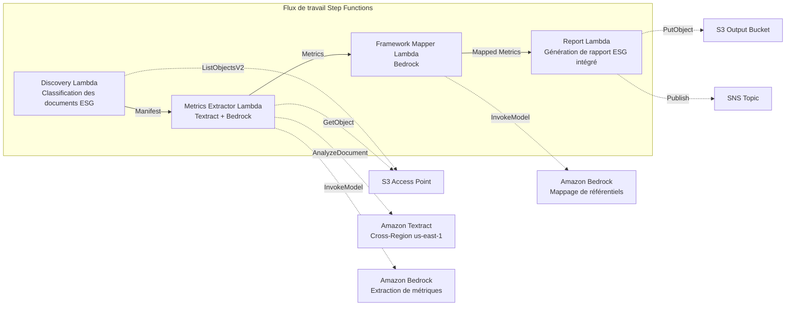

# UC23 : Durabilité et ESG — Extraction de métriques / Mappage de référentiels

🌐 **Language / 言語**: [日本語](README.md) | [English](README.en.md) | [한국어](README.ko.md) | [简体中文](README.zh-CN.md) | [繁體中文](README.zh-TW.md) | Français | [Deutsch](README.de.md) | [Español](README.es.md)

📚 **Documentation** : [Architecture](docs/architecture.fr.md) | [Guide de démonstration](docs/demo-guide.fr.md)

## Vue d'ensemble

Un flux de travail serverless qui exploite les S3 Access Points de FSx for ONTAP pour extraire automatiquement des métriques quantitatives à partir de documents liés à l'ESG tels que les rapports de durabilité, les registres de consommation d'énergie et les manifestes de déchets, puis normaliser les unités et les mapper à des référentiels de reporting.

### Quand ce modèle convient

- Des documents liés à l'ESG (rapports de durabilité, registres énergétiques, manifestes de déchets) sont accumulés sur FSx for ONTAP
- Vous souhaitez normaliser automatiquement les émissions de CO2, la consommation d'énergie, le volume de déchets et la consommation d'eau depuis différentes unités vers une base unifiée
- Vous avez besoin d'un mappage automatique vers des référentiels tels que GRI, TCFD et CDP
- Vous souhaitez visualiser la performance ESG avec une analyse de tendance d'une année sur l'autre (YoY)
- Vous souhaitez réduire l'effort de préparation des rapports de divulgation ESG

### Quand ce modèle ne convient pas

- Vous avez besoin d'un tableau de bord de surveillance ESG en temps réel
- Vous avez besoin de construire une plateforme d'échange de quotas d'émission
- Vous avez besoin d'une automatisation complète des audits d'assurance par des tiers
- Vous êtes dans un environnement où l'accessibilité réseau à l'API REST ONTAP ne peut pas être garantie

### Fonctionnalités principales

- Détection et catégorisation automatiques des documents ESG via le S3 AP (Environmental / Social / Governance)
- Extraction de métriques quantitatives avec Textract + Bedrock (émissions de CO2, énergie, déchets, consommation d'eau)
- Normalisation des unités (CO2→tCO2e, énergie→MWh, déchets→t, eau→m³)
- Mappage automatique vers les référentiels GRI / TCFD / CDP
- Génération de rapport ESG intégré (agrégation par catégorie + par période de reporting, analyse de tendance YoY)
- Contrôles de validation (unités manquantes, contradictions, valeurs aberrantes)

## Success Metrics

### Outcome
En automatisant l'extraction de métriques ESG et la génération de rapports intégrés, améliorer la qualité de la divulgation en matière de durabilité et accroître l'efficacité des opérations de reporting.

### Metrics
| Métrique | Cible (exemple) |
|----------|-----------------|
| Précision d'extraction des métriques ESG | ≥ 85 % |
| Cohérence de la normalisation des unités | 100 % (conforme à la table de conversion définie) |
| Couverture du mappage de référentiels | ≥ 80 % (GRI/TCFD/CDP) |
| Temps de génération de rapport | < 5 min / lot |
| Coût / exécution quotidienne | < 2,00 $ |
| Taux de Human Review requis | > 20 % (métriques ayant échoué à la validation) |

### Measurement Method
Historique d'exécution Step Functions, résultats d'extraction Textract, journaux de précision de mappage Bedrock, CloudWatch EMF Metrics (ProcessingDuration, SuccessCount, ErrorCount).

### Human Review Requirements
- Les métriques ayant échoué à la validation (unités manquantes, valeurs contradictoires, valeurs aberrantes) sont vérifiées par l'équipe durabilité
- Les résultats du mappage de référentiels sont examinés par le responsable de la divulgation
- Le rapport ESG intégré annuel est approuvé en dernier ressort par la direction et l'équipe RI

## Architecture



### Étapes du flux de travail

1. **Discovery** : Détecter les documents ESG depuis le S3 AP et les classer dans les catégories E/S/G
2. **Metrics Extractor** : Extraire les métriques quantitatives avec Textract + Bedrock et normaliser les unités
3. **Framework Mapper** : Mapper vers les identifiants de référentiel GRI/TCFD/CDP avec Bedrock
4. **Report** : Générer le rapport ESG intégré (par catégorie + tendance YoY), notification SNS

## Prérequis

> **Note sur le NetworkOrigin du S3 AP** : La Lambda Discovery est déployée à l'intérieur d'un VPC. Si le NetworkOrigin du S3 Access Point est `Internet`, il ne peut pas être accédé via un S3 Gateway VPC Endpoint (les requêtes ne sont pas routées vers le plan de données FSx). Utilisez un S3 AP avec NetworkOrigin=VPC, ou configurez l'accès via une NAT Gateway. Pour plus de détails, voir [S3AP Compatibility Notes](../docs/s3ap-compatibility-notes.md).

- Compte AWS et autorisations IAM appropriées
- Système de fichiers FSx for ONTAP (ONTAP 9.17.1P4D3 ou ultérieur)
- Un volume avec S3 Access Point activé
- VPC, sous-réseaux privés
- Accès aux modèles Amazon Bedrock activé (Claude / Nova)
- Amazon Textract — configuration d'appel Cross-Region (us-east-1)

## Procédure de déploiement

### 1. Vérification des paramètres

Vérifiez à l'avance les modèles de chemin des documents ESG (préfixes Environmental/Social/Governance).

### 2. Déploiement SAM

```bash
# Prérequis : AWS SAM CLI est requis. 'sam build' empaquette automatiquement le code et la couche partagée.
sam build

sam deploy \
  --stack-name fsxn-esg-reporting \
  --parameter-overrides \
    S3AccessPointAlias=<your-volume-ext-s3alias> \
    S3AccessPointName=<your-s3ap-name> \
    VpcId=<your-vpc-id> \
    PrivateSubnetIds=<subnet-1>,<subnet-2> \
    ScheduleExpression="cron(0 0 * * ? *)" \
    NotificationEmail=<your-email@example.com> \
    EnableVpcEndpoints=false \
    EnableCloudWatchAlarms=false \
  --capabilities CAPABILITY_NAMED_IAM \
  --resolve-s3 \
  --region ap-northeast-1
```

> **Remarque** : `template.yaml` s'utilise avec la SAM CLI (`sam build` + `sam deploy`).
> Pour déployer directement avec la commande `aws cloudformation deploy`, utilisez `template-deploy.yaml` (cela nécessite l'empaquetage préalable des fichiers zip Lambda et leur téléversement vers S3).

## Liste des paramètres de configuration

| Paramètre | Description | Par défaut | Requis |
|-----------|-------------|------------|--------|
| `S3AccessPointAlias` | FSx for ONTAP S3 AP Alias (pour l'entrée) | — | ✅ |
| `S3AccessPointName` | Nom du S3 AP (pour l'octroi des autorisations IAM) | `""` | ⚠️ Recommandé |
| `ScheduleExpression` | Expression de planification EventBridge Scheduler | `cron(0 0 * * ? *)` | |
| `VpcId` | VPC ID | — | ✅ |
| `PrivateSubnetIds` | Liste des ID de sous-réseaux privés | — | ✅ |
| `NotificationEmail` | Adresse e-mail de notification SNS | — | ✅ |
| `MapConcurrency` | Nombre d'exécutions parallèles de l'état Map | `10` | |
| `LambdaMemorySize` | Taille de mémoire Lambda (Mo) | `512` | |
| `LambdaTimeout` | Délai d'expiration Lambda (secondes) | `300` | |
| `EnableVpcEndpoints` | Activer les Interface VPC Endpoints | `false` | |
| `EnableCloudWatchAlarms` | Activer les CloudWatch Alarms | `false` | |

## ⚠️ Considérations de performance

- La capacité de débit de FSx for ONTAP est **partagée entre NFS/SMB/S3 AP**. Lors de l'exécution d'un traitement parallèle avec MapConcurrency=10, cela peut affecter d'autres charges de travail sur le même volume.
- Pour le traitement par lots d'un grand nombre de fichiers, vérifiez la Throughput Capacity (MBps) de FSx for ONTAP et ajustez MapConcurrency en conséquence.
- Recommandé : En production, commencez avec MapConcurrency=5 et augmentez progressivement tout en surveillant la métrique CloudWatch de FSx for ONTAP (ThroughputUtilization).

## Nettoyage

```bash
aws s3 rm s3://fsxn-esg-reporting-output-${AWS_ACCOUNT_ID} --recursive

aws cloudformation delete-stack \
  --stack-name fsxn-esg-reporting \
  --region ap-northeast-1

aws cloudformation wait stack-delete-complete \
  --stack-name fsxn-esg-reporting \
  --region ap-northeast-1
```

## Supported Regions

| Service | Contrainte de région |
|---------|----------------------|
| Amazon Textract | Appel Cross-Region (us-east-1) |
| Amazon Bedrock | Vérifier les régions prises en charge ([Régions Bedrock prises en charge](https://docs.aws.amazon.com/general/latest/gr/bedrock.html)) |

> UC23 n'appelle que Textract en Cross-Region (us-east-1).

## Estimation des coûts (mensuelle approximative)

> **Note** : Estimation approximative pour la région ap-northeast-1. Les coûts réels varient selon l'utilisation.

| Service | Utilisation supposée | Estimation mensuelle |
|---------|----------------------|----------------------|
| Lambda | 4 fonctions × exécution quotidienne | ~1-3 $ |
| S3 API | ~2K requests/jour | ~0,30 $ |
| Step Functions | ~200 transitions/jour | ~0,20 $ |
| Textract | ~100 pages/jour | ~2-5 $ |
| Bedrock (Nova Lite) | ~30K tokens/exécution | ~2-5 $ |

| Configuration | Estimation mensuelle |
|---------------|----------------------|
| Configuration minimale (1x par jour) | ~6-15 $ |
| Configuration standard | ~15-40 $ |

---

## Governance Note

> Ce modèle fournit des orientations d'architecture technique. Il ne constitue pas un avis juridique, de conformité ou réglementaire. L'exactitude des données de divulgation ESG doit être vérifiée par un organisme d'assurance tiers. Les réponses aux GRI Standards, aux recommandations TCFD et au questionnaire CDP doivent être réalisées sous la supervision de consultants spécialisés.

> **Réglementations connexes** : Loi sur les instruments financiers et les échanges (rapport annuel de valeurs mobilières), divulgation d'informations financières liées au climat

---

## S3AP Compatibility

Pour les contraintes de compatibilité des FSx for ONTAP S3 Access Points, le dépannage et les modèles de déclencheur, voir [S3AP Compatibility Notes](../docs/s3ap-compatibility-notes.md).
