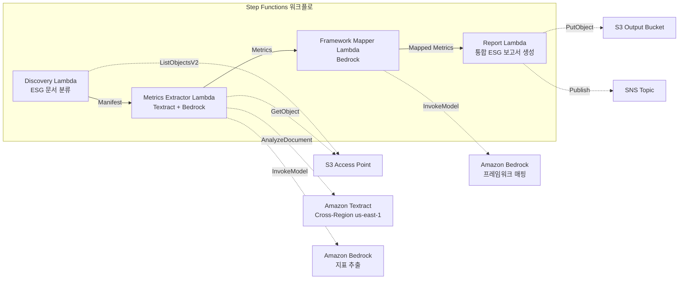

# UC23: 지속가능성·ESG — 지표 추출 / 프레임워크 매핑

🌐 **Language / 言語**: [日本語](README.md) | [English](README.en.md) | 한국어 | [简体中文](README.zh-CN.md) | [繁體中文](README.zh-TW.md) | [Français](README.fr.md) | [Deutsch](README.de.md) | [Español](README.es.md)

📚 **문서**: [아키텍처 다이어그램](docs/architecture.ko.md) | [데모 가이드](docs/demo-guide.ko.md)

## 개요

FSx for ONTAP의 S3 Access Points를 활용하여 지속가능성 보고서, 에너지 소비 기록, 폐기물 매니페스트 등 ESG 관련 문서에서 정량 지표를 자동으로 추출하고 단위 정규화 및 프레임워크 매핑을 수행하는 서버리스 워크플로입니다.

### 이 패턴이 적합한 경우

- ESG 관련 문서(지속가능성 보고서, 에너지 기록, 폐기물 매니페스트)가 FSx for ONTAP에 축적되어 있음
- CO2 배출량, 에너지 사용량, 폐기물량, 물 사용량을 서로 다른 단위에서 통일 기준으로 자동 정규화하고 싶음
- GRI, TCFD, CDP 등의 프레임워크로 자동 매핑이 필요함
- 연도 비교(YoY) 추세 분석으로 ESG 성과를 시각화하고 싶음
- ESG 공시 보고서 작성 공수를 줄이고 싶음

### 이 패턴이 적합하지 않은 경우

- 실시간 ESG 모니터링 대시보드가 필요함
- 배출권 거래 플랫폼 구축이 필요함
- 제3자 보증 감사의 완전 자동화가 필요함
- ONTAP REST API에 대한 네트워크 도달성을 확보할 수 없는 환경

### 주요 기능

- S3 AP를 통해 ESG 문서를 자동 검색·카테고리 분류(Environmental / Social / Governance)
- Textract + Bedrock을 통한 정량 지표 추출(CO2 배출량, 에너지, 폐기물, 물 사용량)
- 단위 정규화(CO2→tCO2e, 에너지→MWh, 폐기물→t, 물→m³)
- GRI / TCFD / CDP 프레임워크로 자동 매핑
- 통합 ESG 보고서 생성(카테고리별 + 보고 기간별 집계, YoY 추세 분석)
- 검증 체크(단위 누락, 모순, 이상치)

## Success Metrics

### Outcome
ESG 지표 추출과 통합 보고서 생성의 자동화를 통해 지속가능성 공시의 품질 향상과 보고 업무의 효율화를 실현합니다.

### Metrics
| 지표 | 목표값(예시) |
|-----|------------|
| ESG 지표 추출 정확도 | ≥ 85% |
| 단위 정규화 일관성 | 100%(정의된 변환 테이블 준수) |
| 프레임워크 매핑 커버리지 | ≥ 80%(GRI/TCFD/CDP) |
| 보고서 생성 시간 | < 5분 / 배치 |
| 비용 / 일일 실행 | < $2.00 |
| Human Review 필수 비율 | > 20%(검증 실패 지표) |

### Measurement Method
Step Functions 실행 이력, Textract 추출 결과, Bedrock 매핑 정확도 로그, CloudWatch EMF Metrics(ProcessingDuration, SuccessCount, ErrorCount).

### Human Review Requirements
- 검증 실패 지표(단위 누락, 모순 값, 이상치)는 지속가능성 팀이 확인
- 프레임워크 매핑 결과는 공시 담당자가 검토
- 연간 ESG 통합 보고서는 경영진·IR 팀이 최종 승인

## 아키텍처



### 워크플로 단계

1. **Discovery**: S3 AP에서 ESG 문서를 검색하여 E/S/G 카테고리로 분류
2. **Metrics Extractor**: Textract + Bedrock으로 정량 지표를 추출·단위 정규화
3. **Framework Mapper**: Bedrock으로 GRI/TCFD/CDP 프레임워크 식별자에 매핑
4. **Report**: 통합 ESG 보고서 생성(카테고리별 + YoY 추세), SNS 알림

## 사전 요구 사항

> **S3 AP NetworkOrigin 주의**: Discovery Lambda는 VPC 내부에 배치됩니다. S3 Access Point의 NetworkOrigin이 `Internet`인 경우 S3 Gateway VPC Endpoint를 통해서는 접근할 수 없습니다(FSx 데이터 플레인으로 라우팅되지 않기 때문). NetworkOrigin=VPC인 S3 AP를 사용하거나 NAT Gateway를 통한 접근을 구성하세요. 자세한 내용은 [S3AP Compatibility Notes](../docs/s3ap-compatibility-notes.md)를 참조하세요.

- AWS 계정과 적절한 IAM 권한
- FSx for ONTAP 파일 시스템(ONTAP 9.17.1P4D3 이상)
- S3 Access Point가 활성화된 볼륨
- VPC, 프라이빗 서브넷
- Amazon Bedrock 모델 액세스 활성화(Claude / Nova)
- Amazon Textract — Cross-Region (us-east-1) 호출 구성

## 배포 절차

### 1. 파라미터 확인

ESG 문서의 경로 패턴(Environmental/Social/Governance 프리픽스)을 사전에 확인합니다.

### 2. SAM 배포

```bash
# 전제: AWS SAM CLI가 필요합니다. sam build가 코드와 공유 레이어를 자동으로 패키징합니다.
sam build

sam deploy \
  --stack-name fsxn-esg-reporting \
  --parameter-overrides \
    S3AccessPointAlias=<your-volume-ext-s3alias> \
    S3AccessPointName=<your-s3ap-name> \
    VpcId=<your-vpc-id> \
    PrivateSubnetIds=<subnet-1>,<subnet-2> \
    ScheduleExpression="cron(0 0 * * ? *)" \
    NotificationEmail=<your-email@example.com> \
    EnableVpcEndpoints=false \
    EnableCloudWatchAlarms=false \
  --capabilities CAPABILITY_NAMED_IAM \
  --resolve-s3 \
  --region ap-northeast-1
```

> **주의**: `template.yaml`은 SAM CLI(`sam build` + `sam deploy`)로 사용합니다.
> `aws cloudformation deploy` 명령으로 직접 배포하는 경우 `template-deploy.yaml`을 사용하세요(Lambda zip 파일의 사전 패키징과 S3 업로드가 필요합니다).

## 설정 파라미터 목록

| 파라미터 | 설명 | 기본값 | 필수 |
|---------|------|-------|------|
| `S3AccessPointAlias` | FSx for ONTAP S3 AP Alias(입력용) | — | ✅ |
| `S3AccessPointName` | S3 AP 이름(IAM 권한 부여용) | `""` | ⚠️ 권장 |
| `ScheduleExpression` | EventBridge Scheduler 스케줄 식 | `cron(0 0 * * ? *)` | |
| `VpcId` | VPC ID | — | ✅ |
| `PrivateSubnetIds` | 프라이빗 서브넷 ID 목록 | — | ✅ |
| `NotificationEmail` | SNS 알림 대상 이메일 주소 | — | ✅ |
| `MapConcurrency` | Map 상태 병렬 실행 수 | `10` | |
| `LambdaMemorySize` | Lambda 메모리 크기 (MB) | `512` | |
| `LambdaTimeout` | Lambda 타임아웃 (초) | `300` | |
| `EnableVpcEndpoints` | Interface VPC Endpoints 활성화 | `false` | |
| `EnableCloudWatchAlarms` | CloudWatch Alarms 활성화 | `false` | |

## ⚠️ 성능에 관한 주의 사항

- FSx for ONTAP의 처리량 용량은 **NFS/SMB/S3 AP 전체에서 공유**됩니다. MapConcurrency=10으로 병렬 처리를 수행하는 경우 동일 볼륨의 다른 워크로드에 영향을 줄 수 있습니다.
- 대량 파일의 일괄 처리를 수행하는 경우 FSx for ONTAP의 Throughput Capacity (MBps)를 확인하고 필요에 따라 MapConcurrency를 조정하세요.
- 권장: 프로덕션 환경에서는 먼저 MapConcurrency=5로 시작하고 FSx for ONTAP의 CloudWatch 지표(ThroughputUtilization)를 모니터링하면서 단계적으로 증가시키세요.

## 정리

```bash
aws s3 rm s3://fsxn-esg-reporting-output-${AWS_ACCOUNT_ID} --recursive

aws cloudformation delete-stack \
  --stack-name fsxn-esg-reporting \
  --region ap-northeast-1

aws cloudformation wait stack-delete-complete \
  --stack-name fsxn-esg-reporting \
  --region ap-northeast-1
```

## Supported Regions

| 서비스 | 리전 제약 |
|-------|----------|
| Amazon Textract | Cross-Region (us-east-1) 호출 |
| Amazon Bedrock | 지원 리전 확인([Bedrock 지원 리전](https://docs.aws.amazon.com/general/latest/gr/bedrock.html)) |

> UC23은 Textract만 Cross-Region (us-east-1)에서 호출합니다.

## 비용 견적(월액 개산)

> **참고**: ap-northeast-1 리전의 개산입니다. 실제 비용은 사용량에 따라 다릅니다.

| 서비스 | 예상 사용량 | 월액 개산 |
|-------|-----------|----------|
| Lambda | 4 함수 × 일일 실행 | ~$1-3 |
| S3 API | ~2K requests/일 | ~$0.30 |
| Step Functions | ~200 transitions/일 | ~$0.20 |
| Textract | ~100 pages/일 | ~$2-5 |
| Bedrock (Nova Lite) | ~30K tokens/실행 | ~$2-5 |

| 구성 | 월액 개산 |
|------|----------|
| 최소 구성(일 1회) | ~$6-15 |
| 표준 구성 | ~$15-40 |

---

## Governance Note

> 본 패턴은 기술 아키텍처 가이던스를 제공합니다. 법적·컴플라이언스·규제상의 조언이 아닙니다. ESG 공시 데이터의 정확성은 제3자 보증 기관에 의한 검증이 권장됩니다. GRI Standards, TCFD 권고, CDP 질문서 대응은 전문 컨설턴트의 감수하에 수행하세요.

> **관련 규제**: 금융상품거래법(유가증권보고서), 기후변화 관련 재무정보 공시

---

## S3AP Compatibility

FSx for ONTAP S3 Access Points의 호환성 제약, 트러블슈팅, 트리거 패턴에 대해서는 [S3AP Compatibility Notes](../docs/s3ap-compatibility-notes.md)를 참조하세요.
