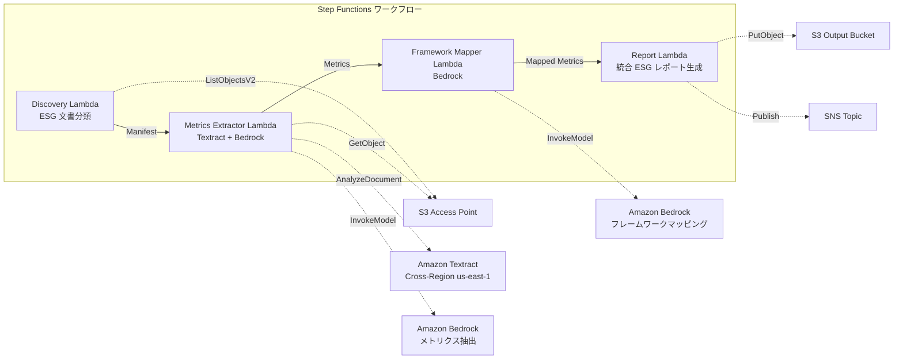

# UC23: サステナビリティ・ESG — メトリクス抽出 / フレームワークマッピング

🌐 **Language / 言語**: 日本語 | [English](README.en.md) | [한국어](README.ko.md) | [简体中文](README.zh-CN.md) | [繁體中文](README.zh-TW.md) | [Français](README.fr.md) | [Deutsch](README.de.md) | [Español](README.es.md)

📚 **ドキュメント**: [アーキテクチャ図](docs/architecture.md) | [デモガイド](docs/demo-guide.md)

## 概要

FSx for ONTAP の S3 Access Points を活用し、サステナビリティレポート、エネルギー消費記録、廃棄物マニフェスト等の ESG 関連文書から定量メトリクスを自動抽出し、単位正規化・フレームワークマッピングを行うサーバーレスワークフローです。

### このパターンが適しているケース

- ESG 関連文書（サステナビリティレポート、エネルギー記録、廃棄物マニフェスト）が FSx for ONTAP 上に蓄積されている
- CO2 排出量、エネルギー使用量、廃棄物量、水使用量を異なる単位から統一基準に自動正規化したい
- GRI、TCFD、CDP 等のフレームワークへの自動マッピングが必要
- 年度比較（YoY）トレンド分析で ESG パフォーマンスを可視化したい
- ESG 開示レポート作成の工数を削減したい

### このパターンが適さないケース

- リアルタイムの ESG モニタリングダッシュボードが必要
- 排出量取引プラットフォームの構築が必要
- 第三者保証監査の完全自動化が必要
- ONTAP REST API へのネットワーク到達性が確保できない環境

### 主な機能

- S3 AP 経由で ESG 文書を自動検出・カテゴリ分類（Environmental / Social / Governance）
- Textract + Bedrock による定量メトリクス抽出（CO2 排出量、エネルギー、廃棄物、水使用量）
- 単位正規化（CO2→tCO2e、エネルギー→MWh、廃棄物→t、水→m³）
- GRI / TCFD / CDP フレームワークへの自動マッピング
- 統合 ESG レポート生成（カテゴリ別 + 報告期間別集計、YoY トレンド分析）
- バリデーションチェック（単位欠落、矛盾、異常値）

## Success Metrics

### Outcome
ESG メトリクス抽出と統合レポート生成の自動化により、サステナビリティ開示の品質向上と報告業務の効率化を実現する。

### Metrics
| メトリクス | 目標値（例） |
|-----------|------------|
| ESG メトリクス抽出精度 | ≥ 85% |
| 単位正規化一貫性 | 100%（定義済み変換テーブル準拠） |
| フレームワークマッピングカバレッジ | ≥ 80%（GRI/TCFD/CDP） |
| レポート生成時間 | < 5 分 / バッチ |
| コスト / 日次実行 | < $2.00 |
| Human Review 必須率 | > 20%（バリデーション失敗メトリクス） |

### Measurement Method
Step Functions 実行履歴、Textract 抽出結果、Bedrock マッピング精度ログ、CloudWatch EMF Metrics（ProcessingDuration, SuccessCount, ErrorCount）。

### Human Review Requirements
- バリデーション失敗メトリクス（単位欠落、矛盾値、異常値）はサステナビリティチームが確認
- フレームワークマッピング結果は開示担当者がレビュー
- 年次 ESG 統合レポートは経営層・IR チームが最終承認

## アーキテクチャ



### ワークフローステップ

1. **Discovery**: S3 AP から ESG 文書を検出し E/S/G カテゴリに分類
2. **Metrics Extractor**: Textract + Bedrock で定量メトリクスを抽出・単位正規化
3. **Framework Mapper**: Bedrock で GRI/TCFD/CDP フレームワーク識別子にマッピング
4. **Report**: 統合 ESG レポート生成（カテゴリ別 + YoY トレンド）、SNS 通知

## 前提条件

> **S3 AP NetworkOrigin 注意**: Discovery Lambda は VPC 内に配置されます。S3 Access Point の NetworkOrigin が `Internet` の場合、S3 Gateway VPC Endpoint 経由ではアクセスできません（FSx データプレーンにルーティングされないため）。NetworkOrigin=VPC の S3 AP を使用するか、NAT Gateway 経由のアクセスを設定してください。詳細は [S3AP Compatibility Notes](../docs/s3ap-compatibility-notes.md) を参照。

- AWS アカウントと適切な IAM 権限
- FSx for ONTAP ファイルシステム（ONTAP 9.17.1P4D3 以上）
- S3 Access Point が有効化されたボリューム
- VPC、プライベートサブネット
- Amazon Bedrock モデルアクセスが有効（Claude / Nova）
- Amazon Textract — Cross-Region (us-east-1) 呼び出し設定

## デプロイ手順

### 1. パラメータの確認

ESG 文書のパスパターン（Environmental/Social/Governance プレフィクス）を事前に確認します。

### 2. SAM デプロイ

```bash
# 前提: AWS SAM CLI が必要です。sam build がコードと共有レイヤーを自動でパッケージングします。
sam build

sam deploy \
  --stack-name fsxn-esg-reporting \
  --parameter-overrides \
    S3AccessPointAlias=<your-volume-ext-s3alias> \
    S3AccessPointName=<your-s3ap-name> \
    VpcId=<your-vpc-id> \
    PrivateSubnetIds=<subnet-1>,<subnet-2> \
    ScheduleExpression="cron(0 0 * * ? *)" \
    NotificationEmail=<your-email@example.com> \
    EnableVpcEndpoints=false \
    EnableCloudWatchAlarms=false \
  --capabilities CAPABILITY_NAMED_IAM \
  --resolve-s3 \
  --region ap-northeast-1
```

> **注意**: `template.yaml` は SAM CLI（`sam build` + `sam deploy`）で使用します。
> `aws cloudformation deploy` コマンドで直接デプロイする場合は `template-deploy.yaml` を使用してください（Lambda zip ファイルの事前パッケージングと S3 アップロードが必要です）。

## 設定パラメータ一覧

| パラメータ | 説明 | デフォルト | 必須 |
|-----------|------|----------|------|
| `S3AccessPointAlias` | FSx for ONTAP S3 AP Alias（入力用） | — | ✅ |
| `S3AccessPointName` | S3 AP 名（IAM 権限付与用） | `""` | ⚠️ 推奨 |
| `ScheduleExpression` | EventBridge Scheduler スケジュール式 | `cron(0 0 * * ? *)` | |
| `VpcId` | VPC ID | — | ✅ |
| `PrivateSubnetIds` | プライベートサブネット ID リスト | — | ✅ |
| `NotificationEmail` | SNS 通知先メールアドレス | — | ✅ |
| `MapConcurrency` | Map ステート並列実行数 | `10` | |
| `LambdaMemorySize` | Lambda メモリサイズ (MB) | `512` | |
| `LambdaTimeout` | Lambda タイムアウト (秒) | `300` | |
| `EnableVpcEndpoints` | Interface VPC Endpoints 有効化 | `false` | |
| `EnableCloudWatchAlarms` | CloudWatch Alarms 有効化 | `false` | |

## ⚠️ パフォーマンスに関する注意事項

- FSx for ONTAP のスループットキャパシティは **NFS/SMB/S3 AP 全体で共有**されます。MapConcurrency=10 で並列処理を行う場合、同一ボリュームの他のワークロードに影響する可能性があります。
- 大量ファイルの一括処理を行う場合は、FSx for ONTAP の Throughput Capacity (MBps) を確認し、必要に応じて MapConcurrency を調整してください。
- 推奨: 本番環境では最初に MapConcurrency=5 で開始し、FSx for ONTAP の CloudWatch メトリクス (ThroughputUtilization) を監視しながら段階的に増加させてください。

## クリーンアップ

```bash
aws s3 rm s3://fsxn-esg-reporting-output-${AWS_ACCOUNT_ID} --recursive

aws cloudformation delete-stack \
  --stack-name fsxn-esg-reporting \
  --region ap-northeast-1

aws cloudformation wait stack-delete-complete \
  --stack-name fsxn-esg-reporting \
  --region ap-northeast-1
```

## Supported Regions

| サービス | リージョン制約 |
|---------|-------------|
| Amazon Textract | Cross-Region (us-east-1) 呼び出し |
| Amazon Bedrock | 対応リージョン確認（[Bedrock 対応リージョン](https://docs.aws.amazon.com/general/latest/gr/bedrock.html)） |

> UC23 は Textract のみ Cross-Region (us-east-1) で呼び出します。

## コスト見積もり（月額概算）

> **注記**: ap-northeast-1 リージョンの概算。実際のコストは使用量により異なります。

| サービス | 想定使用量 | 月額概算 |
|---------|-----------|---------|
| Lambda | 4 関数 × 日次実行 | ~$1-3 |
| S3 API | ~2K requests/日 | ~$0.30 |
| Step Functions | ~200 transitions/日 | ~$0.20 |
| Textract | ~100 pages/日 | ~$2-5 |
| Bedrock (Nova Lite) | ~30K tokens/実行 | ~$2-5 |

| 構成 | 月額概算 |
|------|---------|
| 最小構成（日次 1 回） | ~$6-15 |
| 標準構成 | ~$15-40 |

---

## Governance Note

> 本パターンは技術アーキテクチャガイダンスを提供します。法的・コンプライアンス・規制上の助言ではありません。ESG 開示データの正確性は第三者保証機関による検証が推奨されます。GRI Standards、TCFD 提言、CDP 質問票への対応は専門コンサルタントの監修のもとで行ってください。

> **関連規制**: 金融商品取引法（有価証券報告書）、気候変動関連財務情報開示

---

## S3AP Compatibility

S3 Access Points for FSx for ONTAP の互換性制約、トラブルシューティング、トリガーパターンについては [S3AP Compatibility Notes](../docs/s3ap-compatibility-notes.md) を参照してください。
