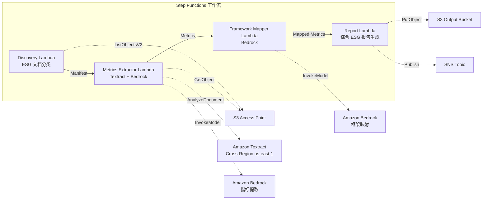

# UC23：可持续发展与 ESG — 指标提取 / 框架映射

🌐 **Language / 言語**: [日本語](README.md) | [English](README.en.md) | [한국어](README.ko.md) | 简体中文 | [繁體中文](README.zh-TW.md) | [Français](README.fr.md) | [Deutsch](README.de.md) | [Español](README.es.md)

📚 **文档**: [架构图](docs/architecture.zh-CN.md) | [演示指南](docs/demo-guide.zh-CN.md)

## 概述

这是一个利用 FSx for ONTAP 的 S3 Access Points 的无服务器工作流，可从可持续发展报告、能源消耗记录、废弃物清单等 ESG 相关文档中自动提取定量指标，并进行单位标准化和框架映射。

### 适合此模式的场景

- ESG 相关文档（可持续发展报告、能源记录、废弃物清单）已累积在 FSx for ONTAP 上
- 希望将 CO2 排放量、能源使用量、废弃物量、水使用量从不同单位自动标准化为统一基准
- 需要自动映射到 GRI、TCFD、CDP 等框架
- 希望通过年度比较（YoY）趋势分析将 ESG 绩效可视化
- 希望减少编制 ESG 披露报告的工作量

### 不适合此模式的场景

- 需要实时 ESG 监控仪表板
- 需要构建排放权交易平台
- 需要第三方保证审计的完全自动化
- 无法确保对 ONTAP REST API 的网络可达性的环境

### 主要功能

- 通过 S3 AP 自动检测 ESG 文档并进行分类（Environmental / Social / Governance）
- 通过 Textract + Bedrock 提取定量指标（CO2 排放量、能源、废弃物、水使用量）
- 单位标准化（CO2→tCO2e、能源→MWh、废弃物→t、水→m³）
- 自动映射到 GRI / TCFD / CDP 框架
- 生成综合 ESG 报告（按类别 + 按报告期汇总，YoY 趋势分析）
- 验证检查（单位缺失、矛盾、异常值）

## Success Metrics

### Outcome
通过自动化 ESG 指标提取和综合报告生成，实现可持续发展披露的质量提升和报告工作的效率化。

### Metrics
| 指标 | 目标值（示例） |
|-----|--------------|
| ESG 指标提取精度 | ≥ 85% |
| 单位标准化一致性 | 100%（遵循已定义的转换表） |
| 框架映射覆盖率 | ≥ 80%（GRI/TCFD/CDP） |
| 报告生成时间 | < 5 分钟 / 批次 |
| 成本 / 每日执行 | < $2.00 |
| Human Review 必需率 | > 20%（验证失败指标） |

### Measurement Method
Step Functions 执行历史、Textract 提取结果、Bedrock 映射精度日志、CloudWatch EMF Metrics（ProcessingDuration、SuccessCount、ErrorCount）。

### Human Review Requirements
- 验证失败指标（单位缺失、矛盾值、异常值）由可持续发展团队确认
- 框架映射结果由披露负责人审核
- 年度 ESG 综合报告由管理层·IR 团队最终批准

## 架构



### 工作流步骤

1. **Discovery**：从 S3 AP 检测 ESG 文档并分类为 E/S/G 类别
2. **Metrics Extractor**：使用 Textract + Bedrock 提取定量指标并进行单位标准化
3. **Framework Mapper**：使用 Bedrock 映射到 GRI/TCFD/CDP 框架标识符
4. **Report**：生成综合 ESG 报告（按类别 + YoY 趋势），SNS 通知

## 前提条件

> **S3 AP NetworkOrigin 注意**：Discovery Lambda 部署在 VPC 内部。如果 S3 Access Point 的 NetworkOrigin 为 `Internet`，则无法通过 S3 Gateway VPC Endpoint 访问（因为不会路由到 FSx 数据平面）。请使用 NetworkOrigin=VPC 的 S3 AP，或配置通过 NAT Gateway 的访问。详情请参阅 [S3AP Compatibility Notes](../docs/s3ap-compatibility-notes.md)。

- AWS 账户和适当的 IAM 权限
- FSx for ONTAP 文件系统（ONTAP 9.17.1P4D3 或更高版本）
- 已启用 S3 Access Point 的卷
- VPC、私有子网
- 已启用 Amazon Bedrock 模型访问（Claude / Nova）
- Amazon Textract — Cross-Region (us-east-1) 调用配置

## 部署步骤

### 1. 确认参数

预先确认 ESG 文档的路径模式（Environmental/Social/Governance 前缀）。

### 2. SAM 部署

```bash
# 前提：需要 AWS SAM CLI。sam build 会自动打包代码和共享层。
sam build

sam deploy \
  --stack-name fsxn-esg-reporting \
  --parameter-overrides \
    S3AccessPointAlias=<your-volume-ext-s3alias> \
    S3AccessPointName=<your-s3ap-name> \
    VpcId=<your-vpc-id> \
    PrivateSubnetIds=<subnet-1>,<subnet-2> \
    ScheduleExpression="cron(0 0 * * ? *)" \
    NotificationEmail=<your-email@example.com> \
    EnableVpcEndpoints=false \
    EnableCloudWatchAlarms=false \
  --capabilities CAPABILITY_NAMED_IAM \
  --resolve-s3 \
  --region ap-northeast-1
```

> **注意**：`template.yaml` 用于 SAM CLI（`sam build` + `sam deploy`）。
> 如果使用 `aws cloudformation deploy` 命令直接部署，请使用 `template-deploy.yaml`（需要预先打包 Lambda zip 文件并上传到 S3）。

## 配置参数一览

| 参数 | 说明 | 默认值 | 必需 |
|-----|------|-------|------|
| `S3AccessPointAlias` | FSx for ONTAP S3 AP Alias（输入用） | — | ✅ |
| `S3AccessPointName` | S3 AP 名称（用于授予 IAM 权限） | `""` | ⚠️ 推荐 |
| `ScheduleExpression` | EventBridge Scheduler 调度表达式 | `cron(0 0 * * ? *)` | |
| `VpcId` | VPC ID | — | ✅ |
| `PrivateSubnetIds` | 私有子网 ID 列表 | — | ✅ |
| `NotificationEmail` | SNS 通知目标电子邮件地址 | — | ✅ |
| `MapConcurrency` | Map 状态并行执行数 | `10` | |
| `LambdaMemorySize` | Lambda 内存大小 (MB) | `512` | |
| `LambdaTimeout` | Lambda 超时 (秒) | `300` | |
| `EnableVpcEndpoints` | 启用 Interface VPC Endpoints | `false` | |
| `EnableCloudWatchAlarms` | 启用 CloudWatch Alarms | `false` | |

## ⚠️ 性能相关注意事项

- FSx for ONTAP 的吞吐量容量在 **NFS/SMB/S3 AP 之间共享**。使用 MapConcurrency=10 进行并行处理时，可能会影响同一卷上的其他工作负载。
- 进行大量文件的批量处理时，请确认 FSx for ONTAP 的 Throughput Capacity (MBps) 并根据需要调整 MapConcurrency。
- 建议：在生产环境中首先以 MapConcurrency=5 开始，并在监控 FSx for ONTAP 的 CloudWatch 指标 (ThroughputUtilization) 的同时逐步增加。

## 清理

```bash
aws s3 rm s3://fsxn-esg-reporting-output-${AWS_ACCOUNT_ID} --recursive

aws cloudformation delete-stack \
  --stack-name fsxn-esg-reporting \
  --region ap-northeast-1

aws cloudformation wait stack-delete-complete \
  --stack-name fsxn-esg-reporting \
  --region ap-northeast-1
```

## Supported Regions

| 服务 | 区域限制 |
|-----|---------|
| Amazon Textract | Cross-Region (us-east-1) 调用 |
| Amazon Bedrock | 确认支持的区域（[Bedrock 支持的区域](https://docs.aws.amazon.com/general/latest/gr/bedrock.html)） |

> UC23 仅在 Cross-Region (us-east-1) 调用 Textract。

## 成本估算（每月概算）

> **备注**：ap-northeast-1 区域的概算。实际成本因使用量而异。

| 服务 | 假定使用量 | 每月概算 |
|-----|-----------|---------|
| Lambda | 4 个函数 × 每日执行 | ~$1-3 |
| S3 API | ~2K requests/日 | ~$0.30 |
| Step Functions | ~200 transitions/日 | ~$0.20 |
| Textract | ~100 pages/日 | ~$2-5 |
| Bedrock (Nova Lite) | ~30K tokens/执行 | ~$2-5 |

| 配置 | 每月概算 |
|-----|---------|
| 最小配置（每日 1 次） | ~$6-15 |
| 标准配置 | ~$15-40 |

---

## Governance Note

> 本模式提供技术架构指导。它不构成法律、合规或监管建议。ESG 披露数据的准确性建议由第三方保证机构进行验证。GRI Standards、TCFD 建议、CDP 问卷的应对应在专业顾问的监督下进行。

> **相关法规**：金融商品交易法（有价证券报告书）、气候变化相关财务信息披露

---

## S3AP Compatibility

有关 FSx for ONTAP S3 Access Points 的兼容性约束、故障排除和触发模式，请参阅 [S3AP Compatibility Notes](../docs/s3ap-compatibility-notes.md)。
