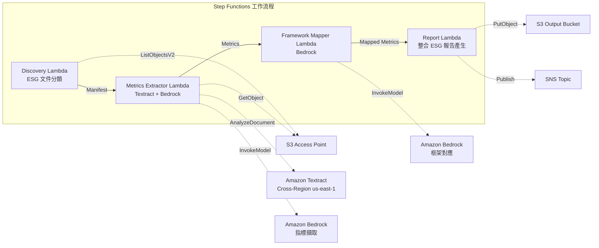

# UC23：永續發展與 ESG — 指標擷取 / 框架對應

🌐 **Language / 言語**: [日本語](README.md) | [English](README.en.md) | [한국어](README.ko.md) | [简体中文](README.zh-CN.md) | 繁體中文 | [Français](README.fr.md) | [Deutsch](README.de.md) | [Español](README.es.md)

📚 **文件**: [架構圖](docs/architecture.zh-TW.md) | [示範指南](docs/demo-guide.zh-TW.md)

## 概述

這是一個運用 FSx for ONTAP 的 S3 Access Points 的無伺服器工作流程，可從永續發展報告、能源消耗紀錄、廢棄物清單等 ESG 相關文件中自動擷取定量指標，並進行單位正規化與框架對應。

### 適合此模式的情境

- ESG 相關文件（永續發展報告、能源紀錄、廢棄物清單）已累積在 FSx for ONTAP 上
- 希望將 CO2 排放量、能源使用量、廢棄物量、水使用量從不同單位自動正規化為統一基準
- 需要自動對應到 GRI、TCFD、CDP 等框架
- 希望透過年度比較（YoY）趨勢分析將 ESG 績效視覺化
- 希望減少編製 ESG 揭露報告的工時

### 不適合此模式的情境

- 需要即時 ESG 監控儀表板
- 需要建構排放權交易平台
- 需要第三方保證稽核的完全自動化
- 無法確保對 ONTAP REST API 的網路可達性的環境

### 主要功能

- 透過 S3 AP 自動偵測 ESG 文件並進行分類（Environmental / Social / Governance）
- 透過 Textract + Bedrock 擷取定量指標（CO2 排放量、能源、廢棄物、水使用量）
- 單位正規化（CO2→tCO2e、能源→MWh、廢棄物→t、水→m³）
- 自動對應到 GRI / TCFD / CDP 框架
- 產生整合 ESG 報告（依類別 + 依報告期間彙總，YoY 趨勢分析）
- 驗證檢查（單位缺漏、矛盾、異常值）

## Success Metrics

### Outcome
透過自動化 ESG 指標擷取與整合報告產生，實現永續發展揭露的品質提升與報告作業的效率化。

### Metrics
| 指標 | 目標值（範例） |
|-----|--------------|
| ESG 指標擷取精確度 | ≥ 85% |
| 單位正規化一致性 | 100%（遵循已定義的轉換表） |
| 框架對應涵蓋率 | ≥ 80%（GRI/TCFD/CDP） |
| 報告產生時間 | < 5 分鐘 / 批次 |
| 成本 / 每日執行 | < $2.00 |
| Human Review 必要比率 | > 20%（驗證失敗指標） |

### Measurement Method
Step Functions 執行歷程、Textract 擷取結果、Bedrock 對應精確度記錄、CloudWatch EMF Metrics（ProcessingDuration、SuccessCount、ErrorCount）。

### Human Review Requirements
- 驗證失敗指標（單位缺漏、矛盾值、異常值）由永續發展團隊確認
- 框架對應結果由揭露負責人審查
- 年度 ESG 整合報告由經營層·IR 團隊最終核准

## 架構



### 工作流程步驟

1. **Discovery**：從 S3 AP 偵測 ESG 文件並分類為 E/S/G 類別
2. **Metrics Extractor**：使用 Textract + Bedrock 擷取定量指標並進行單位正規化
3. **Framework Mapper**：使用 Bedrock 對應到 GRI/TCFD/CDP 框架識別碼
4. **Report**：產生整合 ESG 報告（依類別 + YoY 趨勢），SNS 通知

## 前提條件

> **S3 AP NetworkOrigin 注意**：Discovery Lambda 部署在 VPC 內部。若 S3 Access Point 的 NetworkOrigin 為 `Internet`，則無法透過 S3 Gateway VPC Endpoint 存取（因為不會路由到 FSx 資料平面）。請使用 NetworkOrigin=VPC 的 S3 AP，或設定透過 NAT Gateway 的存取。詳情請參閱 [S3AP Compatibility Notes](../docs/s3ap-compatibility-notes.md)。

- AWS 帳戶與適當的 IAM 權限
- FSx for ONTAP 檔案系統（ONTAP 9.17.1P4D3 以上）
- 已啟用 S3 Access Point 的磁碟區
- VPC、私有子網路
- 已啟用 Amazon Bedrock 模型存取（Claude / Nova）
- Amazon Textract — Cross-Region (us-east-1) 呼叫設定

## 部署步驟

### 1. 確認參數

事先確認 ESG 文件的路徑模式（Environmental/Social/Governance 前綴）。

### 2. SAM 部署

```bash
# 前提：需要 AWS SAM CLI。sam build 會自動封裝程式碼與共用層。
sam build

sam deploy \
  --stack-name fsxn-esg-reporting \
  --parameter-overrides \
    S3AccessPointAlias=<your-volume-ext-s3alias> \
    S3AccessPointName=<your-s3ap-name> \
    VpcId=<your-vpc-id> \
    PrivateSubnetIds=<subnet-1>,<subnet-2> \
    ScheduleExpression="cron(0 0 * * ? *)" \
    NotificationEmail=<your-email@example.com> \
    EnableVpcEndpoints=false \
    EnableCloudWatchAlarms=false \
  --capabilities CAPABILITY_NAMED_IAM \
  --resolve-s3 \
  --region ap-northeast-1
```

> **注意**：`template.yaml` 用於 SAM CLI（`sam build` + `sam deploy`）。
> 若使用 `aws cloudformation deploy` 命令直接部署，請使用 `template-deploy.yaml`（需要事先封裝 Lambda zip 檔案並上傳至 S3）。

## 設定參數一覽

| 參數 | 說明 | 預設值 | 必要 |
|-----|------|-------|------|
| `S3AccessPointAlias` | FSx for ONTAP S3 AP Alias（輸入用） | — | ✅ |
| `S3AccessPointName` | S3 AP 名稱（用於授予 IAM 權限） | `""` | ⚠️ 建議 |
| `ScheduleExpression` | EventBridge Scheduler 排程運算式 | `cron(0 0 * * ? *)` | |
| `VpcId` | VPC ID | — | ✅ |
| `PrivateSubnetIds` | 私有子網路 ID 清單 | — | ✅ |
| `NotificationEmail` | SNS 通知目標電子郵件地址 | — | ✅ |
| `MapConcurrency` | Map 狀態並行執行數 | `10` | |
| `LambdaMemorySize` | Lambda 記憶體大小 (MB) | `512` | |
| `LambdaTimeout` | Lambda 逾時 (秒) | `300` | |
| `EnableVpcEndpoints` | 啟用 Interface VPC Endpoints | `false` | |
| `EnableCloudWatchAlarms` | 啟用 CloudWatch Alarms | `false` | |

## ⚠️ 效能相關注意事項

- FSx for ONTAP 的輸送量容量在 **NFS/SMB/S3 AP 之間共用**。使用 MapConcurrency=10 進行並行處理時，可能會影響同一磁碟區上的其他工作負載。
- 進行大量檔案的批次處理時，請確認 FSx for ONTAP 的 Throughput Capacity (MBps) 並視需要調整 MapConcurrency。
- 建議：在生產環境中先以 MapConcurrency=5 開始，並在監控 FSx for ONTAP 的 CloudWatch 指標 (ThroughputUtilization) 的同時逐步增加。

## 清理

```bash
aws s3 rm s3://fsxn-esg-reporting-output-${AWS_ACCOUNT_ID} --recursive

aws cloudformation delete-stack \
  --stack-name fsxn-esg-reporting \
  --region ap-northeast-1

aws cloudformation wait stack-delete-complete \
  --stack-name fsxn-esg-reporting \
  --region ap-northeast-1
```

## Supported Regions

| 服務 | 區域限制 |
|-----|---------|
| Amazon Textract | Cross-Region (us-east-1) 呼叫 |
| Amazon Bedrock | 確認支援的區域（[Bedrock 支援的區域](https://docs.aws.amazon.com/general/latest/gr/bedrock.html)） |

> UC23 僅在 Cross-Region (us-east-1) 呼叫 Textract。

## 成本估算（每月概算）

> **備註**：ap-northeast-1 區域的概算。實際成本因使用量而異。

| 服務 | 假定使用量 | 每月概算 |
|-----|-----------|---------|
| Lambda | 4 個函數 × 每日執行 | ~$1-3 |
| S3 API | ~2K requests/日 | ~$0.30 |
| Step Functions | ~200 transitions/日 | ~$0.20 |
| Textract | ~100 pages/日 | ~$2-5 |
| Bedrock (Nova Lite) | ~30K tokens/執行 | ~$2-5 |

| 組態 | 每月概算 |
|-----|---------|
| 最小組態（每日 1 次） | ~$6-15 |
| 標準組態 | ~$15-40 |

---

## Governance Note

> 本模式提供技術架構指導。它不構成法律、合規或監管建議。ESG 揭露資料的準確性建議由第三方保證機構進行驗證。GRI Standards、TCFD 建議、CDP 問卷的因應應在專業顧問的監督下進行。

> **相關法規**：金融商品交易法（有價證券報告書）、氣候變遷相關財務資訊揭露

---

## S3AP Compatibility

有關 FSx for ONTAP S3 Access Points 的相容性限制、疑難排解與觸發模式，請參閱 [S3AP Compatibility Notes](../docs/s3ap-compatibility-notes.md)。
