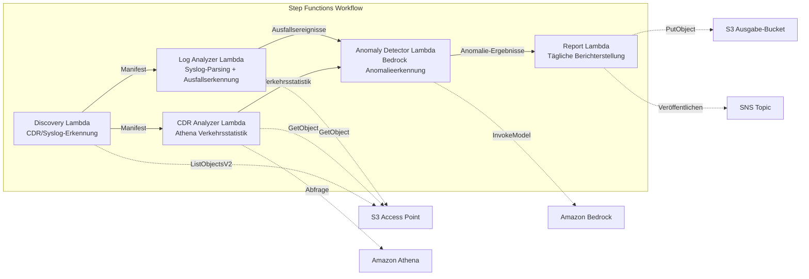

# UC18: Telekommunikation / Netzwerkanalyse — CDR/Netzwerk-Log Anomalieerkennung und Compliance-Berichte

🌐 **Language / 言語**: [日本語](README.md) | [English](README.en.md) | [한국어](README.ko.md) | [简体中文](README.zh-CN.md) | [繁體中文](README.zh-TW.md) | [Français](README.fr.md) | Deutsch | [Español](README.es.md)

📚 **Dokumentation**: [Architekturdiagramm](docs/architecture.de.md) | [Demo-Leitfaden](docs/demo-guide.de.md)

## Überblick

Ein serverloser Workflow, der S3 Access Points auf Amazon FSx for ONTAP nutzt, um CDR (Call Detail Records) und Netzwerkgeräte-Logs automatisch zu analysieren, Anomalien zu erkennen, Verkehrsstatistiken zu erstellen und Compliance-Berichte zu generieren.

### Geeignete Anwendungsfälle

- CDR-Dateien (CSV, ASN.1 decodiert, Parquet) sind auf FSx for ONTAP gespeichert
- Automatische Analyse von Netzwerkgeräte-Syslog/SNMP-Trap-Daten erforderlich
- Verkehrsstatistiken via Athena (stündliches Anrufvolumen, durchschnittliche Anrufdauer, Spitzen-Gleichzeitigkeitsanrufe)
- Anomalieerkennung via Bedrock (7-Tage rollierender Baseline-Vergleich, 3σ-Schwellenerkennung)
- Automatische Erkennung und Alarmierung von Geräteausfällen (Link-Down, Hardware-Fehler, Prozessabstürze)

### Hauptfunktionen

- Automatische Erkennung von CDR-Dateien (.csv, .asn1, .parquet) und Syslog-Dateien via S3 AP
- Verkehrsstatistik-Analyse via Athena (Anrufvolumen, Anrufdauer, Spitzen-Gleichzeitigkeitsverbindungen)
- Anomalieerkennung via Bedrock (3σ-Schwelle, 7-Tage-Baseline-Vergleich)
- Syslog RFC 5424 Parsing + SNMP-Trap-Datenanalyse
- Geräteausfallserkennung (Link-Down, Hardware-Fehler, Kapazitätsschwellenüberschreitung)
- Täglicher Netzwerkgesundheitsbericht + Anomalie-Alarme (SNS)

## Erfolgskennzahlen (Success Metrics)

### Erwartetes Ergebnis (Outcome)
Automatisierung der CDR/Netzwerk-Log-Analyse zur Beschleunigung der Netzwerkfehlererkennung und Kapazitätsplanung für Telekommunikationsanbieter.

### Kennzahlen (Metrics)
| Kennzahl | Zielwert (Beispiel) |
|----------|-------------------|
| Verarbeitete CDR-Dateien / Ausführung | > 200 Dateien |
| Genauigkeit der Anomalieerkennung | > 90% |
| Geräteausfalls-Erkennungsrate | > 95% |
| Berichterstellungszeit | < 5 Min / tägliche Charge |
| Kosten / tägliche Ausführung | < $1,00 |
| Rate der erforderlichen menschlichen Überprüfung | > 20% (kritische Anomalien vollständig überprüft) |

### Messmethode
Step Functions Ausführungshistorie, Athena-Abfrageergebnisse, Bedrock-Inferenzprotokolle, CloudWatch EMF Metrics (ProcessingDuration, SuccessCount, ErrorCount).

### Anforderungen an menschliche Überprüfung
- Kritische Anomalien über 3σ werden automatisch gemeldet und von Menschen bestätigt
- Geräteausfälle (Link-Down) lösen sofortige Benachrichtigung + Operatorbestätigung aus
- Monatliche Trendberichte werden vom Netzwerkplanungsteam überprüft

## Architektur



> **S3 AP NetworkOrigin Hinweis**: Die Discovery Lambda wird innerhalb eines VPC bereitgestellt. Wenn der NetworkOrigin des S3 Access Points `Internet` ist, kann über S3 Gateway VPC Endpoint nicht zugegriffen werden (Anfragen werden nicht an die FSx-Datenebene weitergeleitet). Verwenden Sie einen VPC-origin S3 AP oder konfigurieren Sie NAT Gateway-Zugriff. Siehe [S3AP-Kompatibilitätshinweise](../docs/s3ap-compatibility-notes.md).

## Bereitstellung

```bash
# Voraussetzung: AWS SAM CLI erforderlich. „sam build“ verpackt Code und Shared Layer automatisch.
sam build

sam deploy \
  --stack-name fsxn-telecom-analytics \
  --parameter-overrides \
    S3AccessPointAlias=<your-volume-ext-s3alias> \
    S3AccessPointName=<your-s3ap-name> \
    VpcId=<your-vpc-id> \
    PrivateSubnetIds=<subnet-1>,<subnet-2> \
    ScheduleExpression="cron(0 0 * * ? *)" \
    NotificationEmail=<your-email@example.com> \
    CdrSuffixFilter=".csv,.asn1,.parquet" \
    AnomalyThresholdStdDev=3 \
    CapacityThresholdPercent=80 \
  --capabilities CAPABILITY_NAMED_IAM \
  --resolve-s3 \
  --region ap-northeast-1
```

> **Hinweis**: `template.yaml` ist für die Verwendung mit der AWS SAM CLI (`sam build` + `sam deploy`) vorgesehen.
> Für eine direkte Bereitstellung mit `aws cloudformation deploy` verwenden Sie stattdessen `template-deploy.yaml` (erfordert das vorherige Packen der Lambda-Zip-Dateien und das Hochladen in einen S3-Bucket).

## ⚠️ Leistungshinweise

- Die Durchsatzkapazität von FSx for ONTAP wird **zwischen NFS/SMB/S3 AP geteilt**. Die parallele Ausführung mit MapConcurrency=10 kann andere Workloads auf demselben Volume beeinflussen.
- Bei der Verarbeitung großer Dateien prüfen Sie die FSx for ONTAP Throughput Capacity (MBps) und passen Sie MapConcurrency entsprechend an.
- Empfohlen: Beginnen Sie in der Produktion mit MapConcurrency=5, überwachen Sie die CloudWatch-Metriken (ThroughputUtilization) und erhöhen Sie schrittweise.

## Bereinigung (Cleanup)

```bash
aws s3 rm s3://fsxn-telecom-analytics-output-${AWS_ACCOUNT_ID} --recursive

aws cloudformation delete-stack \
  --stack-name fsxn-telecom-analytics \
  --region ap-northeast-1
```

## Governance-Hinweis

> Dieses Muster bietet technische Architekturberatung. Es stellt keine Rechts-, Compliance- oder Regulierungsberatung dar. CDR-Daten enthalten persönliche Kommunikationsdaten und müssen gemäß den geltenden Telekommunikationsvorschriften und Datenschutzgesetzen behandelt werden.

> **Related Regulations**: 電気通信事業法 (Telecommunications Business Act), 個人情報保護法 (APPI - Personal Information Protection)
