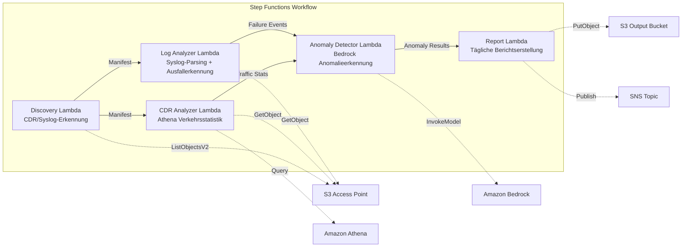

# UC18: Telekommunikation / Netzwerkanalyse — CDR/Netzwerkprotokoll-Anomalieerkennung und Compliance-Berichte

🌐 **Language / Sprache**: [日本語](README.md) | [English](README.en.md) | [한국어](README.ko.md) | [简体中文](README.zh-CN.md) | [繁體中文](README.zh-TW.md) | [Français](README.fr.md) | Deutsch | [Español](README.es.md)

📚 **Dokumentation**: [Architekturdiagramm](docs/architecture.de.md) | [Demo-Leitfaden](docs/demo-guide.de.md)

## Überblick

Ein serverloser Workflow, der die S3 Access Points von FSx for ONTAP nutzt, um die Anomalieerkennung von CDRs (Call Detail Records) und Netzwerkgeräteprotokollen, die Analyse von Verkehrsstatistiken und die automatische Erstellung von Compliance-Berichten zu realisieren.

### Fälle, in denen dieses Muster geeignet ist

- CDR-Dateien (CSV, ASN.1-dekodiert, Parquet) sind auf FSx for ONTAP angesammelt
- Sie möchten syslog- / SNMP-Trap-Daten von Netzwerkgeräten automatisch analysieren
- Sie möchten Verkehrsstatistiken über Athena berechnen (Anrufvolumen nach Tageszeit, durchschnittliche Anrufdauer, maximale Anzahl gleichzeitiger Anrufe)
- Sie möchten eine Anomalieerkennung über Bedrock durchführen (rollierender 7-Tage-Baseline-Vergleich, Erkennung einer 3σ-Überschreitung)
- Sie möchten Geräteausfälle (link-down, Hardwarefehler, Prozessabstürze) automatisch erkennen und melden

### Fälle, in denen dieses Muster nicht geeignet ist

- Ein Echtzeit-Netzwerküberwachungssystem wird benötigt (sekundengenaue Reaktionsfähigkeit)
- Eine vollständige NOC-Plattform (Network Operations Center) ist erforderlich
- Eine großskalige Netzwerktopologie-Analyse wird benötigt
- Eine Umgebung, in der die Netzwerkerreichbarkeit der ONTAP-REST-API nicht sichergestellt werden kann

### Hauptfunktionen

- Automatische Erkennung von CDR-Dateien (.csv, .asn1, .parquet) und syslog-Dateien über S3 AP
- Verkehrsstatistikanalyse über Athena (Anrufvolumen, Anrufdauer, maximale Anzahl gleichzeitiger Verbindungen)
- Anomalieerkennung über Bedrock (3σ-Überschreitung, 7-Tage-Baseline-Vergleich)
- Syslog-RFC-5424-Parsing + Analyse von SNMP-Trap-Daten
- Geräteausfallerkennung (link-down, Hardwarefehler, Überschreitung des Kapazitätsschwellenwerts)
- Täglicher Netzwerk-Gesundheitsbericht + Anomalie-Alarmbenachrichtigungen (SNS)

## Success Metrics

### Outcome
Beschleunigung der Netzwerkfehlererkennung und Kapazitätsplanung für Telekommunikationsbetreiber durch Automatisierung der CDR-/Netzwerkprotokollanalyse.

### Metrics
| Metrik | Zielwert (Beispiel) |
|-----------|------------|
| Anzahl verarbeiteter CDR-Dateien / Ausführung | > 200 files |
| Genauigkeit der Anomalieerkennung | > 90 % |
| Erkennungsrate von Geräteausfällen | > 95 % |
| Berichtserstellungszeit | < 5 Min. / täglicher Batch |
| Kosten / tägliche Ausführung | < $1.00 |
| Erforderliche Human-Review-Rate | > 20 % (schwerwiegende Anomalien werden alle geprüft) |

### Measurement Method
Step-Functions-Ausführungsverlauf, Athena-Abfrageergebnisse, Bedrock-Inferenzprotokolle, CloudWatch EMF Metrics (ProcessingDuration, SuccessCount, ErrorCount).

### Human Review Requirements
- Schwerwiegende Anomalien, die 3σ überschreiten, werden nach der automatischen Benachrichtigung von einem Menschen geprüft
- Geräteausfälle (link-down) lösen eine sofortige Benachrichtigung + Bestätigung durch den Bediener aus
- Monatliche Trendberichte werden vom Netzwerkplanungsteam überprüft

## Architektur



### Workflow-Schritte

1. **Discovery**: CDR- und syslog-Dateien vom S3 AP erkennen
2. **CDR Analyzer**: CDR parsen, Verkehrsstatistiken über Athena aggregieren
3. **Log Analyzer**: Syslog RFC 5424 parsen, SNMP-Traps analysieren, Geräteausfälle erkennen
4. **Anomaly Detector**: Mit der 7-Tage-Baseline vergleichen, Anomalien markieren, die 3σ überschreiten (Bedrock-Inferenz)
5. **Report**: Täglichen Netzwerk-Gesundheitsbericht erstellen + SNS-Alarme

## Voraussetzungen

> **Hinweis zu S3 AP NetworkOrigin**: Die Discovery Lambda wird innerhalb eines VPC bereitgestellt. Wenn der NetworkOrigin des S3 Access Point `Internet` ist, kann nicht über einen S3 Gateway VPC Endpoint zugegriffen werden (da die Anfragen nicht zur FSx-Datenebene geroutet werden). Verwenden Sie einen S3 AP mit NetworkOrigin=VPC oder konfigurieren Sie den Zugriff über ein NAT Gateway. Weitere Details finden Sie unter [S3AP Compatibility Notes](../docs/s3ap-compatibility-notes.md).

- AWS-Konto und geeignete IAM-Berechtigungen
- FSx for ONTAP-Dateisystem (ONTAP 9.17.1P4D3 oder höher)
- Volume mit aktiviertem S3 Access Point (speichert CDR/syslog)
- VPC, private Subnetze
- Amazon-Bedrock-Modellzugriff aktiviert (Claude / Nova)
- Amazon-Athena-Arbeitsgruppe konfiguriert

## Bereitstellungsverfahren

### 1. Überprüfung der Parameter

Überprüfen Sie im Voraus den Suffix-Filter der CDR-Dateien und die Kapazitätsschwellenwerte.

### 2. SAM-Bereitstellung

```bash
# Voraussetzung: AWS SAM CLI ist erforderlich. 'sam build' packt den Code und die gemeinsame Ebene automatisch.
sam build

sam deploy \
  --stack-name fsxn-telecom-analytics \
  --parameter-overrides \
    S3AccessPointAlias=<your-volume-ext-s3alias> \
    S3AccessPointName=<your-s3ap-name> \
    VpcId=<your-vpc-id> \
    PrivateSubnetIds=<subnet-1>,<subnet-2> \
    ScheduleExpression="cron(0 0 * * ? *)" \
    NotificationEmail=<your-email@example.com> \
    CdrSuffixFilter=".csv,.asn1,.parquet" \
    AnomalyThresholdStdDev=3 \
    CapacityThresholdPercent=80 \
    EnableVpcEndpoints=false \
    EnableCloudWatchAlarms=false \
  --capabilities CAPABILITY_NAMED_IAM \
  --resolve-s3 \
  --region ap-northeast-1
```

> **Hinweis**: `template.yaml` wird mit der SAM CLI (`sam build` + `sam deploy`) verwendet.
> Zum direkten Bereitstellen mit dem Befehl `aws cloudformation deploy` verwenden Sie `template-deploy.yaml` (erfordert das vorherige Packen der Lambda-Zip-Dateien und das Hochladen nach S3).

## Liste der Konfigurationsparameter

| Parameter | Beschreibung | Standard | Erforderlich |
|-----------|------|----------|------|
| `S3AccessPointAlias` | FSx for ONTAP S3 AP Alias (für Eingabe) | — | ✅ |
| `S3AccessPointName` | S3 AP-Name (für ARN-basierte IAM-Berechtigungsvergabe) | `""` | ⚠️ Empfohlen |
| `ScheduleExpression` | Zeitplanausdruck des EventBridge Scheduler | `cron(0 0 * * ? *)` | |
| `VpcId` | VPC-ID | — | ✅ |
| `PrivateSubnetIds` | Liste der privaten Subnetz-IDs | — | ✅ |
| `NotificationEmail` | SNS-Benachrichtigungs-E-Mail-Adresse | — | ✅ |
| `CdrSuffixFilter` | Suffix-Filter zur CDR-Dateierkennung | `.csv,.asn1,.parquet` | |
| `AnomalyThresholdStdDev` | Standardabweichungsschwellenwert für die Anomalieerkennung | `3` | |
| `CapacityThresholdPercent` | Kapazitätsschwellenwert (%) | `80` | |
| `BaselineWindowDays` | Baseline-Zeitraum (Tage) | `7` | |
| `MapConcurrency` | Anzahl paralleler Ausführungen des Map-Zustands | `10` | |
| `LambdaMemorySize` | Lambda-Speichergröße (MB) | `512` | |
| `LambdaTimeout` | Lambda-Timeout (Sekunden) | `300` | |
| `EnableVpcEndpoints` | Interface VPC Endpoints aktivieren | `false` | |
| `EnableCloudWatchAlarms` | CloudWatch Alarms aktivieren | `false` | |

## ⚠️ Hinweise zur Leistung

- Die Durchsatzkapazität von FSx for ONTAP wird **über NFS/SMB/S3 AP hinweg gemeinsam genutzt**. Wenn Sie eine parallele Verarbeitung mit MapConcurrency=10 durchführen, kann dies andere Workloads auf demselben Volume beeinträchtigen.
- Wenn Sie eine Stapelverarbeitung großer Dateimengen durchführen, überprüfen Sie die Throughput Capacity (MBps) von FSx for ONTAP und passen Sie MapConcurrency bei Bedarf an.
- Empfohlen: Beginnen Sie in der Produktionsumgebung zunächst mit MapConcurrency=5 und erhöhen Sie den Wert schrittweise, während Sie die CloudWatch-Metrik von FSx for ONTAP (ThroughputUtilization) überwachen.

## Bereinigung

```bash
aws s3 rm s3://fsxn-telecom-analytics-output-${AWS_ACCOUNT_ID} --recursive

aws cloudformation delete-stack \
  --stack-name fsxn-telecom-analytics \
  --region ap-northeast-1

aws cloudformation wait stack-delete-complete \
  --stack-name fsxn-telecom-analytics \
  --region ap-northeast-1
```

## Supported Regions

UC18 verwendet die folgenden Dienste:

| Dienst | Regionale Einschränkungen |
|---------|-------------|
| Amazon Athena | In fast allen Regionen verfügbar |
| Amazon Bedrock | Unterstützte Regionen prüfen ([Bedrock-Regionen](https://docs.aws.amazon.com/general/latest/gr/bedrock.html)) |
| AWS X-Ray | In fast allen Regionen verfügbar |
| CloudWatch EMF | In fast allen Regionen verfügbar |

> UC18 verwendet keine regionsübergreifenden Aufrufe. Athena und Bedrock sind in ap-northeast-1 verfügbar.

## Referenzlinks

- [FSx for ONTAP S3 Access Points – Überblick](https://docs.aws.amazon.com/fsx/latest/ONTAPGuide/accessing-data-via-s3-access-points.html)
- [Amazon Athena Benutzerhandbuch](https://docs.aws.amazon.com/athena/latest/ug/what-is.html)
- [Amazon Bedrock API-Referenz](https://docs.aws.amazon.com/bedrock/latest/APIReference/API_runtime_InvokeModel.html)

---

## AWS-Dokumentationslinks

| Dienst | Dokumentation |
|---------|------------|
| FSx for ONTAP | [Benutzerhandbuch](https://docs.aws.amazon.com/fsx/latest/ONTAPGuide/what-is-fsx-ontap.html) |
| S3 Access Points | [S3 AP for FSx for ONTAP](https://docs.aws.amazon.com/fsx/latest/ONTAPGuide/s3-access-points.html) |
| Step Functions | [Entwicklerhandbuch](https://docs.aws.amazon.com/step-functions/latest/dg/welcome.html) |
| Amazon Athena | [Benutzerhandbuch](https://docs.aws.amazon.com/athena/latest/ug/what-is.html) |
| Amazon Bedrock | [Benutzerhandbuch](https://docs.aws.amazon.com/bedrock/latest/userguide/what-is-bedrock.html) |

### Well-Architected Framework – Zuordnung

| Säule | Zuordnung |
|----|------|
| Operative Exzellenz | X-Ray-Tracing, EMF-Metriken, Anomalieerkennungsüberwachung |
| Sicherheit | IAM mit geringsten Rechten, KMS-Verschlüsselung, CDR-Datenzugriffssteuerung |
| Zuverlässigkeit | Step Functions Retry/Catch, exponential backoff (3 Wiederholungen) |
| Leistungseffizienz | Großskalige CDR-Abfragen über Athena, parallele Verarbeitung |
| Kostenoptimierung | Serverlos, Athena-Scan-basierte Abrechnung |
| Nachhaltigkeit | On-Demand-Ausführung, inkrementelle Verarbeitung |

---

## Kostenschätzung (monatlicher Näherungswert)

> **Anmerkung**: Die folgenden Werte sind Näherungswerte für die Region ap-northeast-1, und die tatsächlichen Kosten variieren je nach Nutzung. Prüfen Sie die aktuellen Preise mit dem [AWS Pricing Calculator](https://calculator.aws/).

### Serverlose Komponenten (nutzungsabhängige Abrechnung)

| Dienst | Stückpreis | Angenommene Nutzung | Monatlicher Näherungswert |
|---------|------|-----------|---------|
| Lambda | $0.0000166667/GB-sec | 5 Funktionen × tägliche Ausführung | ~$1-3 |
| S3 API (GetObject/ListObjects) | $0.0047/10K requests | ~5K requests/Tag | ~$0.75 |
| Step Functions | $0.025/1K state transitions | ~500 transitions/Tag | ~$0.40 |
| Bedrock (Nova Lite) | $0.00006/1K input tokens | ~30K tokens/Ausführung | ~$2-5 |
| Athena | $5/TB scanned | ~10 MB/Abfrage | ~$1-3 |
| SNS | $0.50/100K notifications | ~30 notifications/Tag | ~$0.10 |
| CloudWatch Logs | $0.76/GB ingested | ~500 MB/Monat | ~$0.38 |

### Fixkosten (FSx for ONTAP — setzt eine bestehende Umgebung voraus)

| Komponente | Monatlich |
|--------------|------|
| FSx for ONTAP (128 MBps, 1 TB) | ~$230 (teilt sich die bestehende Umgebung) |
| S3 Access Point | Keine zusätzlichen Gebühren (nur S3-API-Gebühren) |

### Gesamter Näherungswert

| Konfiguration | Monatlicher Näherungswert |
|------|---------|
| Minimalkonfiguration (1 tägliche Ausführung) | ~$5-12 |
| Standardkonfiguration (täglich + Alarme aktiviert) | ~$12-30 |
| Großskalige Konfiguration (hohe Frequenz + großes CDR-Volumen) | ~$30-100 |

> **Governance Caveat**: Kostenschätzungen sind Näherungswerte und keine garantierten Werte. Der tatsächliche Rechnungsbetrag variiert je nach Nutzungsmuster, Datenvolumen und Region.

---

## Lokale Tests

### Prerequisites-Prüfung

```bash
# Voraussetzungen prüfen
aws --version          # AWS CLI v2
sam --version          # SAM CLI
python3 --version      # Python 3.9+
docker --version       # Docker (für sam local)
aws sts get-caller-identity  # AWS-Anmeldeinformationen
```

### sam local invoke

```bash
# Build
# Voraussetzung: AWS SAM CLI ist erforderlich. 'sam build' packt den Code und die gemeinsame Ebene automatisch.
sam build

# Lokale Ausführung der Discovery Lambda
sam local invoke DiscoveryFunction --event events/discovery-event.json

# Mit Überschreibung von Umgebungsvariablen
sam local invoke DiscoveryFunction \
  --event events/discovery-event.json \
  --env-vars env.json
```

### Unit-Tests

```bash
python3 -m pytest tests/ -v
```

Weitere Details finden Sie unter [Schnellstart für lokale Tests](../docs/local-testing-quick-start.md).

---

## Governance Note

> Dieses Muster bietet technische Architekturberatung. Es handelt sich nicht um rechtliche, Compliance- oder regulatorische Beratung. Organisationen sollten qualifizierte Fachleute konsultieren. Da Telekommunikationsdaten (CDR) persönliche Kommunikationsdaten enthalten, müssen sie in Übereinstimmung mit den Telekommunikationsgesetzen und den Datenschutzgesetzen des jeweiligen Landes behandelt werden.

> **Zugehörige Vorschriften**: Telekommunikationsgesetz, Datenschutzgesetz (Fernmeldegeheimnis)

---

## S3AP Compatibility

Informationen zu Kompatibilitätsbeschränkungen, Fehlerbehebung und Trigger-Mustern von S3 Access Points for FSx for ONTAP finden Sie unter [S3AP Compatibility Notes](../docs/s3ap-compatibility-notes.md).
