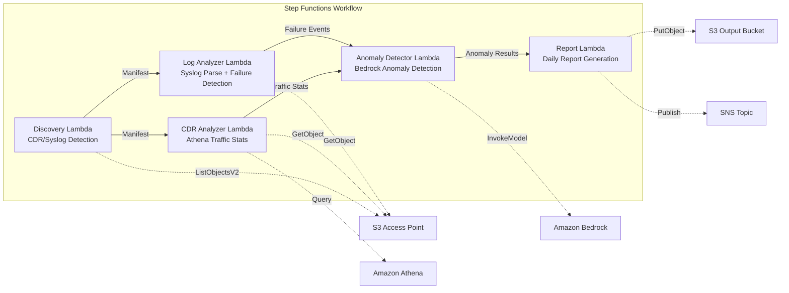

# UC18: Telecommunications / Network Analytics — CDR/Network Log Anomaly Detection and Compliance Reports

🌐 **Language / 言語**: [日本語](README.md) | English | [한국어](README.ko.md) | [简体中文](README.zh-CN.md) | [繁體中文](README.zh-TW.md) | [Français](README.fr.md) | [Deutsch](README.de.md) | [Español](README.es.md)

📚 **Documentation**: [Architecture Diagram](docs/architecture.en.md) | [Demo Guide](docs/demo-guide.en.md)

## Overview

A serverless workflow that leverages the S3 Access Points of FSx for ONTAP to automate anomaly detection of CDRs (Call Detail Records) and network equipment logs, traffic statistics analysis, and compliance report generation.

### When This Pattern Is Suitable

- CDR files (CSV, ASN.1 decoded, Parquet) are accumulated on FSx for ONTAP
- You want to automatically analyze network equipment syslog / SNMP trap data
- You want to compute Athena-based traffic statistics (hourly call volume, average call duration, peak concurrent calls)
- You want to perform Bedrock-based anomaly detection (7-day rolling baseline comparison, 3σ threshold detection)
- You want to automatically detect and alert on equipment failures (link-down, hardware errors, process crashes)

### When This Pattern Is Not Suitable

- A real-time network monitoring system is needed (second-level responsiveness)
- A full NOC (Network Operations Center) platform is required
- Large-scale network topology analysis is needed
- An environment where network reachability to the ONTAP REST API cannot be ensured

### Main Features

- Automatic detection of CDR files (.csv, .asn1, .parquet) and syslog files via S3 AP
- Traffic statistics analysis via Athena (call volume, call duration, peak concurrent connections)
- Anomaly detection via Bedrock (3σ threshold, 7-day baseline comparison)
- Syslog RFC 5424 parsing + SNMP trap data analysis
- Equipment failure detection (link-down, hardware errors, capacity threshold breach)
- Daily network health report + anomaly alert notifications (SNS)

## Success Metrics

### Outcome
Accelerate network fault detection and capacity planning for telecom operators by automating CDR/network log analysis.

### Metrics
| Metric | Target Value (Example) |
|-----------|------------|
| CDR files processed / execution | > 200 files |
| Anomaly detection accuracy | > 90% |
| Equipment failure detection rate | > 95% |
| Report generation time | < 5 min / daily batch |
| Cost / daily execution | < $1.00 |
| Human Review required rate | > 20% (all critical anomalies reviewed) |

### Measurement Method
Step Functions execution history, Athena query results, Bedrock inference logs, CloudWatch EMF Metrics (ProcessingDuration, SuccessCount, ErrorCount).

### Human Review Requirements
- Critical anomalies exceeding 3σ are confirmed by a human after an automatic alert
- Equipment failures (link-down) trigger immediate notification + operator confirmation
- Monthly trend reports are reviewed by the network planning team

## Architecture



### Workflow Steps

1. **Discovery**: Detect CDR and syslog files from S3 AP
2. **CDR Analyzer**: Parse CDR, aggregate traffic statistics via Athena
3. **Log Analyzer**: Parse Syslog RFC 5424, analyze SNMP traps, detect equipment failures
4. **Anomaly Detector**: Compare against 7-day baseline, flag anomalies exceeding 3σ (Bedrock inference)
5. **Report**: Generate daily network health report + SNS alerts

## Prerequisites

> **S3 AP NetworkOrigin Note**: The Discovery Lambda is deployed inside a VPC. If the S3 Access Point's NetworkOrigin is `Internet`, it cannot be accessed via an S3 Gateway VPC Endpoint (because requests are not routed to the FSx data plane). Use an S3 AP with NetworkOrigin=VPC, or configure access via a NAT Gateway. See [S3AP Compatibility Notes](../docs/s3ap-compatibility-notes.md) for details.

- AWS account and appropriate IAM permissions
- FSx for ONTAP file system (ONTAP 9.17.1P4D3 or later)
- A volume with S3 Access Point enabled (storing CDR/syslog)
- VPC, private subnets
- Amazon Bedrock model access enabled (Claude / Nova)
- Amazon Athena workgroup configured

## Deployment

### 1. Review Parameters

Confirm the CDR file suffix filter and capacity thresholds in advance.

### 2. Deploy via SAM

```bash
# Prerequisite: AWS SAM CLI is required. 'sam build' automatically packages the code and shared layer.
sam build

sam deploy \
  --stack-name fsxn-telecom-analytics \
  --parameter-overrides \
    S3AccessPointAlias=<your-volume-ext-s3alias> \
    S3AccessPointName=<your-s3ap-name> \
    VpcId=<your-vpc-id> \
    PrivateSubnetIds=<subnet-1>,<subnet-2> \
    ScheduleExpression="cron(0 0 * * ? *)" \
    NotificationEmail=<your-email@example.com> \
    CdrSuffixFilter=".csv,.asn1,.parquet" \
    AnomalyThresholdStdDev=3 \
    CapacityThresholdPercent=80 \
    EnableVpcEndpoints=false \
    EnableCloudWatchAlarms=false \
  --capabilities CAPABILITY_NAMED_IAM \
  --resolve-s3 \
  --region ap-northeast-1
```

> **Note**: `template.yaml` is used with the SAM CLI (`sam build` + `sam deploy`).
> To deploy directly with the `aws cloudformation deploy` command, use `template-deploy.yaml` instead (this requires pre-packaging the Lambda zip files and uploading them to S3).

## Configuration Parameters

| Parameter | Description | Default | Required |
|-----------|------|----------|------|
| `S3AccessPointAlias` | FSx for ONTAP S3 AP Alias (for input) | — | ✅ |
| `S3AccessPointName` | S3 AP name (for ARN-based IAM permission granting) | `""` | ⚠️ Recommended |
| `ScheduleExpression` | EventBridge Scheduler schedule expression | `cron(0 0 * * ? *)` | |
| `VpcId` | VPC ID | — | ✅ |
| `PrivateSubnetIds` | Private subnet ID list | — | ✅ |
| `NotificationEmail` | SNS notification email address | — | ✅ |
| `CdrSuffixFilter` | Suffix filter for CDR file detection | `.csv,.asn1,.parquet` | |
| `AnomalyThresholdStdDev` | Standard deviation threshold for anomaly detection | `3` | |
| `CapacityThresholdPercent` | Capacity threshold (%) | `80` | |
| `BaselineWindowDays` | Baseline period (days) | `7` | |
| `MapConcurrency` | Map state parallel execution count | `10` | |
| `LambdaMemorySize` | Lambda memory size (MB) | `512` | |
| `LambdaTimeout` | Lambda timeout (seconds) | `300` | |
| `EnableVpcEndpoints` | Enable Interface VPC Endpoints | `false` | |
| `EnableCloudWatchAlarms` | Enable CloudWatch Alarms | `false` | |

## ⚠️ Performance Considerations

- FSx for ONTAP throughput capacity is **shared across NFS/SMB/S3 AP**. When running parallel processing with MapConcurrency=10, it may impact other workloads on the same volume.
- For bulk processing of large numbers of files, check the FSx for ONTAP Throughput Capacity (MBps) and adjust MapConcurrency as needed.
- Recommended: In production, start with MapConcurrency=5 and increase it gradually while monitoring the FSx for ONTAP CloudWatch metric (ThroughputUtilization).

## Cleanup

```bash
aws s3 rm s3://fsxn-telecom-analytics-output-${AWS_ACCOUNT_ID} --recursive

aws cloudformation delete-stack \
  --stack-name fsxn-telecom-analytics \
  --region ap-northeast-1

aws cloudformation wait stack-delete-complete \
  --stack-name fsxn-telecom-analytics \
  --region ap-northeast-1
```

## Supported Regions

UC18 uses the following services:

| Service | Region Constraints |
|---------|-------------|
| Amazon Athena | Available in nearly all regions |
| Amazon Bedrock | Verify supported regions ([Bedrock Regions](https://docs.aws.amazon.com/general/latest/gr/bedrock.html)) |
| AWS X-Ray | Available in nearly all regions |
| CloudWatch EMF | Available in nearly all regions |

> UC18 does not use cross-region calls. Athena and Bedrock are available in ap-northeast-1.

## Reference Links

- [FSx for ONTAP S3 Access Points Overview](https://docs.aws.amazon.com/fsx/latest/ONTAPGuide/accessing-data-via-s3-access-points.html)
- [Amazon Athena User Guide](https://docs.aws.amazon.com/athena/latest/ug/what-is.html)
- [Amazon Bedrock API Reference](https://docs.aws.amazon.com/bedrock/latest/APIReference/API_runtime_InvokeModel.html)

---

## AWS Documentation Links

| Service | Documentation |
|---------|------------|
| FSx for ONTAP | [User Guide](https://docs.aws.amazon.com/fsx/latest/ONTAPGuide/what-is-fsx-ontap.html) |
| S3 Access Points | [S3 AP for FSx for ONTAP](https://docs.aws.amazon.com/fsx/latest/ONTAPGuide/s3-access-points.html) |
| Step Functions | [Developer Guide](https://docs.aws.amazon.com/step-functions/latest/dg/welcome.html) |
| Amazon Athena | [User Guide](https://docs.aws.amazon.com/athena/latest/ug/what-is.html) |
| Amazon Bedrock | [User Guide](https://docs.aws.amazon.com/bedrock/latest/userguide/what-is-bedrock.html) |

### Well-Architected Framework Alignment

| Pillar | Coverage |
|----|------|
| Operational Excellence | X-Ray tracing, EMF metrics, anomaly detection monitoring |
| Security | Least-privilege IAM, KMS encryption, CDR data access control |
| Reliability | Step Functions Retry/Catch, exponential backoff (3 retries) |
| Performance Efficiency | Large-scale CDR queries via Athena, parallel processing |
| Cost Optimization | Serverless, Athena scan-based billing |
| Sustainability | On-demand execution, incremental processing |

---

## Cost Estimation (Monthly Approximate)

> **Note**: The following are approximate figures for the ap-northeast-1 region, and actual costs vary with usage. Check the latest pricing with the [AWS Pricing Calculator](https://calculator.aws/).

### Serverless Components (Pay-as-you-go)

| Service | Unit Price | Assumed Usage | Monthly Approximate |
|---------|------|-----------|---------|
| Lambda | $0.0000166667/GB-sec | 5 functions × daily execution | ~$1-3 |
| S3 API (GetObject/ListObjects) | $0.0047/10K requests | ~5K requests/day | ~$0.75 |
| Step Functions | $0.025/1K state transitions | ~500 transitions/day | ~$0.40 |
| Bedrock (Nova Lite) | $0.00006/1K input tokens | ~30K tokens/execution | ~$2-5 |
| Athena | $5/TB scanned | ~10 MB/query | ~$1-3 |
| SNS | $0.50/100K notifications | ~30 notifications/day | ~$0.10 |
| CloudWatch Logs | $0.76/GB ingested | ~500 MB/month | ~$0.38 |

### Fixed Cost (FSx for ONTAP — Assumes Existing Environment)

| Component | Monthly |
|--------------|------|
| FSx for ONTAP (128 MBps, 1 TB) | ~$230 (shares existing environment) |
| S3 Access Point | No additional charge (S3 API charges only) |

### Total Approximate

| Configuration | Monthly Approximate |
|------|---------|
| Minimal configuration (1 daily execution) | ~$5-12 |
| Standard configuration (daily + alarms enabled) | ~$12-30 |
| Large-scale configuration (high frequency + large CDR volume) | ~$30-100 |

> **Governance Caveat**: Cost estimates are approximate and not guaranteed values. Actual billing varies with usage patterns, data volume, and region.

---

## Local Testing

### Prerequisites Check

```bash
# Verify prerequisites
aws --version          # AWS CLI v2
sam --version          # SAM CLI
python3 --version      # Python 3.9+
docker --version       # Docker (for sam local)
aws sts get-caller-identity  # AWS credentials
```

### sam local invoke

```bash
# Build
# Prerequisite: AWS SAM CLI is required. 'sam build' automatically packages the code and shared layer.
sam build

# Run the Discovery Lambda locally
sam local invoke DiscoveryFunction --event events/discovery-event.json

# With environment variable overrides
sam local invoke DiscoveryFunction \
  --event events/discovery-event.json \
  --env-vars env.json
```

### Unit Tests

```bash
python3 -m pytest tests/ -v
```

See [Local Testing Quick Start](../docs/local-testing-quick-start.md) for details.

---

## Governance Note

> This pattern provides technical architecture guidance. It is not legal, compliance, or regulatory advice. Organizations should consult qualified professionals. Because telecommunications data (CDR) contains personal communication data, it must be handled in compliance with each country's telecommunications business laws and personal information protection laws.

> **Related Regulations**: Telecommunications Business Act, Personal Information Protection Act (secrecy of communications)

---

## S3AP Compatibility

For compatibility constraints, troubleshooting, and trigger patterns of S3 Access Points for FSx for ONTAP, see [S3AP Compatibility Notes](../docs/s3ap-compatibility-notes.md).
