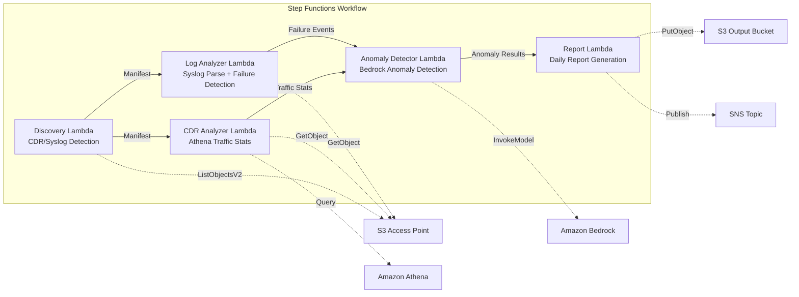

# UC18: Telecommunications / Network Analytics — CDR/Network Log Anomaly Detection and Compliance Reports

🌐 **Language / 言語**: [日本語](README.md) | English | [한국어](README.ko.md) | [简体中文](README.zh-CN.md) | [繁體中文](README.zh-TW.md) | [Français](README.fr.md) | [Deutsch](README.de.md) | [Español](README.es.md)

📚 **Documentation**: [Architecture Diagram](docs/architecture.en.md) | [Demo Guide](docs/demo-guide.en.md)

## Overview

A serverless workflow leveraging S3 Access Points on Amazon FSx for ONTAP to automate CDR (Call Detail Record) and network equipment log analysis, anomaly detection, traffic statistics, and compliance report generation.

### When This Pattern Is Suitable

- CDR files (CSV, ASN.1 decoded, Parquet) are accumulated on FSx for ONTAP
- You want to automatically analyze network equipment syslog / SNMP trap data
- You need Athena-based traffic statistics (hourly call volume, average call duration, peak concurrent calls)
- You want Bedrock-based anomaly detection (7-day rolling baseline comparison, 3σ threshold detection)
- You need automatic detection and alerting of equipment failures (link-down, hardware errors, process crashes)

### When This Pattern Is Not Suitable

- A real-time network monitoring system (sub-second response) is needed
- A full NOC (Network Operations Center) platform is required
- Large-scale network topology analysis is needed
- Network reachability to ONTAP REST API cannot be ensured

### Main Features

- Automatic detection of CDR files (.csv, .asn1, .parquet) and syslog files via S3 AP
- Traffic statistics analysis via Athena (call volume, call duration, peak concurrent connections)
- Anomaly detection via Bedrock (3σ threshold, 7-day baseline comparison)
- Syslog RFC 5424 parsing + SNMP trap data analysis
- Equipment failure detection (link-down, hardware errors, capacity threshold breach)
- Daily network health report + anomaly alert notifications (SNS)

## Success Metrics

### Outcome
Automate CDR/network log analysis to accelerate network fault detection and capacity planning for telecom operators.

### Metrics
| Metric | Target Value (Example) |
|--------|----------------------|
| CDR files processed / execution | > 200 files |
| Anomaly detection accuracy | > 90% |
| Equipment failure detection rate | > 95% |
| Report generation time | < 5 min / daily batch |
| Cost / daily execution | < $1.00 |
| Human Review required rate | > 20% (critical anomalies require full review) |

### Measurement Method
Step Functions execution history, Athena query results, Bedrock inference logs, CloudWatch EMF Metrics (ProcessingDuration, SuccessCount, ErrorCount).

### Human Review Requirements
- Critical anomalies exceeding 3σ are automatically alerted then confirmed by humans
- Equipment failures (link-down) trigger immediate notification + operator confirmation
- Monthly trend reports are reviewed by network planning teams

## Architecture



### Workflow Steps

1. **Discovery**: Detect CDR and syslog files from S3 AP
2. **CDR Analyzer**: Parse CDR, aggregate traffic statistics via Athena
3. **Log Analyzer**: Parse Syslog RFC 5424, analyze SNMP traps, detect equipment failures
4. **Anomaly Detector**: Compare against 7-day baseline, flag anomalies exceeding 3σ (Bedrock inference)
5. **Report**: Generate daily network health report + SNS alerts

## Prerequisites

- AWS account with appropriate IAM permissions
- FSx for ONTAP file system (ONTAP 9.17.1P4D3 or later)
- S3 Access Point enabled volume (storing CDR/syslog files)
- VPC, private subnets
- Amazon Bedrock model access enabled (Claude / Nova)
- Amazon Athena workgroup configured

> **S3 AP NetworkOrigin Note**: The Discovery Lambda is deployed inside a VPC. If the S3 Access Point's NetworkOrigin is `Internet`, it cannot be accessed via S3 Gateway VPC Endpoint (requests are not routed to the FSx data plane). Use a VPC-origin S3 AP or configure NAT Gateway access. See [S3AP Compatibility Notes](../docs/s3ap-compatibility-notes.md).

## Deployment

### 1. Review Parameters

Confirm CDR file suffix filters and capacity thresholds before deploying.

### 2. Deploy via SAM

```bash
# Prerequisite: AWS SAM CLI required. 'sam build' packages the code and shared layer automatically.
sam build

sam deploy \
  --stack-name fsxn-telecom-analytics \
  --parameter-overrides \
    S3AccessPointAlias=<your-volume-ext-s3alias> \
    S3AccessPointName=<your-s3ap-name> \
    VpcId=<your-vpc-id> \
    PrivateSubnetIds=<subnet-1>,<subnet-2> \
    ScheduleExpression="cron(0 0 * * ? *)" \
    NotificationEmail=<your-email@example.com> \
    CdrSuffixFilter=".csv,.asn1,.parquet" \
    AnomalyThresholdStdDev=3 \
    CapacityThresholdPercent=80 \
    EnableVpcEndpoints=false \
    EnableCloudWatchAlarms=false \
  --capabilities CAPABILITY_NAMED_IAM \
  --resolve-s3 \
  --region ap-northeast-1
```

## Configuration Parameters

| Parameter | Description | Default | Required |
|-----------|-------------|---------|----------|
| `S3AccessPointAlias` | FSx for ONTAP S3 AP Alias (for input) | — | ✅ |
| `S3AccessPointName` | S3 AP name (for ARN-based IAM permissions) | `""` | ⚠️ Recommended |
| `ScheduleExpression` | EventBridge Scheduler schedule expression | `cron(0 0 * * ? *)` | |
| `VpcId` | VPC ID | — | ✅ |
| `PrivateSubnetIds` | Private subnet ID list | — | ✅ |
| `NotificationEmail` | SNS notification email address | — | ✅ |
| `CdrSuffixFilter` | CDR file detection suffix filter | `.csv,.asn1,.parquet` | |
| `AnomalyThresholdStdDev` | Standard deviation threshold for anomaly detection | `3` | |
| `CapacityThresholdPercent` | Capacity threshold (%) | `80` | |
| `BaselineWindowDays` | Baseline window period (days) | `7` | |
| `MapConcurrency` | Map state parallel execution count | `10` | |
| `LambdaMemorySize` | Lambda memory size (MB) | `512` | |
| `LambdaTimeout` | Lambda timeout (seconds) | `300` | |
| `EnableVpcEndpoints` | Enable Interface VPC Endpoints | `false` | |
| `EnableCloudWatchAlarms` | Enable CloudWatch Alarms | `false` | |


## ⚠️ Performance Considerations

- FSx for ONTAP throughput capacity is **shared across NFS/SMB/S3 AP**. Running MapConcurrency=10 in parallel may impact other workloads on the same volume.
- For large batch processing, check FSx for ONTAP Throughput Capacity (MBps) and adjust MapConcurrency accordingly.
- Recommended: Start with MapConcurrency=5 in production, monitor FSx for ONTAP CloudWatch metrics (ThroughputUtilization), and increase gradually.

## Cleanup

```bash
aws s3 rm s3://fsxn-telecom-analytics-output-${AWS_ACCOUNT_ID} --recursive

aws cloudformation delete-stack \
  --stack-name fsxn-telecom-analytics \
  --region ap-northeast-1

aws cloudformation wait stack-delete-complete \
  --stack-name fsxn-telecom-analytics \
  --region ap-northeast-1
```

## Supported Regions

UC18 uses the following services:

| Service | Region Constraints |
|---------|-------------------|
| Amazon Athena | Available in most regions |
| Amazon Bedrock | Verify supported regions ([Bedrock Regions](https://docs.aws.amazon.com/general/latest/gr/bedrock.html)) |
| AWS X-Ray | Available in most regions |
| CloudWatch EMF | Available in most regions |

> UC18 does not use cross-region calls. Athena and Bedrock are available in ap-northeast-1.

## Reference Links

- [FSx for ONTAP S3 Access Points Overview](https://docs.aws.amazon.com/fsx/latest/ONTAPGuide/accessing-data-via-s3-access-points.html)
- [Amazon Athena User Guide](https://docs.aws.amazon.com/athena/latest/ug/what-is.html)
- [Amazon Bedrock API Reference](https://docs.aws.amazon.com/bedrock/latest/APIReference/API_runtime_InvokeModel.html)

---

## Well-Architected Framework Alignment

| Pillar | Coverage |
|--------|---------|
| Operational Excellence | X-Ray tracing, EMF metrics, anomaly detection monitoring |
| Security | Least-privilege IAM, KMS encryption, CDR data access control |
| Reliability | Step Functions Retry/Catch, exponential backoff (3 retries) |
| Performance Efficiency | Athena for large-scale CDR queries, parallel processing |
| Cost Optimization | Serverless, Athena scan-based billing |
| Sustainability | On-demand execution, incremental processing |

---

## Governance Note

> This pattern provides technical architecture guidance. It is not legal, compliance, or regulatory advice. Organizations should consult qualified professionals. CDR data contains personal communication data and must be handled in compliance with applicable telecommunications regulations and privacy laws.

> **Related Regulations**: 電気通信事業法 (Telecommunications Business Act), 個人情報保護法 (APPI - Personal Information Protection)

---

## S3AP Compatibility

For S3 Access Points for FSx for ONTAP compatibility constraints, troubleshooting, and trigger patterns, see [S3AP Compatibility Notes](../docs/s3ap-compatibility-notes.md).
