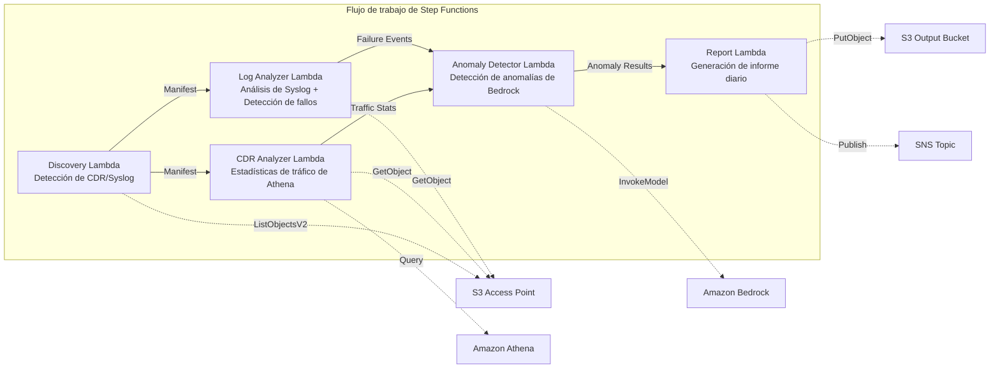

# UC18: Telecomunicaciones / Análisis de red — Detección de anomalías en CDR/registros de red e informes de cumplimiento

🌐 **Language / Idioma**: [日本語](README.md) | [English](README.en.md) | [한국어](README.ko.md) | [简体中文](README.zh-CN.md) | [繁體中文](README.zh-TW.md) | [Français](README.fr.md) | [Deutsch](README.de.md) | Español

📚 **Documentación**: [Diagrama de arquitectura](docs/architecture.es.md) | [Guía de demostración](docs/demo-guide.es.md)

## Descripción general

Un flujo de trabajo sin servidor que aprovecha los S3 Access Points de FSx for ONTAP para realizar la detección de anomalías de CDR (registros detallados de llamadas) y registros de equipos de red, el análisis de estadísticas de tráfico y la generación automática de informes de cumplimiento.

### Casos en los que este patrón es adecuado

- Los archivos CDR (CSV, ASN.1 decodificado, Parquet) se acumulan en FSx for ONTAP
- Desea analizar automáticamente los datos de syslog / trap SNMP de los equipos de red
- Desea calcular estadísticas de tráfico mediante Athena (volumen de llamadas por franja horaria, duración media de las llamadas, número máximo de llamadas simultáneas)
- Desea realizar la detección de anomalías mediante Bedrock (comparación con una línea base móvil de 7 días, detección de superación de 3σ)
- Desea detectar y alertar automáticamente sobre fallos de equipos (link-down, errores de hardware, caídas de procesos)

### Casos en los que este patrón no es adecuado

- Se necesita un sistema de supervisión de red en tiempo real (capacidad de respuesta al segundo)
- Se requiere una plataforma NOC (Network Operations Center) completa
- Se necesita un análisis de topología de red a gran escala
- Un entorno en el que no se puede garantizar la accesibilidad de red a la API REST de ONTAP

### Funciones principales

- Detección automática de archivos CDR (.csv, .asn1, .parquet) y archivos syslog mediante S3 AP
- Análisis de estadísticas de tráfico mediante Athena (volumen de llamadas, duración de llamadas, número máximo de conexiones simultáneas)
- Detección de anomalías mediante Bedrock (superación de 3σ, comparación con una línea base de 7 días)
- Análisis de Syslog RFC 5424 + análisis de datos de trap SNMP
- Detección de fallos de equipos (link-down, errores de hardware, superación del umbral de capacidad)
- Informe diario de estado de la red + notificaciones de alerta de anomalías (SNS)

## Success Metrics

### Outcome
Acelerar la detección de fallos de red y la planificación de la capacidad para los operadores de telecomunicaciones mediante la automatización del análisis de CDR/registros de red.

### Metrics
| Métrica | Valor objetivo (ejemplo) |
|-----------|------------|
| Número de archivos CDR procesados / ejecución | > 200 files |
| Precisión de la detección de anomalías | > 90 % |
| Tasa de detección de fallos de equipos | > 95 % |
| Tiempo de generación de informes | < 5 min / lote diario |
| Coste / ejecución diaria | < $1.00 |
| Tasa obligatoria de Human Review | > 20 % (todas las anomalías críticas se verifican) |

### Measurement Method
Historial de ejecución de Step Functions, resultados de consultas de Athena, registros de inferencia de Bedrock, CloudWatch EMF Metrics (ProcessingDuration, SuccessCount, ErrorCount).

### Human Review Requirements
- Las anomalías críticas que superan 3σ son verificadas por una persona tras la alerta automática
- Los fallos de equipos (link-down) desencadenan una notificación inmediata + confirmación del operador
- Los informes de tendencias mensuales son revisados por el equipo de planificación de red

## Arquitectura



### Pasos del flujo de trabajo

1. **Discovery**: Detectar archivos CDR y syslog desde el S3 AP
2. **CDR Analyzer**: Analizar CDR, agregar estadísticas de tráfico mediante Athena
3. **Log Analyzer**: Analizar Syslog RFC 5424, analizar traps SNMP, detectar fallos de equipos
4. **Anomaly Detector**: Comparar con la línea base de 7 días, marcar anomalías que superen 3σ (inferencia de Bedrock)
5. **Report**: Generar informe diario de estado de la red + alertas SNS

## Requisitos previos

> **Nota sobre S3 AP NetworkOrigin**: La Discovery Lambda se implementa dentro de una VPC. Si el NetworkOrigin del S3 Access Point es `Internet`, no se puede acceder a través de un S3 Gateway VPC Endpoint (porque las solicitudes no se enrutan al plano de datos de FSx). Utilice un S3 AP con NetworkOrigin=VPC o configure el acceso a través de una NAT Gateway. Para más detalles, consulte [S3AP Compatibility Notes](../docs/s3ap-compatibility-notes.md).

- Cuenta de AWS y permisos IAM adecuados
- Sistema de archivos FSx for ONTAP (ONTAP 9.17.1P4D3 o posterior)
- Volumen con S3 Access Point habilitado (que almacena CDR/syslog)
- VPC, subredes privadas
- Acceso a modelos de Amazon Bedrock habilitado (Claude / Nova)
- Grupo de trabajo de Amazon Athena configurado

## Procedimiento de implementación

### 1. Verificación de parámetros

Verifique de antemano el filtro de sufijos de los archivos CDR y los umbrales de capacidad.

### 2. Implementación con SAM

```bash
# Requisito previo: se requiere AWS SAM CLI. 'sam build' empaqueta automáticamente el código y la capa compartida.
sam build

sam deploy \
  --stack-name fsxn-telecom-analytics \
  --parameter-overrides \
    S3AccessPointAlias=<your-volume-ext-s3alias> \
    S3AccessPointName=<your-s3ap-name> \
    VpcId=<your-vpc-id> \
    PrivateSubnetIds=<subnet-1>,<subnet-2> \
    ScheduleExpression="cron(0 0 * * ? *)" \
    NotificationEmail=<your-email@example.com> \
    CdrSuffixFilter=".csv,.asn1,.parquet" \
    AnomalyThresholdStdDev=3 \
    CapacityThresholdPercent=80 \
    EnableVpcEndpoints=false \
    EnableCloudWatchAlarms=false \
  --capabilities CAPABILITY_NAMED_IAM \
  --resolve-s3 \
  --region ap-northeast-1
```

> **Nota**: `template.yaml` se utiliza con la SAM CLI (`sam build` + `sam deploy`).
> Para implementar directamente con el comando `aws cloudformation deploy`, utilice `template-deploy.yaml` (requiere empaquetar previamente los archivos zip de Lambda y subirlos a S3).

## Lista de parámetros de configuración

| Parámetro | Descripción | Predeterminado | Obligatorio |
|-----------|------|----------|------|
| `S3AccessPointAlias` | FSx for ONTAP S3 AP Alias (para entrada) | — | ✅ |
| `S3AccessPointName` | Nombre del S3 AP (para la concesión de permisos IAM basados en ARN) | `""` | ⚠️ Recomendado |
| `ScheduleExpression` | Expresión de programación de EventBridge Scheduler | `cron(0 0 * * ? *)` | |
| `VpcId` | ID de VPC | — | ✅ |
| `PrivateSubnetIds` | Lista de ID de subredes privadas | — | ✅ |
| `NotificationEmail` | Dirección de correo electrónico de destino de notificaciones SNS | — | ✅ |
| `CdrSuffixFilter` | Filtro de sufijos para la detección de archivos CDR | `.csv,.asn1,.parquet` | |
| `AnomalyThresholdStdDev` | Umbral de desviación estándar para la detección de anomalías | `3` | |
| `CapacityThresholdPercent` | Umbral de capacidad (%) | `80` | |
| `BaselineWindowDays` | Período de línea base (días) | `7` | |
| `MapConcurrency` | Número de ejecuciones paralelas del estado Map | `10` | |
| `LambdaMemorySize` | Tamaño de memoria de Lambda (MB) | `512` | |
| `LambdaTimeout` | Tiempo de espera de Lambda (segundos) | `300` | |
| `EnableVpcEndpoints` | Habilitar Interface VPC Endpoints | `false` | |
| `EnableCloudWatchAlarms` | Habilitar CloudWatch Alarms | `false` | |

## ⚠️ Consideraciones de rendimiento

- La capacidad de rendimiento de FSx for ONTAP se **comparte entre NFS/SMB/S3 AP**. Cuando se realiza el procesamiento en paralelo con MapConcurrency=10, puede afectar a otras cargas de trabajo en el mismo volumen.
- Para el procesamiento por lotes de grandes cantidades de archivos, verifique la Throughput Capacity (MBps) de FSx for ONTAP y ajuste MapConcurrency según sea necesario.
- Recomendado: en el entorno de producción, comience primero con MapConcurrency=5 y auméntelo gradualmente mientras supervisa la métrica de CloudWatch de FSx for ONTAP (ThroughputUtilization).

## Limpieza

```bash
aws s3 rm s3://fsxn-telecom-analytics-output-${AWS_ACCOUNT_ID} --recursive

aws cloudformation delete-stack \
  --stack-name fsxn-telecom-analytics \
  --region ap-northeast-1

aws cloudformation wait stack-delete-complete \
  --stack-name fsxn-telecom-analytics \
  --region ap-northeast-1
```

## Supported Regions

UC18 utiliza los siguientes servicios:

| Servicio | Restricciones de región |
|---------|-------------|
| Amazon Athena | Disponible en casi todas las regiones |
| Amazon Bedrock | Verifique las regiones compatibles ([Regiones de Bedrock](https://docs.aws.amazon.com/general/latest/gr/bedrock.html)) |
| AWS X-Ray | Disponible en casi todas las regiones |
| CloudWatch EMF | Disponible en casi todas las regiones |

> UC18 no utiliza llamadas entre regiones. Athena y Bedrock están disponibles en ap-northeast-1.

## Enlaces de referencia

- [Descripción general de FSx for ONTAP S3 Access Points](https://docs.aws.amazon.com/fsx/latest/ONTAPGuide/accessing-data-via-s3-access-points.html)
- [Guía del usuario de Amazon Athena](https://docs.aws.amazon.com/athena/latest/ug/what-is.html)
- [Referencia de la API de Amazon Bedrock](https://docs.aws.amazon.com/bedrock/latest/APIReference/API_runtime_InvokeModel.html)

---

## Enlaces a la documentación de AWS

| Servicio | Documentación |
|---------|------------|
| FSx for ONTAP | [Guía del usuario](https://docs.aws.amazon.com/fsx/latest/ONTAPGuide/what-is-fsx-ontap.html) |
| S3 Access Points | [S3 AP for FSx for ONTAP](https://docs.aws.amazon.com/fsx/latest/ONTAPGuide/s3-access-points.html) |
| Step Functions | [Guía del desarrollador](https://docs.aws.amazon.com/step-functions/latest/dg/welcome.html) |
| Amazon Athena | [Guía del usuario](https://docs.aws.amazon.com/athena/latest/ug/what-is.html) |
| Amazon Bedrock | [Guía del usuario](https://docs.aws.amazon.com/bedrock/latest/userguide/what-is-bedrock.html) |

### Alineación con el Well-Architected Framework

| Pilar | Cobertura |
|----|------|
| Excelencia operativa | Rastreo X-Ray, métricas EMF, supervisión de detección de anomalías |
| Seguridad | IAM de privilegios mínimos, cifrado KMS, control de acceso a datos CDR |
| Fiabilidad | Step Functions Retry/Catch, exponential backoff (3 reintentos) |
| Eficiencia del rendimiento | Consultas CDR a gran escala mediante Athena, procesamiento paralelo |
| Optimización de costes | Sin servidor, facturación basada en escaneo de Athena |
| Sostenibilidad | Ejecución bajo demanda, procesamiento incremental |

---

## Estimación de costes (aproximación mensual)

> **Nota**: Las siguientes cifras son aproximaciones para la región ap-northeast-1, y los costes reales varían según el uso. Verifique los precios más recientes con la [AWS Pricing Calculator](https://calculator.aws/).

### Componentes sin servidor (facturación por uso)

| Servicio | Precio unitario | Uso estimado | Aproximación mensual |
|---------|------|-----------|---------|
| Lambda | $0.0000166667/GB-sec | 5 funciones × ejecución diaria | ~$1-3 |
| S3 API (GetObject/ListObjects) | $0.0047/10K requests | ~5K requests/día | ~$0.75 |
| Step Functions | $0.025/1K state transitions | ~500 transitions/día | ~$0.40 |
| Bedrock (Nova Lite) | $0.00006/1K input tokens | ~30K tokens/ejecución | ~$2-5 |
| Athena | $5/TB scanned | ~10 MB/consulta | ~$1-3 |
| SNS | $0.50/100K notifications | ~30 notifications/día | ~$0.10 |
| CloudWatch Logs | $0.76/GB ingested | ~500 MB/mes | ~$0.38 |

### Coste fijo (FSx for ONTAP — supone un entorno existente)

| Componente | Mensual |
|--------------|------|
| FSx for ONTAP (128 MBps, 1 TB) | ~$230 (comparte el entorno existente) |
| S3 Access Point | Sin cargo adicional (solo cargos de la API S3) |

### Aproximación total

| Configuración | Aproximación mensual |
|------|---------|
| Configuración mínima (1 ejecución diaria) | ~$5-12 |
| Configuración estándar (diaria + alarmas habilitadas) | ~$12-30 |
| Configuración a gran escala (alta frecuencia + gran volumen de CDR) | ~$30-100 |

> **Governance Caveat**: Las estimaciones de costes son aproximaciones y no valores garantizados. El importe facturado real varía según los patrones de uso, el volumen de datos y la región.

---

## Pruebas locales

### Comprobación de requisitos previos

```bash
# Verificar los requisitos previos
aws --version          # AWS CLI v2
sam --version          # SAM CLI
python3 --version      # Python 3.9+
docker --version       # Docker (para sam local)
aws sts get-caller-identity  # Credenciales de AWS
```

### sam local invoke

```bash
# Build
# Requisito previo: se requiere AWS SAM CLI. 'sam build' empaqueta automáticamente el código y la capa compartida.
sam build

# Ejecución local de la Discovery Lambda
sam local invoke DiscoveryFunction --event events/discovery-event.json

# Con anulación de variables de entorno
sam local invoke DiscoveryFunction \
  --event events/discovery-event.json \
  --env-vars env.json
```

### Pruebas unitarias

```bash
python3 -m pytest tests/ -v
```

Para más detalles, consulte [Inicio rápido de pruebas locales](../docs/local-testing-quick-start.md).

---

## Governance Note

> Este patrón proporciona orientación de arquitectura técnica. No constituye asesoramiento legal, de cumplimiento ni regulatorio. Las organizaciones deben consultar a profesionales cualificados. Dado que los datos de telecomunicaciones (CDR) contienen datos de comunicación personal, deben tratarse de conformidad con las leyes de telecomunicaciones y las leyes de protección de datos personales de cada país.

> **Regulaciones relacionadas**: Ley de Telecomunicaciones, Ley de Protección de Datos Personales (secreto de las comunicaciones)

---

## S3AP Compatibility

Para conocer las restricciones de compatibilidad, la solución de problemas y los patrones de activación de S3 Access Points for FSx for ONTAP, consulte [S3AP Compatibility Notes](../docs/s3ap-compatibility-notes.md).
