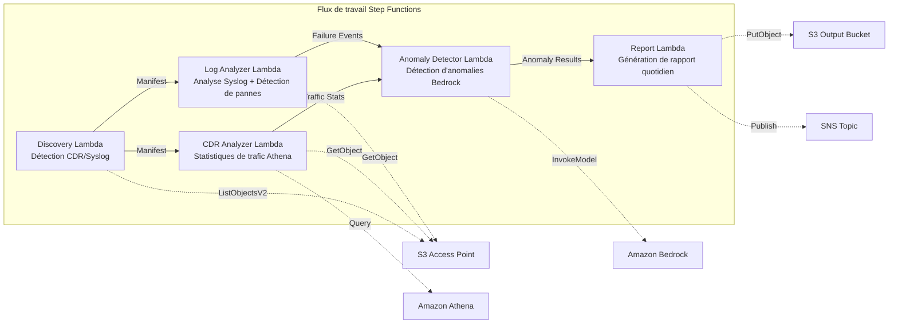

# UC18 : Télécommunications / Analyse réseau — Détection d'anomalies dans les CDR/journaux réseau et rapports de conformité

🌐 **Language / Langue**: [日本語](README.md) | [English](README.en.md) | [한국어](README.ko.md) | [简体中文](README.zh-CN.md) | [繁體中文](README.zh-TW.md) | Français | [Deutsch](README.de.md) | [Español](README.es.md)

📚 **Documentation** : [Schéma d'architecture](docs/architecture.fr.md) | [Guide de démonstration](docs/demo-guide.fr.md)

## Vue d'ensemble

Un flux de travail serverless qui exploite les S3 Access Points de FSx for ONTAP pour réaliser la détection d'anomalies des CDR (enregistrements détaillés des appels) et des journaux d'équipements réseau, l'analyse des statistiques de trafic et la génération automatique de rapports de conformité.

### Cas où ce modèle est adapté

- Des fichiers CDR (CSV, ASN.1 décodé, Parquet) sont accumulés sur FSx for ONTAP
- Vous souhaitez analyser automatiquement les données syslog / trap SNMP des équipements réseau
- Vous souhaitez calculer des statistiques de trafic via Athena (volume d'appels par tranche horaire, durée moyenne des appels, nombre maximal d'appels simultanés)
- Vous souhaitez réaliser une détection d'anomalies via Bedrock (comparaison à une ligne de base glissante sur 7 jours, détection de dépassement de 3σ)
- Vous souhaitez détecter et alerter automatiquement les pannes d'équipements (link-down, erreurs matérielles, plantages de processus)

### Cas où ce modèle n'est pas adapté

- Un système de surveillance réseau en temps réel est nécessaire (réactivité à la seconde)
- Une plateforme NOC (Network Operations Center) complète est requise
- Une analyse de topologie réseau à grande échelle est nécessaire
- Un environnement où l'accessibilité réseau à l'API REST ONTAP ne peut pas être garantie

### Fonctionnalités principales

- Détection automatique des fichiers CDR (.csv, .asn1, .parquet) et des fichiers syslog via S3 AP
- Analyse des statistiques de trafic via Athena (volume d'appels, durée des appels, nombre maximal de connexions simultanées)
- Détection d'anomalies via Bedrock (dépassement de 3σ, comparaison à une ligne de base sur 7 jours)
- Analyse syntaxique Syslog RFC 5424 + analyse des données de trap SNMP
- Détection des pannes d'équipements (link-down, erreurs matérielles, dépassement du seuil de capacité)
- Rapport quotidien de santé du réseau + notifications d'alerte d'anomalie (SNS)

## Success Metrics

### Outcome
Accélérer la détection des pannes réseau et la planification de la capacité pour les opérateurs de télécommunications grâce à l'automatisation de l'analyse des CDR/journaux réseau.

### Metrics
| Métrique | Valeur cible (exemple) |
|-----------|------------|
| Nombre de fichiers CDR traités / exécution | > 200 files |
| Précision de la détection d'anomalies | > 90 % |
| Taux de détection des pannes d'équipements | > 95 % |
| Temps de génération du rapport | < 5 min / traitement par lot quotidien |
| Coût / exécution quotidienne | < $1.00 |
| Taux obligatoire de Human Review | > 20 % (les anomalies critiques sont toutes vérifiées) |

### Measurement Method
Historique d'exécution Step Functions, résultats de requêtes Athena, journaux d'inférence Bedrock, CloudWatch EMF Metrics (ProcessingDuration, SuccessCount, ErrorCount).

### Human Review Requirements
- Les anomalies critiques dépassant 3σ sont vérifiées par un humain après l'alerte automatique
- Les pannes d'équipements (link-down) déclenchent une notification immédiate + confirmation de l'opérateur
- Les rapports de tendances mensuels sont examinés par l'équipe de planification réseau

## Architecture



### Étapes du flux de travail

1. **Discovery** : Détecter les fichiers CDR et syslog depuis le S3 AP
2. **CDR Analyzer** : Analyser les CDR, agréger les statistiques de trafic via Athena
3. **Log Analyzer** : Analyser Syslog RFC 5424, analyser les traps SNMP, détecter les pannes d'équipements
4. **Anomaly Detector** : Comparer à la ligne de base sur 7 jours, marquer les anomalies dépassant 3σ (inférence Bedrock)
5. **Report** : Générer un rapport quotidien de santé du réseau + alertes SNS

## Prérequis

> **Remarque sur S3 AP NetworkOrigin** : La Discovery Lambda est déployée dans un VPC. Si le NetworkOrigin du S3 Access Point est `Internet`, l'accès n'est pas possible via un S3 Gateway VPC Endpoint (car les requêtes ne sont pas routées vers le plan de données FSx). Utilisez un S3 AP avec NetworkOrigin=VPC, ou configurez l'accès via une NAT Gateway. Pour plus de détails, consultez [S3AP Compatibility Notes](../docs/s3ap-compatibility-notes.md).

- Compte AWS et autorisations IAM appropriées
- Système de fichiers FSx for ONTAP (ONTAP 9.17.1P4D3 ou version ultérieure)
- Volume avec S3 Access Point activé (stockant les CDR/syslog)
- VPC, sous-réseaux privés
- Accès aux modèles Amazon Bedrock activé (Claude / Nova)
- Groupe de travail Amazon Athena configuré

## Procédure de déploiement

### 1. Vérification des paramètres

Vérifiez à l'avance le filtre de suffixe des fichiers CDR et les seuils de capacité.

### 2. Déploiement SAM

```bash
# Prérequis : AWS SAM CLI est requis. 'sam build' package automatiquement le code et la couche partagée.
sam build

sam deploy \
  --stack-name fsxn-telecom-analytics \
  --parameter-overrides \
    S3AccessPointAlias=<your-volume-ext-s3alias> \
    S3AccessPointName=<your-s3ap-name> \
    VpcId=<your-vpc-id> \
    PrivateSubnetIds=<subnet-1>,<subnet-2> \
    ScheduleExpression="cron(0 0 * * ? *)" \
    NotificationEmail=<your-email@example.com> \
    CdrSuffixFilter=".csv,.asn1,.parquet" \
    AnomalyThresholdStdDev=3 \
    CapacityThresholdPercent=80 \
    EnableVpcEndpoints=false \
    EnableCloudWatchAlarms=false \
  --capabilities CAPABILITY_NAMED_IAM \
  --resolve-s3 \
  --region ap-northeast-1
```

> **Remarque** : `template.yaml` s'utilise avec la SAM CLI (`sam build` + `sam deploy`).
> Pour déployer directement avec la commande `aws cloudformation deploy`, utilisez `template-deploy.yaml` (nécessite le pré-packaging des fichiers zip Lambda et leur téléversement vers S3).

## Liste des paramètres de configuration

| Paramètre | Description | Par défaut | Requis |
|-----------|------|----------|------|
| `S3AccessPointAlias` | FSx for ONTAP S3 AP Alias (pour l'entrée) | — | ✅ |
| `S3AccessPointName` | Nom du S3 AP (pour l'octroi d'autorisations IAM basées sur ARN) | `""` | ⚠️ Recommandé |
| `ScheduleExpression` | Expression de planification d'EventBridge Scheduler | `cron(0 0 * * ? *)` | |
| `VpcId` | ID du VPC | — | ✅ |
| `PrivateSubnetIds` | Liste des ID de sous-réseaux privés | — | ✅ |
| `NotificationEmail` | Adresse e-mail de destination des notifications SNS | — | ✅ |
| `CdrSuffixFilter` | Filtre de suffixe pour la détection des fichiers CDR | `.csv,.asn1,.parquet` | |
| `AnomalyThresholdStdDev` | Seuil d'écart type pour la détection d'anomalies | `3` | |
| `CapacityThresholdPercent` | Seuil de capacité (%) | `80` | |
| `BaselineWindowDays` | Période de la ligne de base (jours) | `7` | |
| `MapConcurrency` | Nombre d'exécutions parallèles de l'état Map | `10` | |
| `LambdaMemorySize` | Taille mémoire Lambda (MB) | `512` | |
| `LambdaTimeout` | Délai d'expiration Lambda (secondes) | `300` | |
| `EnableVpcEndpoints` | Activer les Interface VPC Endpoints | `false` | |
| `EnableCloudWatchAlarms` | Activer les CloudWatch Alarms | `false` | |

## ⚠️ Considérations relatives aux performances

- La capacité de débit de FSx for ONTAP est **partagée entre NFS/SMB/S3 AP**. Lorsque vous effectuez un traitement parallèle avec MapConcurrency=10, cela peut impacter d'autres charges de travail sur le même volume.
- Pour le traitement par lot d'un grand nombre de fichiers, vérifiez la Throughput Capacity (MBps) de FSx for ONTAP et ajustez MapConcurrency selon les besoins.
- Recommandé : en environnement de production, commencez d'abord avec MapConcurrency=5, puis augmentez progressivement tout en surveillant la métrique CloudWatch de FSx for ONTAP (ThroughputUtilization).

## Nettoyage

```bash
aws s3 rm s3://fsxn-telecom-analytics-output-${AWS_ACCOUNT_ID} --recursive

aws cloudformation delete-stack \
  --stack-name fsxn-telecom-analytics \
  --region ap-northeast-1

aws cloudformation wait stack-delete-complete \
  --stack-name fsxn-telecom-analytics \
  --region ap-northeast-1
```

## Supported Regions

UC18 utilise les services suivants :

| Service | Contraintes de région |
|---------|-------------|
| Amazon Athena | Disponible dans presque toutes les régions |
| Amazon Bedrock | Vérifiez les régions prises en charge ([Régions Bedrock](https://docs.aws.amazon.com/general/latest/gr/bedrock.html)) |
| AWS X-Ray | Disponible dans presque toutes les régions |
| CloudWatch EMF | Disponible dans presque toutes les régions |

> UC18 n'utilise pas d'appels inter-régions. Athena et Bedrock sont disponibles dans ap-northeast-1.

## Liens de référence

- [Vue d'ensemble de FSx for ONTAP S3 Access Points](https://docs.aws.amazon.com/fsx/latest/ONTAPGuide/accessing-data-via-s3-access-points.html)
- [Guide de l'utilisateur Amazon Athena](https://docs.aws.amazon.com/athena/latest/ug/what-is.html)
- [Référence de l'API Amazon Bedrock](https://docs.aws.amazon.com/bedrock/latest/APIReference/API_runtime_InvokeModel.html)

---

## Liens vers la documentation AWS

| Service | Documentation |
|---------|------------|
| FSx for ONTAP | [Guide de l'utilisateur](https://docs.aws.amazon.com/fsx/latest/ONTAPGuide/what-is-fsx-ontap.html) |
| S3 Access Points | [S3 AP for FSx for ONTAP](https://docs.aws.amazon.com/fsx/latest/ONTAPGuide/s3-access-points.html) |
| Step Functions | [Guide du développeur](https://docs.aws.amazon.com/step-functions/latest/dg/welcome.html) |
| Amazon Athena | [Guide de l'utilisateur](https://docs.aws.amazon.com/athena/latest/ug/what-is.html) |
| Amazon Bedrock | [Guide de l'utilisateur](https://docs.aws.amazon.com/bedrock/latest/userguide/what-is-bedrock.html) |

### Alignement avec le Well-Architected Framework

| Pilier | Prise en charge |
|----|------|
| Excellence opérationnelle | Traçage X-Ray, métriques EMF, surveillance de la détection d'anomalies |
| Sécurité | IAM au moindre privilège, chiffrement KMS, contrôle d'accès aux données CDR |
| Fiabilité | Step Functions Retry/Catch, exponential backoff (3 tentatives) |
| Efficacité des performances | Requêtes CDR à grande échelle via Athena, traitement parallèle |
| Optimisation des coûts | Serverless, facturation à l'analyse Athena |
| Durabilité | Exécution à la demande, traitement incrémentiel |

---

## Estimation des coûts (approximation mensuelle)

> **Remarque** : Les valeurs suivantes sont des approximations pour la région ap-northeast-1, et les coûts réels varient selon l'utilisation. Vérifiez les tarifs les plus récents avec l'[AWS Pricing Calculator](https://calculator.aws/).

### Composants serverless (facturation à l'usage)

| Service | Prix unitaire | Utilisation estimée | Approximation mensuelle |
|---------|------|-----------|---------|
| Lambda | $0.0000166667/GB-sec | 5 fonctions × exécution quotidienne | ~$1-3 |
| S3 API (GetObject/ListObjects) | $0.0047/10K requests | ~5K requests/jour | ~$0.75 |
| Step Functions | $0.025/1K state transitions | ~500 transitions/jour | ~$0.40 |
| Bedrock (Nova Lite) | $0.00006/1K input tokens | ~30K tokens/exécution | ~$2-5 |
| Athena | $5/TB scanned | ~10 MB/requête | ~$1-3 |
| SNS | $0.50/100K notifications | ~30 notifications/jour | ~$0.10 |
| CloudWatch Logs | $0.76/GB ingested | ~500 MB/mois | ~$0.38 |

### Coût fixe (FSx for ONTAP — suppose un environnement existant)

| Composant | Mensuel |
|--------------|------|
| FSx for ONTAP (128 MBps, 1 TB) | ~$230 (partage l'environnement existant) |
| S3 Access Point | Aucuns frais supplémentaires (uniquement les frais d'API S3) |

### Approximation totale

| Configuration | Approximation mensuelle |
|------|---------|
| Configuration minimale (1 exécution quotidienne) | ~$5-12 |
| Configuration standard (quotidienne + alarmes activées) | ~$12-30 |
| Configuration à grande échelle (fréquence élevée + gros volume de CDR) | ~$30-100 |

> **Governance Caveat** : Les estimations de coûts sont des approximations et non des valeurs garanties. Le montant facturé réel varie selon les schémas d'utilisation, le volume de données et la région.

---

## Tests locaux

### Vérification des prérequis

```bash
# Vérifier les prérequis
aws --version          # AWS CLI v2
sam --version          # SAM CLI
python3 --version      # Python 3.9+
docker --version       # Docker (pour sam local)
aws sts get-caller-identity  # Identifiants AWS
```

### sam local invoke

```bash
# Build
# Prérequis : AWS SAM CLI est requis. 'sam build' package automatiquement le code et la couche partagée.
sam build

# Exécution locale de la Discovery Lambda
sam local invoke DiscoveryFunction --event events/discovery-event.json

# Avec remplacement des variables d'environnement
sam local invoke DiscoveryFunction \
  --event events/discovery-event.json \
  --env-vars env.json
```

### Tests unitaires

```bash
python3 -m pytest tests/ -v
```

Pour plus de détails, consultez [Démarrage rapide des tests locaux](../docs/local-testing-quick-start.md).

---

## Governance Note

> Ce modèle fournit des conseils d'architecture technique. Il ne s'agit pas de conseils juridiques, de conformité ou réglementaires. Les organisations doivent consulter des professionnels qualifiés. Comme les données de télécommunications (CDR) contiennent des données de communication personnelles, elles doivent être traitées conformément aux lois sur les télécommunications et aux lois sur la protection des informations personnelles de chaque pays.

> **Réglementations connexes** : loi sur les télécommunications, loi sur la protection des informations personnelles (secret des communications)

---

## S3AP Compatibility

Pour les contraintes de compatibilité, le dépannage et les modèles de déclenchement des S3 Access Points for FSx for ONTAP, consultez [S3AP Compatibility Notes](../docs/s3ap-compatibility-notes.md).
