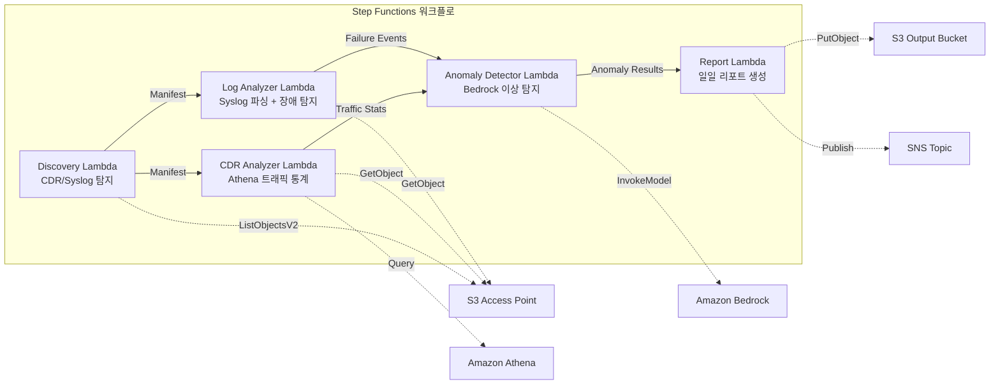

# UC18: 통신 / 네트워크 분석 — CDR/네트워크 로그 이상 탐지·컴플라이언스 리포트

🌐 **Language / 언어**: [日本語](README.md) | [English](README.en.md) | 한국어 | [简体中文](README.zh-CN.md) | [繁體中文](README.zh-TW.md) | [Français](README.fr.md) | [Deutsch](README.de.md) | [Español](README.es.md)

📚 **문서**: [아키텍처 다이어그램](docs/architecture.ko.md) | [데모 가이드](docs/demo-guide.ko.md)

## 개요

FSx for ONTAP의 S3 Access Points를 활용하여 CDR(통화 상세 기록)과 네트워크 장비 로그의 이상 탐지, 트래픽 통계 분석, 컴플라이언스 리포트 자동 생성을 실현하는 서버리스 워크플로입니다.

### 이 패턴이 적합한 경우

- CDR 파일(CSV, ASN.1 디코딩 완료, Parquet)이 FSx for ONTAP에 축적되어 있음
- 네트워크 장비의 syslog / SNMP 트랩 데이터를 자동 분석하고 싶음
- Athena를 통한 트래픽 통계(시간대별 통화량, 평균 통화 시간, 피크 동시 통화 수)를 산출하고 싶음
- Bedrock을 통한 이상 탐지(7일 롤링 베이스라인 비교, 3σ 초과 탐지)를 수행하고 싶음
- 장비 장애(link-down, 하드웨어 오류, 프로세스 크래시)를 자동 탐지·알림하고 싶음

### 이 패턴이 적합하지 않은 경우

- 실시간 네트워크 모니터링 시스템이 필요함(초 단위의 즉각적인 대응성)
- 완전한 NOC(Network Operations Center) 플랫폼이 필요함
- 대규모 네트워크 토폴로지 분석이 필요함
- ONTAP REST API에 대한 네트워크 도달성을 확보할 수 없는 환경

### 주요 기능

- S3 AP를 통해 CDR 파일(.csv, .asn1, .parquet)과 syslog 파일을 자동 탐지
- Athena를 통한 트래픽 통계 분석(통화량, 통화 시간, 피크 동시 접속 수)
- Bedrock을 통한 이상 탐지(3σ 초과, 7일 베이스라인 비교)
- Syslog RFC 5424 파싱 + SNMP 트랩 데이터 해석
- 장비 장애 탐지(link-down, 하드웨어 오류, 용량 임계값 초과)
- 일일 네트워크 상태 리포트 + 이상 알림 통지(SNS)

## Success Metrics

### Outcome
CDR/네트워크 로그 분석 자동화를 통해 통신 사업자의 네트워크 장애 탐지와 용량 계획을 신속화합니다.

### Metrics
| 메트릭 | 목표값(예) |
|-----------|------------|
| 처리 완료 CDR 파일 수 / 실행 | > 200 files |
| 이상 탐지 정확도 | > 90% |
| 장비 장애 탐지율 | > 95% |
| 리포트 생성 시간 | < 5분 / 일일 배치 |
| 비용 / 일일 실행 | < $1.00 |
| Human Review 필수율 | > 20%(중대 이상은 전건 확인) |

### Measurement Method
Step Functions 실행 이력, Athena 쿼리 결과, Bedrock 추론 로그, CloudWatch EMF Metrics(ProcessingDuration, SuccessCount, ErrorCount).

### Human Review Requirements
- 3σ 초과의 중대 이상은 자동 알림 후 사람이 확인
- 장비 장애(link-down)는 즉시 통지 + 운영자 확인
- 월간 트렌드 리포트는 네트워크 계획 팀이 검토

## 아키텍처



### 워크플로 단계

1. **Discovery**: S3 AP에서 CDR 파일과 syslog 파일을 탐지
2. **CDR Analyzer**: CDR 파싱, Athena를 통한 트래픽 통계 집계
3. **Log Analyzer**: Syslog RFC 5424 파싱, SNMP 트랩 해석, 장비 장애 탐지
4. **Anomaly Detector**: 7일 베이스라인 비교, 3σ 초과 이상 플래그 지정(Bedrock 추론)
5. **Report**: 일일 네트워크 상태 리포트 생성 + SNS 알림

## 전제 조건

> **S3 AP NetworkOrigin 주의**: Discovery Lambda는 VPC 내에 배치됩니다. S3 Access Point의 NetworkOrigin이 `Internet`인 경우 S3 Gateway VPC Endpoint를 통해서는 액세스할 수 없습니다(FSx 데이터 플레인으로 라우팅되지 않기 때문). NetworkOrigin=VPC의 S3 AP를 사용하거나 NAT Gateway를 통한 액세스를 구성하십시오. 자세한 내용은 [S3AP Compatibility Notes](../docs/s3ap-compatibility-notes.md)를 참조하십시오.

- AWS 계정과 적절한 IAM 권한
- FSx for ONTAP 파일 시스템(ONTAP 9.17.1P4D3 이상)
- S3 Access Point가 활성화된 볼륨(CDR/syslog를 저장)
- VPC, 프라이빗 서브넷
- Amazon Bedrock 모델 액세스 활성화(Claude / Nova)
- Amazon Athena 워크그룹 구성 완료

## 배포 절차

### 1. 파라미터 확인

CDR 파일의 접미사 필터와 용량 임계값을 사전에 확인합니다.

### 2. SAM 배포

```bash
# 전제: AWS SAM CLI가 필요합니다. sam build가 코드와 공유 레이어를 자동으로 패키징합니다.
sam build

sam deploy \
  --stack-name fsxn-telecom-analytics \
  --parameter-overrides \
    S3AccessPointAlias=<your-volume-ext-s3alias> \
    S3AccessPointName=<your-s3ap-name> \
    VpcId=<your-vpc-id> \
    PrivateSubnetIds=<subnet-1>,<subnet-2> \
    ScheduleExpression="cron(0 0 * * ? *)" \
    NotificationEmail=<your-email@example.com> \
    CdrSuffixFilter=".csv,.asn1,.parquet" \
    AnomalyThresholdStdDev=3 \
    CapacityThresholdPercent=80 \
    EnableVpcEndpoints=false \
    EnableCloudWatchAlarms=false \
  --capabilities CAPABILITY_NAMED_IAM \
  --resolve-s3 \
  --region ap-northeast-1
```

> **주의**: `template.yaml`은 SAM CLI(`sam build` + `sam deploy`)로 사용합니다.
> `aws cloudformation deploy` 명령으로 직접 배포하는 경우 `template-deploy.yaml`을 사용하십시오(Lambda zip 파일의 사전 패키징과 S3 업로드가 필요합니다).

## 설정 파라미터 목록

| 파라미터 | 설명 | 기본값 | 필수 |
|-----------|------|----------|------|
| `S3AccessPointAlias` | FSx for ONTAP S3 AP Alias(입력용) | — | ✅ |
| `S3AccessPointName` | S3 AP 이름(ARN 기반 IAM 권한 부여용) | `""` | ⚠️ 권장 |
| `ScheduleExpression` | EventBridge Scheduler의 스케줄 식 | `cron(0 0 * * ? *)` | |
| `VpcId` | VPC ID | — | ✅ |
| `PrivateSubnetIds` | 프라이빗 서브넷 ID 목록 | — | ✅ |
| `NotificationEmail` | SNS 통지 대상 이메일 주소 | — | ✅ |
| `CdrSuffixFilter` | CDR 파일 탐지용 접미사 필터 | `.csv,.asn1,.parquet` | |
| `AnomalyThresholdStdDev` | 이상 탐지의 표준 편차 임계값 | `3` | |
| `CapacityThresholdPercent` | 용량 임계값(%) | `80` | |
| `BaselineWindowDays` | 베이스라인 기간(일) | `7` | |
| `MapConcurrency` | Map 상태의 병렬 실행 수 | `10` | |
| `LambdaMemorySize` | Lambda 메모리 크기 (MB) | `512` | |
| `LambdaTimeout` | Lambda 타임아웃 (초) | `300` | |
| `EnableVpcEndpoints` | Interface VPC Endpoints 활성화 | `false` | |
| `EnableCloudWatchAlarms` | CloudWatch Alarms 활성화 | `false` | |

## ⚠️ 성능에 관한 주의 사항

- FSx for ONTAP의 처리량 용량은 **NFS/SMB/S3 AP 전체에서 공유**됩니다. MapConcurrency=10으로 병렬 처리를 수행하는 경우 동일 볼륨의 다른 워크로드에 영향을 줄 수 있습니다.
- 대량 파일의 일괄 처리를 수행하는 경우 FSx for ONTAP의 Throughput Capacity (MBps)를 확인하고 필요에 따라 MapConcurrency를 조정하십시오.
- 권장: 프로덕션 환경에서는 처음에 MapConcurrency=5로 시작하고, FSx for ONTAP의 CloudWatch 메트릭 (ThroughputUtilization)을 모니터링하면서 단계적으로 증가시키십시오.

## 정리

```bash
aws s3 rm s3://fsxn-telecom-analytics-output-${AWS_ACCOUNT_ID} --recursive

aws cloudformation delete-stack \
  --stack-name fsxn-telecom-analytics \
  --region ap-northeast-1

aws cloudformation wait stack-delete-complete \
  --stack-name fsxn-telecom-analytics \
  --region ap-northeast-1
```

## Supported Regions

UC18은 다음 서비스를 사용합니다:

| 서비스 | 리전 제약 |
|---------|-------------|
| Amazon Athena | 거의 모든 리전에서 사용 가능 |
| Amazon Bedrock | 지원 리전 확인([Bedrock 지원 리전](https://docs.aws.amazon.com/general/latest/gr/bedrock.html)) |
| AWS X-Ray | 거의 모든 리전에서 사용 가능 |
| CloudWatch EMF | 거의 모든 리전에서 사용 가능 |

> UC18은 크로스 리전 호출을 사용하지 않습니다. Athena와 Bedrock은 ap-northeast-1에서 사용 가능합니다.

## 참고 링크

- [FSx for ONTAP S3 Access Points 개요](https://docs.aws.amazon.com/fsx/latest/ONTAPGuide/accessing-data-via-s3-access-points.html)
- [Amazon Athena 사용자 가이드](https://docs.aws.amazon.com/athena/latest/ug/what-is.html)
- [Amazon Bedrock API 레퍼런스](https://docs.aws.amazon.com/bedrock/latest/APIReference/API_runtime_InvokeModel.html)

---

## AWS 문서 링크

| 서비스 | 문서 |
|---------|------------|
| FSx for ONTAP | [사용자 가이드](https://docs.aws.amazon.com/fsx/latest/ONTAPGuide/what-is-fsx-ontap.html) |
| S3 Access Points | [S3 AP for FSx for ONTAP](https://docs.aws.amazon.com/fsx/latest/ONTAPGuide/s3-access-points.html) |
| Step Functions | [개발자 가이드](https://docs.aws.amazon.com/step-functions/latest/dg/welcome.html) |
| Amazon Athena | [사용자 가이드](https://docs.aws.amazon.com/athena/latest/ug/what-is.html) |
| Amazon Bedrock | [사용자 가이드](https://docs.aws.amazon.com/bedrock/latest/userguide/what-is-bedrock.html) |

### Well-Architected Framework 대응

| 기둥 | 대응 |
|----|------|
| 운영 우수성 | X-Ray 트레이싱, EMF 메트릭, 이상 탐지 모니터링 |
| 보안 | 최소 권한 IAM, KMS 암호화, CDR 데이터 액세스 제어 |
| 신뢰성 | Step Functions Retry/Catch, exponential backoff (3회 재시도) |
| 성능 효율성 | Athena를 통한 대규모 CDR 쿼리, 병렬 처리 |
| 비용 최적화 | 서버리스, Athena 스캔 과금 |
| 지속 가능성 | 온디맨드 실행, 차분 처리 |

---

## 비용 견적(월간 개산)

> **참고**: 다음은 ap-northeast-1 리전의 개산이며, 실제 비용은 사용량에 따라 다릅니다. 최신 요금은 [AWS Pricing Calculator](https://calculator.aws/)에서 확인하십시오.

### 서버리스 컴포넌트(종량 과금)

| 서비스 | 단가 | 예상 사용량 | 월간 개산 |
|---------|------|-----------|---------|
| Lambda | $0.0000166667/GB-sec | 5개 함수 × 일일 실행 | ~$1-3 |
| S3 API (GetObject/ListObjects) | $0.0047/10K requests | ~5K requests/일 | ~$0.75 |
| Step Functions | $0.025/1K state transitions | ~500 transitions/일 | ~$0.40 |
| Bedrock (Nova Lite) | $0.00006/1K input tokens | ~30K tokens/실행 | ~$2-5 |
| Athena | $5/TB scanned | ~10 MB/쿼리 | ~$1-3 |
| SNS | $0.50/100K notifications | ~30 notifications/일 | ~$0.10 |
| CloudWatch Logs | $0.76/GB ingested | ~500 MB/월 | ~$0.38 |

### 고정 비용(FSx for ONTAP — 기존 환경 전제)

| 컴포넌트 | 월간 |
|--------------|------|
| FSx for ONTAP (128 MBps, 1 TB) | ~$230 (기존 환경을 공유) |
| S3 Access Point | 추가 요금 없음(S3 API 요금만) |

### 합계 개산

| 구성 | 월간 개산 |
|------|---------|
| 최소 구성(일일 1회 실행) | ~$5-12 |
| 표준 구성(일일 + 알람 활성화) | ~$12-30 |
| 대규모 구성(고빈도 + 대량 CDR) | ~$30-100 |

> **Governance Caveat**: 비용 견적은 개산이며 보증값이 아닙니다. 실제 청구 금액은 사용 패턴, 데이터 양, 리전에 따라 다릅니다.

---

## 로컬 테스트

### Prerequisites 체크

```bash
# 전제 조건 확인
aws --version          # AWS CLI v2
sam --version          # SAM CLI
python3 --version      # Python 3.9+
docker --version       # Docker (sam local 용)
aws sts get-caller-identity  # AWS 자격 증명
```

### sam local invoke

```bash
# 빌드
# 전제: AWS SAM CLI가 필요합니다. sam build가 코드와 공유 레이어를 자동으로 패키징합니다.
sam build

# Discovery Lambda의 로컬 실행
sam local invoke DiscoveryFunction --event events/discovery-event.json

# 환경 변수 오버라이드 포함
sam local invoke DiscoveryFunction \
  --event events/discovery-event.json \
  --env-vars env.json
```

### 유닛 테스트

```bash
python3 -m pytest tests/ -v
```

자세한 내용은 [로컬 테스트 퀵 스타트](../docs/local-testing-quick-start.md)를 참조하십시오.

---

## Governance Note

> 본 패턴은 기술 아키텍처 가이던스를 제공합니다. 법적·컴플라이언스·규제상의 조언이 아닙니다. 조직은 적격한 전문가와 상담하십시오. 통신 데이터(CDR)는 개인 통신 데이터를 포함하므로 각국의 전기통신사업법 및 개인정보보호법을 준수한 취급이 필요합니다.

> **관련 규제**: 전기통신사업법, 개인정보보호법(통신의 비밀)

---

## S3AP Compatibility

S3 Access Points for FSx for ONTAP의 호환성 제약, 트러블슈팅, 트리거 패턴에 대해서는 [S3AP Compatibility Notes](../docs/s3ap-compatibility-notes.md)를 참조하십시오.
