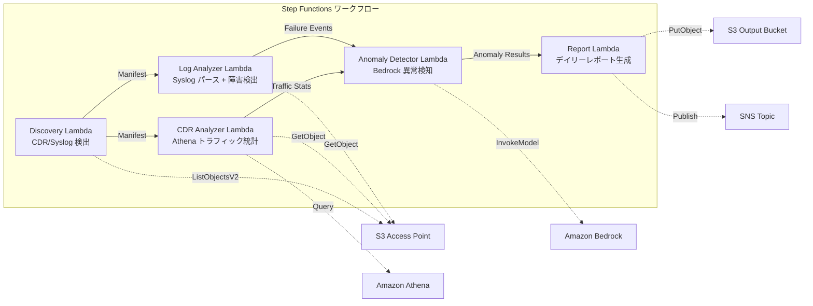

# UC18: 通信 / ネットワーク分析 — CDR/ネットワークログ異常検知・コンプライアンスレポート

🌐 **Language / 言語**: 日本語 | [English](README.en.md) | [한국어](README.ko.md) | [简体中文](README.zh-CN.md) | [繁體中文](README.zh-TW.md) | [Français](README.fr.md) | [Deutsch](README.de.md) | [Español](README.es.md)

📚 **ドキュメント**: [アーキテクチャ図](docs/architecture.md) | [デモガイド](docs/demo-guide.md)

## 概要

FSx for ONTAP の S3 Access Points を活用し、CDR（通話詳細記録）とネットワーク機器ログの異常検知、トラフィック統計分析、コンプライアンスレポートの自動生成を実現するサーバーレスワークフローです。

### このパターンが適しているケース

- CDR ファイル（CSV、ASN.1 デコード済み、Parquet）が FSx for ONTAP 上に蓄積されている
- ネットワーク機器の syslog / SNMP トラップデータを自動分析したい
- Athena によるトラフィック統計（時間帯別通話量、平均通話時間、ピーク同時通話数）を算出したい
- Bedrock による異常検知（7 日間ローリングベースライン比較、3σ超過検出）を実施したい
- 機器障害（link-down、ハードウェアエラー、プロセスクラッシュ）を自動検出・アラートしたい

### このパターンが適さないケース

- リアルタイムのネットワーク監視システムが必要（秒単位の即応性）
- 完全な NOC（Network Operations Center）プラットフォームが必要
- 大規模なネットワークトポロジー分析が必要
- ONTAP REST API へのネットワーク到達性が確保できない環境

### 主な機能

- S3 AP 経由で CDR ファイル（.csv, .asn1, .parquet）と syslog ファイルを自動検出
- Athena によるトラフィック統計分析（通話量、通話時間、ピーク同時接続数）
- Bedrock による異常検知（3σ超過、7 日間ベースライン比較）
- Syslog RFC 5424 パース + SNMP トラップデータ解析
- 機器障害検出（link-down、ハードウェアエラー、キャパシティ閾値超過）
- デイリーネットワーク健全性レポート + 異常アラート通知（SNS）

## Success Metrics

### Outcome
CDR/ネットワークログの分析自動化により、通信事業者のネットワーク障害検出と容量計画を迅速化する。

### Metrics
| メトリクス | 目標値（例） |
|-----------|------------|
| 処理済み CDR ファイル数 / 実行 | > 200 files |
| 異常検知精度 | > 90% |
| 機器障害検出率 | > 95% |
| レポート生成時間 | < 5 分 / 日次バッチ |
| コスト / 日次実行 | < $1.00 |
| Human Review 必須率 | > 20%（重大異常は全件確認） |

### Measurement Method
Step Functions 実行履歴、Athena クエリ結果、Bedrock 推論ログ、CloudWatch EMF Metrics（ProcessingDuration, SuccessCount, ErrorCount）。

### Human Review Requirements
- 3σ超過の重大異常は自動アラート後に人間が確認
- 機器障害（link-down）は即時通知 + オペレーター確認
- 月次トレンドレポートはネットワーク計画チームがレビュー

## アーキテクチャ



### ワークフローステップ

1. **Discovery**: S3 AP から CDR ファイルと syslog ファイルを検出
2. **CDR Analyzer**: CDR パース、Athena によるトラフィック統計集計
3. **Log Analyzer**: Syslog RFC 5424 パース、SNMP トラップ解析、機器障害検出
4. **Anomaly Detector**: 7 日間ベースライン比較、3σ超過の異常フラグ付け（Bedrock 推論）
5. **Report**: デイリーネットワーク健全性レポート生成 + SNS アラート

## 前提条件

> **S3 AP NetworkOrigin 注意**: Discovery Lambda は VPC 内に配置されます。S3 Access Point の NetworkOrigin が `Internet` の場合、S3 Gateway VPC Endpoint 経由ではアクセスできません（FSx データプレーンにルーティングされないため）。NetworkOrigin=VPC の S3 AP を使用するか、NAT Gateway 経由のアクセスを設定してください。詳細は [S3AP Compatibility Notes](../docs/s3ap-compatibility-notes.md) を参照。

- AWS アカウントと適切な IAM 権限
- FSx for ONTAP ファイルシステム（ONTAP 9.17.1P4D3 以上）
- S3 Access Point が有効化されたボリューム（CDR/syslog を格納）
- VPC、プライベートサブネット
- Amazon Bedrock モデルアクセスが有効（Claude / Nova）
- Amazon Athena ワークグループ設定済み

## デプロイ手順

### 1. パラメータの確認

CDR ファイルのサフィックスフィルタとキャパシティ閾値を事前に確認します。

### 2. SAM デプロイ

```bash
# 前提: AWS SAM CLI が必要です。sam build がコードと共有レイヤーを自動でパッケージングします。
sam build

sam deploy \
  --stack-name fsxn-telecom-analytics \
  --parameter-overrides \
    S3AccessPointAlias=<your-volume-ext-s3alias> \
    S3AccessPointName=<your-s3ap-name> \
    VpcId=<your-vpc-id> \
    PrivateSubnetIds=<subnet-1>,<subnet-2> \
    ScheduleExpression="cron(0 0 * * ? *)" \
    NotificationEmail=<your-email@example.com> \
    CdrSuffixFilter=".csv,.asn1,.parquet" \
    AnomalyThresholdStdDev=3 \
    CapacityThresholdPercent=80 \
    EnableVpcEndpoints=false \
    EnableCloudWatchAlarms=false \
  --capabilities CAPABILITY_NAMED_IAM \
  --resolve-s3 \
  --region ap-northeast-1
```

## 設定パラメータ一覧

| パラメータ | 説明 | デフォルト | 必須 |
|-----------|------|----------|------|
| `S3AccessPointAlias` | FSx for ONTAP S3 AP Alias（入力用） | — | ✅ |
| `S3AccessPointName` | S3 AP 名（ARN ベースの IAM 権限付与用） | `""` | ⚠️ 推奨 |
| `ScheduleExpression` | EventBridge Scheduler のスケジュール式 | `cron(0 0 * * ? *)` | |
| `VpcId` | VPC ID | — | ✅ |
| `PrivateSubnetIds` | プライベートサブネット ID リスト | — | ✅ |
| `NotificationEmail` | SNS 通知先メールアドレス | — | ✅ |
| `CdrSuffixFilter` | CDR ファイル検出用サフィックスフィルタ | `.csv,.asn1,.parquet` | |
| `AnomalyThresholdStdDev` | 異常検知の標準偏差閾値 | `3` | |
| `CapacityThresholdPercent` | キャパシティ閾値（%） | `80` | |
| `BaselineWindowDays` | ベースライン期間（日） | `7` | |
| `MapConcurrency` | Map ステートの並列実行数 | `10` | |
| `LambdaMemorySize` | Lambda メモリサイズ (MB) | `512` | |
| `LambdaTimeout` | Lambda タイムアウト (秒) | `300` | |
| `EnableVpcEndpoints` | Interface VPC Endpoints の有効化 | `false` | |
| `EnableCloudWatchAlarms` | CloudWatch Alarms の有効化 | `false` | |

## ⚠️ パフォーマンスに関する注意事項

- FSx for ONTAP のスループットキャパシティは **NFS/SMB/S3 AP 全体で共有**されます。MapConcurrency=10 で並列処理を行う場合、同一ボリュームの他のワークロードに影響する可能性があります。
- 大量ファイルの一括処理を行う場合は、FSx for ONTAP の Throughput Capacity (MBps) を確認し、必要に応じて MapConcurrency を調整してください。
- 推奨: 本番環境では最初に MapConcurrency=5 で開始し、FSx for ONTAP の CloudWatch メトリクス (ThroughputUtilization) を監視しながら段階的に増加させてください。

## クリーンアップ

```bash
aws s3 rm s3://fsxn-telecom-analytics-output-${AWS_ACCOUNT_ID} --recursive

aws cloudformation delete-stack \
  --stack-name fsxn-telecom-analytics \
  --region ap-northeast-1

aws cloudformation wait stack-delete-complete \
  --stack-name fsxn-telecom-analytics \
  --region ap-northeast-1
```

## Supported Regions

UC18 は以下のサービスを使用します:

| サービス | リージョン制約 |
|---------|-------------|
| Amazon Athena | ほぼ全リージョンで利用可能 |
| Amazon Bedrock | 対応リージョンを確認（[Bedrock 対応リージョン](https://docs.aws.amazon.com/general/latest/gr/bedrock.html)） |
| AWS X-Ray | ほぼ全リージョンで利用可能 |
| CloudWatch EMF | ほぼ全リージョンで利用可能 |

> UC18 はクロスリージョン呼び出しを使用しません。Athena と Bedrock は ap-northeast-1 で利用可能です。

## 参考リンク

- [FSx for ONTAP S3 Access Points 概要](https://docs.aws.amazon.com/fsx/latest/ONTAPGuide/accessing-data-via-s3-access-points.html)
- [Amazon Athena ユーザーガイド](https://docs.aws.amazon.com/athena/latest/ug/what-is.html)
- [Amazon Bedrock API リファレンス](https://docs.aws.amazon.com/bedrock/latest/APIReference/API_runtime_InvokeModel.html)

---

## AWS ドキュメントリンク

| サービス | ドキュメント |
|---------|------------|
| FSx for ONTAP | [ユーザーガイド](https://docs.aws.amazon.com/fsx/latest/ONTAPGuide/what-is-fsx-ontap.html) |
| S3 Access Points | [S3 AP for FSx for ONTAP](https://docs.aws.amazon.com/fsx/latest/ONTAPGuide/s3-access-points.html) |
| Step Functions | [開発者ガイド](https://docs.aws.amazon.com/step-functions/latest/dg/welcome.html) |
| Amazon Athena | [ユーザーガイド](https://docs.aws.amazon.com/athena/latest/ug/what-is.html) |
| Amazon Bedrock | [ユーザーガイド](https://docs.aws.amazon.com/bedrock/latest/userguide/what-is-bedrock.html) |

### Well-Architected Framework 対応

| 柱 | 対応 |
|----|------|
| 運用上の優秀性 | X-Ray トレーシング、EMF メトリクス、異常検知監視 |
| セキュリティ | 最小権限 IAM、KMS 暗号化、CDR データアクセス制御 |
| 信頼性 | Step Functions Retry/Catch、exponential backoff (3 回リトライ) |
| パフォーマンス効率 | Athena による大規模 CDR クエリ、並列処理 |
| コスト最適化 | サーバーレス、Athena スキャン課金 |
| 持続可能性 | オンデマンド実行、差分処理 |

---

## コスト見積もり（月額概算）

> **注記**: 以下は ap-northeast-1 リージョンの概算であり、実際のコストは使用量により異なります。最新の料金は [AWS Pricing Calculator](https://calculator.aws/) で確認してください。

### サーバーレスコンポーネント（従量課金）

| サービス | 単価 | 想定使用量 | 月額概算 |
|---------|------|-----------|---------|
| Lambda | $0.0000166667/GB-sec | 5 関数 × 日次実行 | ~$1-3 |
| S3 API (GetObject/ListObjects) | $0.0047/10K requests | ~5K requests/日 | ~$0.75 |
| Step Functions | $0.025/1K state transitions | ~500 transitions/日 | ~$0.40 |
| Bedrock (Nova Lite) | $0.00006/1K input tokens | ~30K tokens/実行 | ~$2-5 |
| Athena | $5/TB scanned | ~10 MB/クエリ | ~$1-3 |
| SNS | $0.50/100K notifications | ~30 notifications/日 | ~$0.10 |
| CloudWatch Logs | $0.76/GB ingested | ~500 MB/月 | ~$0.38 |

### 固定コスト（FSx for ONTAP — 既存環境前提）

| コンポーネント | 月額 |
|--------------|------|
| FSx for ONTAP (128 MBps, 1 TB) | ~$230 (既存環境を共有) |
| S3 Access Point | 追加料金なし（S3 API 料金のみ） |

### 合計概算

| 構成 | 月額概算 |
|------|---------|
| 最小構成（日次 1 回実行） | ~$5-12 |
| 標準構成（日次 + アラーム有効） | ~$12-30 |
| 大規模構成（高頻度 + 大量 CDR） | ~$30-100 |

> **Governance Caveat**: コスト見積もりは概算であり、保証値ではありません。実際の請求額は使用パターン、データ量、リージョンにより異なります。

---

## ローカルテスト

### Prerequisites チェック

```bash
# 前提条件の確認
aws --version          # AWS CLI v2
sam --version          # SAM CLI
python3 --version      # Python 3.9+
docker --version       # Docker (sam local 用)
aws sts get-caller-identity  # AWS 認証情報
```

### sam local invoke

```bash
# ビルド
# 前提: AWS SAM CLI が必要です。sam build がコードと共有レイヤーを自動でパッケージングします。
sam build

# Discovery Lambda のローカル実行
sam local invoke DiscoveryFunction --event events/discovery-event.json

# 環境変数オーバーライド付き
sam local invoke DiscoveryFunction \
  --event events/discovery-event.json \
  --env-vars env.json
```

### ユニットテスト

```bash
python3 -m pytest tests/ -v
```

詳細は [ローカルテスト クイックスタート](../docs/local-testing-quick-start.md) を参照してください。

---

## Governance Note

> 本パターンは技術アーキテクチャガイダンスを提供します。法的・コンプライアンス・規制上の助言ではありません。組織は適格な専門家に相談してください。通信データ（CDR）は個人通信データを含むため、各国の電気通信事業法および個人情報保護法に準拠した取り扱いが必要です。

> **関連規制**: 電気通信事業法、個人情報保護法（通信の秘密）

---

## S3AP Compatibility

S3 Access Points for FSx for ONTAP の互換性制約、トラブルシューティング、トリガーパターンについては [S3AP Compatibility Notes](../docs/s3ap-compatibility-notes.md) を参照してください。
