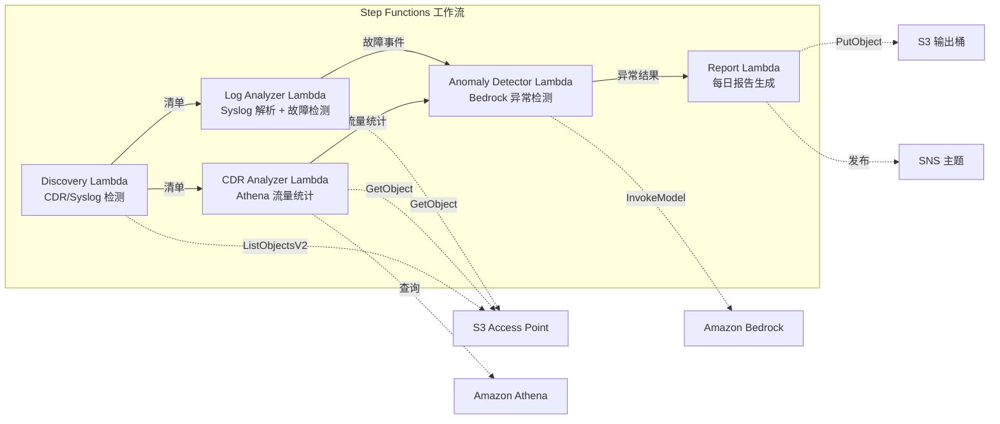

# UC18: 电信 / 网络分析 — CDR/网络日志异常检测与合规报告

🌐 **Language / 言語**: [日本語](README.md) | [English](README.en.md) | [한국어](README.ko.md) | 简体中文 | [繁體中文](README.zh-TW.md) | [Français](README.fr.md) | [Deutsch](README.de.md) | [Español](README.es.md)

📚 **文档**: [架构图](docs/architecture.zh-CN.md) | [演示指南](docs/demo-guide.zh-CN.md)

## 概述

利用 Amazon FSx for ONTAP 的 S3 Access Points，实现 CDR（通话详细记录）和网络设备日志的异常检测、流量统计分析以及合规报告的自动生成的无服务器工作流。

### 适用场景

- CDR 文件（CSV、ASN.1 解码、Parquet）积累在 FSx for ONTAP 上
- 需要自动分析网络设备的 syslog / SNMP trap 数据
- 需要通过 Athena 计算流量统计（时段通话量、平均通话时长、峰值并发通话数）
- 需要通过 Bedrock 进行异常检测（7天滚动基线比较、3σ超过检测）
- 需要自动检测和告警设备故障（link-down、硬件错误、进程崩溃）

### 主要功能

- 通过 S3 AP 自动检测 CDR 文件（.csv, .asn1, .parquet）和 syslog 文件
- 通过 Athena 进行流量统计分析（通话量、通话时长、峰值并发连接数）
- 通过 Bedrock 进行异常检测（3σ阈值、7天基线比较）
- Syslog RFC 5424 解析 + SNMP trap 数据分析
- 设备故障检测（link-down、硬件错误、容量阈值超出）
- 每日网络健康报告 + 异常告警通知（SNS）

## 成功指标 (Success Metrics)

### 预期成果 (Outcome)
通过自动化 CDR/网络日志分析，加速电信运营商的网络故障检测和容量规划。

### 指标 (Metrics)
| 指标 | 目标值（示例） |
|------|-------------|
| 每次执行处理的 CDR 文件数 | > 200 个文件 |
| 异常检测准确率 | > 90% |
| 设备故障检测率 | > 95% |
| 报告生成时间 | < 5 分钟 / 每日批次 |
| 每日执行费用 | < $1.00 |
| 需人工审核比例 | > 20%（重大异常全量确认） |

### 测量方法 (Measurement Method)
Step Functions 执行历史、Athena 查询结果、Bedrock 推理日志、CloudWatch EMF 指标（ProcessingDuration, SuccessCount, ErrorCount）。

### 人工审核要求 (Human Review Requirements)
- 超过 3σ 的重大异常在自动告警后由人工确认
- 设备故障（link-down）立即通知 + 运维人员确认
- 月度趋势报告由网络规划团队审核

## 架构



> **S3 AP NetworkOrigin 注意**: Discovery Lambda 部署在 VPC 内。如果 S3 Access Point 的 NetworkOrigin 为 `Internet`，则无法通过 S3 Gateway VPC Endpoint 访问（请求不会路由到 FSx 数据平面）。请使用 VPC-origin S3 AP 或配置 NAT Gateway 访问。详见 [S3AP 兼容性说明](../docs/s3ap-compatibility-notes.md)。

## 部署方法

```bash
# 前提条件：需要 AWS SAM CLI。'sam build' 会自动打包代码和共享层。
sam build

sam deploy \
  --stack-name fsxn-telecom-analytics \
  --parameter-overrides \
    S3AccessPointAlias=<your-volume-ext-s3alias> \
    S3AccessPointName=<your-s3ap-name> \
    VpcId=<your-vpc-id> \
    PrivateSubnetIds=<subnet-1>,<subnet-2> \
    ScheduleExpression="cron(0 0 * * ? *)" \
    NotificationEmail=<your-email@example.com> \
    CdrSuffixFilter=".csv,.asn1,.parquet" \
    AnomalyThresholdStdDev=3 \
    CapacityThresholdPercent=80 \
  --capabilities CAPABILITY_NAMED_IAM \
  --resolve-s3 \
  --region ap-northeast-1
```

> **注意**: `template.yaml` 用于 SAM CLI（`sam build` + `sam deploy`）。
> 如需使用原生 `aws cloudformation deploy` 部署，请改用 `template-deploy.yaml`（需要预先打包 Lambda zip 文件并上传到 S3 存储桶）。

## ⚠️ 性能注意事项

- FSx for ONTAP 的吞吐量容量在 **NFS/SMB/S3 AP 之间共享**。使用 MapConcurrency=10 进行并行处理时可能影响同一卷上的其他工作负载。
- 进行大规模批量处理时，请检查 FSx for ONTAP 的 Throughput Capacity (MBps) 并相应调整 MapConcurrency。
- 建议：在生产环境中从 MapConcurrency=5 开始，监控 CloudWatch 指标 (ThroughputUtilization)，然后逐步增加。

## 清理 (Cleanup)

```bash
aws s3 rm s3://fsxn-telecom-analytics-output-${AWS_ACCOUNT_ID} --recursive

aws cloudformation delete-stack \
  --stack-name fsxn-telecom-analytics \
  --region ap-northeast-1
```

## 治理说明 (Governance Note)

> 本模式提供技术架构指导。不构成法律、合规或监管建议。CDR 数据包含个人通信数据，必须遵守适用的电信法规和隐私法律进行处理。

> **Related Regulations**: 電気通信事業法 (Telecommunications Business Act), 個人情報保護法 (APPI - Personal Information Protection)
