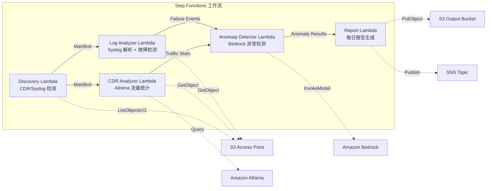

# UC18：电信 / 网络分析 — CDR/网络日志异常检测·合规报告

🌐 **Language / 语言**: [日本語](README.md) | [English](README.en.md) | [한국어](README.ko.md) | 简体中文 | [繁體中文](README.zh-TW.md) | [Français](README.fr.md) | [Deutsch](README.de.md) | [Español](README.es.md)

📚 **文档**: [架构图](docs/architecture.zh-CN.md) | [演示指南](docs/demo-guide.zh-CN.md)

## 概述

这是一个利用 FSx for ONTAP 的 S3 Access Points，实现对 CDR（通话详细记录）和网络设备日志的异常检测、流量统计分析以及合规报告自动生成的无服务器工作流。

### 适合本模式的场景

- CDR 文件（CSV、已 ASN.1 解码、Parquet）积累在 FSx for ONTAP 上
- 希望自动分析网络设备的 syslog / SNMP trap 数据
- 希望通过 Athena 计算流量统计（按时段的通话量、平均通话时长、峰值并发通话数）
- 希望通过 Bedrock 实施异常检测（7 天滚动基线比较、3σ 超出检测）
- 希望自动检测·告警设备故障（link-down、硬件错误、进程崩溃）

### 不适合本模式的场景

- 需要实时网络监控系统（秒级即时响应）
- 需要完整的 NOC（Network Operations Center）平台
- 需要大规模网络拓扑分析
- 无法确保对 ONTAP REST API 的网络可达性的环境

### 主要功能

- 通过 S3 AP 自动检测 CDR 文件（.csv、.asn1、.parquet）和 syslog 文件
- 通过 Athena 进行流量统计分析（通话量、通话时长、峰值并发连接数）
- 通过 Bedrock 进行异常检测（3σ 超出、7 天基线比较）
- Syslog RFC 5424 解析 + SNMP trap 数据解析
- 设备故障检测（link-down、硬件错误、容量阈值超出）
- 每日网络健康报告 + 异常告警通知（SNS）

## Success Metrics

### Outcome
通过 CDR/网络日志分析自动化，加速电信运营商的网络故障检测和容量规划。

### Metrics
| 指标 | 目标值（示例） |
|-----------|------------|
| 已处理 CDR 文件数 / 执行 | > 200 files |
| 异常检测精度 | > 90% |
| 设备故障检测率 | > 95% |
| 报告生成时间 | < 5 分钟 / 每日批处理 |
| 成本 / 每日执行 | < $1.00 |
| Human Review 必需率 | > 20%（重大异常全部确认） |

### Measurement Method
Step Functions 执行历史、Athena 查询结果、Bedrock 推理日志、CloudWatch EMF Metrics（ProcessingDuration、SuccessCount、ErrorCount）。

### Human Review Requirements
- 3σ 超出的重大异常在自动告警后由人工确认
- 设备故障（link-down）需即时通知 + 运维人员确认
- 月度趋势报告由网络规划团队审查

## 架构



### 工作流步骤

1. **Discovery**：从 S3 AP 检测 CDR 文件和 syslog 文件
2. **CDR Analyzer**：CDR 解析，通过 Athena 汇总流量统计
3. **Log Analyzer**：Syslog RFC 5424 解析、SNMP trap 解析、设备故障检测
4. **Anomaly Detector**：7 天基线比较，标记 3σ 超出的异常（Bedrock 推理）
5. **Report**：生成每日网络健康报告 + SNS 告警

## 前提条件

> **S3 AP NetworkOrigin 注意**：Discovery Lambda 部署在 VPC 内。如果 S3 Access Point 的 NetworkOrigin 为 `Internet`，则无法通过 S3 Gateway VPC Endpoint 访问（因为不会路由到 FSx 数据平面）。请使用 NetworkOrigin=VPC 的 S3 AP，或配置通过 NAT Gateway 的访问。详情请参阅 [S3AP Compatibility Notes](../docs/s3ap-compatibility-notes.md)。

- AWS 账户和适当的 IAM 权限
- FSx for ONTAP 文件系统（ONTAP 9.17.1P4D3 以上）
- 已启用 S3 Access Point 的卷（存储 CDR/syslog）
- VPC、私有子网
- 已启用 Amazon Bedrock 模型访问（Claude / Nova）
- 已配置 Amazon Athena 工作组

## 部署步骤

### 1. 参数确认

事先确认 CDR 文件的后缀过滤器和容量阈值。

### 2. SAM 部署

```bash
# 前提：需要 AWS SAM CLI。sam build 会自动打包代码和共享层。
sam build

sam deploy \
  --stack-name fsxn-telecom-analytics \
  --parameter-overrides \
    S3AccessPointAlias=<your-volume-ext-s3alias> \
    S3AccessPointName=<your-s3ap-name> \
    VpcId=<your-vpc-id> \
    PrivateSubnetIds=<subnet-1>,<subnet-2> \
    ScheduleExpression="cron(0 0 * * ? *)" \
    NotificationEmail=<your-email@example.com> \
    CdrSuffixFilter=".csv,.asn1,.parquet" \
    AnomalyThresholdStdDev=3 \
    CapacityThresholdPercent=80 \
    EnableVpcEndpoints=false \
    EnableCloudWatchAlarms=false \
  --capabilities CAPABILITY_NAMED_IAM \
  --resolve-s3 \
  --region ap-northeast-1
```

> **注意**：`template.yaml` 用于 SAM CLI（`sam build` + `sam deploy`）。
> 若使用 `aws cloudformation deploy` 命令直接部署，请使用 `template-deploy.yaml`（需要事先打包 Lambda zip 文件并上传到 S3）。

## 配置参数一览

| 参数 | 说明 | 默认值 | 必需 |
|-----------|------|----------|------|
| `S3AccessPointAlias` | FSx for ONTAP S3 AP Alias（输入用） | — | ✅ |
| `S3AccessPointName` | S3 AP 名称（用于基于 ARN 的 IAM 权限授予） | `""` | ⚠️ 推荐 |
| `ScheduleExpression` | EventBridge Scheduler 的调度表达式 | `cron(0 0 * * ? *)` | |
| `VpcId` | VPC ID | — | ✅ |
| `PrivateSubnetIds` | 私有子网 ID 列表 | — | ✅ |
| `NotificationEmail` | SNS 通知目标电子邮件地址 | — | ✅ |
| `CdrSuffixFilter` | CDR 文件检测用后缀过滤器 | `.csv,.asn1,.parquet` | |
| `AnomalyThresholdStdDev` | 异常检测的标准差阈值 | `3` | |
| `CapacityThresholdPercent` | 容量阈值（%） | `80` | |
| `BaselineWindowDays` | 基线期间（天） | `7` | |
| `MapConcurrency` | Map 状态的并行执行数 | `10` | |
| `LambdaMemorySize` | Lambda 内存大小 (MB) | `512` | |
| `LambdaTimeout` | Lambda 超时 (秒) | `300` | |
| `EnableVpcEndpoints` | 启用 Interface VPC Endpoints | `false` | |
| `EnableCloudWatchAlarms` | 启用 CloudWatch Alarms | `false` | |

## ⚠️ 性能相关注意事项

- FSx for ONTAP 的吞吐量容量在 **NFS/SMB/S3 AP 之间共享**。以 MapConcurrency=10 进行并行处理时，可能会影响同一卷上的其他工作负载。
- 进行大量文件的批量处理时，请确认 FSx for ONTAP 的 Throughput Capacity (MBps)，并根据需要调整 MapConcurrency。
- 推荐：在生产环境中首先以 MapConcurrency=5 开始，边监控 FSx for ONTAP 的 CloudWatch 指标 (ThroughputUtilization) 边逐步增加。

## 清理

```bash
aws s3 rm s3://fsxn-telecom-analytics-output-${AWS_ACCOUNT_ID} --recursive

aws cloudformation delete-stack \
  --stack-name fsxn-telecom-analytics \
  --region ap-northeast-1

aws cloudformation wait stack-delete-complete \
  --stack-name fsxn-telecom-analytics \
  --region ap-northeast-1
```

## Supported Regions

UC18 使用以下服务：

| 服务 | 区域限制 |
|---------|-------------|
| Amazon Athena | 几乎所有区域均可用 |
| Amazon Bedrock | 请确认支持的区域（[Bedrock 支持区域](https://docs.aws.amazon.com/general/latest/gr/bedrock.html)） |
| AWS X-Ray | 几乎所有区域均可用 |
| CloudWatch EMF | 几乎所有区域均可用 |

> UC18 不使用跨区域调用。Athena 和 Bedrock 在 ap-northeast-1 可用。

## 参考链接

- [FSx for ONTAP S3 Access Points 概述](https://docs.aws.amazon.com/fsx/latest/ONTAPGuide/accessing-data-via-s3-access-points.html)
- [Amazon Athena 用户指南](https://docs.aws.amazon.com/athena/latest/ug/what-is.html)
- [Amazon Bedrock API 参考](https://docs.aws.amazon.com/bedrock/latest/APIReference/API_runtime_InvokeModel.html)

---

## AWS 文档链接

| 服务 | 文档 |
|---------|------------|
| FSx for ONTAP | [用户指南](https://docs.aws.amazon.com/fsx/latest/ONTAPGuide/what-is-fsx-ontap.html) |
| S3 Access Points | [S3 AP for FSx for ONTAP](https://docs.aws.amazon.com/fsx/latest/ONTAPGuide/s3-access-points.html) |
| Step Functions | [开发者指南](https://docs.aws.amazon.com/step-functions/latest/dg/welcome.html) |
| Amazon Athena | [用户指南](https://docs.aws.amazon.com/athena/latest/ug/what-is.html) |
| Amazon Bedrock | [用户指南](https://docs.aws.amazon.com/bedrock/latest/userguide/what-is-bedrock.html) |

### Well-Architected Framework 对应

| 支柱 | 对应 |
|----|------|
| 卓越运营 | X-Ray 追踪、EMF 指标、异常检测监控 |
| 安全性 | 最小权限 IAM、KMS 加密、CDR 数据访问控制 |
| 可靠性 | Step Functions Retry/Catch、exponential backoff（3 次重试） |
| 性能效率 | 通过 Athena 进行大规模 CDR 查询、并行处理 |
| 成本优化 | 无服务器、Athena 扫描计费 |
| 可持续性 | 按需执行、增量处理 |

---

## 成本估算（月度概算）

> **注记**：以下为 ap-northeast-1 区域的概算，实际成本因使用量而异。最新价格请在 [AWS Pricing Calculator](https://calculator.aws/) 确认。

### 无服务器组件（按量计费）

| 服务 | 单价 | 预计使用量 | 月度概算 |
|---------|------|-----------|---------|
| Lambda | $0.0000166667/GB-sec | 5 个函数 × 每日执行 | ~$1-3 |
| S3 API (GetObject/ListObjects) | $0.0047/10K requests | ~5K requests/天 | ~$0.75 |
| Step Functions | $0.025/1K state transitions | ~500 transitions/天 | ~$0.40 |
| Bedrock (Nova Lite) | $0.00006/1K input tokens | ~30K tokens/执行 | ~$2-5 |
| Athena | $5/TB scanned | ~10 MB/查询 | ~$1-3 |
| SNS | $0.50/100K notifications | ~30 notifications/天 | ~$0.10 |
| CloudWatch Logs | $0.76/GB ingested | ~500 MB/月 | ~$0.38 |

### 固定成本（FSx for ONTAP — 以现有环境为前提）

| 组件 | 月度 |
|--------------|------|
| FSx for ONTAP (128 MBps, 1 TB) | ~$230（共享现有环境） |
| S3 Access Point | 无额外费用（仅 S3 API 费用） |

### 合计概算

| 配置 | 月度概算 |
|------|---------|
| 最小配置（每日 1 次执行） | ~$5-12 |
| 标准配置（每日 + 启用告警） | ~$12-30 |
| 大规模配置（高频 + 大量 CDR） | ~$30-100 |

> **Governance Caveat**：成本估算为概算，并非保证值。实际账单金额因使用模式、数据量、区域而异。

---

## 本地测试

### Prerequisites 检查

```bash
# 确认前提条件
aws --version          # AWS CLI v2
sam --version          # SAM CLI
python3 --version      # Python 3.9+
docker --version       # Docker (用于 sam local)
aws sts get-caller-identity  # AWS 凭证
```

### sam local invoke

```bash
# 构建
# 前提：需要 AWS SAM CLI。sam build 会自动打包代码和共享层。
sam build

# 在本地执行 Discovery Lambda
sam local invoke DiscoveryFunction --event events/discovery-event.json

# 带环境变量覆盖
sam local invoke DiscoveryFunction \
  --event events/discovery-event.json \
  --env-vars env.json
```

### 单元测试

```bash
python3 -m pytest tests/ -v
```

详情请参阅 [本地测试快速入门](../docs/local-testing-quick-start.md)。

---

## Governance Note

> 本模式提供技术架构指导。并非法律·合规·监管方面的建议。组织应咨询具备资质的专业人士。通信数据（CDR）包含个人通信数据，因此需要按照各国的电信业务法及个人信息保护法进行合规处理。

> **相关法规**：电信业务法、个人信息保护法（通信秘密）

---

## S3AP Compatibility

关于 S3 Access Points for FSx for ONTAP 的兼容性约束、故障排除、触发模式，请参阅 [S3AP Compatibility Notes](../docs/s3ap-compatibility-notes.md)。
