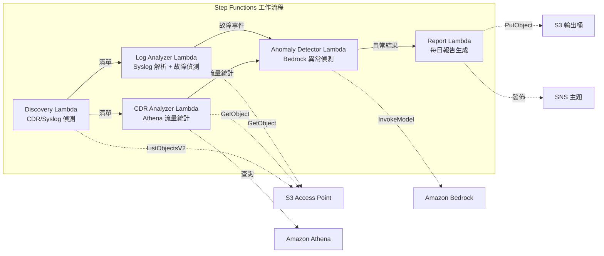

# UC18: 電信 / 網路分析 — CDR/網路日誌異常偵測與合規報告

🌐 **Language / 言語**: [日本語](README.md) | [English](README.en.md) | [한국어](README.ko.md) | [简体中文](README.zh-CN.md) | 繁體中文 | [Français](README.fr.md) | [Deutsch](README.de.md) | [Español](README.es.md)

📚 **文件**: [架構圖](docs/architecture.zh-TW.md) | [展示指南](docs/demo-guide.zh-TW.md)

## 概述

利用 Amazon FSx for ONTAP 的 S3 Access Points，實現 CDR（通話詳細記錄）和網路設備日誌的異常偵測、流量統計分析以及合規報告的自動生成的無伺服器工作流程。

### 適用情境

- CDR 檔案（CSV、ASN.1 解碼、Parquet）累積在 FSx for ONTAP 上
- 需要自動分析網路設備的 syslog / SNMP trap 資料
- 需要透過 Athena 計算流量統計（時段通話量、平均通話時長、尖峰同時通話數）
- 需要透過 Bedrock 進行異常偵測（7天滾動基線比較、3σ超過偵測）
- 需要自動偵測和告警設備故障（link-down、硬體錯誤、程序崩潰）

### 主要功能

- 透過 S3 AP 自動偵測 CDR 檔案（.csv, .asn1, .parquet）和 syslog 檔案
- 透過 Athena 進行流量統計分析（通話量、通話時長、尖峰同時連線數）
- 透過 Bedrock 進行異常偵測（3σ閾值、7天基線比較）
- Syslog RFC 5424 解析 + SNMP trap 資料分析
- 設備故障偵測（link-down、硬體錯誤、容量閾值超出）
- 每日網路健康報告 + 異常告警通知（SNS）

## 成功指標 (Success Metrics)

### 預期成果 (Outcome)
透過自動化 CDR/網路日誌分析，加速電信營運商的網路故障偵測和容量規劃。

### 指標 (Metrics)
| 指標 | 目標值（範例） |
|------|-------------|
| 每次執行處理的 CDR 檔案數 | > 200 個檔案 |
| 異常偵測準確率 | > 90% |
| 設備故障偵測率 | > 95% |
| 報告生成時間 | < 5 分鐘 / 每日批次 |
| 每日執行成本 | < $1.00 |
| 需人工審核比例 | > 20%（重大異常全量確認） |

### 衡量方法 (Measurement Method)
Step Functions 執行歷史、Athena 查詢結果、Bedrock 推論日誌、CloudWatch EMF 指標（ProcessingDuration, SuccessCount, ErrorCount）。

### 人工審核要求 (Human Review Requirements)
- 超過 3σ 的重大異常在自動告警後由人工確認
- 設備故障（link-down）立即通知 + 維運人員確認
- 月度趨勢報告由網路規劃團隊審核

## 架構



> **S3 AP NetworkOrigin 注意**: Discovery Lambda 部署在 VPC 內。如果 S3 Access Point 的 NetworkOrigin 為 `Internet`，則無法透過 S3 Gateway VPC Endpoint 存取（請求不會路由到 FSx 資料平面）。請使用 VPC-origin S3 AP 或設定 NAT Gateway 存取。詳見 [S3AP 相容性說明](../docs/s3ap-compatibility-notes.md)。

## 部署方法

```bash
# 前提條件：需要 AWS SAM CLI。'sam build' 會自動打包程式碼與共用層。
sam build

sam deploy \
  --stack-name fsxn-telecom-analytics \
  --parameter-overrides \
    S3AccessPointAlias=<your-volume-ext-s3alias> \
    S3AccessPointName=<your-s3ap-name> \
    VpcId=<your-vpc-id> \
    PrivateSubnetIds=<subnet-1>,<subnet-2> \
    ScheduleExpression="cron(0 0 * * ? *)" \
    NotificationEmail=<your-email@example.com> \
    CdrSuffixFilter=".csv,.asn1,.parquet" \
    AnomalyThresholdStdDev=3 \
    CapacityThresholdPercent=80 \
  --capabilities CAPABILITY_NAMED_IAM \
  --resolve-s3 \
  --region ap-northeast-1
```

> **注意**: `template.yaml` 用於 SAM CLI（`sam build` + `sam deploy`）。
> 如需使用原生 `aws cloudformation deploy` 部署，請改用 `template-deploy.yaml`（需要預先封裝 Lambda zip 檔案並上傳至 S3 儲存貯體）。

## ⚠️ 效能注意事項

- FSx for ONTAP 的吞吐量容量在 **NFS/SMB/S3 AP 之間共享**。使用 MapConcurrency=10 進行並行處理時可能影響同一卷上的其他工作負載。
- 進行大規模批量處理時，請檢查 FSx for ONTAP 的 Throughput Capacity (MBps) 並相應調整 MapConcurrency。
- 建議：在生產環境中從 MapConcurrency=5 開始，監控 CloudWatch 指標 (ThroughputUtilization)，然後逐步增加。

## 清理 (Cleanup)

```bash
aws s3 rm s3://fsxn-telecom-analytics-output-${AWS_ACCOUNT_ID} --recursive

aws cloudformation delete-stack \
  --stack-name fsxn-telecom-analytics \
  --region ap-northeast-1
```

## 治理說明 (Governance Note)

> 本模式提供技術架構指引。不構成法律、合規或監管建議。CDR 資料包含個人通訊資料，必須遵守適用的電信法規和隱私法律進行處理。

> **Related Regulations**: 電気通信事業法 (Telecommunications Business Act), 個人情報保護法 (APPI - Personal Information Protection)
