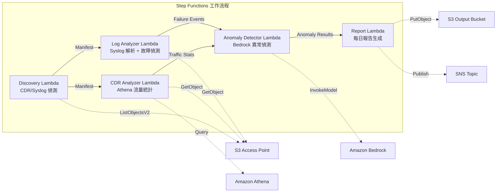

# UC18：電信 / 網路分析 — CDR/網路日誌異常偵測·合規報告

🌐 **Language / 語言**: [日本語](README.md) | [English](README.en.md) | [한국어](README.ko.md) | [简体中文](README.zh-CN.md) | 繁體中文 | [Français](README.fr.md) | [Deutsch](README.de.md) | [Español](README.es.md)

📚 **文件**: [架構圖](docs/architecture.zh-TW.md) | [示範指南](docs/demo-guide.zh-TW.md)

## 概述

這是一個利用 FSx for ONTAP 的 S3 Access Points，實現對 CDR（通話詳細記錄）和網路設備日誌的異常偵測、流量統計分析以及合規報告自動生成的無伺服器工作流程。

### 適合本模式的情境

- CDR 檔案（CSV、已 ASN.1 解碼、Parquet）累積在 FSx for ONTAP 上
- 希望自動分析網路設備的 syslog / SNMP trap 資料
- 希望透過 Athena 計算流量統計（各時段通話量、平均通話時間、尖峰同時通話數）
- 希望透過 Bedrock 實施異常偵測（7 天滾動基準線比較、3σ 超出偵測）
- 希望自動偵測·告警設備故障（link-down、硬體錯誤、程序當機）

### 不適合本模式的情境

- 需要即時網路監控系統（秒級即時回應性）
- 需要完整的 NOC（Network Operations Center）平台
- 需要大規模網路拓撲分析
- 無法確保對 ONTAP REST API 的網路可達性的環境

### 主要功能

- 透過 S3 AP 自動偵測 CDR 檔案（.csv、.asn1、.parquet）和 syslog 檔案
- 透過 Athena 進行流量統計分析（通話量、通話時間、尖峰同時連線數）
- 透過 Bedrock 進行異常偵測（3σ 超出、7 天基準線比較）
- Syslog RFC 5424 解析 + SNMP trap 資料解析
- 設備故障偵測（link-down、硬體錯誤、容量閾值超出）
- 每日網路健康報告 + 異常告警通知（SNS）

## Success Metrics

### Outcome
透過 CDR/網路日誌分析自動化，加速電信業者的網路故障偵測和容量規劃。

### Metrics
| 指標 | 目標值（範例） |
|-----------|------------|
| 已處理 CDR 檔案數 / 執行 | > 200 files |
| 異常偵測精度 | > 90% |
| 設備故障偵測率 | > 95% |
| 報告生成時間 | < 5 分鐘 / 每日批次 |
| 成本 / 每日執行 | < $1.00 |
| Human Review 必需率 | > 20%（重大異常全部確認） |

### Measurement Method
Step Functions 執行歷史、Athena 查詢結果、Bedrock 推論日誌、CloudWatch EMF Metrics（ProcessingDuration、SuccessCount、ErrorCount）。

### Human Review Requirements
- 3σ 超出的重大異常在自動告警後由人工確認
- 設備故障（link-down）需即時通知 + 維運人員確認
- 月度趨勢報告由網路規劃團隊審查

## 架構



### 工作流程步驟

1. **Discovery**：從 S3 AP 偵測 CDR 檔案和 syslog 檔案
2. **CDR Analyzer**：CDR 解析，透過 Athena 彙總流量統計
3. **Log Analyzer**：Syslog RFC 5424 解析、SNMP trap 解析、設備故障偵測
4. **Anomaly Detector**：7 天基準線比較，標記 3σ 超出的異常（Bedrock 推論）
5. **Report**：生成每日網路健康報告 + SNS 告警

## 前提條件

> **S3 AP NetworkOrigin 注意**：Discovery Lambda 部署在 VPC 內。如果 S3 Access Point 的 NetworkOrigin 為 `Internet`，則無法透過 S3 Gateway VPC Endpoint 存取（因為不會路由到 FSx 資料平面）。請使用 NetworkOrigin=VPC 的 S3 AP，或設定透過 NAT Gateway 的存取。詳情請參閱 [S3AP Compatibility Notes](../docs/s3ap-compatibility-notes.md)。

- AWS 帳戶和適當的 IAM 權限
- FSx for ONTAP 檔案系統（ONTAP 9.17.1P4D3 以上）
- 已啟用 S3 Access Point 的磁碟區（儲存 CDR/syslog）
- VPC、私有子網路
- 已啟用 Amazon Bedrock 模型存取（Claude / Nova）
- 已設定 Amazon Athena 工作群組

## 部署步驟

### 1. 參數確認

事先確認 CDR 檔案的後綴篩選器和容量閾值。

### 2. SAM 部署

```bash
# 前提：需要 AWS SAM CLI。sam build 會自動封裝程式碼和共用層。
sam build

sam deploy \
  --stack-name fsxn-telecom-analytics \
  --parameter-overrides \
    S3AccessPointAlias=<your-volume-ext-s3alias> \
    S3AccessPointName=<your-s3ap-name> \
    VpcId=<your-vpc-id> \
    PrivateSubnetIds=<subnet-1>,<subnet-2> \
    ScheduleExpression="cron(0 0 * * ? *)" \
    NotificationEmail=<your-email@example.com> \
    CdrSuffixFilter=".csv,.asn1,.parquet" \
    AnomalyThresholdStdDev=3 \
    CapacityThresholdPercent=80 \
    EnableVpcEndpoints=false \
    EnableCloudWatchAlarms=false \
  --capabilities CAPABILITY_NAMED_IAM \
  --resolve-s3 \
  --region ap-northeast-1
```

> **注意**：`template.yaml` 用於 SAM CLI（`sam build` + `sam deploy`）。
> 若使用 `aws cloudformation deploy` 命令直接部署，請使用 `template-deploy.yaml`（需要事先封裝 Lambda zip 檔案並上傳到 S3）。

## 設定參數一覽

| 參數 | 說明 | 預設值 | 必需 |
|-----------|------|----------|------|
| `S3AccessPointAlias` | FSx for ONTAP S3 AP Alias（輸入用） | — | ✅ |
| `S3AccessPointName` | S3 AP 名稱（用於基於 ARN 的 IAM 權限授予） | `""` | ⚠️ 建議 |
| `ScheduleExpression` | EventBridge Scheduler 的排程運算式 | `cron(0 0 * * ? *)` | |
| `VpcId` | VPC ID | — | ✅ |
| `PrivateSubnetIds` | 私有子網路 ID 清單 | — | ✅ |
| `NotificationEmail` | SNS 通知目標電子郵件位址 | — | ✅ |
| `CdrSuffixFilter` | CDR 檔案偵測用後綴篩選器 | `.csv,.asn1,.parquet` | |
| `AnomalyThresholdStdDev` | 異常偵測的標準差閾值 | `3` | |
| `CapacityThresholdPercent` | 容量閾值（%） | `80` | |
| `BaselineWindowDays` | 基準線期間（天） | `7` | |
| `MapConcurrency` | Map 狀態的平行執行數 | `10` | |
| `LambdaMemorySize` | Lambda 記憶體大小 (MB) | `512` | |
| `LambdaTimeout` | Lambda 逾時 (秒) | `300` | |
| `EnableVpcEndpoints` | 啟用 Interface VPC Endpoints | `false` | |
| `EnableCloudWatchAlarms` | 啟用 CloudWatch Alarms | `false` | |

## ⚠️ 效能相關注意事項

- FSx for ONTAP 的吞吐量容量在 **NFS/SMB/S3 AP 之間共用**。以 MapConcurrency=10 進行平行處理時，可能會影響同一磁碟區上的其他工作負載。
- 進行大量檔案的批次處理時，請確認 FSx for ONTAP 的 Throughput Capacity (MBps)，並視需要調整 MapConcurrency。
- 建議：在生產環境中首先以 MapConcurrency=5 開始，一邊監控 FSx for ONTAP 的 CloudWatch 指標 (ThroughputUtilization) 一邊逐步增加。

## 清理

```bash
aws s3 rm s3://fsxn-telecom-analytics-output-${AWS_ACCOUNT_ID} --recursive

aws cloudformation delete-stack \
  --stack-name fsxn-telecom-analytics \
  --region ap-northeast-1

aws cloudformation wait stack-delete-complete \
  --stack-name fsxn-telecom-analytics \
  --region ap-northeast-1
```

## Supported Regions

UC18 使用以下服務：

| 服務 | 區域限制 |
|---------|-------------|
| Amazon Athena | 幾乎所有區域均可使用 |
| Amazon Bedrock | 請確認支援的區域（[Bedrock 支援區域](https://docs.aws.amazon.com/general/latest/gr/bedrock.html)） |
| AWS X-Ray | 幾乎所有區域均可使用 |
| CloudWatch EMF | 幾乎所有區域均可使用 |

> UC18 不使用跨區域呼叫。Athena 和 Bedrock 在 ap-northeast-1 可使用。

## 參考連結

- [FSx for ONTAP S3 Access Points 概述](https://docs.aws.amazon.com/fsx/latest/ONTAPGuide/accessing-data-via-s3-access-points.html)
- [Amazon Athena 使用者指南](https://docs.aws.amazon.com/athena/latest/ug/what-is.html)
- [Amazon Bedrock API 參考](https://docs.aws.amazon.com/bedrock/latest/APIReference/API_runtime_InvokeModel.html)

---

## AWS 文件連結

| 服務 | 文件 |
|---------|------------|
| FSx for ONTAP | [使用者指南](https://docs.aws.amazon.com/fsx/latest/ONTAPGuide/what-is-fsx-ontap.html) |
| S3 Access Points | [S3 AP for FSx for ONTAP](https://docs.aws.amazon.com/fsx/latest/ONTAPGuide/s3-access-points.html) |
| Step Functions | [開發人員指南](https://docs.aws.amazon.com/step-functions/latest/dg/welcome.html) |
| Amazon Athena | [使用者指南](https://docs.aws.amazon.com/athena/latest/ug/what-is.html) |
| Amazon Bedrock | [使用者指南](https://docs.aws.amazon.com/bedrock/latest/userguide/what-is-bedrock.html) |

### Well-Architected Framework 對應

| 支柱 | 對應 |
|----|------|
| 卓越營運 | X-Ray 追蹤、EMF 指標、異常偵測監控 |
| 安全性 | 最小權限 IAM、KMS 加密、CDR 資料存取控制 |
| 可靠性 | Step Functions Retry/Catch、exponential backoff（3 次重試） |
| 效能效率 | 透過 Athena 進行大規模 CDR 查詢、平行處理 |
| 成本最佳化 | 無伺服器、Athena 掃描計費 |
| 永續性 | 隨需執行、增量處理 |

---

## 成本估算（每月概算）

> **註記**：以下為 ap-northeast-1 區域的概算，實際成本因使用量而異。最新價格請在 [AWS Pricing Calculator](https://calculator.aws/) 確認。

### 無伺服器元件（依用量計費）

| 服務 | 單價 | 預計使用量 | 每月概算 |
|---------|------|-----------|---------|
| Lambda | $0.0000166667/GB-sec | 5 個函數 × 每日執行 | ~$1-3 |
| S3 API (GetObject/ListObjects) | $0.0047/10K requests | ~5K requests/天 | ~$0.75 |
| Step Functions | $0.025/1K state transitions | ~500 transitions/天 | ~$0.40 |
| Bedrock (Nova Lite) | $0.00006/1K input tokens | ~30K tokens/執行 | ~$2-5 |
| Athena | $5/TB scanned | ~10 MB/查詢 | ~$1-3 |
| SNS | $0.50/100K notifications | ~30 notifications/天 | ~$0.10 |
| CloudWatch Logs | $0.76/GB ingested | ~500 MB/月 | ~$0.38 |

### 固定成本（FSx for ONTAP — 以現有環境為前提）

| 元件 | 每月 |
|--------------|------|
| FSx for ONTAP (128 MBps, 1 TB) | ~$230（共用現有環境） |
| S3 Access Point | 無額外費用（僅 S3 API 費用） |

### 合計概算

| 組態 | 每月概算 |
|------|---------|
| 最小組態（每日 1 次執行） | ~$5-12 |
| 標準組態（每日 + 啟用告警） | ~$12-30 |
| 大規模組態（高頻 + 大量 CDR） | ~$30-100 |

> **Governance Caveat**：成本估算為概算，並非保證值。實際帳單金額因使用模式、資料量、區域而異。

---

## 本機測試

### Prerequisites 檢查

```bash
# 確認前提條件
aws --version          # AWS CLI v2
sam --version          # SAM CLI
python3 --version      # Python 3.9+
docker --version       # Docker (用於 sam local)
aws sts get-caller-identity  # AWS 憑證
```

### sam local invoke

```bash
# 建置
# 前提：需要 AWS SAM CLI。sam build 會自動封裝程式碼和共用層。
sam build

# 在本機執行 Discovery Lambda
sam local invoke DiscoveryFunction --event events/discovery-event.json

# 帶環境變數覆寫
sam local invoke DiscoveryFunction \
  --event events/discovery-event.json \
  --env-vars env.json
```

### 單元測試

```bash
python3 -m pytest tests/ -v
```

詳情請參閱 [本機測試快速入門](../docs/local-testing-quick-start.md)。

---

## Governance Note

> 本模式提供技術架構指導。並非法律·合規·監管方面的建議。組織應諮詢具備資格的專業人士。通訊資料（CDR）包含個人通訊資料，因此需要依照各國的電信事業法及個人資料保護法進行合規處理。

> **相關法規**：電信事業法、個人資料保護法（通訊祕密）

---

## S3AP Compatibility

關於 S3 Access Points for FSx for ONTAP 的相容性限制、疑難排解、觸發模式，請參閱 [S3AP Compatibility Notes](../docs/s3ap-compatibility-notes.md)。
