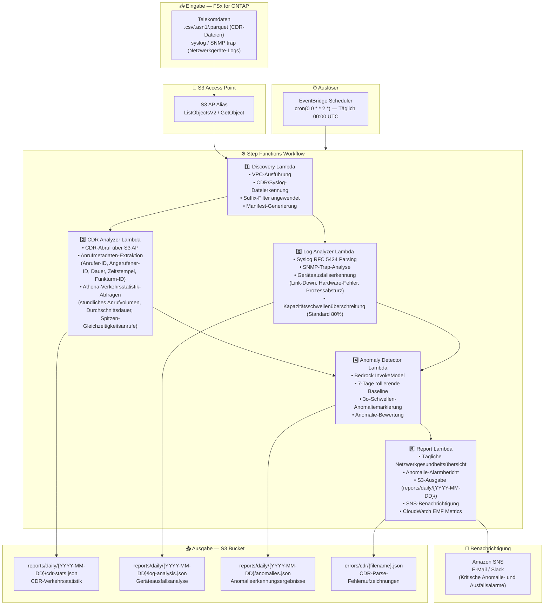

# UC18: Telekommunikation / Netzwerkanalyse — CDR/Netzwerk-Log Anomalieerkennung und Compliance-Berichte

🌐 **Language / 言語**: [日本語](architecture.md) | [English](architecture.en.md) | [한국어](architecture.ko.md) | [简体中文](architecture.zh-CN.md) | [繁體中文](architecture.zh-TW.md) | [Français](architecture.fr.md) | Deutsch | [Español](architecture.es.md)

## End-to-End-Architektur (Eingabe → Ausgabe)

---

## Architekturdiagramm

---

## Wichtige Designentscheidungen

1. **Parallele Verarbeitung von CDR und Syslog** — Parallelisierung über Step Functions Map State für Durchsatzverbesserung
2. **Athena für CDR-Aggregation im großen Maßstab** — Serverloses SQL für effiziente Aggregation massiver CDR-Datensätze
3. **7-Tage rollierende Baseline** — Statistische Anomalieerkennung unter Berücksichtigung von Wochentagscharakteristiken
4. **3σ-Schwelle für Anomaliemarkierung** — Erkennt nur statistisch signifikante Anomalien
5. **Fehlerisolation** — CDR-Parse-Fehler werden unter `errors/cdr/` aufgezeichnet ohne den gesamten Batch zu unterbrechen
6. **Polling-basiert** — S3 AP unterstützt keine Ereignisbenachrichtigungen

---

## Verwendete AWS-Services

| Service | Rolle |
|---------|------|
| FSx for ONTAP | CDR/Netzwerk-Log-Speicher |
| S3 Access Points | Serverloser Zugriff auf ONTAP-Volumes |
| EventBridge Scheduler | Täglicher Auslöser (00:00 UTC) |
| Step Functions | Workflow-Orchestrierung (paralleler Map State) |
| Lambda | Compute (Discovery, CDR Analyzer, Log Analyzer, Anomaly Detector, Report) |
| Amazon Athena | CDR-Verkehrsstatistik SQL-Abfragen |
| Amazon Bedrock | Anomalieerkennung-Inferenz (Claude / Nova) |
| SNS | Kritische Anomalie- und Ausfallsalarmbenachrichtigungen |
| Secrets Manager | ONTAP REST API Zugangsdatenverwaltung |
| CloudWatch + X-Ray | Observability (EMF Metrics, Tracing) |
