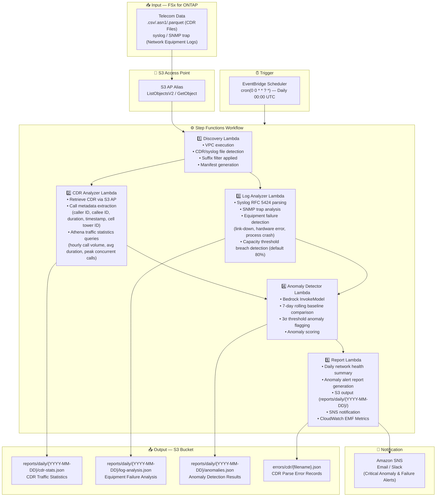

# UC18: Telecommunications / Network Analytics — CDR/Network Log Anomaly Detection and Compliance Reports

🌐 **Language / 言語**: [日本語](architecture.md) | English | [한국어](architecture.ko.md) | [简体中文](architecture.zh-CN.md) | [繁體中文](architecture.zh-TW.md) | [Français](architecture.fr.md) | [Deutsch](architecture.de.md) | [Español](architecture.es.md)

## End-to-End Architecture (Input → Output)

---

## Architecture Diagram

---

## Data Flow Detail

### Input
| Item | Description |
|------|-------------|
| **Source** | FSx for ONTAP volume |
| **File Types** | .csv / .asn1 / .parquet (CDR), syslog text (network equipment logs) |
| **Access Method** | S3 Access Point (ListObjectsV2 + GetObject) |
| **Read Strategy** | Suffix filter (max 20 patterns, default: `.csv,.asn1,.parquet`) |

### Processing
| Step | Service | Function |
|------|---------|----------|
| Discovery | Lambda (VPC) | CDR/syslog file detection, Manifest generation |
| CDR Analyzer | Lambda + Athena | CDR parsing, call metadata extraction, traffic statistics aggregation |
| Log Analyzer | Lambda | Syslog RFC 5424 parsing, SNMP analysis, equipment failure detection |
| Anomaly Detector | Lambda + Bedrock | 7-day baseline comparison, 3σ anomaly detection |
| Report | Lambda | Daily report generation, SNS alerts |

### Output
| Artifact | Format | Description |
|----------|--------|-------------|
| CDR Traffic Stats | `reports/daily/{YYYY-MM-DD}/cdr-stats.json` | Hourly call volume, average duration, peak concurrent connections |
| Equipment Failure Analysis | `reports/daily/{YYYY-MM-DD}/log-analysis.json` | Failure event list (type, device ID, timestamp) |
| Anomaly Detection Results | `reports/daily/{YYYY-MM-DD}/anomalies.json` | Anomaly metrics (score, threshold, recommended action) |
| Network Health Report | `reports/daily/{YYYY-MM-DD}/network-health.json` | Daily summary (success count, error count, severity distribution) |
| CDR Parse Errors | `errors/cdr/{filename}.json` | File path, error category, error details |
| SNS Notification | Email | Critical anomaly and equipment failure alerts |

---

## Key Design Decisions

1. **Parallel processing of CDR and syslog** — CDR analysis and log analysis are independent. Parallelized via Step Functions Map State for throughput improvement
2. **Athena for large-scale CDR aggregation** — Efficiently aggregate massive CDR records via serverless SQL, eliminating the need for in-memory processing in Lambda
3. **7-day rolling baseline** — Statistical anomaly detection considering day-of-week characteristics. Distinguishes between short-term spikes and true anomalies
4. **3σ threshold anomaly flagging** — Detects only statistically significant anomalies. Minimizes false positives and reduces operator burden
5. **Error isolation** — CDR parse failures are recorded under `errors/cdr/` without stopping the entire batch
6. **Polling-based** — S3 AP does not support event notifications, so EventBridge Scheduler triggers daily execution

---

## AWS Services Used

| Service | Role |
|---------|------|
| FSx for ONTAP | CDR/network log storage |
| S3 Access Points | Serverless access to ONTAP volumes |
| EventBridge Scheduler | Daily trigger (00:00 UTC) |
| Step Functions | Workflow orchestration (parallel Map State) |
| Lambda | Compute (Discovery, CDR Analyzer, Log Analyzer, Anomaly Detector, Report) |
| Amazon Athena | CDR traffic statistics SQL queries |
| Amazon Bedrock | Anomaly detection inference (Claude / Nova) |
| SNS | Critical anomaly and equipment failure alert notifications |
| Secrets Manager | ONTAP REST API credentials management |
| CloudWatch + X-Ray | Observability (EMF Metrics, tracing) |
