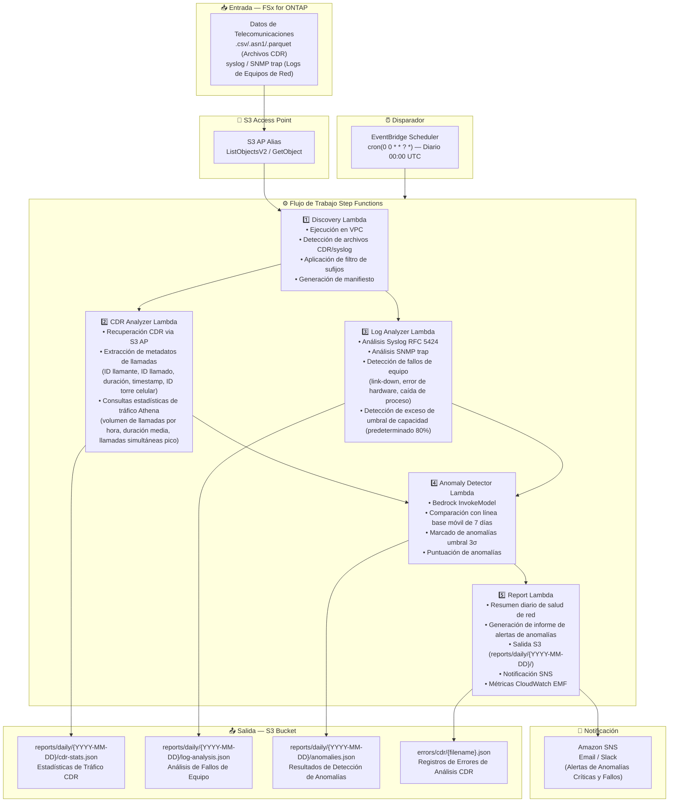

# UC18: Telecomunicaciones / Análisis de Red — Detección de Anomalías CDR/Logs de Red e Informes de Cumplimiento

🌐 **Language / 言語**: [日本語](architecture.md) | [English](architecture.en.md) | [한국어](architecture.ko.md) | [简体中文](architecture.zh-CN.md) | [繁體中文](architecture.zh-TW.md) | [Français](architecture.fr.md) | [Deutsch](architecture.de.md) | Español

## Arquitectura de Extremo a Extremo (Entrada → Salida)

---

## Diagrama de Arquitectura

---

## Decisiones de Diseño Clave

1. **Procesamiento paralelo de CDR y syslog** — Paralelización via Step Functions Map State para mejorar el rendimiento
2. **Athena para agregación CDR a gran escala** — SQL serverless para agregar eficientemente volúmenes masivos de CDR
3. **Línea base móvil de 7 días** — Detección de anomalías estadística considerando características del día de la semana
4. **Umbral 3σ para marcado de anomalías** — Detecta solo anomalías estadísticamente significativas
5. **Aislamiento de errores** — Los fallos de análisis CDR se registran sin interrumpir el lote completo
6. **Basado en polling** — S3 AP no soporta notificaciones de eventos

---

## Servicios AWS Utilizados

| Servicio | Rol |
|---------|------|
| FSx for ONTAP | Almacenamiento CDR/logs de red |
| S3 Access Points | Acceso serverless a volúmenes ONTAP |
| EventBridge Scheduler | Disparador diario (00:00 UTC) |
| Step Functions | Orquestación de flujo de trabajo (Map State paralelo) |
| Lambda | Cómputo (Discovery, CDR Analyzer, Log Analyzer, Anomaly Detector, Report) |
| Amazon Athena | Consultas SQL de estadísticas de tráfico CDR |
| Amazon Bedrock | Inferencia de detección de anomalías (Claude / Nova) |
| SNS | Notificaciones de alertas de anomalías críticas y fallos |
| Secrets Manager | Gestión de credenciales ONTAP REST API |
| CloudWatch + X-Ray | Observabilidad (Métricas EMF, trazado) |
