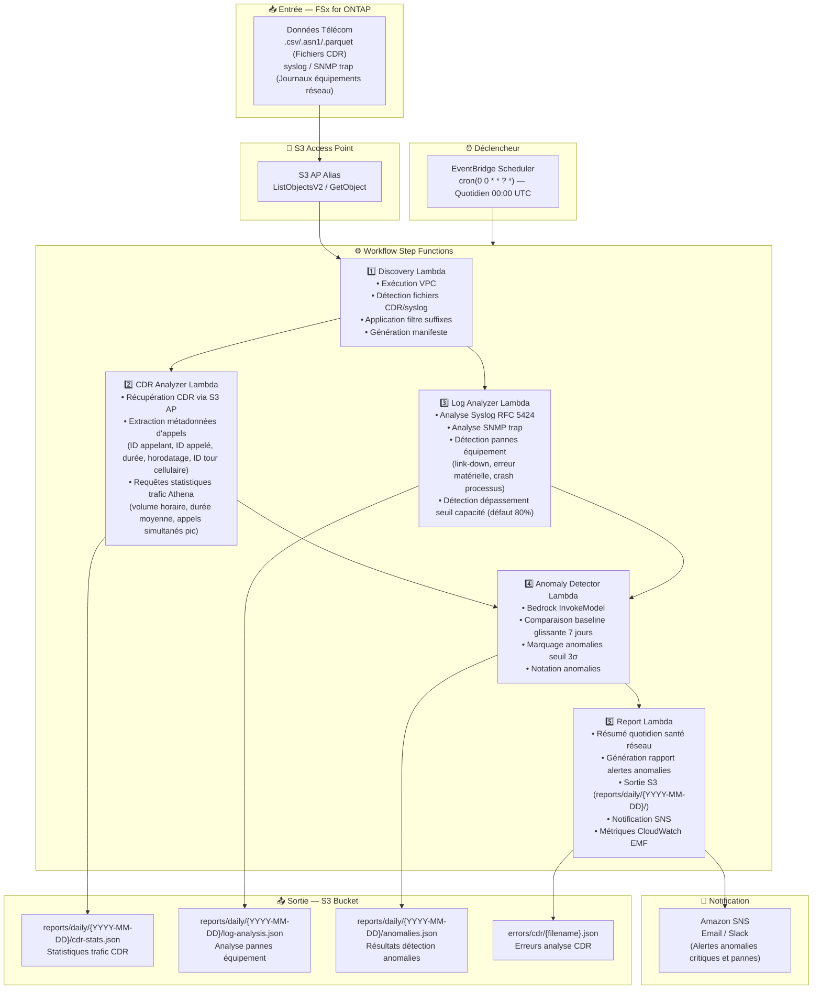

# UC18 : Télécommunications / Analyse Réseau — Détection d'anomalies CDR/journaux réseau et rapports de conformité

🌐 **Language / 言語**: [日本語](architecture.md) | [English](architecture.en.md) | [한국어](architecture.ko.md) | [简体中文](architecture.zh-CN.md) | [繁體中文](architecture.zh-TW.md) | Français | [Deutsch](architecture.de.md) | [Español](architecture.es.md)

## Architecture de bout en bout (Entrée → Sortie)

---

## Diagramme d'architecture

---

## Décisions de conception clés

1. **Traitement parallèle CDR et syslog** — Parallélisation via Step Functions Map State pour améliorer le débit
2. **Athena pour l'agrégation CDR à grande échelle** — SQL serverless pour agréger efficacement des volumes massifs de CDR
3. **Baseline glissante de 7 jours** — Détection d'anomalies statistique tenant compte des caractéristiques jour de la semaine
4. **Seuil 3σ pour le marquage d'anomalies** — Détecte uniquement les anomalies statistiquement significatives
5. **Isolation des erreurs** — Les échecs d'analyse CDR sont enregistrés sans interrompre le lot entier
6. **Basé sur le polling** — S3 AP ne supporte pas les notifications d'événements

---

## Services AWS utilisés

| Service | Rôle |
|---------|------|
| FSx for ONTAP | Stockage CDR/journaux réseau |
| S3 Access Points | Accès serverless aux volumes ONTAP |
| EventBridge Scheduler | Déclencheur quotidien (00:00 UTC) |
| Step Functions | Orchestration workflow (Map State parallèle) |
| Lambda | Calcul (Discovery, CDR Analyzer, Log Analyzer, Anomaly Detector, Report) |
| Amazon Athena | Requêtes SQL statistiques trafic CDR |
| Amazon Bedrock | Inférence détection anomalies (Claude / Nova) |
| SNS | Notifications alertes anomalies critiques et pannes |
| Secrets Manager | Gestion identifiants ONTAP REST API |
| CloudWatch + X-Ray | Observabilité (Métriques EMF, traçage) |
