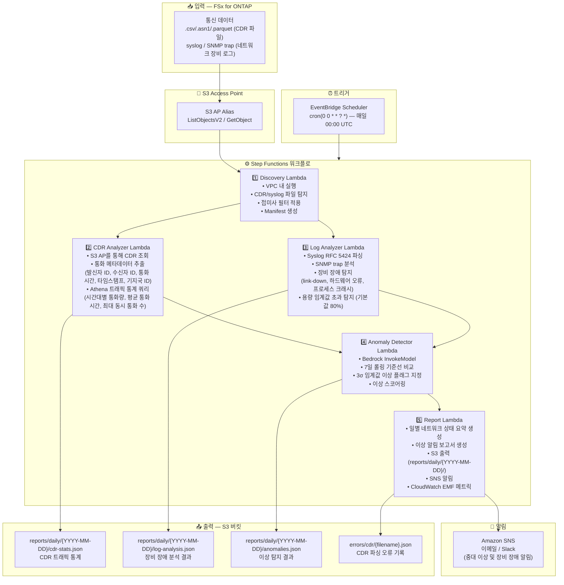

# UC18: 통신 / 네트워크 분석 — CDR/네트워크 로그 이상 탐지 및 컴플라이언스 보고서

🌐 **Language / 言語**: [日本語](architecture.md) | [English](architecture.en.md) | 한국어 | [简体中文](architecture.zh-CN.md) | [繁體中文](architecture.zh-TW.md) | [Français](architecture.fr.md) | [Deutsch](architecture.de.md) | [Español](architecture.es.md)

## 엔드투엔드 아키텍처 (입력 → 출력)

---

## 아키텍처 다이어그램

---

## 주요 설계 결정

1. **CDR과 syslog의 병렬 처리** — CDR 분석과 로그 분석은 독립적으로 실행 가능. Step Functions Map State로 병렬화하여 처리량 향상
2. **대규모 CDR 집계를 위한 Athena** — 서버리스 SQL로 대량 CDR 레코드를 효율적으로 집계
3. **7일 롤링 기준선** — 요일 특성을 고려한 통계적 이상 탐지
4. **3σ 임계값 이상 플래그** — 통계적으로 유의미한 이상만 탐지. 오탐을 최소화
5. **오류 격리** — CDR 파싱 실패는 `errors/cdr/`에 기록하고 전체 배치를 중단하지 않음
6. **폴링 기반** — S3 AP는 이벤트 알림을 지원하지 않으므로 EventBridge Scheduler로 일별 실행

---

## 사용 AWS 서비스

| 서비스 | 역할 |
|--------|------|
| FSx for ONTAP | CDR/네트워크 로그 스토리지 |
| S3 Access Points | ONTAP 볼륨에 대한 서버리스 접근 |
| EventBridge Scheduler | 일별 트리거 (00:00 UTC) |
| Step Functions | 워크플로 오케스트레이션 (병렬 Map State) |
| Lambda | 컴퓨팅 (Discovery, CDR Analyzer, Log Analyzer, Anomaly Detector, Report) |
| Amazon Athena | CDR 트래픽 통계 SQL 쿼리 |
| Amazon Bedrock | 이상 탐지 추론 (Claude / Nova) |
| SNS | 중대 이상 및 장비 장애 알림 |
| Secrets Manager | ONTAP REST API 인증 정보 관리 |
| CloudWatch + X-Ray | 관측성 (EMF 메트릭, 트레이싱) |
