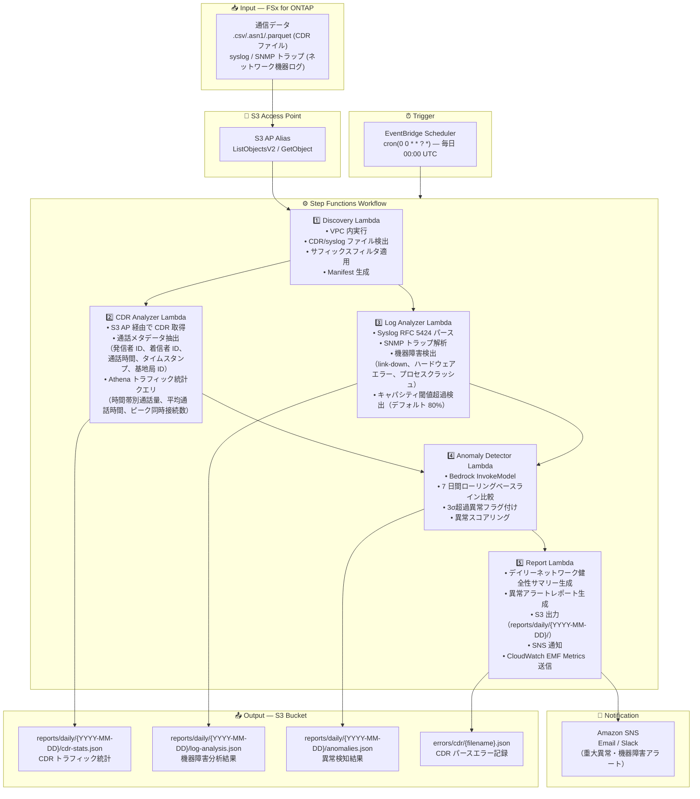

# UC18: 通信 / ネットワーク分析 — CDR/ネットワークログ異常検知・コンプライアンスレポート

🌐 **Language / 言語**: 日本語 | [English](architecture.en.md) | [한국어](architecture.ko.md) | [简体中文](architecture.zh-CN.md) | [繁體中文](architecture.zh-TW.md) | [Français](architecture.fr.md) | [Deutsch](architecture.de.md) | [Español](architecture.es.md)

## End-to-End Architecture (Input → Output)

---

## Architecture Diagram

---

## Data Flow Detail

### Input
| 項目 | 説明 |
|------|------|
| **ソース** | FSx for ONTAP ボリューム |
| **ファイル種別** | .csv / .asn1 / .parquet（CDR）、syslog テキスト（ネットワーク機器ログ） |
| **アクセス方法** | S3 Access Point（ListObjectsV2 + GetObject） |
| **読み取り戦略** | サフィックスフィルタ（最大 20 パターン、デフォルト: `.csv,.asn1,.parquet`） |

### Processing
| ステップ | サービス | 処理内容 |
|---------|---------|---------|
| Discovery | Lambda (VPC) | CDR/syslog ファイル検出、Manifest 生成 |
| CDR Analyzer | Lambda + Athena | CDR パース、通話メタデータ抽出、トラフィック統計集計 |
| Log Analyzer | Lambda | Syslog RFC 5424 パース、SNMP 解析、機器障害検出 |
| Anomaly Detector | Lambda + Bedrock | 7 日間ベースライン比較、3σ異常検知 |
| Report | Lambda | デイリーレポート生成、SNS アラート |

### Output
| アーティファクト | フォーマット | 説明 |
|--------------|---------|------|
| CDR トラフィック統計 | `reports/daily/{YYYY-MM-DD}/cdr-stats.json` | 時間帯別通話量、平均通話時間、ピーク同時接続数 |
| 機器障害分析 | `reports/daily/{YYYY-MM-DD}/log-analysis.json` | 障害イベント一覧（タイプ、機器 ID、タイムスタンプ） |
| 異常検知結果 | `reports/daily/{YYYY-MM-DD}/anomalies.json` | 異常メトリクス一覧（スコア、閾値、推奨対応） |
| ネットワーク健全性レポート | `reports/daily/{YYYY-MM-DD}/network-health.json` | デイリーサマリー（成功件数、エラー件数、重大度分布） |
| CDR パースエラー | `errors/cdr/{filename}.json` | ファイルパス、エラーカテゴリ、エラー詳細 |
| SNS 通知 | Email | 重大異常・機器障害アラート |

---

## Key Design Decisions

1. **CDR と syslog の並列処理** — CDR 分析とログ分析は独立して実行可能。Step Functions の Map State で並列化しスループット向上
2. **Athena による大規模 CDR 集計** — 大量の CDR レコードをサーバーレス SQL で効率的に集計。Lambda 内でのインメモリ処理を不要にする
3. **7 日間ローリングベースライン** — 曜日特性を考慮した統計的異常検知。短期のスパイクと真の異常を区別
4. **3σ閾値による異常フラグ** — 統計的に有意な異常のみを検出。誤検知を最小化しオペレーター負荷を軽減
5. **エラー分離** — CDR パース失敗は `errors/cdr/` に記録し、バッチ全体を停止させない
6. **ポーリングベース** — S3 AP はイベント通知非対応のため、EventBridge Scheduler による日次実行

---

## AWS Services Used

| サービス | 役割 |
|---------|------|
| FSx for ONTAP | CDR/ネットワークログのストレージ |
| S3 Access Points | ONTAP ボリュームへのサーバーレスアクセス |
| EventBridge Scheduler | 日次トリガー（00:00 UTC） |
| Step Functions | ワークフローオーケストレーション（並列 Map State） |
| Lambda | コンピュート（Discovery, CDR Analyzer, Log Analyzer, Anomaly Detector, Report） |
| Amazon Athena | CDR トラフィック統計 SQL クエリ |
| Amazon Bedrock | 異常検知推論（Claude / Nova） |
| SNS | 重大異常・機器障害アラート通知 |
| Secrets Manager | ONTAP REST API 認証情報管理 |
| CloudWatch + X-Ray | オブザーバビリティ（EMF Metrics, トレーシング） |
