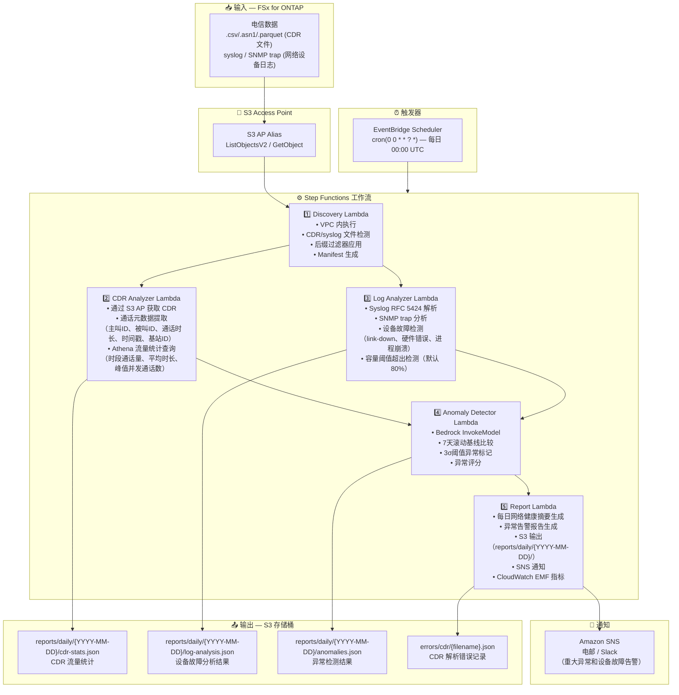

# UC18: 电信 / 网络分析 — CDR/网络日志异常检测与合规报告

🌐 **Language / 言語**: [日本語](architecture.md) | [English](architecture.en.md) | [한국어](architecture.ko.md) | 简体中文 | [繁體中文](architecture.zh-TW.md) | [Français](architecture.fr.md) | [Deutsch](architecture.de.md) | [Español](architecture.es.md)

## 端到端架构（输入 → 输出）

---

## 架构图

---

## 关键设计决策

1. **CDR 和 syslog 并行处理** — CDR 分析和日志分析可以独立执行。通过 Step Functions Map State 并行化提升吞吐量
2. **通过 Athena 进行大规模 CDR 聚合** — 使用无服务器 SQL 高效聚合海量 CDR 记录
3. **7天滚动基线** — 考虑工作日特征的统计异常检测
4. **3σ阈值异常标记** — 仅检测统计显著的异常。最小化误报
5. **错误隔离** — CDR 解析失败记录在 `errors/cdr/` 下，不中断整个批次
6. **基于轮询** — S3 AP 不支持事件通知，因此使用 EventBridge Scheduler 每日执行

---

## 使用的 AWS 服务

| 服务 | 角色 |
|------|------|
| FSx for ONTAP | CDR/网络日志存储 |
| S3 Access Points | 对 ONTAP 卷的无服务器访问 |
| EventBridge Scheduler | 每日触发（00:00 UTC） |
| Step Functions | 工作流编排（并行 Map State） |
| Lambda | 计算（Discovery, CDR Analyzer, Log Analyzer, Anomaly Detector, Report） |
| Amazon Athena | CDR 流量统计 SQL 查询 |
| Amazon Bedrock | 异常检测推理（Claude / Nova） |
| SNS | 重大异常和设备故障告警通知 |
| Secrets Manager | ONTAP REST API 凭证管理 |
| CloudWatch + X-Ray | 可观测性（EMF 指标、链路追踪） |
