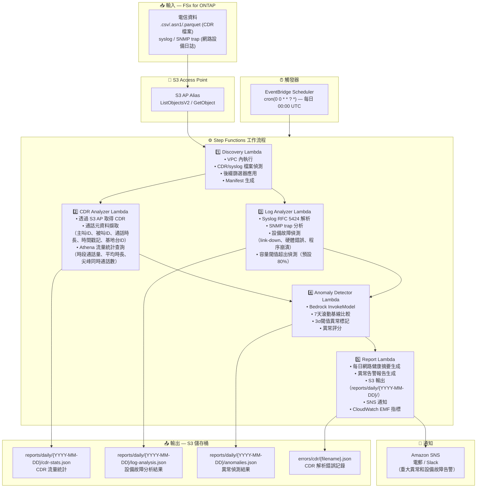

# UC18: 電信 / 網路分析 — CDR/網路日誌異常偵測與合規報告

🌐 **Language / 言語**: [日本語](architecture.md) | [English](architecture.en.md) | [한국어](architecture.ko.md) | [简体中文](architecture.zh-CN.md) | 繁體中文 | [Français](architecture.fr.md) | [Deutsch](architecture.de.md) | [Español](architecture.es.md)

## 端對端架構（輸入 → 輸出）

---

## 架構圖

---

## 關鍵設計決策

1. **CDR 和 syslog 並行處理** — CDR 分析和日誌分析可以獨立執行。透過 Step Functions Map State 並行化提升吞吐量
2. **透過 Athena 進行大規模 CDR 彙整** — 使用無伺服器 SQL 高效彙整大量 CDR 記錄
3. **7天滾動基線** — 考慮工作日特徵的統計異常偵測
4. **3σ閾值異常標記** — 僅偵測統計顯著的異常。最小化誤報
5. **錯誤隔離** — CDR 解析失敗記錄在 `errors/cdr/` 下，不中斷整個批次
6. **基於輪詢** — S3 AP 不支援事件通知，因此使用 EventBridge Scheduler 每日執行

---

## 使用的 AWS 服務

| 服務 | 角色 |
|------|------|
| FSx for ONTAP | CDR/網路日誌儲存 |
| S3 Access Points | 對 ONTAP 卷的無伺服器存取 |
| EventBridge Scheduler | 每日觸發（00:00 UTC） |
| Step Functions | 工作流程編排（並行 Map State） |
| Lambda | 運算（Discovery, CDR Analyzer, Log Analyzer, Anomaly Detector, Report） |
| Amazon Athena | CDR 流量統計 SQL 查詢 |
| Amazon Bedrock | 異常偵測推論（Claude / Nova） |
| SNS | 重大異常和設備故障告警通知 |
| Secrets Manager | ONTAP REST API 憑證管理 |
| CloudWatch + X-Ray | 可觀測性（EMF 指標、鏈路追蹤） |
