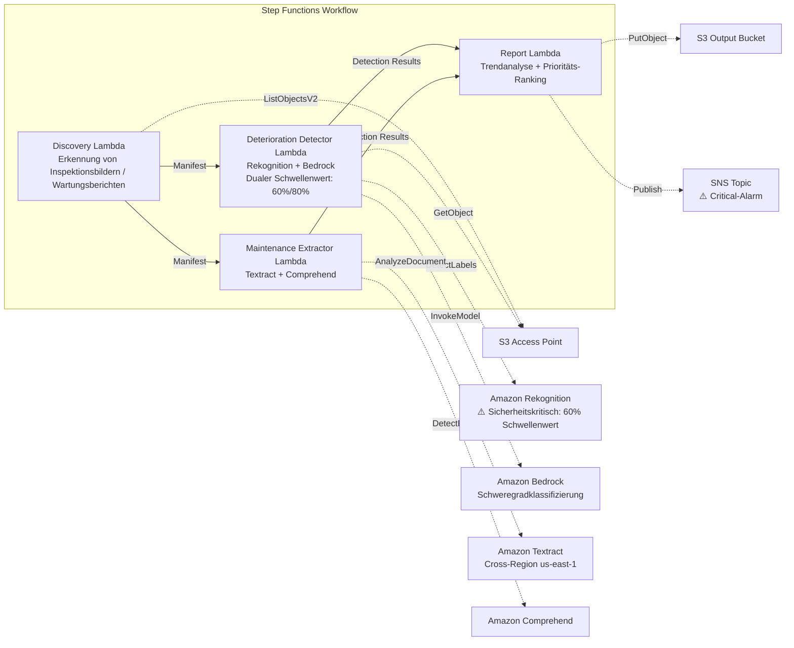

# UC22: Transport & Schiene — Bildanalyse von Anlageninspektionen / Verwaltung von Wartungsberichten

🌐 **Language / 言語**: [日本語](README.md) | [English](README.en.md) | [한국어](README.ko.md) | [简体中文](README.zh-CN.md) | [繁體中文](README.zh-TW.md) | [Français](README.fr.md) | Deutsch | [Español](README.es.md)

📚 **Dokumentation**: [Architektur](docs/architecture.de.md) | [Demo-Leitfaden](docs/demo-guide.de.md)

## Überblick

Ein serverloser Workflow, der die S3 Access Points von FSx for ONTAP nutzt, um aus Inspektionsbildern von Eisenbahninfrastruktur Verschleißindikatoren (Risse, Rost, Verschiebung) zu erkennen und automatisch eine Schweregradklassifizierung sowie ein Ranking der Wartungsprioritäten zu erstellen. Er verwendet ein **sicherheitsorientiertes Design, das für sicherheitskritische Infrastruktur (Brücken, Signalanlagen, Schienenstöße) einen niedrigeren Erkennungsschwellenwert anwendet und die menschliche Prüfung verpflichtend macht.**

### Wann dieses Pattern passt

- Regelmäßige Inspektionsbilder von Eisenbahnanlagen (Gleise, Brücken, Signalanlagen) werden in FSx for ONTAP gesammelt
- Sie möchten Verschleißmuster (Risse, Rost, Verschiebung) per KI automatisch erkennen und den Schweregrad klassifizieren
- Sie möchten Reparaturhistorie und Lebenszyklusdaten automatisch aus Wartungsberichten (PDF, Excel) extrahieren
- Sie benötigen eine Erkennung mit niedrigem Schwellenwert plus Kennzeichnung zur menschlichen Prüfung für sicherheitskritische Infrastruktur
- Sie benötigen eine Analyse der Verschleißtrends über 12 Monate und ein Ranking der Wartungsprioritäten

### Wann dieses Pattern nicht passt

- Eine Echtzeit-Verwaltung des Zugbetriebs ist erforderlich
- Der Aufbau eines vollständigen CMMS (Computerized Maintenance Management System) ist erforderlich
- Eine Umgebung, in der die Netzwerkerreichbarkeit der ONTAP REST API nicht sichergestellt werden kann

### Hauptfunktionen

- Automatische Erkennung von Inspektionsbildern (JPEG/PNG/TIFF) und Wartungsberichten (PDF/Excel) über S3 AP
- Erkennung von Verschleißindikatoren mit Rekognition (dualer Schwellenwert: Standard 80 %, sicherheitskritisch 60 %)
- Schweregradklassifizierung mit Bedrock (critical / major / minor / observation)
- Sicherheitskritische Infrastruktur: Jede Erkennung unter 90 % wird auf `human_review_required: true` gesetzt

> **Absicht des Sicherheitsdesigns**: Der Schwellenwert von 60 % ist kein automatischer Freigabeschwellenwert, sondern ein **Eskalationsschwellenwert** (darauf ausgelegt, den Prüfungsumfang zu erweitern, um falsch-negative Ergebnisse zu reduzieren). Dieses Pattern automatisiert keine Sicherheitsentscheidungen; es führt eine Kandidatenerkennung für die Prüfung durch Experten durch.
- Extraktion von Reparaturhistorie und Lebenszyklusdaten aus Wartungsberichten mit Textract + Comprehend
- Analyse der Verschleißtrends über 12 Monate + Ranking der Wartungsprioritäten nach Schweregrad × Bauteilalter
- Bilder mit niedriger Auflösung (< 1024×768) werden automatisch als `requires-reinspection` markiert

## Success Metrics

### Outcome
Die KI-Analyse von Anlageninspektionsbildern ermöglicht die Früherkennung von Verschleiß der Eisenbahninfrastruktur und die Optimierung der Wartungsplanung. Sie minimiert das Risiko, Probleme an sicherheitskritischer Infrastruktur zu übersehen.

### Metrics
| Metrik | Ziel (Beispiel) |
|-----------|------------|
| Verschleißerkennungsrate (Standardinfrastruktur) | ≥ 85 % (80% confidence) |
| Verschleißerkennungsrate (sicherheitskritische Infrastruktur) | ≥ 95 % (60% confidence) |
| Genauigkeit der Schweregradklassifizierung | ≥ 80 % |
| Falsch-negativ-Rate (sicherheitskritisch) | < 5 % |
| Berichtserstellungszeit | < 5 Min. / Batch |
| Verpflichtende Human-Review-Rate | > 30 % (alle sicherheitskritischen Erkennungen < 90 %) |

### Measurement Method
Step-Functions-Ausführungshistorie, Rekognition-Erkennungsprotokolle, Bedrock-Klassifizierungsergebnisse, CloudWatch EMF Metrics (ProcessingDuration, SuccessCount, ErrorCount, HumanReviewCount).

### Human Review Requirements
- **Sicherheitskritische Infrastruktur (Brücken, Signalanlagen, Schienenstöße)**: menschliche Prüfung verpflichtend für jede Erkennung unter 90 %
- **Schweregrad critical**: sofortige Benachrichtigung + Bestätigung durch einen Ingenieur innerhalb von 48 Stunden
- **Bilder mit niedriger Auflösung**: Festlegung eines Nachinspektionsplans
- Monatliche Verschleißtrendberichte werden vom Wartungsplanungsteam geprüft

## Architektur



## Sicherheitskritisches Design (Safety-Critical Design)

| Kategorie | Schwellenwert | Human Review |
|---------|------|-------------|
| Standardinfrastruktur (allgemeines Gleis) | Rekognition ≥ 80 % | Nur Erkennungsergebnisse aufzeichnen |
| Sicherheitskritische Infrastruktur (Brücken) | Rekognition ≥ 60 % | Alle < 90 % geprüft |
| Sicherheitskritische Infrastruktur (Signalanlagen) | Rekognition ≥ 60 % | Alle < 90 % geprüft |
| Sicherheitskritische Infrastruktur (Schienenstöße) | Rekognition ≥ 60 % | Alle < 90 % geprüft |
| Bilder mit niedriger Auflösung (< 1024×768) | — | Als `requires-reinspection` markiert |

## Voraussetzungen

> **S3 AP NetworkOrigin Hinweis**: Die Discovery Lambda wird innerhalb einer VPC bereitgestellt. Wenn der NetworkOrigin des S3 Access Point `Internet` ist, kann er nicht über den S3 Gateway VPC Endpoint erreicht werden (Anfragen werden nicht zur FSx-Datenebene geroutet). Verwenden Sie einen S3 AP mit NetworkOrigin=VPC oder konfigurieren Sie den Zugriff über ein NAT Gateway. Weitere Details unter [S3AP Compatibility Notes](../docs/s3ap-compatibility-notes.md).

- AWS-Konto mit geeigneten IAM-Berechtigungen
- FSx for ONTAP Dateisystem (ONTAP 9.17.1P4D3 oder höher)
- Ein Volume mit aktiviertem S3 Access Point
- VPC, private Subnetze
- Amazon Bedrock Modellzugriff aktiviert
- Amazon Textract — Cross-Region (us-east-1) Aufruf konfiguriert

## Bereitstellungsschritte

```bash
# Voraussetzung: AWS SAM CLI ist erforderlich. 'sam build' packt den Code und die Shared Layer automatisch.
sam build

sam deploy \
  --stack-name fsxn-transport-maintenance \
  --parameter-overrides \
    S3AccessPointAlias=<your-volume-ext-s3alias> \
    S3AccessPointName=<your-s3ap-name> \
    VpcId=<your-vpc-id> \
    PrivateSubnetIds=<subnet-1>,<subnet-2> \
    ScheduleExpression="cron(0 0 * * ? *)" \
    NotificationEmail=<your-email@example.com> \
  --capabilities CAPABILITY_NAMED_IAM \
  --resolve-s3 \
  --region ap-northeast-1
```

> **Hinweis**: `template.yaml` ist für die Verwendung mit der SAM CLI (`sam build` + `sam deploy`) vorgesehen.
> Um direkt mit dem Befehl `aws cloudformation deploy` bereitzustellen, verwenden Sie `template-deploy.yaml` (dies erfordert das Vorpaketieren der Lambda-Zip-Dateien und deren Upload nach S3).

## Kostenschätzung (monatliche Näherung)

| Konfiguration | Monatliche Näherung |
|------|---------|
| Minimalkonfiguration (einmal täglich) | ~$10-25 |
| Standardkonfiguration | ~$25-70 |

---

## ⚠️ Hinweise zur Performance

- Die Durchsatzkapazität von FSx for ONTAP wird **über NFS/SMB/S3 AP hinweg gemeinsam genutzt**. Wenn Sie eine Parallelverarbeitung mit MapConcurrency=10 ausführen, kann dies andere Workloads auf demselben Volume beeinträchtigen.
- Prüfen Sie für die Stapelverarbeitung großer Dateimengen die Throughput Capacity (MBps) von FSx for ONTAP und passen Sie MapConcurrency entsprechend an.
- Empfehlung: Beginnen Sie in der Produktion mit MapConcurrency=5 und erhöhen Sie schrittweise, während Sie die CloudWatch-Metriken von FSx for ONTAP (ThroughputUtilization) überwachen.

## Governance Note

> Dieses Pattern liefert technische Architekturhinweise. Es stellt keine rechtliche, Compliance- oder regulatorische Beratung dar. Das Sicherheitsmanagement der Eisenbahninfrastruktur muss dem Eisenbahnbetriebsgesetz und verschiedenen technischen Normen entsprechen. KI-Erkennungsergebnisse sind keine endgültigen Urteile; die Bestätigung durch einen qualifizierten Ingenieur ist verpflichtend.

> **Zugehörige Vorschriften**: Railway Business Act, Transport Safety Board Establishment Act

---

## Branchenreferenzfälle / Industry Reference Cases

> **Evidence Tier**: Public (aus offiziellen Blogs / Konferenzsessions)

### 7-Eleven: GenAI-Assistent für Wartungstechniker (DAIS 2026)

7-Eleven hat einen GenAI-Agenten aufgebaut, mit dem Techniker über ihr Smartphone sofortige Antworten aus PDFs/Tabellen auf gemeinsamen Laufwerken erhalten, für die Wartung von Anlagen wie HVAC und Öfen in über 13.000 Filialen.

- **Ergebnisse**: −60 % Suchzeit, +25 % Erstlösungsrate, −40 %+ Latenz
- **Agentenfähigkeiten**: dokumentenbasierte RAG-Suche, bildbasierte Fehlersuche, Zugriff auf Teileinformationen, Websuche mit Leitplanken
- **Relevanz für FSx for ONTAP**: Anlagenhandbücher (PDF/Bilder) auf NFS/SMB-Freigaben gespeichert → Zugriff durch die KI-Pipeline über S3 AP → Vektorisierung → Suche und Antwort durch den Agenten

Dieses Pattern (UC22) bietet eine Architektur, die dieselbe Problemklasse (Anlageninspektionsbilder + Analyse von Wartungsdokumenten) mit FSx for ONTAP S3 AP + AWS Bedrock löst.

Detaillierte Analyse: [DAIS 2026 Agent Bricks Branchenfallanalyse](../docs/investigations/dais2026-agent-bricks-industry-cases.md)

Sources:
- [DAIS 2026 Session: AI Agents for the Frontline](https://www.databricks.com/dataaisummit/session/ai-agents-frontline-7-elevens-genai-maintenance-assistant)
- [Databricks Blog](https://www.databricks.com/blog/how-7-eleven-transformed-maintenance-technician-knowledge-access-databricks-agent-bricks)

---

## S3AP Compatibility

Siehe [S3AP Compatibility Notes](../docs/s3ap-compatibility-notes.md).
