# UC22: Transportation & Rail — Equipment Inspection Image Analysis / Maintenance Report Management

🌐 **Language / 言語**: [日本語](README.md) | English | [한국어](README.ko.md) | [简体中文](README.zh-CN.md) | [繁體中文](README.zh-TW.md) | [Français](README.fr.md) | [Deutsch](README.de.md) | [Español](README.es.md)

📚 **Documentation**: [Architecture](docs/architecture.en.md) | [Demo Guide](docs/demo-guide.en.md)

## Overview

A serverless workflow that leverages FSx for ONTAP S3 Access Points to detect deterioration indicators (cracks, rust, displacement) from railway infrastructure inspection images and automatically generate severity classifications and maintenance priority rankings. It adopts a **safety-oriented design that applies a lower detection threshold to safety-critical infrastructure (bridges, signaling equipment, rail joints) and makes human review mandatory.**

### When this pattern is a good fit

- Periodic railway equipment inspection images (track, bridges, signaling equipment) are accumulated in FSx for ONTAP
- You want to automatically detect deterioration patterns (cracks, rust, displacement) with AI and classify severity
- You want to automatically extract repair history and lifecycle data from maintenance reports (PDF, Excel)
- You need low-threshold detection plus human review flags for safety-critical infrastructure
- You need 12-month deterioration trend analysis and maintenance priority rankings

### When this pattern is not a good fit

- Real-time train operation management is required
- A complete CMMS (Computerized Maintenance Management System) needs to be built
- Network reachability to the ONTAP REST API cannot be ensured

### Key Features

- Auto-detection of inspection images (JPEG/PNG/TIFF) and maintenance reports (PDF/Excel) via S3 AP
- Deterioration indicator detection with Rekognition (dual threshold: standard 80%, safety-critical 60%)
- Severity classification with Bedrock (critical / major / minor / observation)
- Safety-critical infrastructure: every detection below 90% is set to `human_review_required: true`

> **Safety design intent**: The 60% threshold is not an auto-approval threshold but an **escalation threshold** (designed to widen the review scope in order to reduce false negatives). This pattern does not automate safety decisions; it performs candidate detection for expert review.
- Extraction of repair history and lifecycle data from maintenance reports with Textract + Comprehend
- 12-month deterioration trend analysis + maintenance priority ranking by severity × component age
- Low-resolution images (< 1024×768) auto-marked as `requires-reinspection`

## Success Metrics

### Outcome
AI analysis of equipment inspection images enables early detection of railway infrastructure deterioration and optimization of maintenance planning. It minimizes the risk of overlooking issues in safety-critical infrastructure.

### Metrics
| Metric | Target (example) |
|-----------|------------|
| Deterioration detection rate (standard infrastructure) | ≥ 85% (80% confidence) |
| Deterioration detection rate (safety-critical infrastructure) | ≥ 95% (60% confidence) |
| Severity classification accuracy | ≥ 80% |
| False negative rate (safety-critical) | < 5% |
| Report generation time | < 5 min / batch |
| Human Review mandatory rate | > 30% (all safety-critical detections < 90%) |

### Measurement Method
Step Functions execution history, Rekognition detection logs, Bedrock classification results, CloudWatch EMF Metrics (ProcessingDuration, SuccessCount, ErrorCount, HumanReviewCount).

### Human Review Requirements
- **Safety-critical infrastructure (bridges, signaling, rail joints)**: human review mandatory for every detection below 90%
- **critical severity**: immediate notification + engineer confirmation within 48 hours
- **Low-resolution images**: schedule a re-inspection
- Monthly deterioration trend reports are reviewed by the maintenance planning team

## Architecture

```mermaid
graph LR
    subgraph "Step Functions Workflow"
        D[Discovery Lambda<br/>Inspection image / maintenance report detection]
        DD[Deterioration Detector Lambda<br/>Rekognition + Bedrock<br/>Dual threshold: 60%/80%]
        ME[Maintenance Extractor Lambda<br/>Textract + Comprehend]
        R[Report Lambda<br/>Trend analysis + priority ranking]
    end

    D -->|Manifest| DD
    D -->|Manifest| ME
    DD -->|Detection Results| R
    ME -->|Extraction Results| R

    D -.->|ListObjectsV2| S3AP[S3 Access Point]
    DD -.->|GetObject| S3AP
    DD -.->|DetectLabels| REK[Amazon Rekognition<br/>⚠️ Safety-critical: 60% threshold]
    DD -.->|InvokeModel| BDR[Amazon Bedrock<br/>Severity classification]
    ME -.->|AnalyzeDocument| TXT[Amazon Textract<br/>Cross-Region us-east-1]
    ME -.->|DetectEntities| CMP[Amazon Comprehend]
    R -.->|PutObject| S3OUT[S3 Output Bucket]
    R -.->|Publish| SNS[SNS Topic<br/>⚠️ Critical alert]
```



## Safety-Critical Design

| Category | Threshold | Human Review |
|---------|------|-------------|
| Standard infrastructure (general track) | Rekognition ≥ 80% | Record detection results only |
| Safety-critical infrastructure (bridges) | Rekognition ≥ 60% | All < 90% reviewed |
| Safety-critical infrastructure (signaling equipment) | Rekognition ≥ 60% | All < 90% reviewed |
| Safety-critical infrastructure (rail joints) | Rekognition ≥ 60% | All < 90% reviewed |
| Low-resolution images (< 1024×768) | — | Marked `requires-reinspection` |

## Prerequisites

> **S3 AP NetworkOrigin Note**: The Discovery Lambda is deployed inside a VPC. If the S3 Access Point's NetworkOrigin is `Internet`, it cannot be accessed via the S3 Gateway VPC Endpoint (requests are not routed to the FSx data plane). Use an S3 AP with NetworkOrigin=VPC, or configure access via a NAT Gateway. See [S3AP Compatibility Notes](../docs/s3ap-compatibility-notes.md) for details.

- AWS account with appropriate IAM permissions
- FSx for ONTAP file system (ONTAP 9.17.1P4D3 or later)
- A volume with S3 Access Point enabled
- VPC, private subnets
- Amazon Bedrock model access enabled
- Amazon Textract — Cross-Region (us-east-1) invocation configured

## Deployment

```bash
# Prerequisite: AWS SAM CLI is required. 'sam build' packages the code and shared layer automatically.
sam build

sam deploy \
  --stack-name fsxn-transport-maintenance \
  --parameter-overrides \
    S3AccessPointAlias=<your-volume-ext-s3alias> \
    S3AccessPointName=<your-s3ap-name> \
    VpcId=<your-vpc-id> \
    PrivateSubnetIds=<subnet-1>,<subnet-2> \
    ScheduleExpression="cron(0 0 * * ? *)" \
    NotificationEmail=<your-email@example.com> \
  --capabilities CAPABILITY_NAMED_IAM \
  --resolve-s3 \
  --region ap-northeast-1
```

> **Note**: `template.yaml` is for use with the SAM CLI (`sam build` + `sam deploy`).
> To deploy directly with the `aws cloudformation deploy` command, use `template-deploy.yaml` (which requires pre-packaging the Lambda zip files and uploading them to S3).

## Cost Estimate (approximate monthly)

| Configuration | Approximate monthly |
|------|---------|
| Minimal configuration (once daily) | ~$10-25 |
| Standard configuration | ~$25-70 |

---

## ⚠️ Performance Considerations

- FSx for ONTAP throughput capacity is **shared across NFS/SMB/S3 AP**. When running parallel processing with MapConcurrency=10, it may impact other workloads on the same volume.
- For bulk processing of large numbers of files, check the FSx for ONTAP Throughput Capacity (MBps) and adjust MapConcurrency as needed.
- Recommended: In production, start with MapConcurrency=5 and increase gradually while monitoring FSx for ONTAP CloudWatch metrics (ThroughputUtilization).

## Governance Note

> This pattern provides technical architecture guidance. It is not legal, compliance, or regulatory advice. Railway infrastructure safety management must comply with railway business law and various technical standards. AI detection results are not final judgments; confirmation by a qualified engineer is mandatory.

> **Related Regulations**: Railway Business Act, Transport Safety Board Establishment Act

---

## Industry Reference Cases

> **Evidence Tier**: Public (from official blogs / conference sessions)

### 7-Eleven: GenAI Assistant for Maintenance Technicians (DAIS 2026)

7-Eleven built a GenAI agent that lets technicians get instant answers on their smartphones from PDFs/spreadsheets on shared drives, for equipment maintenance such as HVAC and ovens across 13,000+ stores.

- **Results**: −60% search time, +25% first-time-fix rate, −40%+ latency
- **Agent capabilities**: document RAG search, image-based troubleshooting, parts information access, guardrailed web search
- **Relevance to FSx for ONTAP**: equipment manuals (PDF/images) stored on NFS/SMB shares → accessed by the AI pipeline via S3 AP → vectorization → agent search and answer

This pattern (UC22) provides an architecture that solves the same class of problem (equipment inspection images + maintenance document analysis) with FSx for ONTAP S3 AP + AWS Bedrock.

Detailed analysis: [DAIS 2026 Agent Bricks Industry Case Analysis](../docs/investigations/dais2026-agent-bricks-industry-cases.md)

Sources:
- [DAIS 2026 Session: AI Agents for the Frontline](https://www.databricks.com/dataaisummit/session/ai-agents-frontline-7-elevens-genai-maintenance-assistant)
- [Databricks Blog](https://www.databricks.com/blog/how-7-eleven-transformed-maintenance-technician-knowledge-access-databricks-agent-bricks)

---

## S3AP Compatibility

See [S3AP Compatibility Notes](../docs/s3ap-compatibility-notes.md).
