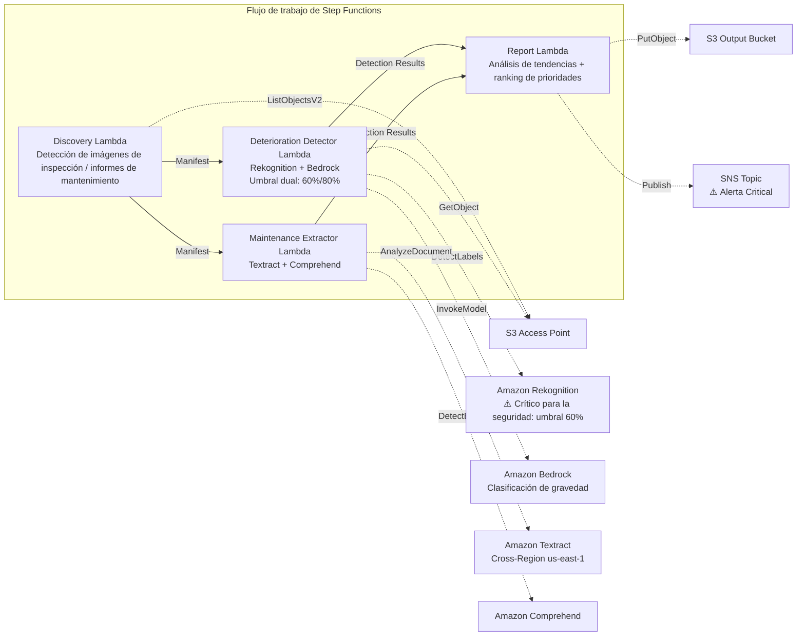

# UC22: Transporte y ferrocarril — Análisis de imágenes de inspección de equipos / Gestión de informes de mantenimiento

🌐 **Language / 言語**: [日本語](README.md) | [English](README.en.md) | [한국어](README.ko.md) | [简体中文](README.zh-CN.md) | [繁體中文](README.zh-TW.md) | [Français](README.fr.md) | [Deutsch](README.de.md) | Español

📚 **Documentación**: [Arquitectura](docs/architecture.es.md) | [Guía de demostración](docs/demo-guide.es.md)

## Descripción general

Un flujo de trabajo serverless que aprovecha los S3 Access Points de FSx for ONTAP para detectar indicadores de deterioro (grietas, óxido, desplazamiento) a partir de imágenes de inspección de infraestructura ferroviaria y generar automáticamente una clasificación de gravedad y un ranking de prioridades de mantenimiento. Adopta un **diseño orientado a la seguridad que aplica un umbral de detección más bajo a la infraestructura crítica para la seguridad (puentes, equipos de señalización, juntas de riel) y hace obligatoria la revisión humana.**

### Cuándo conviene este patrón

- Las imágenes de inspección periódica de equipos ferroviarios (vías, puentes, equipos de señalización) están acumuladas en FSx for ONTAP
- Desea detectar automáticamente patrones de deterioro (grietas, óxido, desplazamiento) con IA y clasificar la gravedad
- Desea extraer automáticamente el historial de reparaciones y los datos del ciclo de vida de los informes de mantenimiento (PDF, Excel)
- Necesita detección con umbral bajo más indicadores de revisión humana para la infraestructura crítica para la seguridad
- Necesita un análisis de tendencias de deterioro de 12 meses y un ranking de prioridades de mantenimiento

### Cuándo no conviene este patrón

- Se requiere una gestión en tiempo real de la operación de trenes
- Se requiere la construcción de un CMMS completo (sistema de gestión del mantenimiento de equipos)
- Un entorno donde no puede asegurarse la accesibilidad de red a la API REST de ONTAP

### Funciones principales

- Detección automática de imágenes de inspección (JPEG/PNG/TIFF) e informes de mantenimiento (PDF/Excel) vía S3 AP
- Detección de indicadores de deterioro con Rekognition (umbral dual: estándar 80 %, crítico para la seguridad 60 %)
- Clasificación de gravedad con Bedrock (critical / major / minor / observation)
- Infraestructura crítica para la seguridad: toda detección por debajo del 90 % se establece en `human_review_required: true`

> **Intención del diseño de seguridad**: el umbral del 60 % no es un umbral de aprobación automática, sino un **umbral de escalado** (diseñado para ampliar el alcance de la revisión con el fin de reducir los falsos negativos). Este patrón no automatiza las decisiones de seguridad; realiza una detección de candidatos para la revisión por expertos.
- Extracción del historial de reparaciones y datos del ciclo de vida de los informes de mantenimiento con Textract + Comprehend
- Análisis de tendencias de deterioro de 12 meses + ranking de prioridades de mantenimiento por gravedad × antigüedad del componente
- Las imágenes de baja resolución (< 1024×768) se marcan automáticamente como `requires-reinspection`

## Success Metrics

### Outcome
El análisis por IA de las imágenes de inspección de equipos permite la detección temprana del deterioro de la infraestructura ferroviaria y la optimización de la planificación del mantenimiento. Minimiza el riesgo de pasar por alto problemas en la infraestructura crítica para la seguridad.

### Metrics
| Métrica | Objetivo (ejemplo) |
|-----------|------------|
| Tasa de detección de deterioro (infraestructura estándar) | ≥ 85 % (80% confidence) |
| Tasa de detección de deterioro (infraestructura crítica para la seguridad) | ≥ 95 % (60% confidence) |
| Precisión de clasificación de gravedad | ≥ 80 % |
| Tasa de falsos negativos (crítico para la seguridad) | < 5 % |
| Tiempo de generación de informes | < 5 min / lote |
| Tasa obligatoria de Human Review | > 30 % (todas las detecciones críticas para la seguridad < 90 %) |

### Measurement Method
Historial de ejecución de Step Functions, registros de detección de Rekognition, resultados de clasificación de Bedrock, CloudWatch EMF Metrics (ProcessingDuration, SuccessCount, ErrorCount, HumanReviewCount).

### Human Review Requirements
- **Infraestructura crítica para la seguridad (puentes, señalización, juntas de riel)**: revisión humana obligatoria para toda detección por debajo del 90 %
- **Gravedad critical**: notificación inmediata + confirmación por un ingeniero dentro de las 48 horas
- **Imágenes de baja resolución**: establecimiento de un calendario de reinspección
- Los informes mensuales de tendencias de deterioro son revisados por el equipo de planificación de mantenimiento

## Arquitectura



## Diseño crítico para la seguridad (Safety-Critical Design)

| Categoría | Umbral | Human Review |
|---------|------|-------------|
| Infraestructura estándar (vía general) | Rekognition ≥ 80 % | Registrar solo los resultados de detección |
| Infraestructura crítica para la seguridad (puentes) | Rekognition ≥ 60 % | Todas < 90 % revisadas |
| Infraestructura crítica para la seguridad (equipos de señalización) | Rekognition ≥ 60 % | Todas < 90 % revisadas |
| Infraestructura crítica para la seguridad (juntas de riel) | Rekognition ≥ 60 % | Todas < 90 % revisadas |
| Imágenes de baja resolución (< 1024×768) | — | Marcadas `requires-reinspection` |

## Requisitos previos

> **Nota sobre S3 AP NetworkOrigin**: la Discovery Lambda se despliega dentro de una VPC. Si el NetworkOrigin del S3 Access Point es `Internet`, no se puede acceder a él a través del S3 Gateway VPC Endpoint (las solicitudes no se enrutan al plano de datos de FSx). Utilice un S3 AP con NetworkOrigin=VPC, o configure el acceso a través de un NAT Gateway. Para más detalles, consulte [S3AP Compatibility Notes](../docs/s3ap-compatibility-notes.md).

- Cuenta de AWS con permisos IAM adecuados
- Sistema de archivos FSx for ONTAP (ONTAP 9.17.1P4D3 o posterior)
- Un volumen con S3 Access Point habilitado
- VPC, subredes privadas
- Acceso a modelos de Amazon Bedrock habilitado
- Amazon Textract — invocación Cross-Region (us-east-1) configurada

## Procedimiento de despliegue

```bash
# Requisito previo: se necesita AWS SAM CLI. 'sam build' empaqueta el código y la capa compartida automáticamente.
sam build

sam deploy \
  --stack-name fsxn-transport-maintenance \
  --parameter-overrides \
    S3AccessPointAlias=<your-volume-ext-s3alias> \
    S3AccessPointName=<your-s3ap-name> \
    VpcId=<your-vpc-id> \
    PrivateSubnetIds=<subnet-1>,<subnet-2> \
    ScheduleExpression="cron(0 0 * * ? *)" \
    NotificationEmail=<your-email@example.com> \
  --capabilities CAPABILITY_NAMED_IAM \
  --resolve-s3 \
  --region ap-northeast-1
```

> **Nota**: `template.yaml` es para usar con la SAM CLI (`sam build` + `sam deploy`).
> Para desplegar directamente con el comando `aws cloudformation deploy`, utilice `template-deploy.yaml` (que requiere empaquetar previamente los archivos zip de Lambda y subirlos a S3).

## Estimación de costes (aproximación mensual)

| Configuración | Aproximación mensual |
|------|---------|
| Configuración mínima (una vez al día) | ~$10-25 |
| Configuración estándar | ~$25-70 |

---

## ⚠️ Consideraciones de rendimiento

- La capacidad de rendimiento de FSx for ONTAP se **comparte entre NFS/SMB/S3 AP**. Ejecutar procesamiento en paralelo con MapConcurrency=10 puede afectar a otras cargas de trabajo en el mismo volumen.
- Para el procesamiento por lotes de grandes cantidades de archivos, compruebe la Throughput Capacity (MBps) de FSx for ONTAP y ajuste MapConcurrency según sea necesario.
- Recomendado: en producción, comience con MapConcurrency=5 y auméntelo gradualmente mientras supervisa las métricas de CloudWatch de FSx for ONTAP (ThroughputUtilization).

## Governance Note

> Este patrón proporciona orientación de arquitectura técnica. No constituye asesoramiento legal, de cumplimiento ni regulatorio. La gestión de la seguridad de la infraestructura ferroviaria debe cumplir con la ley de empresas ferroviarias y diversas normas técnicas. Los resultados de detección por IA no son juicios finales; la confirmación por parte de un ingeniero cualificado es obligatoria.

> **Normativas relacionadas**: Railway Business Act, Transport Safety Board Establishment Act

---

## Casos de referencia del sector / Industry Reference Cases

> **Evidence Tier**: Public (de blogs oficiales / sesiones de conferencia)

### 7-Eleven: Asistente GenAI para técnicos de mantenimiento (DAIS 2026)

7-Eleven construyó un agente GenAI que permite a los técnicos obtener respuestas instantáneas en su smartphone a partir de PDF/hojas de cálculo almacenados en unidades compartidas, para el mantenimiento de equipos como HVAC y hornos en más de 13 000 tiendas.

- **Resultados**: −60 % de tiempo de búsqueda, +25 % de tasa de reparación a la primera, −40 %+ de latencia
- **Capacidades del agente**: búsqueda RAG de documentos, resolución de problemas basada en imágenes, acceso a información de piezas, búsqueda web con barreras de protección
- **Relevancia para FSx for ONTAP**: manuales de equipos (PDF/imágenes) almacenados en recursos compartidos NFS/SMB → acceso por la canalización de IA vía S3 AP → vectorización → búsqueda y respuesta del agente

Este patrón (UC22) proporciona una arquitectura que resuelve la misma clase de problema (imágenes de inspección de equipos + análisis de documentos de mantenimiento) con FSx for ONTAP S3 AP + AWS Bedrock.

Análisis detallado: [Análisis de casos del sector DAIS 2026 Agent Bricks](../docs/investigations/dais2026-agent-bricks-industry-cases.md)

Sources:
- [DAIS 2026 Session: AI Agents for the Frontline](https://www.databricks.com/dataaisummit/session/ai-agents-frontline-7-elevens-genai-maintenance-assistant)
- [Databricks Blog](https://www.databricks.com/blog/how-7-eleven-transformed-maintenance-technician-knowledge-access-databricks-agent-bricks)

---

## S3AP Compatibility

Consulte [S3AP Compatibility Notes](../docs/s3ap-compatibility-notes.md).
