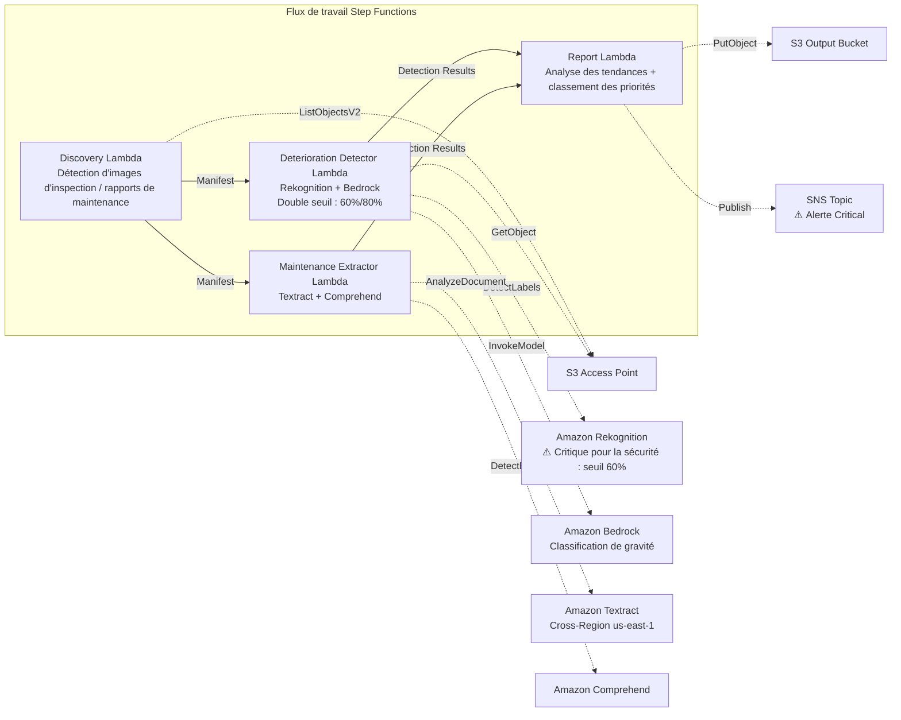

# UC22 : Transport et rail — Analyse d'images d'inspection d'équipements / Gestion des rapports de maintenance

🌐 **Language / 言語**: [日本語](README.md) | [English](README.en.md) | [한국어](README.ko.md) | [简体中文](README.zh-CN.md) | [繁體中文](README.zh-TW.md) | Français | [Deutsch](README.de.md) | [Español](README.es.md)

📚 **Documentation** : [Architecture](docs/architecture.fr.md) | [Guide de démonstration](docs/demo-guide.fr.md)

## Vue d'ensemble

Un flux de travail serverless qui exploite les S3 Access Points de FSx for ONTAP pour détecter des indicateurs de détérioration (fissures, rouille, déplacement) à partir d'images d'inspection d'infrastructures ferroviaires, et générer automatiquement une classification de gravité et un classement des priorités de maintenance. Il adopte une **conception axée sur la sécurité qui applique un seuil de détection plus bas aux infrastructures critiques pour la sécurité (ponts, équipements de signalisation, joints de rail) et rend la revue humaine obligatoire.**

### Quand ce pattern convient

- Des images d'inspection périodiques d'équipements ferroviaires (voies, ponts, équipements de signalisation) sont accumulées dans FSx for ONTAP
- Vous souhaitez détecter automatiquement les schémas de détérioration (fissures, rouille, déplacement) par IA et classer la gravité
- Vous souhaitez extraire automatiquement l'historique des réparations et les données de cycle de vie à partir des rapports de maintenance (PDF, Excel)
- Vous avez besoin d'une détection à seuil bas plus d'indicateurs de revue humaine pour les infrastructures critiques pour la sécurité
- Vous avez besoin d'une analyse des tendances de détérioration sur 12 mois et d'un classement des priorités de maintenance

### Quand ce pattern ne convient pas

- Une gestion en temps réel de l'exploitation des trains est requise
- La construction d'un CMMS complet (système de gestion de la maintenance des équipements) est requise
- Un environnement où la joignabilité réseau vers l'API REST ONTAP ne peut pas être assurée

### Fonctionnalités clés

- Détection automatique des images d'inspection (JPEG/PNG/TIFF) et des rapports de maintenance (PDF/Excel) via S3 AP
- Détection d'indicateurs de détérioration par Rekognition (double seuil : standard 80 %, critique pour la sécurité 60 %)
- Classification de gravité par Bedrock (critical / major / minor / observation)
- Infrastructures critiques pour la sécurité : toute détection inférieure à 90 % est définie sur `human_review_required: true`

> **Intention de la conception de sécurité** : le seuil de 60 % n'est pas un seuil d'approbation automatique mais un **seuil d'escalade** (conçu pour élargir le champ de la revue afin de réduire les faux négatifs). Ce pattern n'automatise pas les décisions de sécurité ; il effectue une détection de candidats en vue d'une revue par des experts.
- Extraction de l'historique des réparations et des données de cycle de vie des rapports de maintenance par Textract + Comprehend
- Analyse des tendances de détérioration sur 12 mois + classement des priorités de maintenance par gravité × âge du composant
- Les images en basse résolution (< 1024×768) sont automatiquement marquées `requires-reinspection`

## Success Metrics

### Outcome
L'analyse par IA des images d'inspection d'équipements permet une détection précoce de la détérioration des infrastructures ferroviaires et l'optimisation de la planification de la maintenance. Elle minimise le risque de passer à côté de problèmes sur les infrastructures critiques pour la sécurité.

### Metrics
| Métrique | Cible (exemple) |
|-----------|------------|
| Taux de détection de détérioration (infrastructure standard) | ≥ 85 % (80% confidence) |
| Taux de détection de détérioration (infrastructure critique pour la sécurité) | ≥ 95 % (60% confidence) |
| Précision de classification de gravité | ≥ 80 % |
| Taux de faux négatifs (critique pour la sécurité) | < 5 % |
| Temps de génération de rapport | < 5 min / lot |
| Taux obligatoire de Human Review | > 30 % (toutes les détections critiques pour la sécurité < 90 %) |

### Measurement Method
Historique d'exécution Step Functions, journaux de détection Rekognition, résultats de classification Bedrock, CloudWatch EMF Metrics (ProcessingDuration, SuccessCount, ErrorCount, HumanReviewCount).

### Human Review Requirements
- **Infrastructures critiques pour la sécurité (ponts, signalisation, joints de rail)** : revue humaine obligatoire pour toute détection inférieure à 90 %
- **Gravité critical** : notification immédiate + confirmation par un ingénieur dans les 48 heures
- **Images en basse résolution** : planification d'une réinspection
- Les rapports mensuels de tendances de détérioration sont examinés par l'équipe de planification de la maintenance

## Architecture



## Conception axée sur la sécurité (Safety-Critical Design)

| Catégorie | Seuil | Human Review |
|---------|------|-------------|
| Infrastructure standard (voie générale) | Rekognition ≥ 80 % | Enregistrer uniquement les résultats de détection |
| Infrastructure critique pour la sécurité (ponts) | Rekognition ≥ 60 % | Toutes < 90 % examinées |
| Infrastructure critique pour la sécurité (équipements de signalisation) | Rekognition ≥ 60 % | Toutes < 90 % examinées |
| Infrastructure critique pour la sécurité (joints de rail) | Rekognition ≥ 60 % | Toutes < 90 % examinées |
| Images en basse résolution (< 1024×768) | — | Marquées `requires-reinspection` |

## Prérequis

> **Note S3 AP NetworkOrigin** : la Discovery Lambda est déployée à l'intérieur d'un VPC. Si le NetworkOrigin du S3 Access Point est `Internet`, il n'est pas accessible via le S3 Gateway VPC Endpoint (les requêtes ne sont pas routées vers le plan de données FSx). Utilisez un S3 AP avec NetworkOrigin=VPC, ou configurez un accès via une NAT Gateway. Pour plus de détails, consultez [S3AP Compatibility Notes](../docs/s3ap-compatibility-notes.md).

- Compte AWS avec des autorisations IAM appropriées
- Système de fichiers FSx for ONTAP (ONTAP 9.17.1P4D3 ou ultérieur)
- Un volume avec S3 Access Point activé
- VPC, sous-réseaux privés
- Accès aux modèles Amazon Bedrock activé
- Amazon Textract — appel Cross-Region (us-east-1) configuré

## Procédure de déploiement

```bash
# Prérequis : AWS SAM CLI est requis. 'sam build' empaquette automatiquement le code et la couche partagée.
sam build

sam deploy \
  --stack-name fsxn-transport-maintenance \
  --parameter-overrides \
    S3AccessPointAlias=<your-volume-ext-s3alias> \
    S3AccessPointName=<your-s3ap-name> \
    VpcId=<your-vpc-id> \
    PrivateSubnetIds=<subnet-1>,<subnet-2> \
    ScheduleExpression="cron(0 0 * * ? *)" \
    NotificationEmail=<your-email@example.com> \
  --capabilities CAPABILITY_NAMED_IAM \
  --resolve-s3 \
  --region ap-northeast-1
```

> **Note** : `template.yaml` s'utilise avec la SAM CLI (`sam build` + `sam deploy`).
> Pour déployer directement avec la commande `aws cloudformation deploy`, utilisez `template-deploy.yaml` (qui nécessite le pré-empaquetage des fichiers zip Lambda et leur téléversement vers S3).

## Estimation des coûts (approximation mensuelle)

| Configuration | Approximation mensuelle |
|------|---------|
| Configuration minimale (une fois par jour) | ~$10-25 |
| Configuration standard | ~$25-70 |

---

## ⚠️ Considérations de performance

- La capacité de débit de FSx for ONTAP est **partagée entre NFS/SMB/S3 AP**. L'exécution d'un traitement parallèle avec MapConcurrency=10 peut impacter d'autres charges de travail sur le même volume.
- Pour le traitement par lots d'un grand nombre de fichiers, vérifiez la Throughput Capacity (MBps) de FSx for ONTAP et ajustez MapConcurrency en conséquence.
- Recommandé : en production, commencez avec MapConcurrency=5 et augmentez progressivement tout en surveillant les métriques CloudWatch de FSx for ONTAP (ThroughputUtilization).

## Governance Note

> Ce pattern fournit des conseils d'architecture technique. Il ne constitue pas un avis juridique, de conformité ou réglementaire. La gestion de la sécurité des infrastructures ferroviaires doit être conforme à la loi sur les entreprises ferroviaires et à diverses normes techniques. Les résultats de détection par IA ne sont pas des jugements finaux ; la confirmation par un ingénieur qualifié est obligatoire.

> **Réglementations connexes** : Railway Business Act, Transport Safety Board Establishment Act

---

## Cas de référence sectoriels / Industry Reference Cases

> **Evidence Tier**: Public (issu de blogs officiels / sessions de conférence)

### 7-Eleven : Assistant GenAI pour techniciens de maintenance (DAIS 2026)

7-Eleven a construit un agent GenAI qui permet aux techniciens d'obtenir des réponses instantanées sur leur smartphone à partir de PDF/feuilles de calcul stockés sur des lecteurs partagés, pour la maintenance d'équipements tels que CVC et fours dans plus de 13 000 magasins.

- **Résultats** : −60 % de temps de recherche, +25 % de taux de réparation dès la première intervention, −40 %+ de latence
- **Capacités de l'agent** : recherche RAG documentaire, dépannage basé sur l'image, accès aux informations sur les pièces, recherche Web avec garde-fous
- **Pertinence pour FSx for ONTAP** : manuels d'équipement (PDF/images) stockés sur des partages NFS/SMB → accédés par le pipeline IA via S3 AP → vectorisation → recherche et réponse par l'agent

Ce pattern (UC22) fournit une architecture qui résout la même catégorie de problème (images d'inspection d'équipements + analyse de documents de maintenance) avec FSx for ONTAP S3 AP + AWS Bedrock.

Analyse détaillée : [Analyse des cas sectoriels DAIS 2026 Agent Bricks](../docs/investigations/dais2026-agent-bricks-industry-cases.md)

Sources:
- [DAIS 2026 Session: AI Agents for the Frontline](https://www.databricks.com/dataaisummit/session/ai-agents-frontline-7-elevens-genai-maintenance-assistant)
- [Databricks Blog](https://www.databricks.com/blog/how-7-eleven-transformed-maintenance-technician-knowledge-access-databricks-agent-bricks)

---

## S3AP Compatibility

Consultez [S3AP Compatibility Notes](../docs/s3ap-compatibility-notes.md).
