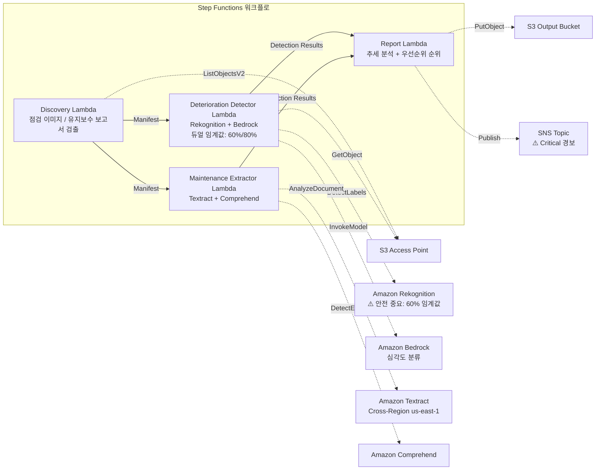

# UC22: 운송·철도 — 설비 점검 이미지 분석 / 유지보수 보고서 관리

🌐 **Language / 言語**: [日本語](README.md) | [English](README.en.md) | 한국어 | [简体中文](README.zh-CN.md) | [繁體中文](README.zh-TW.md) | [Français](README.fr.md) | [Deutsch](README.de.md) | [Español](README.es.md)

📚 **문서**: [아키텍처](docs/architecture.ko.md) | [데모 가이드](docs/demo-guide.ko.md)

## 개요

FSx for ONTAP의 S3 Access Points를 활용하여 철도 인프라 점검 이미지에서 열화 지표(균열, 부식, 변위)를 검출하고, 심각도 분류와 유지보수 우선순위 순위를 자동 생성하는 서버리스 워크플로입니다. **안전 중요 인프라(교량, 신호 설비, 레일 이음매)에 대해서는 더 낮은 검출 임계값을 적용하고 사람 검토를 필수화하는 안전 설계**를 채택하고 있습니다.

### 이 패턴이 적합한 경우

- 철도 설비의 정기 점검 이미지(궤도, 교량, 신호 설비)가 FSx for ONTAP에 축적되어 있음
- 열화 패턴(균열, 부식, 변위)을 AI로 자동 검출하고 심각도를 분류하고 싶음
- 유지보수 보고서(PDF, Excel)에서 수리 이력과 라이프사이클 데이터를 자동 추출하고 싶음
- 안전 중요 인프라에 대해 낮은 임계값 검출 + 사람 검토 플래그가 필요함
- 12개월간의 열화 추세 분석과 유지보수 우선순위 순위가 필요함

### 이 패턴이 적합하지 않은 경우

- 실시간 열차 운행 관리가 필요함
- 완전한 CMMS(설비 보전 관리 시스템) 구축이 필요함
- ONTAP REST API로의 네트워크 도달성을 확보할 수 없는 환경

### 주요 기능

- S3 AP 경유로 점검 이미지(JPEG/PNG/TIFF)와 유지보수 보고서(PDF/Excel)를 자동 검출
- Rekognition에 의한 열화 지표 검출(듀얼 임계값: 표준 80%, 안전 중요 60%)
- Bedrock에 의한 심각도 분류(critical / major / minor / observation)
- 안전 중요 인프라: 90% 미만의 검출은 모두 `human_review_required: true`

> **안전 설계의 의도**: 60% 임계값은 자동 승인 임계값이 아니라 **에스컬레이션 임계값**(false negative 감소를 위해 검토 대상을 넓히는 설계)입니다. 본 패턴은 안전 판단을 자동화하는 것이 아니라, 전문가 검토를 위한 후보 검출을 수행합니다.
- Textract + Comprehend에 의한 유지보수 보고서의 수리 이력·라이프사이클 데이터 추출
- 12개월 열화 추세 분석 + 심각도×부품 연식에 의한 유지보수 우선순위 순위
- 저해상도 이미지(< 1024×768)는 `requires-reinspection` 자동 마크

## Success Metrics

### Outcome
설비 점검 이미지의 AI 분석을 통해 철도 인프라의 열화 조기 발견과 유지보수 계획 최적화를 실현합니다. 안전 중요 인프라의 누락 리스크를 최소화합니다.

### Metrics
| 메트릭 | 목표값(예시) |
|-----------|------------|
| 열화 검출률(표준 인프라) | ≥ 85% (80% confidence) |
| 열화 검출률(안전 중요 인프라) | ≥ 95% (60% confidence) |
| 심각도 분류 정확도 | ≥ 80% |
| 위음성률(안전 중요) | < 5% |
| 보고서 생성 시간 | < 5분 / 배치 |
| Human Review 필수율 | > 30%(안전 중요는 전체 < 90% 검출) |

### Measurement Method
Step Functions 실행 이력, Rekognition 검출 로그, Bedrock 분류 결과, CloudWatch EMF Metrics(ProcessingDuration, SuccessCount, ErrorCount, HumanReviewCount).

### Human Review Requirements
- **안전 중요 인프라(교량, 신호, 레일 이음매)**: 90% 미만의 모든 검출에 사람 검토 필수
- **critical 심각도**: 즉시 통지 + 48시간 이내의 엔지니어 확인
- **저해상도 이미지**: 재점검 스케줄 설정
- 월간 열화 추세 보고서는 유지보수 계획 팀이 검토

## 아키텍처



## 안전 설계 (Safety-Critical Design)

| 카테고리 | 임계값 | Human Review |
|---------|------|-------------|
| 표준 인프라(일반 궤도) | Rekognition ≥ 80% | 검출 결과만 기록 |
| 안전 중요 인프라(교량) | Rekognition ≥ 60% | < 90%는 전건 검토 |
| 안전 중요 인프라(신호 설비) | Rekognition ≥ 60% | < 90%는 전건 검토 |
| 안전 중요 인프라(레일 이음매) | Rekognition ≥ 60% | < 90%는 전건 검토 |
| 저해상도 이미지 (< 1024×768) | — | `requires-reinspection` 마크 |

## 사전 준비 사항

> **S3 AP NetworkOrigin 주의**: Discovery Lambda는 VPC 내에 배치됩니다. S3 Access Point의 NetworkOrigin이 `Internet`인 경우, S3 Gateway VPC Endpoint 경유로는 액세스할 수 없습니다(FSx 데이터 플레인으로 라우팅되지 않기 때문). NetworkOrigin=VPC의 S3 AP를 사용하거나 NAT Gateway 경유의 액세스를 설정하십시오. 자세한 내용은 [S3AP Compatibility Notes](../docs/s3ap-compatibility-notes.md)를 참조하십시오.

- AWS 계정과 적절한 IAM 권한
- FSx for ONTAP 파일 시스템(ONTAP 9.17.1P4D3 이상)
- S3 Access Point가 활성화된 볼륨
- VPC, 프라이빗 서브넷
- Amazon Bedrock 모델 액세스가 활성화됨
- Amazon Textract — Cross-Region (us-east-1) 호출 설정

## 배포 절차

```bash
# 전제: AWS SAM CLI가 필요합니다. 'sam build'가 코드와 공유 레이어를 자동으로 패키징합니다.
sam build

sam deploy \
  --stack-name fsxn-transport-maintenance \
  --parameter-overrides \
    S3AccessPointAlias=<your-volume-ext-s3alias> \
    S3AccessPointName=<your-s3ap-name> \
    VpcId=<your-vpc-id> \
    PrivateSubnetIds=<subnet-1>,<subnet-2> \
    ScheduleExpression="cron(0 0 * * ? *)" \
    NotificationEmail=<your-email@example.com> \
  --capabilities CAPABILITY_NAMED_IAM \
  --resolve-s3 \
  --region ap-northeast-1
```

> **참고**: `template.yaml`은 SAM CLI(`sam build` + `sam deploy`)로 사용합니다.
> `aws cloudformation deploy` 명령으로 직접 배포하는 경우는 `template-deploy.yaml`을 사용하십시오(Lambda zip 파일의 사전 패키징과 S3 업로드가 필요합니다).

## 비용 견적(월액 개산)

| 구성 | 월액 개산 |
|------|---------|
| 최소 구성(일 1회) | ~$10-25 |
| 표준 구성 | ~$25-70 |

---

## ⚠️ 성능에 관한 주의 사항

- FSx for ONTAP의 스루풋 캐패시티는 **NFS/SMB/S3 AP 전체에서 공유**됩니다. MapConcurrency=10으로 병렬 처리를 수행하는 경우, 동일 볼륨의 다른 워크로드에 영향을 줄 수 있습니다.
- 대량 파일의 일괄 처리를 수행하는 경우는 FSx for ONTAP의 Throughput Capacity (MBps)를 확인하고, 필요에 따라 MapConcurrency를 조정하십시오.
- 권장: 프로덕션 환경에서는 처음에 MapConcurrency=5로 시작하고, FSx for ONTAP의 CloudWatch 메트릭 (ThroughputUtilization)을 모니터링하면서 단계적으로 늘리십시오.

## Governance Note

> 본 패턴은 기술 아키텍처 가이던스를 제공합니다. 법적·컴플라이언스·규제상의 조언이 아닙니다. 철도 인프라의 안전 관리는 철도 사업법 및 각종 기술 기준에 준거해야 합니다. AI에 의한 검출 결과는 최종 판단이 아니며, 유자격 엔지니어에 의한 확인이 필수입니다.

> **관련 규제**: 철도사업법(Railway Business Act), 운수안전위원회설치법(Transport Safety Board Establishment Act)

---

## 산업 참고 사례 / Industry Reference Cases

> **Evidence Tier**: Public(공식 블로그 / 컨퍼런스 세션에서)

### 7-Eleven: 유지보수 기술자용 GenAI 어시스턴트 (DAIS 2026)

7-Eleven은 13,000개 이상 점포의 HVAC·오븐 등 설비 유지보수에서 공유 드라이브 상의 PDF/스프레드시트에서 기술자가 스마트폰으로 즉시 답변을 얻는 GenAI 에이전트를 구축했습니다.

- **성과**: 검색 시간 −60%, 초회 수리 성공률 +25%, 레이턴시 −40% 이상
- **에이전트 기능**: 문서 RAG 검색, 이미지 기반 트러블슈팅, 부품 정보 액세스, 가드레일 포함 웹 검색
- **FSx for ONTAP와의 관련**: 설비 매뉴얼(PDF/이미지)을 NFS/SMB 공유에 저장 → S3 AP로 AI 파이프라인이 액세스 → 벡터화 → 에이전트가 검색·답변

본 패턴(UC22)은 동종의 과제(설비 점검 이미지 + 유지보수 문서 분석)를 FSx for ONTAP S3 AP + AWS Bedrock으로 해결하는 아키텍처를 제공합니다.

상세 분석: [DAIS 2026 Agent Bricks 사례 분석](../docs/investigations/dais2026-agent-bricks-industry-cases.md)

Sources:
- [DAIS 2026 Session: AI Agents for the Frontline](https://www.databricks.com/dataaisummit/session/ai-agents-frontline-7-elevens-genai-maintenance-assistant)
- [Databricks Blog](https://www.databricks.com/blog/how-7-eleven-transformed-maintenance-technician-knowledge-access-databricks-agent-bricks)

---

## S3AP Compatibility

[S3AP Compatibility Notes](../docs/s3ap-compatibility-notes.md)를 참조하십시오.
