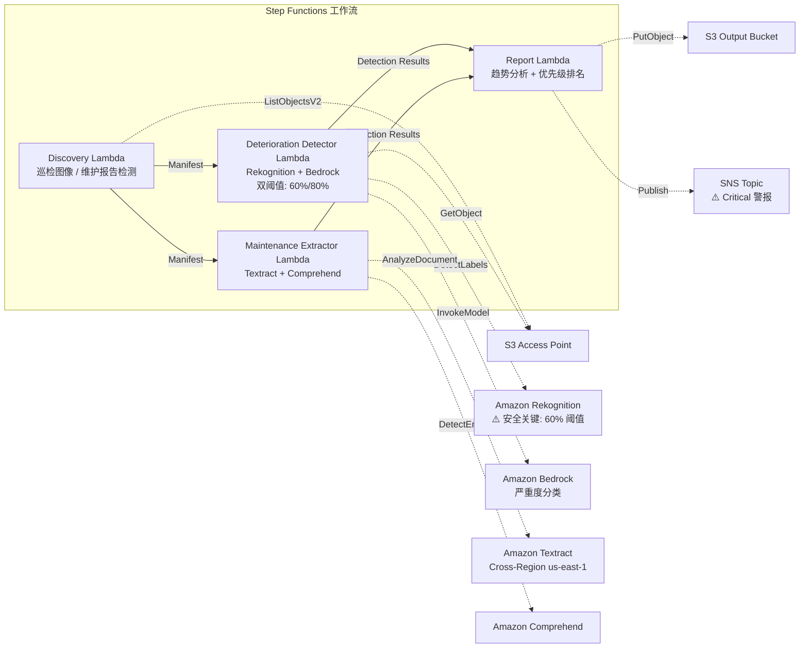

# UC22：运输·铁路 — 设备巡检图像分析 / 维护报告管理

🌐 **Language / 言語**: [日本語](README.md) | [English](README.en.md) | [한국어](README.ko.md) | 简体中文 | [繁體中文](README.zh-TW.md) | [Français](README.fr.md) | [Deutsch](README.de.md) | [Español](README.es.md)

📚 **文档**: [架构图](docs/architecture.zh-CN.md) | [演示指南](docs/demo-guide.zh-CN.md)

## 概述

这是一套利用 FSx for ONTAP 的 S3 Access Points，从铁路基础设施巡检图像中检测劣化指标（裂纹、锈蚀、位移），并自动生成严重度分类和维护优先级排名的无服务器工作流。它采用**对安全关键基础设施（桥梁、信号设备、钢轨接头）应用更低检测阈值并强制人工审查的安全设计**。

### 适合此模式的场景

- 铁路设备的定期巡检图像（轨道、桥梁、信号设备）已积累在 FSx for ONTAP 中
- 希望用 AI 自动检测劣化模式（裂纹、锈蚀、位移）并分类严重度
- 希望从维护报告（PDF、Excel）中自动提取维修历史和生命周期数据
- 需要对安全关键基础设施进行低阈值检测 + 人工审查标记
- 需要 12 个月的劣化趋势分析和维护优先级排名

### 不适合此模式的场景

- 需要实时的列车运行管理
- 需要构建完整的 CMMS（设备维护管理系统）
- 无法确保对 ONTAP REST API 的网络可达性的环境

### 主要功能

- 经由 S3 AP 自动检测巡检图像（JPEG/PNG/TIFF）和维护报告（PDF/Excel）
- 基于 Rekognition 的劣化指标检测（双阈值：标准 80%、安全关键 60%）
- 基于 Bedrock 的严重度分类（critical / major / minor / observation）
- 安全关键基础设施：低于 90% 的检测全部设为 `human_review_required: true`

> **安全设计的意图**：60% 阈值并非自动批准阈值，而是**升级阈值**（为减少 false negative 而扩大审查对象的设计）。本模式并非将安全判断自动化，而是为专家审查执行候选检测。
- 基于 Textract + Comprehend 的维护报告维修历史·生命周期数据提取
- 12 个月劣化趋势分析 + 按严重度×部件年限的维护优先级排名
- 低分辨率图像（< 1024×768）自动标记为 `requires-reinspection`

## Success Metrics

### Outcome
通过对设备巡检图像的 AI 分析，实现铁路基础设施劣化的早期发现和维护计划的优化。最大限度降低安全关键基础设施的漏检风险。

### Metrics
| 指标 | 目标值（示例） |
|-----------|------------|
| 劣化检测率（标准基础设施） | ≥ 85% (80% confidence) |
| 劣化检测率（安全关键基础设施） | ≥ 95% (60% confidence) |
| 严重度分类精度 | ≥ 80% |
| 假阴性率（安全关键） | < 5% |
| 报告生成时间 | < 5 分钟 / 批次 |
| Human Review 强制率 | > 30%（安全关键为全部 < 90% 检测） |

### Measurement Method
Step Functions 执行历史、Rekognition 检测日志、Bedrock 分类结果、CloudWatch EMF Metrics（ProcessingDuration, SuccessCount, ErrorCount, HumanReviewCount）。

### Human Review Requirements
- **安全关键基础设施（桥梁、信号、钢轨接头）**：低于 90% 的全部检测强制人工审查
- **critical 严重度**：即时通知 + 48 小时以内的工程师确认
- **低分辨率图像**：设定重新巡检计划
- 月度劣化趋势报告由维护计划团队审查

## 架构



## 安全设计 (Safety-Critical Design)

| 类别 | 阈值 | Human Review |
|---------|------|-------------|
| 标准基础设施（一般轨道） | Rekognition ≥ 80% | 仅记录检测结果 |
| 安全关键基础设施（桥梁） | Rekognition ≥ 60% | < 90% 全部审查 |
| 安全关键基础设施（信号设备） | Rekognition ≥ 60% | < 90% 全部审查 |
| 安全关键基础设施（钢轨接头） | Rekognition ≥ 60% | < 90% 全部审查 |
| 低分辨率图像 (< 1024×768) | — | 标记 `requires-reinspection` |

## 前提条件

> **S3 AP NetworkOrigin 注意**：Discovery Lambda 部署在 VPC 内。若 S3 Access Point 的 NetworkOrigin 为 `Internet`，则无法经由 S3 Gateway VPC Endpoint 访问（因为不会路由到 FSx 数据平面）。请使用 NetworkOrigin=VPC 的 S3 AP，或配置经由 NAT Gateway 的访问。详情请参阅 [S3AP Compatibility Notes](../docs/s3ap-compatibility-notes.md)。

- AWS 账户与适当的 IAM 权限
- FSx for ONTAP 文件系统（ONTAP 9.17.1P4D3 以上）
- 已启用 S3 Access Point 的卷
- VPC、私有子网
- 已启用 Amazon Bedrock 模型访问
- Amazon Textract — Cross-Region (us-east-1) 调用配置

## 部署步骤

```bash
# 前提: 需要 AWS SAM CLI。'sam build' 会自动打包代码和共享层。
sam build

sam deploy \
  --stack-name fsxn-transport-maintenance \
  --parameter-overrides \
    S3AccessPointAlias=<your-volume-ext-s3alias> \
    S3AccessPointName=<your-s3ap-name> \
    VpcId=<your-vpc-id> \
    PrivateSubnetIds=<subnet-1>,<subnet-2> \
    ScheduleExpression="cron(0 0 * * ? *)" \
    NotificationEmail=<your-email@example.com> \
  --capabilities CAPABILITY_NAMED_IAM \
  --resolve-s3 \
  --region ap-northeast-1
```

> **注意**：`template.yaml` 用于 SAM CLI（`sam build` + `sam deploy`）。
> 若使用 `aws cloudformation deploy` 命令直接部署，请使用 `template-deploy.yaml`（需要预先打包 Lambda zip 文件并上传至 S3）。

## 成本估算（每月概算）

| 配置 | 每月概算 |
|------|---------|
| 最小配置（每日 1 次） | ~$10-25 |
| 标准配置 | ~$25-70 |

---

## ⚠️ 性能相关注意事项

- FSx for ONTAP 的吞吐容量**在 NFS/SMB/S3 AP 之间共享**。以 MapConcurrency=10 进行并行处理时，可能影响同一卷上的其他工作负载。
- 进行大量文件的批量处理时，请确认 FSx for ONTAP 的 Throughput Capacity (MBps)，并根据需要调整 MapConcurrency。
- 建议：在生产环境中首先以 MapConcurrency=5 开始，边监控 FSx for ONTAP 的 CloudWatch 指标 (ThroughputUtilization) 边逐步增加。

## Governance Note

> 本模式提供技术架构指导。并非法律·合规·监管方面的建议。铁路基础设施的安全管理必须遵循铁路事业法及各类技术标准。AI 的检测结果并非最终判断，必须由有资质的工程师确认。

> **相关法规**：铁路事业法（Railway Business Act）、运输安全委员会设置法（Transport Safety Board Establishment Act）

---

## 行业参考案例 / Industry Reference Cases

> **Evidence Tier**: Public（来自官方博客 / 会议演讲）

### 7-Eleven：面向维护技术人员的 GenAI 助手 (DAIS 2026)

7-Eleven 在 13,000+ 门店的 HVAC、烤箱等设备维护中，构建了让技术人员通过智能手机从共享驱动器上的 PDF/电子表格即时获取答案的 GenAI 智能体。

- **成果**：检索时间 −60%、首次维修成功率 +25%、延迟 −40% 以上
- **智能体功能**：文档 RAG 检索、基于图像的故障排查、部件信息访问、带护栏的 Web 检索
- **与 FSx for ONTAP 的关联**：将设备手册（PDF/图像）保存在 NFS/SMB 共享 → AI 管道经由 S3 AP 访问 → 向量化 → 智能体检索·回答

本模式（UC22）提供以 FSx for ONTAP S3 AP + AWS Bedrock 解决同类课题（设备巡检图像 + 维护文档分析）的架构。

详细分析：[DAIS 2026 Agent Bricks 案例分析](../docs/investigations/dais2026-agent-bricks-industry-cases.md)

Sources:
- [DAIS 2026 Session: AI Agents for the Frontline](https://www.databricks.com/dataaisummit/session/ai-agents-frontline-7-elevens-genai-maintenance-assistant)
- [Databricks Blog](https://www.databricks.com/blog/how-7-eleven-transformed-maintenance-technician-knowledge-access-databricks-agent-bricks)

---

## S3AP Compatibility

请参阅 [S3AP Compatibility Notes](../docs/s3ap-compatibility-notes.md)。
