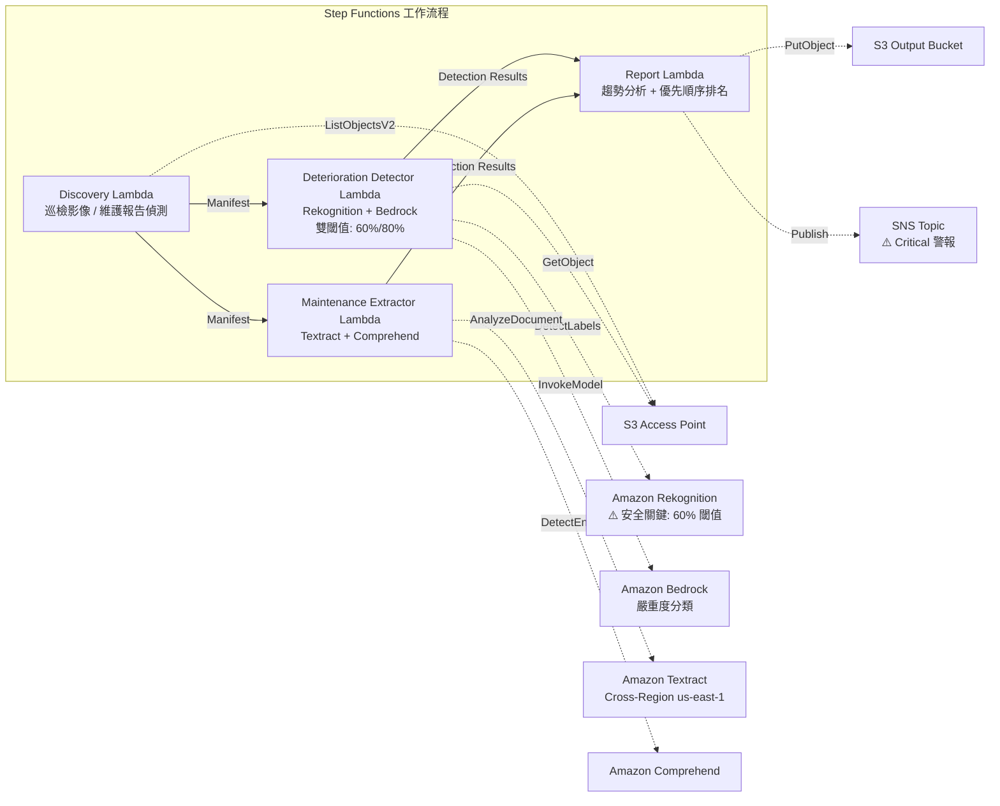

# UC22：運輸·鐵路 — 設備巡檢影像分析 / 維護報告管理

🌐 **Language / 言語**: [日本語](README.md) | [English](README.en.md) | [한국어](README.ko.md) | [简体中文](README.zh-CN.md) | 繁體中文 | [Français](README.fr.md) | [Deutsch](README.de.md) | [Español](README.es.md)

📚 **文件**: [架構圖](docs/architecture.zh-TW.md) | [示範指南](docs/demo-guide.zh-TW.md)

## 概述

這是一套運用 FSx for ONTAP 的 S3 Access Points，從鐵路基礎設施巡檢影像中偵測劣化指標（裂縫、鏽蝕、位移），並自動產生嚴重度分類與維護優先順序排名的無伺服器工作流程。它採用**對安全關鍵基礎設施（橋梁、號誌設備、鋼軌接頭）套用更低偵測閾值並強制人工審查的安全設計**。

### 適合此模式的情境

- 鐵路設備的定期巡檢影像（軌道、橋梁、號誌設備）已累積在 FSx for ONTAP 中
- 希望以 AI 自動偵測劣化模式（裂縫、鏽蝕、位移）並分類嚴重度
- 希望從維護報告（PDF、Excel）中自動擷取維修歷史與生命週期資料
- 需要對安全關鍵基礎設施進行低閾值偵測 + 人工審查標記
- 需要 12 個月的劣化趨勢分析與維護優先順序排名

### 不適合此模式的情境

- 需要即時的列車運行管理
- 需要建置完整的 CMMS（設備維護管理系統）
- 無法確保對 ONTAP REST API 的網路可達性的環境

### 主要功能

- 經由 S3 AP 自動偵測巡檢影像（JPEG/PNG/TIFF）與維護報告（PDF/Excel）
- 以 Rekognition 進行劣化指標偵測（雙閾值：標準 80%、安全關鍵 60%）
- 以 Bedrock 進行嚴重度分類（critical / major / minor / observation）
- 安全關鍵基礎設施：低於 90% 的偵測全部設為 `human_review_required: true`

> **安全設計的意圖**：60% 閾值並非自動核准閾值，而是**升級閾值**（為減少 false negative 而擴大審查對象的設計）。本模式並非將安全判斷自動化，而是為專家審查執行候選偵測。
- 以 Textract + Comprehend 進行維護報告的維修歷史·生命週期資料擷取
- 12 個月劣化趨勢分析 + 依嚴重度×零件年限的維護優先順序排名
- 低解析度影像（< 1024×768）自動標記為 `requires-reinspection`

## Success Metrics

### Outcome
透過對設備巡檢影像的 AI 分析，實現鐵路基礎設施劣化的早期發現與維護計畫的最佳化。將安全關鍵基礎設施的漏檢風險降至最低。

### Metrics
| 指標 | 目標值（範例） |
|-----------|------------|
| 劣化偵測率（標準基礎設施） | ≥ 85% (80% confidence) |
| 劣化偵測率（安全關鍵基礎設施） | ≥ 95% (60% confidence) |
| 嚴重度分類精度 | ≥ 80% |
| 偽陰性率（安全關鍵） | < 5% |
| 報告產生時間 | < 5 分鐘 / 批次 |
| Human Review 強制率 | > 30%（安全關鍵為全部 < 90% 偵測） |

### Measurement Method
Step Functions 執行歷史、Rekognition 偵測日誌、Bedrock 分類結果、CloudWatch EMF Metrics（ProcessingDuration, SuccessCount, ErrorCount, HumanReviewCount）。

### Human Review Requirements
- **安全關鍵基礎設施（橋梁、號誌、鋼軌接頭）**：低於 90% 的全部偵測強制人工審查
- **critical 嚴重度**：即時通知 + 48 小時以內的工程師確認
- **低解析度影像**：設定重新巡檢排程
- 每月劣化趨勢報告由維護計畫團隊審查

## 架構



## 安全設計 (Safety-Critical Design)

| 類別 | 閾值 | Human Review |
|---------|------|-------------|
| 標準基礎設施（一般軌道） | Rekognition ≥ 80% | 僅記錄偵測結果 |
| 安全關鍵基礎設施（橋梁） | Rekognition ≥ 60% | < 90% 全部審查 |
| 安全關鍵基礎設施（號誌設備） | Rekognition ≥ 60% | < 90% 全部審查 |
| 安全關鍵基礎設施（鋼軌接頭） | Rekognition ≥ 60% | < 90% 全部審查 |
| 低解析度影像 (< 1024×768) | — | 標記 `requires-reinspection` |

## 前提條件

> **S3 AP NetworkOrigin 注意**：Discovery Lambda 部署在 VPC 內。若 S3 Access Point 的 NetworkOrigin 為 `Internet`，則無法經由 S3 Gateway VPC Endpoint 存取（因為不會路由至 FSx 資料平面）。請使用 NetworkOrigin=VPC 的 S3 AP，或設定經由 NAT Gateway 的存取。詳情請參閱 [S3AP Compatibility Notes](../docs/s3ap-compatibility-notes.md)。

- AWS 帳戶與適當的 IAM 權限
- FSx for ONTAP 檔案系統（ONTAP 9.17.1P4D3 以上）
- 已啟用 S3 Access Point 的磁碟區
- VPC、私有子網路
- 已啟用 Amazon Bedrock 模型存取
- Amazon Textract — Cross-Region (us-east-1) 呼叫設定

## 部署步驟

```bash
# 前提: 需要 AWS SAM CLI。'sam build' 會自動封裝程式碼與共用層。
sam build

sam deploy \
  --stack-name fsxn-transport-maintenance \
  --parameter-overrides \
    S3AccessPointAlias=<your-volume-ext-s3alias> \
    S3AccessPointName=<your-s3ap-name> \
    VpcId=<your-vpc-id> \
    PrivateSubnetIds=<subnet-1>,<subnet-2> \
    ScheduleExpression="cron(0 0 * * ? *)" \
    NotificationEmail=<your-email@example.com> \
  --capabilities CAPABILITY_NAMED_IAM \
  --resolve-s3 \
  --region ap-northeast-1
```

> **注意**：`template.yaml` 用於 SAM CLI（`sam build` + `sam deploy`）。
> 若使用 `aws cloudformation deploy` 命令直接部署，請使用 `template-deploy.yaml`（需要預先封裝 Lambda zip 檔案並上傳至 S3）。

## 成本估算（每月概算）

| 組態 | 每月概算 |
|------|---------|
| 最小組態（每日 1 次） | ~$10-25 |
| 標準組態 | ~$25-70 |

---

## ⚠️ 效能相關注意事項

- FSx for ONTAP 的吞吐容量**在 NFS/SMB/S3 AP 之間共用**。以 MapConcurrency=10 進行平行處理時，可能影響同一磁碟區上的其他工作負載。
- 進行大量檔案的批次處理時，請確認 FSx for ONTAP 的 Throughput Capacity (MBps)，並視需要調整 MapConcurrency。
- 建議：在生產環境中首先以 MapConcurrency=5 開始，一邊監控 FSx for ONTAP 的 CloudWatch 指標 (ThroughputUtilization) 一邊逐步增加。

## Governance Note

> 本模式提供技術架構指導。並非法律·合規·法規方面的建議。鐵路基礎設施的安全管理必須遵循鐵路事業法及各類技術標準。AI 的偵測結果並非最終判斷，必須由具資格的工程師確認。

> **相關法規**：鐵路事業法（Railway Business Act）、運輸安全委員會設置法（Transport Safety Board Establishment Act）

---

## 產業參考案例 / Industry Reference Cases

> **Evidence Tier**: Public（來自官方部落格 / 研討會議程）

### 7-Eleven：面向維護技術人員的 GenAI 助理 (DAIS 2026)

7-Eleven 在 13,000+ 門市的 HVAC、烤箱等設備維護中，建置了讓技術人員透過智慧型手機從共用磁碟機上的 PDF/試算表即時取得答案的 GenAI 代理程式。

- **成果**：檢索時間 −60%、首次維修成功率 +25%、延遲 −40% 以上
- **代理程式功能**：文件 RAG 檢索、基於影像的故障排除、零件資訊存取、附護欄的 Web 檢索
- **與 FSx for ONTAP 的關聯**：將設備手冊（PDF/影像）儲存在 NFS/SMB 共用 → AI 管線經由 S3 AP 存取 → 向量化 → 代理程式檢索·回答

本模式（UC22）提供以 FSx for ONTAP S3 AP + AWS Bedrock 解決同類課題（設備巡檢影像 + 維護文件分析）的架構。

詳細分析：[DAIS 2026 Agent Bricks 案例分析](../docs/investigations/dais2026-agent-bricks-industry-cases.md)

Sources:
- [DAIS 2026 Session: AI Agents for the Frontline](https://www.databricks.com/dataaisummit/session/ai-agents-frontline-7-elevens-genai-maintenance-assistant)
- [Databricks Blog](https://www.databricks.com/blog/how-7-eleven-transformed-maintenance-technician-knowledge-access-databricks-agent-bricks)

---

## S3AP Compatibility

請參閱 [S3AP Compatibility Notes](../docs/s3ap-compatibility-notes.md)。
