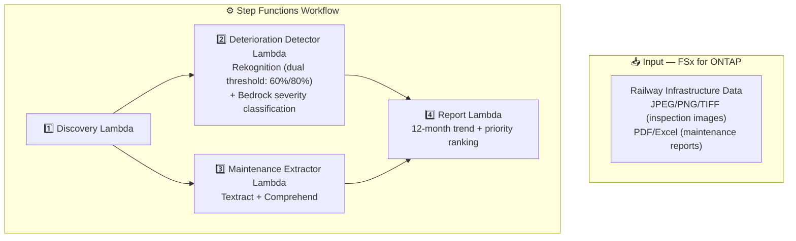

# UC22: Transportation & Rail — Architecture

🌐 **Language / 言語**: [日本語](architecture.md) | English | [한국어](architecture.ko.md) | [简体中文](architecture.zh-CN.md) | [繁體中文](architecture.zh-TW.md) | [Français](architecture.fr.md) | [Deutsch](architecture.de.md) | [Español](architecture.es.md)

## Architecture Diagram

## Safety-Critical Design

| Category | Threshold | Human Review |
|----------|-----------|-------------|
| Standard infrastructure | Rekognition >= 80% | Detection recorded |
| Bridges | Rekognition >= 60% | All < 90% reviewed |
| Signaling equipment | Rekognition >= 60% | All < 90% reviewed |
| Rail joints | Rekognition >= 60% | All < 90% reviewed |

## AWS Services Used

| Service | Role |
|---------|------|
| Amazon Rekognition | Deterioration detection (dual threshold) |
| Amazon Bedrock | Severity classification (4 levels) |
| Amazon Textract | Maintenance report analysis (Cross-Region us-east-1) |
| Amazon Comprehend | Entity extraction |

## Key Design Decisions

1. **Dual threshold** — Safety-critical (60%) vs standard (80%) detection sensitivity
2. **Mandatory human review** — All detections < 90% require engineer review
3. **12-month trend analysis** — Visualization of deterioration patterns over time
4. **Severity x component age** — Two-axis priority ranking
5. **Low-resolution handling** — Images < 1024x768 marked requires-reinspection
