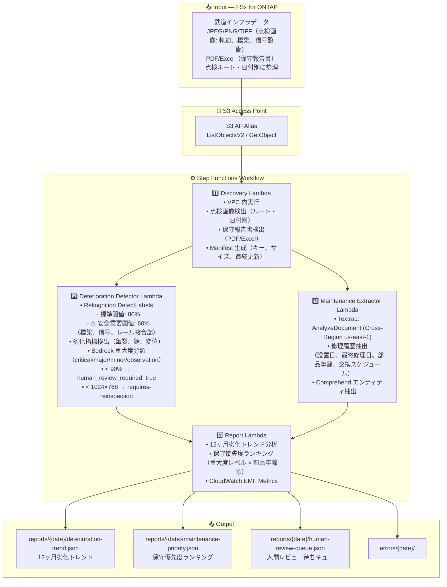
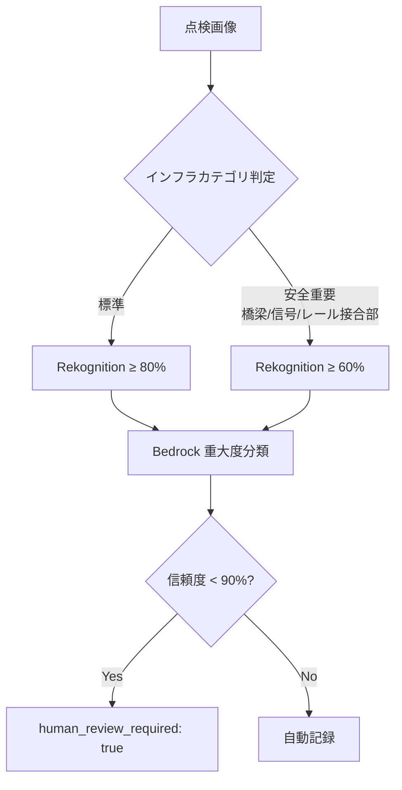

# UC22: 運輸・鉄道 — 設備点検画像分析 / 保守レポート管理 アーキテクチャ

🌐 **Language / 言語**: 日本語 | [English](architecture.en.md) | [한국어](architecture.ko.md) | [简体中文](architecture.zh-CN.md) | [繁體中文](architecture.zh-TW.md) | [Français](architecture.fr.md) | [Deutsch](architecture.de.md) | [Español](architecture.es.md)

## Architecture Diagram

---

## Safety-Critical Design

### デュアル閾値アーキテクチャ

### 低解像度画像ハンドリング

- 解像度 < 1024×768 ピクセル: `requires-reinspection` マーク
- 品質メトリクス記録: 実際の解像度、ファイルサイズ、分析に必要な最小解像度

---

## Key Design Decisions

1. **デュアル閾値** — 安全重要インフラ（60%）vs 標準インフラ（80%）で検出感度を分離
2. **人間レビュー必須化** — 90% 未満の検出は全件エンジニアレビュー。偽陰性リスク最小化
3. **12ヶ月トレンド分析** — 経時劣化パターンの可視化で予防保全計画を支援
4. **重大度 × 部品年齢** — 優先度ランキングの二軸評価
5. **Cross-Region Textract** — 保守報告書の正確な解析のため us-east-1 を使用
6. **エラー分離** — 個別画像の処理失敗がバッチ全体を停止させない

---

## AWS Services Used

| サービス | 役割 |
|---------|------|
| FSx for ONTAP | 点検画像・保守報告書のストレージ |
| S3 Access Points | ONTAP ボリュームへのサーバーレスアクセス |
| Amazon Rekognition | 劣化指標検出（デュアル閾値） |
| Amazon Bedrock | 重大度分類（4段階） |
| Amazon Textract | 保守報告書解析（Cross-Region us-east-1） |
| Amazon Comprehend | エンティティ抽出 |
| Step Functions | ワークフローオーケストレーション |
| EventBridge Scheduler | 日次トリガー |
| SNS | Critical アラート通知 |
| CloudWatch + X-Ray | オブザーバビリティ |
