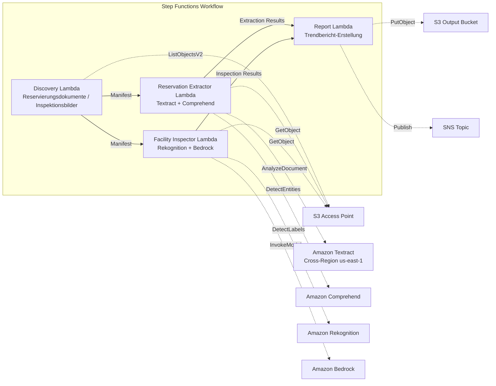

# UC20: Reise & Gastgewerbe — Verarbeitung von Reservierungsdokumenten / Analyse von Anlageninspektionsbildern

🌐 **Language / 言語**: [日本語](README.md) | [English](README.en.md) | [한국어](README.ko.md) | [简体中文](README.zh-CN.md) | [繁體中文](README.zh-TW.md) | [Français](README.fr.md) | Deutsch | [Español](README.es.md)

📚 **Dokumentation**: [Architektur](docs/architecture.de.md) | [Demo-Anleitung](docs/demo-guide.de.md)

## Überblick

Ein Serverless-Workflow, der die S3 Access Points von FSx for ONTAP nutzt, um aus Reservierungsdokumenten von Hotels und Gasthäusern (PDF, gescannte Bilder) automatisch strukturierte Daten zu extrahieren und aus Anlageninspektionsbildern automatisch eine Zustandsanalyse der Anlagen sowie Wartungsempfehlungen zu erzeugen.

### Wann dieses Pattern passt

- Reservierungsbestätigungen, Stornierungsbenachrichtigungen und Gästekorrespondenz sammeln sich auf FSx for ONTAP an
- Sie möchten Gästename, Daten, Zimmertyp und Betrag automatisch aus Reservierungsdokumenten extrahieren
- Sie möchten den Zustand von Anlageninspektionsbildern (Gästezimmer, Gemeinschaftsbereiche, Außenbereiche) automatisch per KI bewerten
- Sie benötigen eine automatische Verarbeitung mit Mehrsprachenunterstützung (nicht japanische Gästedokumente)
- Sie möchten die Trendanalyse des Anlagenzustands für die präventive Instandhaltungsplanung nutzen

### Wann dieses Pattern nicht passt

- Ein Echtzeit-Reservierungsverwaltungssystem (PMS) ist erforderlich
- Eine sofortige Check-in-/Check-out-Verarbeitung ist erforderlich
- Eine vollständige Anlagenverwaltungsplattform (CAFM) ist erforderlich
- Umgebungen, in denen die Netzwerkerreichbarkeit der ONTAP REST API nicht sichergestellt werden kann

### Hauptfunktionen

- Automatische Erkennung von Reservierungsdokumenten (PDF, gescannte Bilder) und Anlageninspektionsbildern über S3 AP
- Strukturierte Extraktion von Reservierungsdaten mit Textract + Comprehend (Gästename, Daten, Zimmertyp, Betrag)
- Mehrsprachenunterstützung (Spracherkennung → Textract-Hinweise + automatische Auswahl des Comprehend-Modells)
- Analyse des Anlagenzustands mit Rekognition (Schadenserkennung, Sauberkeitsbewertung 0–100)
- Erzeugung von Wartungsempfehlungen mit Bedrock
- Trendbericht zum Anlagenzustand + Zusammenfassung der Reservierungsverarbeitung (JSON + menschenlesbares Format)

## Success Metrics

### Outcome
Durch die Automatisierung der Verarbeitung von Reservierungsdokumenten und der Analyse von Anlageninspektionsbildern werden betriebliche Effizienz und die Aufrechterhaltung der Anlagenqualität für Hotelketten erreicht.

### Metrics
| Metrik | Zielwert (Beispiel) |
|-----------|------------|
| Genauigkeit der Reservierungsdatenextraktion | ≥ 90 % |
| Erkennungsrate des Anlagenzustands | ≥ 85 % |
| Abdeckung der Mehrsprachenunterstützung | ≥ 5 Sprachen |
| Berichterstellungszeit | < 5 Min. / Batch |
| Kosten / tägliche Ausführung | < $2.00 |
| Human-Review-Pflichtquote | > 15 % (bei Schadenserkennung alle geprüft) |

### Measurement Method
Step-Functions-Ausführungsverlauf, Textract/Comprehend-Extraktionsergebnisse, Rekognition-Analyseprotokolle, CloudWatch EMF Metrics (ProcessingDuration, SuccessCount, ErrorCount).

### Human Review Requirements
- Bei Erkennung von Anlagenschäden prüft das Anlagenverwaltungsteam und entscheidet über die Reaktion
- Dokumente mit geringer Extraktionsgenauigkeit erfordern eine manuelle Prüfung
- Monatliche Trendberichte zum Anlagenzustand werden von der Geschäftsleitung überprüft

## Architektur



### Workflow-Schritte

1. **Discovery**: Reservierungsdokumente und Anlageninspektionsbilder aus dem S3 AP erkennen
2. **Reservation Extractor**: Dokumente mit Textract analysieren + Entitäten mit Comprehend extrahieren (Mehrsprachenunterstützung)
3. **Facility Inspector**: Anlagenzustand mit Rekognition analysieren + Wartungsempfehlungen mit Bedrock erzeugen
4. **Report**: Trendbericht zum Anlagenzustand + Zusammenfassung der Reservierungsverarbeitung erstellen, SNS-Benachrichtigung senden

## Voraussetzungen

> **Hinweis zu S3 AP NetworkOrigin**: Die Discovery Lambda wird innerhalb eines VPC bereitgestellt. Wenn der NetworkOrigin des S3 Access Point `Internet` ist, kann nicht über einen S3 Gateway VPC Endpoint darauf zugegriffen werden (die Anfragen werden nicht an die FSx-Datenebene geroutet). Verwenden Sie einen S3 AP mit NetworkOrigin=VPC oder konfigurieren Sie den Zugriff über eine NAT Gateway. Weitere Einzelheiten finden Sie unter [S3AP Compatibility Notes](../docs/s3ap-compatibility-notes.md).

- AWS-Konto und geeignete IAM-Berechtigungen
- FSx for ONTAP-Dateisystem (ONTAP 9.17.1P4D3 oder höher)
- Ein Volume mit aktivierten S3 Access Points
- VPC, private Subnetze
- Aktivierter Zugriff auf Amazon Bedrock-Modelle (Claude / Nova)
- Amazon Textract — Cross-Region (us-east-1)-Aufruf konfiguriert

## Bereitstellungsverfahren

### 1. Überprüfung der Parameter

Überprüfen Sie vorab die Pfadmuster der Reservierungsdokumente und das Verzeichnis der Anlageninspektionsbilder.

### 2. SAM-Bereitstellung

```bash
# Voraussetzung: AWS SAM CLI erforderlich. „sam build“ paketiert den Code und den Shared Layer automatisch.
sam build

sam deploy \
  --stack-name fsxn-travel-processing \
  --parameter-overrides \
    S3AccessPointAlias=<your-volume-ext-s3alias> \
    S3AccessPointName=<your-s3ap-name> \
    VpcId=<your-vpc-id> \
    PrivateSubnetIds=<subnet-1>,<subnet-2> \
    ScheduleExpression="cron(0 0 * * ? *)" \
    NotificationEmail=<your-email@example.com> \
    EnableVpcEndpoints=false \
    EnableCloudWatchAlarms=false \
  --capabilities CAPABILITY_NAMED_IAM \
  --resolve-s3 \
  --region ap-northeast-1
```

> **Hinweis**: `template.yaml` wird mit der SAM CLI (`sam build` + `sam deploy`) verwendet.
> Zur direkten Bereitstellung mit dem Befehl `aws cloudformation deploy` verwenden Sie stattdessen `template-deploy.yaml` (erfordert das vorherige Paketieren der Lambda-Zip-Dateien und deren Upload nach S3).

## Liste der Konfigurationsparameter

| Parameter | Beschreibung | Standard | Erforderlich |
|-----------|------|----------|------|
| `S3AccessPointAlias` | FSx for ONTAP S3 AP Alias (für Eingabe) | — | ✅ |
| `S3AccessPointName` | S3 AP-Name (für die Vergabe von IAM-Berechtigungen) | `""` | ⚠️ Empfohlen |
| `ScheduleExpression` | EventBridge Scheduler-Zeitplanausdruck | `cron(0 0 * * ? *)` | |
| `VpcId` | VPC ID | — | ✅ |
| `PrivateSubnetIds` | Liste der privaten Subnetz-IDs | — | ✅ |
| `NotificationEmail` | SNS-Benachrichtigungs-E-Mail-Adresse | — | ✅ |
| `MapConcurrency` | Anzahl paralleler Ausführungen des Map-Status | `10` | |
| `LambdaMemorySize` | Lambda-Speichergröße (MB) | `512` | |
| `LambdaTimeout` | Lambda-Timeout (Sekunden) | `300` | |
| `EnableVpcEndpoints` | Interface VPC Endpoints aktivieren | `false` | |
| `EnableCloudWatchAlarms` | CloudWatch Alarms aktivieren | `false` | |

## ⚠️ Hinweise zur Performance

- Die Durchsatzkapazität von FSx for ONTAP wird **über NFS/SMB/S3 AP hinweg geteilt**. Wenn Sie mit MapConcurrency=10 parallel verarbeiten, kann dies andere Workloads auf demselben Volume beeinträchtigen.
- Bei der Batch-Verarbeitung großer Dateimengen überprüfen Sie die Throughput Capacity (MBps) von FSx for ONTAP und passen Sie MapConcurrency bei Bedarf an.
- Empfohlen: Beginnen Sie in der Produktionsumgebung zunächst mit MapConcurrency=5 und erhöhen Sie den Wert schrittweise, während Sie die CloudWatch-Metriken von FSx for ONTAP (ThroughputUtilization) überwachen.

## Bereinigung

```bash
aws s3 rm s3://fsxn-travel-processing-output-${AWS_ACCOUNT_ID} --recursive

aws cloudformation delete-stack \
  --stack-name fsxn-travel-processing \
  --region ap-northeast-1

aws cloudformation wait stack-delete-complete \
  --stack-name fsxn-travel-processing \
  --region ap-northeast-1
```

## Supported Regions

| Dienst | Regionsbeschränkung |
|---------|-------------|
| Amazon Textract | Cross-Region (us-east-1)-Aufruf |
| Amazon Comprehend | Verfügbar in ap-northeast-1 |
| Amazon Rekognition | Verfügbar in ap-northeast-1 |
| Amazon Bedrock | Unterstützte Regionen prüfen ([Von Bedrock unterstützte Regionen](https://docs.aws.amazon.com/general/latest/gr/bedrock.html)) |

> In UC20 wird nur Textract Cross-Region (us-east-1) aufgerufen.

## Kostenschätzung (ungefähr monatlich)

> **Anmerkung**: Ungefähre Angabe für die Region ap-northeast-1. Die tatsächlichen Kosten variieren je nach Nutzung.

| Dienst | Angenommene Nutzung | Ungefähr monatlich |
|---------|-----------|---------|
| Lambda | 4 Funktionen × tägliche Ausführung | ~$1-3 |
| S3 API | ~3K requests/Tag | ~$0.50 |
| Step Functions | ~300 transitions/Tag | ~$0.25 |
| Textract | ~200 pages/Tag | ~$3-8 |
| Comprehend | ~200 docs/Tag | ~$1-3 |
| Rekognition | ~100 images/Tag | ~$1-3 |
| Bedrock (Nova Lite) | ~20K tokens/Ausführung | ~$1-3 |

| Konfiguration | Ungefähr monatlich |
|------|---------|
| Minimalkonfiguration (1× täglich) | ~$8-20 |
| Standardkonfiguration | ~$20-50 |

---

## Governance Note

> Dieses Pattern bietet technische Architekturhinweise. Es stellt keine rechtliche, Compliance- oder regulatorische Beratung dar. Die Handhabung von Reservierungsdokumenten, die personenbezogene Daten von Gästen (Name, Kontaktdaten usw.) enthalten, muss dem Gesetz zum Schutz personenbezogener Informationen und dem Gasthaus- und Hotelgesetz entsprechen.

> **Zugehörige Vorschriften**: Reisebürogesetz, Gesetz zum Schutz personenbezogener Informationen

---

## S3AP Compatibility

Informationen zu Kompatibilitätsbeschränkungen, Fehlerbehebung und Trigger-Patterns für S3 Access Points for FSx for ONTAP finden Sie unter [S3AP Compatibility Notes](../docs/s3ap-compatibility-notes.md).
