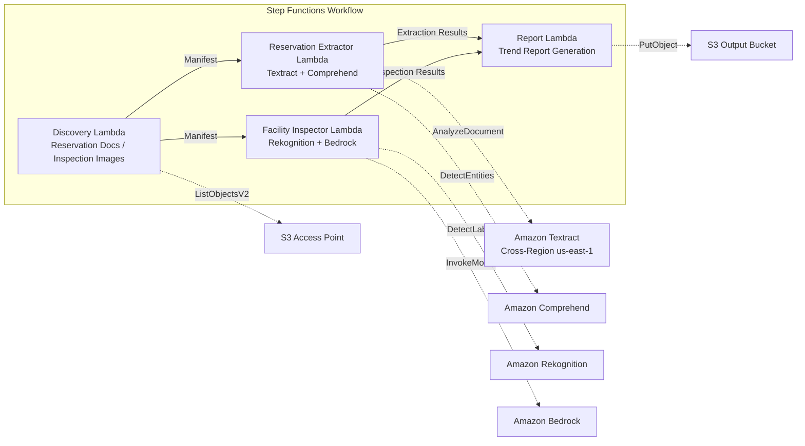

# UC20: Travel & Hospitality — Reservation Document Processing / Facility Inspection Image Analysis

🌐 **Language / 言語**: [日本語](README.md) | English | [한국어](README.ko.md) | [简体中文](README.zh-CN.md) | [繁體中文](README.zh-TW.md) | [Français](README.fr.md) | [Deutsch](README.de.md) | [Español](README.es.md)

📚 **Documentation**: [Architecture](docs/architecture.en.md) | [Demo Guide](docs/demo-guide.en.md)

## Overview

A serverless workflow leveraging FSx for ONTAP S3 Access Points to automatically extract structured data from hotel/inn reservation documents (PDF, scanned images) and generate facility condition analysis and maintenance recommendations from inspection images.

### When This Pattern Fits

- Reservation confirmations, cancellation notices, and guest correspondence stored on FSx for ONTAP
- Need to automatically extract guest name, dates, room type, and amounts from reservation documents
- Want AI-powered facility inspection image analysis (rooms, common areas, exteriors)
- Require multilingual document processing (non-Japanese guest documents)
- Want to leverage facility condition trend analysis for preventive maintenance

### Key Features

- Auto-detection of reservation documents (PDF, scanned images) and facility inspection images via S3 AP
- Textract + Comprehend structured data extraction (guest name, dates, room type, amount)
- Multilingual support (language detection → Textract hints + Comprehend model auto-selection)
- Rekognition facility condition analysis (damage detection, cleanliness scoring 0–100)
- Bedrock maintenance recommendation generation
- Facility condition trend report + reservation processing summary (JSON + human-readable)

## Success Metrics

### Outcome
Automate reservation document processing and facility inspection image analysis to improve hotel chain operational efficiency and facility quality maintenance.

### Metrics
| Metric | Target (Example) |
|--------|-----------------|
| Reservation data extraction accuracy | ≥ 90% |
| Facility condition detection rate | ≥ 85% |
| Multilingual support coverage | ≥ 5 languages |
| Report generation time | < 5 min / batch |
| Cost / daily execution | < $2.00 |
| Human review required rate | > 15% (all damage detections reviewed) |

### Measurement Method
Step Functions execution history, Textract/Comprehend extraction results, Rekognition analysis logs, CloudWatch EMF Metrics (ProcessingDuration, SuccessCount, ErrorCount).

### Human Review Requirements
- Facility damage detections reviewed by facility management team
- Low-accuracy extractions require manual verification
- Monthly facility condition trend reports reviewed by management

## Architecture



> **S3 AP NetworkOrigin Note**: The Discovery Lambda is deployed inside a VPC. If the S3 Access Point's NetworkOrigin is `Internet`, it cannot be accessed via S3 Gateway VPC Endpoint (requests are not routed to the FSx data plane). Use a VPC-origin S3 AP or configure NAT Gateway access. See [S3AP Compatibility Notes](../docs/s3ap-compatibility-notes.md).

## Deployment

```bash
# Prerequisite: AWS SAM CLI required. 'sam build' packages the code and shared layer automatically.
sam build

sam deploy \
  --stack-name fsxn-travel-processing \
  --parameter-overrides \
    S3AccessPointAlias=<your-volume-ext-s3alias> \
    S3AccessPointName=<your-s3ap-name> \
    VpcId=<your-vpc-id> \
    PrivateSubnetIds=<subnet-1>,<subnet-2> \
    NotificationEmail=<your-email@example.com> \
  --capabilities CAPABILITY_NAMED_IAM \
  --resolve-s3 \
  --region ap-northeast-1
```


## ⚠️ Performance Considerations

- FSx for ONTAP throughput capacity is **shared across NFS/SMB/S3 AP**. Running MapConcurrency=10 in parallel may impact other workloads on the same volume.
- For large batch processing, check FSx for ONTAP Throughput Capacity (MBps) and adjust MapConcurrency accordingly.
- Recommended: Start with MapConcurrency=5 in production, monitor FSx for ONTAP CloudWatch metrics (ThroughputUtilization), and increase gradually.

## Governance Note

> This pattern provides technical architecture guidance. It does not constitute legal, compliance, or regulatory advice. Handling of guest personal information (names, contact details) in reservation documents must comply with applicable personal information protection laws and hospitality industry regulations.

> **Related Regulations**: 旅行業法 (Travel Agency Act), 個人情報保護法 (APPI)

---

## S3AP Compatibility

See [S3AP Compatibility Notes](../docs/s3ap-compatibility-notes.md) for FSx for ONTAP S3 Access Points constraints and troubleshooting.
