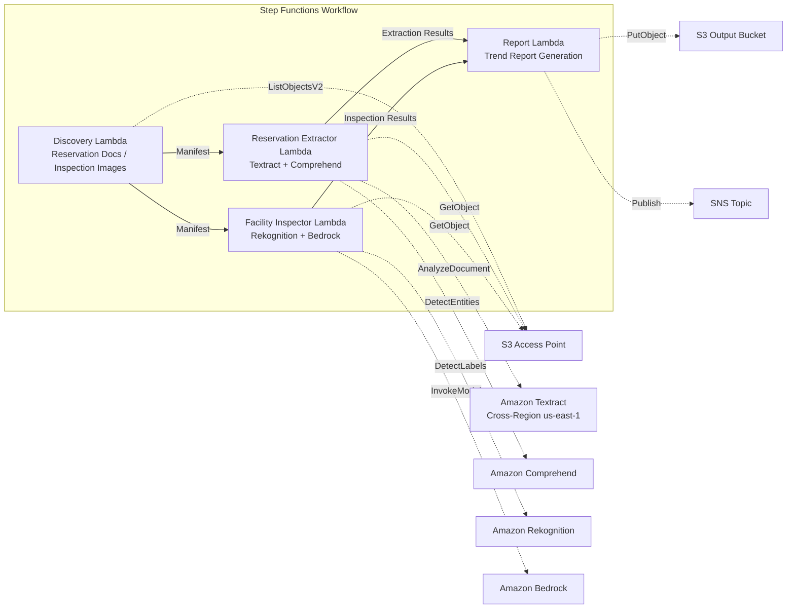

# UC20: Travel & Hospitality — Reservation Document Processing / Facility Inspection Image Analysis

🌐 **Language / 言語**: [日本語](README.md) | English | [한국어](README.ko.md) | [简体中文](README.zh-CN.md) | [繁體中文](README.zh-TW.md) | [Français](README.fr.md) | [Deutsch](README.de.md) | [Español](README.es.md)

📚 **Documentation**: [Architecture](docs/architecture.en.md) | [Demo Guide](docs/demo-guide.en.md)

## Overview

A serverless workflow that leverages FSx for ONTAP S3 Access Points to automatically extract structured data from hotel/inn reservation documents (PDF, scanned images) and to automatically generate facility condition analysis and maintenance recommendations from facility inspection images.

### When This Pattern Fits

- Reservation confirmations, cancellation notices, and guest correspondence are accumulating on FSx for ONTAP
- You want to automatically extract guest name, dates, room type, and amount from reservation documents
- You want to automatically assess the condition of facility inspection images (guest rooms, common areas, exteriors) with AI
- You need automated processing with multilingual support (non-Japanese guest documents)
- You want to leverage facility condition trend analysis for preventive maintenance planning

### When This Pattern Does Not Fit

- A real-time reservation management system (PMS) is required
- Immediate check-in/check-out processing is required
- A full facility management (CAFM) platform is required
- Environments where network reachability to the ONTAP REST API cannot be ensured

### Key Features

- Automatic detection of reservation documents (PDF, scanned images) and facility inspection images via S3 AP
- Structured reservation data extraction with Textract + Comprehend (guest name, dates, room type, amount)
- Multilingual support (language detection → Textract hints + automatic Comprehend model selection)
- Facility condition analysis with Rekognition (damage detection, cleanliness scoring 0–100)
- Maintenance recommendation generation with Bedrock
- Facility condition trend report + reservation processing summary (JSON + human-readable format)

## Success Metrics

### Outcome
By automating reservation document processing and facility inspection image analysis, achieve operational efficiency and facility quality maintenance for hotel chains.

### Metrics
| Metric | Target (Example) |
|-----------|------------|
| Reservation data extraction accuracy | ≥ 90% |
| Facility condition detection rate | ≥ 85% |
| Multilingual support coverage | ≥ 5 languages |
| Report generation time | < 5 min / batch |
| Cost / daily execution | < $2.00 |
| Human Review required rate | > 15% (all damage detections reviewed) |

### Measurement Method
Step Functions execution history, Textract/Comprehend extraction results, Rekognition analysis logs, CloudWatch EMF Metrics (ProcessingDuration, SuccessCount, ErrorCount).

### Human Review Requirements
- When facility damage is detected, the facility management team reviews and decides on the response
- Documents with low extraction accuracy require manual verification
- Monthly facility condition trend reports are reviewed by management

## Architecture



### Workflow Steps

1. **Discovery**: Detect reservation documents and facility inspection images from the S3 AP
2. **Reservation Extractor**: Parse documents with Textract + extract entities with Comprehend (multilingual support)
3. **Facility Inspector**: Analyze facility condition with Rekognition + generate maintenance recommendations with Bedrock
4. **Report**: Generate facility condition trend report + reservation processing summary, send SNS notification

## Prerequisites

> **S3 AP NetworkOrigin Note**: The Discovery Lambda is deployed inside a VPC. If the S3 Access Point's NetworkOrigin is `Internet`, it cannot be accessed via an S3 Gateway VPC Endpoint (requests are not routed to the FSx data plane). Use an S3 AP with NetworkOrigin=VPC, or configure access via a NAT Gateway. For details, see [S3AP Compatibility Notes](../docs/s3ap-compatibility-notes.md).

- AWS account and appropriate IAM permissions
- FSx for ONTAP file system (ONTAP 9.17.1P4D3 or later)
- A volume with S3 Access Points enabled
- VPC, private subnets
- Amazon Bedrock model access enabled (Claude / Nova)
- Amazon Textract — Cross-Region (us-east-1) invocation configured

## Deployment

### 1. Verify Parameters

Verify the reservation document path patterns and the facility inspection image directory in advance.

### 2. SAM Deploy

```bash
# Prerequisite: AWS SAM CLI required. 'sam build' packages the code and shared layer automatically.
sam build

sam deploy \
  --stack-name fsxn-travel-processing \
  --parameter-overrides \
    S3AccessPointAlias=<your-volume-ext-s3alias> \
    S3AccessPointName=<your-s3ap-name> \
    VpcId=<your-vpc-id> \
    PrivateSubnetIds=<subnet-1>,<subnet-2> \
    ScheduleExpression="cron(0 0 * * ? *)" \
    NotificationEmail=<your-email@example.com> \
    EnableVpcEndpoints=false \
    EnableCloudWatchAlarms=false \
  --capabilities CAPABILITY_NAMED_IAM \
  --resolve-s3 \
  --region ap-northeast-1
```

> **Note**: `template.yaml` is used with the SAM CLI (`sam build` + `sam deploy`).
> To deploy directly with the `aws cloudformation deploy` command, use `template-deploy.yaml` instead (requires pre-packaging Lambda zip files and uploading them to S3).

## Configuration Parameters

| Parameter | Description | Default | Required |
|-----------|------|----------|------|
| `S3AccessPointAlias` | FSx for ONTAP S3 AP Alias (for input) | — | ✅ |
| `S3AccessPointName` | S3 AP name (for IAM permission grants) | `""` | ⚠️ Recommended |
| `ScheduleExpression` | EventBridge Scheduler schedule expression | `cron(0 0 * * ? *)` | |
| `VpcId` | VPC ID | — | ✅ |
| `PrivateSubnetIds` | Private subnet ID list | — | ✅ |
| `NotificationEmail` | SNS notification email address | — | ✅ |
| `MapConcurrency` | Map state parallel execution count | `10` | |
| `LambdaMemorySize` | Lambda memory size (MB) | `512` | |
| `LambdaTimeout` | Lambda timeout (seconds) | `300` | |
| `EnableVpcEndpoints` | Enable Interface VPC Endpoints | `false` | |
| `EnableCloudWatchAlarms` | Enable CloudWatch Alarms | `false` | |

## ⚠️ Performance Considerations

- FSx for ONTAP throughput capacity is **shared across NFS/SMB/S3 AP**. Running parallel processing with MapConcurrency=10 may impact other workloads on the same volume.
- For bulk processing of large numbers of files, check the FSx for ONTAP Throughput Capacity (MBps) and adjust MapConcurrency as needed.
- Recommended: In production, start with MapConcurrency=5 first, and increase gradually while monitoring FSx for ONTAP CloudWatch metrics (ThroughputUtilization).

## Cleanup

```bash
aws s3 rm s3://fsxn-travel-processing-output-${AWS_ACCOUNT_ID} --recursive

aws cloudformation delete-stack \
  --stack-name fsxn-travel-processing \
  --region ap-northeast-1

aws cloudformation wait stack-delete-complete \
  --stack-name fsxn-travel-processing \
  --region ap-northeast-1
```

## Supported Regions

| Service | Region Constraint |
|---------|-------------|
| Amazon Textract | Cross-Region (us-east-1) invocation |
| Amazon Comprehend | Available in ap-northeast-1 |
| Amazon Rekognition | Available in ap-northeast-1 |
| Amazon Bedrock | Check supported regions ([Bedrock supported regions](https://docs.aws.amazon.com/general/latest/gr/bedrock.html)) |

> In UC20, only Textract is invoked Cross-Region (us-east-1).

## Cost Estimation (Approximate Monthly)

> **Note**: Approximate for the ap-northeast-1 region. Actual costs vary by usage.

| Service | Assumed Usage | Approx. Monthly |
|---------|-----------|---------|
| Lambda | 4 functions × daily execution | ~$1-3 |
| S3 API | ~3K requests/day | ~$0.50 |
| Step Functions | ~300 transitions/day | ~$0.25 |
| Textract | ~200 pages/day | ~$3-8 |
| Comprehend | ~200 docs/day | ~$1-3 |
| Rekognition | ~100 images/day | ~$1-3 |
| Bedrock (Nova Lite) | ~20K tokens/execution | ~$1-3 |

| Configuration | Approx. Monthly |
|------|---------|
| Minimal (once daily) | ~$8-20 |
| Standard | ~$20-50 |

---

## Governance Note

> This pattern provides technical architecture guidance. It does not constitute legal, compliance, or regulatory advice. Handling of reservation documents that contain guest personal information (name, contact details, etc.) must comply with the Act on the Protection of Personal Information and the Inns and Hotels Act.

> **Related Regulations**: Travel Agency Act, Act on the Protection of Personal Information

---

## S3AP Compatibility

For FSx for ONTAP S3 Access Points compatibility constraints, troubleshooting, and trigger patterns, see [S3AP Compatibility Notes](../docs/s3ap-compatibility-notes.md).
