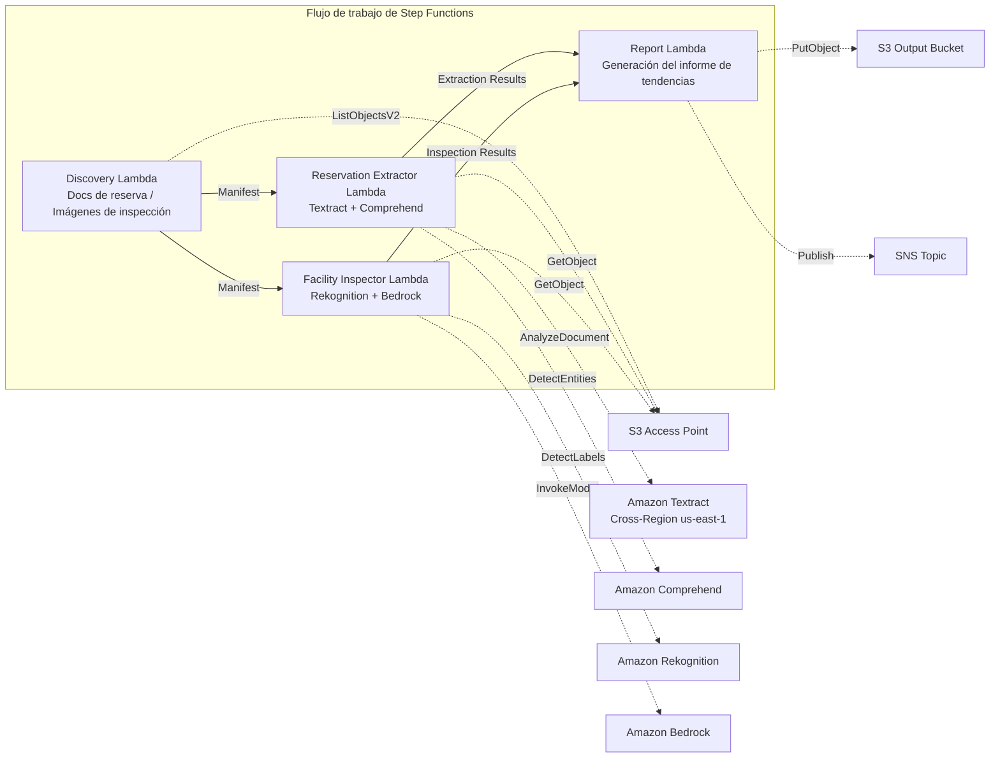

# UC20: Viajes y hostelería — Procesamiento de documentos de reserva / Análisis de imágenes de inspección de instalaciones

🌐 **Language / 言語**: [日本語](README.md) | [English](README.en.md) | [한국어](README.ko.md) | [简体中文](README.zh-CN.md) | [繁體中文](README.zh-TW.md) | [Français](README.fr.md) | [Deutsch](README.de.md) | Español

📚 **Documentación**: [Arquitectura](docs/architecture.es.md) | [Guía de demostración](docs/demo-guide.es.md)

## Descripción general

Un flujo de trabajo serverless que aprovecha los S3 Access Points de FSx for ONTAP para extraer automáticamente datos estructurados de los documentos de reserva de hoteles y posadas (PDF, imágenes escaneadas) y generar automáticamente el análisis del estado de las instalaciones y recomendaciones de mantenimiento a partir de imágenes de inspección.

### Cuándo encaja este patrón

- Las confirmaciones de reserva, avisos de cancelación y documentos de correspondencia con huéspedes se acumulan en FSx for ONTAP
- Desea extraer automáticamente el nombre del huésped, las fechas, el tipo de habitación y el importe de los documentos de reserva
- Desea evaluar automáticamente mediante IA el estado de las imágenes de inspección de instalaciones (habitaciones, áreas comunes, exteriores)
- Necesita procesamiento automático con soporte multilingüe (documentos de huéspedes no japoneses)
- Desea aprovechar el análisis de tendencias del estado de las instalaciones para la planificación del mantenimiento preventivo

### Cuándo no encaja este patrón

- Se requiere un sistema de gestión de reservas en tiempo real (PMS)
- Se requiere el procesamiento inmediato de check-in/check-out
- Se requiere una plataforma completa de gestión de instalaciones (CAFM)
- Entornos en los que no se puede garantizar la accesibilidad de red a la API REST de ONTAP

### Funciones principales

- Detección automática mediante S3 AP de documentos de reserva (PDF, imágenes escaneadas) e imágenes de inspección de instalaciones
- Extracción estructurada de datos de reserva con Textract + Comprehend (nombre del huésped, fechas, tipo de habitación, importe)
- Soporte multilingüe (detección de idioma → sugerencias de Textract + selección automática del modelo de Comprehend)
- Análisis del estado de las instalaciones con Rekognition (detección de daños, puntuación de limpieza 0–100)
- Generación de recomendaciones de mantenimiento con Bedrock
- Informe de tendencias del estado de las instalaciones + resumen del procesamiento de reservas (JSON + formato legible por humanos)

## Success Metrics

### Outcome
Mediante la automatización del procesamiento de documentos de reserva y el análisis de imágenes de inspección de instalaciones, lograr la eficiencia operativa y el mantenimiento de la calidad de las instalaciones para las cadenas hoteleras.

### Metrics
| Métrica | Valor objetivo (ejemplo) |
|-----------|------------|
| Precisión de extracción de datos de reserva | ≥ 90 % |
| Tasa de detección del estado de las instalaciones | ≥ 85 % |
| Cobertura del soporte multilingüe | ≥ 5 idiomas |
| Tiempo de generación de informes | < 5 min / lote |
| Coste / ejecución diaria | < $2.00 |
| Tasa obligatoria de Human Review | > 15 % (todas las detecciones de daños revisadas) |

### Measurement Method
Historial de ejecución de Step Functions, resultados de extracción de Textract/Comprehend, registros de análisis de Rekognition, CloudWatch EMF Metrics (ProcessingDuration, SuccessCount, ErrorCount).

### Human Review Requirements
- Cuando se detectan daños en las instalaciones, el equipo de gestión de instalaciones revisa y decide la respuesta
- Los documentos con baja precisión de extracción requieren verificación manual
- Los informes mensuales de tendencias del estado de las instalaciones son revisados por la dirección

## Arquitectura



### Pasos del flujo de trabajo

1. **Discovery**: Detectar documentos de reserva e imágenes de inspección de instalaciones desde el S3 AP
2. **Reservation Extractor**: Analizar documentos con Textract + extraer entidades con Comprehend (soporte multilingüe)
3. **Facility Inspector**: Analizar el estado de las instalaciones con Rekognition + generar recomendaciones de mantenimiento con Bedrock
4. **Report**: Generar el informe de tendencias del estado de las instalaciones + el resumen del procesamiento de reservas, enviar notificación SNS

## Requisitos previos

> **Nota sobre S3 AP NetworkOrigin**: La Discovery Lambda se implementa dentro de una VPC. Si el NetworkOrigin del S3 Access Point es `Internet`, no se puede acceder a él a través de un S3 Gateway VPC Endpoint (las solicitudes no se enrutan al plano de datos de FSx). Utilice un S3 AP con NetworkOrigin=VPC o configure el acceso a través de una NAT Gateway. Para más detalles, consulte [S3AP Compatibility Notes](../docs/s3ap-compatibility-notes.md).

- Cuenta de AWS y permisos IAM adecuados
- Sistema de archivos FSx for ONTAP (ONTAP 9.17.1P4D3 o posterior)
- Un volumen con S3 Access Points habilitados
- VPC, subredes privadas
- Acceso al modelo de Amazon Bedrock habilitado (Claude / Nova)
- Amazon Textract — invocación Cross-Region (us-east-1) configurada

## Procedimiento de implementación

### 1. Verificación de parámetros

Verifique de antemano los patrones de ruta de los documentos de reserva y el directorio de imágenes de inspección de instalaciones.

### 2. Implementación de SAM

```bash
# Requisito previo: se necesita AWS SAM CLI. «sam build» empaqueta automáticamente el código y la capa compartida.
sam build

sam deploy \
  --stack-name fsxn-travel-processing \
  --parameter-overrides \
    S3AccessPointAlias=<your-volume-ext-s3alias> \
    S3AccessPointName=<your-s3ap-name> \
    VpcId=<your-vpc-id> \
    PrivateSubnetIds=<subnet-1>,<subnet-2> \
    ScheduleExpression="cron(0 0 * * ? *)" \
    NotificationEmail=<your-email@example.com> \
    EnableVpcEndpoints=false \
    EnableCloudWatchAlarms=false \
  --capabilities CAPABILITY_NAMED_IAM \
  --resolve-s3 \
  --region ap-northeast-1
```

> **Nota**: `template.yaml` se utiliza con la SAM CLI (`sam build` + `sam deploy`).
> Para implementar directamente con el comando `aws cloudformation deploy`, utilice `template-deploy.yaml` en su lugar (requiere empaquetar previamente los archivos zip de Lambda y subirlos a S3).

## Lista de parámetros de configuración

| Parámetro | Descripción | Predeterminado | Obligatorio |
|-----------|------|----------|------|
| `S3AccessPointAlias` | FSx for ONTAP S3 AP Alias (para entrada) | — | ✅ |
| `S3AccessPointName` | Nombre del S3 AP (para la concesión de permisos IAM) | `""` | ⚠️ Recomendado |
| `ScheduleExpression` | Expresión de programación de EventBridge Scheduler | `cron(0 0 * * ? *)` | |
| `VpcId` | VPC ID | — | ✅ |
| `PrivateSubnetIds` | Lista de ID de subredes privadas | — | ✅ |
| `NotificationEmail` | Dirección de correo electrónico de notificación SNS | — | ✅ |
| `MapConcurrency` | Número de ejecuciones paralelas del estado Map | `10` | |
| `LambdaMemorySize` | Tamaño de memoria de Lambda (MB) | `512` | |
| `LambdaTimeout` | Tiempo de espera de Lambda (segundos) | `300` | |
| `EnableVpcEndpoints` | Habilitar Interface VPC Endpoints | `false` | |
| `EnableCloudWatchAlarms` | Habilitar CloudWatch Alarms | `false` | |

## ⚠️ Consideraciones de rendimiento

- La capacidad de rendimiento de FSx for ONTAP se **comparte entre NFS/SMB/S3 AP**. Ejecutar el procesamiento en paralelo con MapConcurrency=10 puede afectar a otras cargas de trabajo en el mismo volumen.
- Para el procesamiento por lotes de un gran número de archivos, verifique la Throughput Capacity (MBps) de FSx for ONTAP y ajuste MapConcurrency según sea necesario.
- Recomendado: En el entorno de producción, comience primero con MapConcurrency=5 y auméntelo gradualmente mientras supervisa las métricas de CloudWatch de FSx for ONTAP (ThroughputUtilization).

## Limpieza

```bash
aws s3 rm s3://fsxn-travel-processing-output-${AWS_ACCOUNT_ID} --recursive

aws cloudformation delete-stack \
  --stack-name fsxn-travel-processing \
  --region ap-northeast-1

aws cloudformation wait stack-delete-complete \
  --stack-name fsxn-travel-processing \
  --region ap-northeast-1
```

## Supported Regions

| Servicio | Restricción de región |
|---------|-------------|
| Amazon Textract | Invocación Cross-Region (us-east-1) |
| Amazon Comprehend | Disponible en ap-northeast-1 |
| Amazon Rekognition | Disponible en ap-northeast-1 |
| Amazon Bedrock | Verificar las regiones compatibles ([Regiones compatibles con Bedrock](https://docs.aws.amazon.com/general/latest/gr/bedrock.html)) |

> En UC20, solo Textract se invoca en Cross-Region (us-east-1).

## Estimación de costes (aproximación mensual)

> **Nota**: Aproximación para la región ap-northeast-1. Los costes reales varían según el uso.

| Servicio | Uso supuesto | Aprox. mensual |
|---------|-----------|---------|
| Lambda | 4 funciones × ejecución diaria | ~$1-3 |
| S3 API | ~3K requests/día | ~$0.50 |
| Step Functions | ~300 transitions/día | ~$0.25 |
| Textract | ~200 pages/día | ~$3-8 |
| Comprehend | ~200 docs/día | ~$1-3 |
| Rekognition | ~100 images/día | ~$1-3 |
| Bedrock (Nova Lite) | ~20K tokens/ejecución | ~$1-3 |

| Configuración | Aprox. mensual |
|------|---------|
| Configuración mínima (1 vez al día) | ~$8-20 |
| Configuración estándar | ~$20-50 |

---

## Governance Note

> Este patrón proporciona orientación sobre arquitectura técnica. No constituye asesoramiento legal, de cumplimiento ni regulatorio. El manejo de los documentos de reserva que contienen información personal de los huéspedes (nombre, datos de contacto, etc.) debe cumplir con la Ley de Protección de Información Personal y la Ley de Posadas y Hoteles.

> **Regulaciones relacionadas**: Ley de Agencias de Viajes, Ley de Protección de Información Personal

---

## S3AP Compatibility

Para conocer las restricciones de compatibilidad, la resolución de problemas y los patrones de activación de S3 Access Points for FSx for ONTAP, consulte [S3AP Compatibility Notes](../docs/s3ap-compatibility-notes.md).
