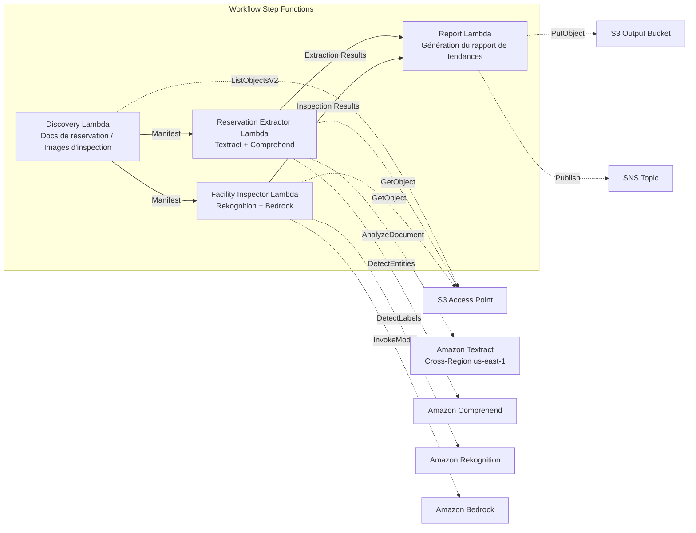

# UC20 : Voyage et hôtellerie — Traitement des documents de réservation / Analyse des images d'inspection des installations

🌐 **Language / 言語**: [日本語](README.md) | [English](README.en.md) | [한국어](README.ko.md) | [简体中文](README.zh-CN.md) | [繁體中文](README.zh-TW.md) | Français | [Deutsch](README.de.md) | [Español](README.es.md)

📚 **Documentation** : [Architecture](docs/architecture.fr.md) | [Guide de démonstration](docs/demo-guide.fr.md)

## Vue d'ensemble

Un workflow serverless qui exploite les S3 Access Points de FSx for ONTAP pour extraire automatiquement des données structurées à partir des documents de réservation d'hôtels et d'auberges (PDF, images numérisées), et pour générer automatiquement l'analyse de l'état des installations et des recommandations de maintenance à partir des images d'inspection.

### Cas où ce pattern convient

- Les confirmations de réservation, avis d'annulation et documents de correspondance client s'accumulent sur FSx for ONTAP
- Vous souhaitez extraire automatiquement le nom du client, les dates, le type de chambre et le montant des documents de réservation
- Vous souhaitez évaluer automatiquement par IA l'état des images d'inspection des installations (chambres, parties communes, extérieurs)
- Vous avez besoin d'un traitement automatique multilingue (documents clients autres qu'en japonais)
- Vous souhaitez exploiter l'analyse des tendances de l'état des installations pour la planification de la maintenance préventive

### Cas où ce pattern ne convient pas

- Un système de gestion des réservations en temps réel (PMS) est requis
- Un traitement immédiat de l'enregistrement/départ (check-in/check-out) est requis
- Une plateforme complète de gestion des installations (CAFM) est requise
- Environnements où l'accessibilité réseau à l'API REST ONTAP ne peut pas être garantie

### Fonctionnalités principales

- Détection automatique via S3 AP des documents de réservation (PDF, images numérisées) et des images d'inspection des installations
- Extraction structurée des données de réservation avec Textract + Comprehend (nom du client, dates, type de chambre, montant)
- Prise en charge multilingue (détection de langue → indices Textract + sélection automatique du modèle Comprehend)
- Analyse de l'état des installations avec Rekognition (détection de dommages, notation de propreté 0–100)
- Génération de recommandations de maintenance avec Bedrock
- Rapport de tendances de l'état des installations + résumé du traitement des réservations (JSON + format lisible par l'humain)

## Success Metrics

### Outcome
En automatisant le traitement des documents de réservation et l'analyse des images d'inspection des installations, améliorer l'efficacité opérationnelle et le maintien de la qualité des installations des chaînes hôtelières.

### Metrics
| Métrique | Valeur cible (exemple) |
|-----------|------------|
| Précision d'extraction des données de réservation | ≥ 90 % |
| Taux de détection de l'état des installations | ≥ 85 % |
| Couverture de la prise en charge multilingue | ≥ 5 langues |
| Temps de génération du rapport | < 5 min / lot |
| Coût / exécution quotidienne | < $2.00 |
| Taux obligatoire de Human Review | > 15 % (toutes les détections de dommages vérifiées) |

### Measurement Method
Historique d'exécution Step Functions, résultats d'extraction Textract/Comprehend, journaux d'analyse Rekognition, CloudWatch EMF Metrics (ProcessingDuration, SuccessCount, ErrorCount).

### Human Review Requirements
- En cas de détection de dommages aux installations, l'équipe de gestion des installations vérifie et décide de la réponse
- Les documents à faible précision d'extraction nécessitent une vérification manuelle
- Les rapports mensuels de tendances de l'état des installations sont examinés par la direction

## Architecture



### Étapes du workflow

1. **Discovery** : Détecter les documents de réservation et les images d'inspection des installations depuis le S3 AP
2. **Reservation Extractor** : Analyser les documents avec Textract + extraire les entités avec Comprehend (prise en charge multilingue)
3. **Facility Inspector** : Analyser l'état des installations avec Rekognition + générer des recommandations de maintenance avec Bedrock
4. **Report** : Générer le rapport de tendances de l'état des installations + le résumé du traitement des réservations, envoyer une notification SNS

## Prérequis

> **Note S3 AP NetworkOrigin** : La Discovery Lambda est déployée à l'intérieur d'un VPC. Si le NetworkOrigin du S3 Access Point est `Internet`, il n'est pas accessible via un S3 Gateway VPC Endpoint (les requêtes ne sont pas routées vers le plan de données FSx). Utilisez un S3 AP avec NetworkOrigin=VPC, ou configurez l'accès via une NAT Gateway. Pour plus de détails, voir [S3AP Compatibility Notes](../docs/s3ap-compatibility-notes.md).

- Compte AWS et permissions IAM appropriées
- Système de fichiers FSx for ONTAP (ONTAP 9.17.1P4D3 ou ultérieur)
- Un volume avec S3 Access Points activés
- VPC, sous-réseaux privés
- Accès au modèle Amazon Bedrock activé (Claude / Nova)
- Amazon Textract — invocation Cross-Region (us-east-1) configurée

## Procédure de déploiement

### 1. Vérification des paramètres

Vérifiez à l'avance les modèles de chemin des documents de réservation et le répertoire des images d'inspection des installations.

### 2. Déploiement SAM

```bash
# Prérequis : AWS SAM CLI requis. « sam build » empaquette automatiquement le code et la couche partagée.
sam build

sam deploy \
  --stack-name fsxn-travel-processing \
  --parameter-overrides \
    S3AccessPointAlias=<your-volume-ext-s3alias> \
    S3AccessPointName=<your-s3ap-name> \
    VpcId=<your-vpc-id> \
    PrivateSubnetIds=<subnet-1>,<subnet-2> \
    ScheduleExpression="cron(0 0 * * ? *)" \
    NotificationEmail=<your-email@example.com> \
    EnableVpcEndpoints=false \
    EnableCloudWatchAlarms=false \
  --capabilities CAPABILITY_NAMED_IAM \
  --resolve-s3 \
  --region ap-northeast-1
```

> **Note** : `template.yaml` s'utilise avec la SAM CLI (`sam build` + `sam deploy`).
> Pour un déploiement direct avec la commande `aws cloudformation deploy`, utilisez `template-deploy.yaml` à la place (nécessite l'empaquetage préalable des fichiers zip Lambda et leur téléchargement vers S3).

## Liste des paramètres de configuration

| Paramètre | Description | Par défaut | Requis |
|-----------|------|----------|------|
| `S3AccessPointAlias` | FSx for ONTAP S3 AP Alias (pour l'entrée) | — | ✅ |
| `S3AccessPointName` | Nom du S3 AP (pour l'octroi des permissions IAM) | `""` | ⚠️ Recommandé |
| `ScheduleExpression` | Expression de planification EventBridge Scheduler | `cron(0 0 * * ? *)` | |
| `VpcId` | VPC ID | — | ✅ |
| `PrivateSubnetIds` | Liste des ID de sous-réseaux privés | — | ✅ |
| `NotificationEmail` | Adresse e-mail de notification SNS | — | ✅ |
| `MapConcurrency` | Nombre d'exécutions parallèles de l'état Map | `10` | |
| `LambdaMemorySize` | Taille mémoire Lambda (MB) | `512` | |
| `LambdaTimeout` | Délai d'expiration Lambda (secondes) | `300` | |
| `EnableVpcEndpoints` | Activer les Interface VPC Endpoints | `false` | |
| `EnableCloudWatchAlarms` | Activer les CloudWatch Alarms | `false` | |

## ⚠️ Considérations de performance

- La capacité de débit de FSx for ONTAP est **partagée entre NFS/SMB/S3 AP**. Effectuer un traitement parallèle avec MapConcurrency=10 peut affecter les autres charges de travail sur le même volume.
- Pour le traitement par lots d'un grand nombre de fichiers, vérifiez la Throughput Capacity (MBps) de FSx for ONTAP et ajustez MapConcurrency en conséquence.
- Recommandé : En production, commencez d'abord avec MapConcurrency=5, puis augmentez progressivement tout en surveillant les métriques CloudWatch de FSx for ONTAP (ThroughputUtilization).

## Nettoyage

```bash
aws s3 rm s3://fsxn-travel-processing-output-${AWS_ACCOUNT_ID} --recursive

aws cloudformation delete-stack \
  --stack-name fsxn-travel-processing \
  --region ap-northeast-1

aws cloudformation wait stack-delete-complete \
  --stack-name fsxn-travel-processing \
  --region ap-northeast-1
```

## Supported Regions

| Service | Contrainte de région |
|---------|-------------|
| Amazon Textract | Invocation Cross-Region (us-east-1) |
| Amazon Comprehend | Disponible dans ap-northeast-1 |
| Amazon Rekognition | Disponible dans ap-northeast-1 |
| Amazon Bedrock | Vérifier les régions prises en charge ([Régions prises en charge par Bedrock](https://docs.aws.amazon.com/general/latest/gr/bedrock.html)) |

> Dans UC20, seul Textract est invoqué en Cross-Region (us-east-1).

## Estimation des coûts (approximation mensuelle)

> **Remarque** : Approximation pour la région ap-northeast-1. Les coûts réels varient selon l'utilisation.

| Service | Utilisation supposée | Approx. mensuelle |
|---------|-----------|---------|
| Lambda | 4 fonctions × exécution quotidienne | ~$1-3 |
| S3 API | ~3K requests/jour | ~$0.50 |
| Step Functions | ~300 transitions/jour | ~$0.25 |
| Textract | ~200 pages/jour | ~$3-8 |
| Comprehend | ~200 docs/jour | ~$1-3 |
| Rekognition | ~100 images/jour | ~$1-3 |
| Bedrock (Nova Lite) | ~20K tokens/exécution | ~$1-3 |

| Configuration | Approx. mensuelle |
|------|---------|
| Configuration minimale (1 fois par jour) | ~$8-20 |
| Configuration standard | ~$20-50 |

---

## Governance Note

> Ce pattern fournit des conseils d'architecture technique. Il ne constitue pas un avis juridique, de conformité ou réglementaire. Le traitement des documents de réservation contenant des informations personnelles des clients (nom, coordonnées, etc.) doit être conforme à la Loi sur la protection des informations personnelles et à la Loi sur les auberges et hôtels.

> **Réglementations associées** : Loi sur les agences de voyage, Loi sur la protection des informations personnelles

---

## S3AP Compatibility

Pour les contraintes de compatibilité, le dépannage et les patterns de déclenchement des S3 Access Points for FSx for ONTAP, voir [S3AP Compatibility Notes](../docs/s3ap-compatibility-notes.md).
