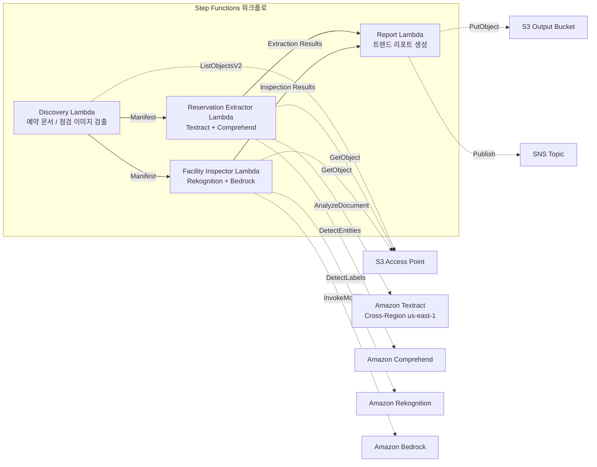

# UC20: 여행·호스피탈리티 — 예약 문서 처리 / 시설 점검 이미지 분석

🌐 **Language / 言語**: [日本語](README.md) | [English](README.en.md) | 한국어 | [简体中文](README.zh-CN.md) | [繁體中文](README.zh-TW.md) | [Français](README.fr.md) | [Deutsch](README.de.md) | [Español](README.es.md)

📚 **문서**: [아키텍처](docs/architecture.ko.md) | [데모 가이드](docs/demo-guide.ko.md)

## 개요

FSx for ONTAP의 S3 Access Points를 활용하여 호텔·료칸의 예약 문서(PDF, 스캔 이미지)에서 구조화된 데이터를 자동으로 추출하고, 시설 점검 이미지의 상태 분석·유지보수 권장 사항을 자동으로 생성하는 서버리스 워크플로입니다.

### 이 패턴이 적합한 경우

- 예약 확인서, 취소 통지, 게스트 응대 문서가 FSx for ONTAP에 축적되어 있음
- 예약 문서에서 숙박자 이름, 날짜, 객실 유형, 금액을 자동으로 추출하고 싶음
- 시설 점검 이미지(객실, 공용부, 외장)의 상태를 AI로 자동 평가하고 싶음
- 다국어 지원(일본어 이외의 게스트 문서)의 자동 처리가 필요함
- 시설 상태의 트렌드 분석과 예방 보전 계획에 활용하고 싶음

### 이 패턴이 적합하지 않은 경우

- 실시간 예약 관리 시스템(PMS)이 필요함
- 체크인/체크아웃의 즉시 처리가 필요함
- 완전한 시설 관리(CAFM) 플랫폼이 필요함
- ONTAP REST API에 대한 네트워크 도달성을 확보할 수 없는 환경

### 주요 기능

- S3 AP를 통한 예약 문서(PDF, 스캔 이미지)와 시설 점검 이미지 자동 검출
- Textract + Comprehend에 의한 예약 데이터 구조화 추출(숙박자 이름, 날짜, 객실 유형, 금액)
- 다국어 지원(언어 검출 → Textract 힌트 + Comprehend 모델 자동 선택)
- Rekognition에 의한 시설 상태 분석(손상 검출, 청결도 스코어링 0–100)
- Bedrock에 의한 유지보수 권장 사항 생성
- 시설 상태 트렌드 리포트 + 예약 처리 요약(JSON + 사람이 읽을 수 있는 형식)

## Success Metrics

### Outcome
예약 문서 처리와 시설 점검 이미지 분석의 자동화를 통해 호텔 체인의 운영 효율화와 시설 품질 유지를 실현합니다.

### Metrics
| 메트릭 | 목표값(예) |
|-----------|------------|
| 예약 데이터 추출 정확도 | ≥ 90% |
| 시설 상태 검출률 | ≥ 85% |
| 다국어 지원 커버리지 | ≥ 5개 언어 |
| 리포트 생성 시간 | < 5분 / 배치 |
| 비용 / 일일 실행 | < $2.00 |
| Human Review 필수율 | > 15%(손상 검출 시에는 전건 확인) |

### Measurement Method
Step Functions 실행 이력, Textract/Comprehend 추출 결과, Rekognition 분석 로그, CloudWatch EMF Metrics(ProcessingDuration, SuccessCount, ErrorCount).

### Human Review Requirements
- 시설 손상 검출 시에는 시설 관리 팀이 확인·대응을 판단
- 추출 정확도가 낮은 문서는 수동 확인
- 월간 시설 상태 트렌드 리포트는 경영진이 검토

## 아키텍처



### 워크플로 단계

1. **Discovery**: S3 AP에서 예약 문서와 시설 점검 이미지를 검출
2. **Reservation Extractor**: Textract로 문서 해석 + Comprehend로 엔티티 추출(다국어 지원)
3. **Facility Inspector**: Rekognition으로 시설 상태 분석 + Bedrock으로 유지보수 권장 사항 생성
4. **Report**: 시설 상태 트렌드 리포트 + 예약 처리 요약 생성, SNS 알림

## 전제 조건

> **S3 AP NetworkOrigin 주의**: Discovery Lambda는 VPC 내에 배치됩니다. S3 Access Point의 NetworkOrigin이 `Internet`인 경우 S3 Gateway VPC Endpoint를 통해서는 액세스할 수 없습니다(FSx 데이터 플레인으로 라우팅되지 않기 때문). NetworkOrigin=VPC인 S3 AP를 사용하거나 NAT Gateway를 통한 액세스를 구성하세요. 자세한 내용은 [S3AP Compatibility Notes](../docs/s3ap-compatibility-notes.md)를 참조하세요.

- AWS 계정과 적절한 IAM 권한
- FSx for ONTAP 파일 시스템(ONTAP 9.17.1P4D3 이상)
- S3 Access Points가 활성화된 볼륨
- VPC, 프라이빗 서브넷
- Amazon Bedrock 모델 액세스가 활성화됨(Claude / Nova)
- Amazon Textract — Cross-Region (us-east-1) 호출 구성

## 배포 절차

### 1. 파라미터 확인

예약 문서의 경로 패턴과 시설 점검 이미지 디렉터리를 사전에 확인합니다.

### 2. SAM 배포

```bash
# 전제: AWS SAM CLI가 필요합니다. sam build가 코드와 공유 레이어를 자동으로 패키징합니다.
sam build

sam deploy \
  --stack-name fsxn-travel-processing \
  --parameter-overrides \
    S3AccessPointAlias=<your-volume-ext-s3alias> \
    S3AccessPointName=<your-s3ap-name> \
    VpcId=<your-vpc-id> \
    PrivateSubnetIds=<subnet-1>,<subnet-2> \
    ScheduleExpression="cron(0 0 * * ? *)" \
    NotificationEmail=<your-email@example.com> \
    EnableVpcEndpoints=false \
    EnableCloudWatchAlarms=false \
  --capabilities CAPABILITY_NAMED_IAM \
  --resolve-s3 \
  --region ap-northeast-1
```

> **주의**: `template.yaml`은 SAM CLI(`sam build` + `sam deploy`)로 사용합니다.
> `aws cloudformation deploy` 명령으로 직접 배포하는 경우에는 `template-deploy.yaml`을 사용하세요(Lambda zip 파일의 사전 패키징과 S3 업로드가 필요합니다).

## 설정 파라미터 목록

| 파라미터 | 설명 | 기본값 | 필수 |
|-----------|------|----------|------|
| `S3AccessPointAlias` | FSx for ONTAP S3 AP Alias(입력용) | — | ✅ |
| `S3AccessPointName` | S3 AP 이름(IAM 권한 부여용) | `""` | ⚠️ 권장 |
| `ScheduleExpression` | EventBridge Scheduler 스케줄 식 | `cron(0 0 * * ? *)` | |
| `VpcId` | VPC ID | — | ✅ |
| `PrivateSubnetIds` | 프라이빗 서브넷 ID 목록 | — | ✅ |
| `NotificationEmail` | SNS 알림 대상 이메일 주소 | — | ✅ |
| `MapConcurrency` | Map 상태 병렬 실행 수 | `10` | |
| `LambdaMemorySize` | Lambda 메모리 크기 (MB) | `512` | |
| `LambdaTimeout` | Lambda 타임아웃 (초) | `300` | |
| `EnableVpcEndpoints` | Interface VPC Endpoints 활성화 | `false` | |
| `EnableCloudWatchAlarms` | CloudWatch Alarms 활성화 | `false` | |

## ⚠️ 성능에 관한 주의 사항

- FSx for ONTAP의 스루풋 용량은 **NFS/SMB/S3 AP 전체에서 공유**됩니다. MapConcurrency=10으로 병렬 처리를 수행하는 경우 동일 볼륨의 다른 워크로드에 영향을 줄 수 있습니다.
- 대량 파일의 일괄 처리를 수행하는 경우에는 FSx for ONTAP의 Throughput Capacity (MBps)를 확인하고 필요에 따라 MapConcurrency를 조정하세요.
- 권장: 프로덕션 환경에서는 처음에 MapConcurrency=5로 시작하고, FSx for ONTAP의 CloudWatch 메트릭(ThroughputUtilization)을 모니터링하면서 단계적으로 늘리세요.

## 정리

```bash
aws s3 rm s3://fsxn-travel-processing-output-${AWS_ACCOUNT_ID} --recursive

aws cloudformation delete-stack \
  --stack-name fsxn-travel-processing \
  --region ap-northeast-1

aws cloudformation wait stack-delete-complete \
  --stack-name fsxn-travel-processing \
  --region ap-northeast-1
```

## Supported Regions

| 서비스 | 리전 제약 |
|---------|-------------|
| Amazon Textract | Cross-Region (us-east-1) 호출 |
| Amazon Comprehend | ap-northeast-1에서 사용 가능 |
| Amazon Rekognition | ap-northeast-1에서 사용 가능 |
| Amazon Bedrock | 지원 리전 확인([Bedrock 지원 리전](https://docs.aws.amazon.com/general/latest/gr/bedrock.html)) |

> UC20은 Textract만 Cross-Region (us-east-1)에서 호출합니다.

## 비용 견적(월액 개산)

> **비고**: ap-northeast-1 리전의 개산. 실제 비용은 사용량에 따라 다릅니다.

| 서비스 | 예상 사용량 | 월액 개산 |
|---------|-----------|---------|
| Lambda | 4개 함수 × 일일 실행 | ~$1-3 |
| S3 API | ~3K requests/일 | ~$0.50 |
| Step Functions | ~300 transitions/일 | ~$0.25 |
| Textract | ~200 pages/일 | ~$3-8 |
| Comprehend | ~200 docs/일 | ~$1-3 |
| Rekognition | ~100 images/일 | ~$1-3 |
| Bedrock (Nova Lite) | ~20K tokens/실행 | ~$1-3 |

| 구성 | 월액 개산 |
|------|---------|
| 최소 구성(일일 1회) | ~$8-20 |
| 표준 구성 | ~$20-50 |

---

## Governance Note

> 본 패턴은 기술 아키텍처 가이던스를 제공합니다. 법적·컴플라이언스·규제상의 조언이 아닙니다. 숙박자의 개인정보(성명, 연락처 등)를 포함한 예약 문서의 취급은 개인정보보호법 및 여관업법을 준수해야 합니다.

> **관련 규제**: 여행업법, 개인정보보호법

---

## S3AP Compatibility

S3 Access Points for FSx for ONTAP의 호환성 제약, 문제 해결, 트리거 패턴에 대해서는 [S3AP Compatibility Notes](../docs/s3ap-compatibility-notes.md)를 참조하세요.
