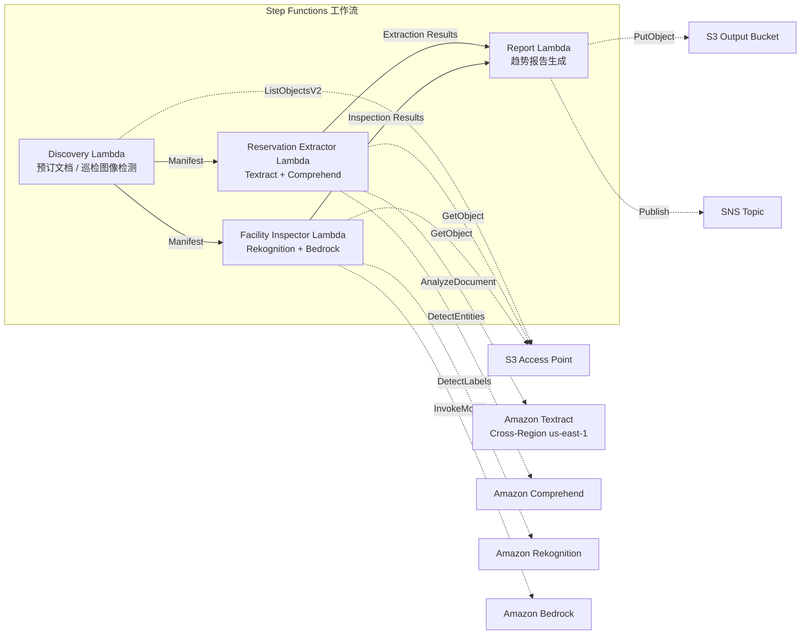

# UC20：旅行·酒店 — 预订文档处理 / 设施巡检图像分析

🌐 **Language / 言語**: [日本語](README.md) | [English](README.en.md) | [한국어](README.ko.md) | 简体中文 | [繁體中文](README.zh-TW.md) | [Français](README.fr.md) | [Deutsch](README.de.md) | [Español](README.es.md)

📚 **文档**: [架构图](docs/architecture.zh-CN.md) | [演示指南](docs/demo-guide.zh-CN.md)

## 概述

利用 FSx for ONTAP 的 S3 Access Points，从酒店·旅馆的预订文档（PDF、扫描图像）中自动提取结构化数据，并从设施巡检图像自动生成状态分析·维护建议的无服务器工作流。

### 适合此模式的场景

- 预订确认书、取消通知、宾客往来文档已积累在 FSx for ONTAP 上
- 希望从预订文档中自动提取住客姓名、日期、房型、金额
- 希望用 AI 自动评估设施巡检图像（客房、公共区域、外观）的状态
- 需要多语言支持（非日语的宾客文档）的自动处理
- 希望将设施状态趋势分析用于预防性维护计划

### 不适合此模式的场景

- 需要实时的预订管理系统（PMS）
- 需要即时的入住/退房处理
- 需要完整的设施管理（CAFM）平台
- 无法确保到 ONTAP REST API 的网络可达性的环境

### 主要功能

- 通过 S3 AP 自动检测预订文档（PDF、扫描图像）和设施巡检图像
- 基于 Textract + Comprehend 的预订数据结构化提取（住客姓名、日期、房型、金额）
- 多语言支持（语言检测 → Textract 提示 + Comprehend 模型自动选择）
- 基于 Rekognition 的设施状态分析（损坏检测、清洁度评分 0–100）
- 基于 Bedrock 的维护建议生成
- 设施状态趋势报告 + 预订处理摘要（JSON + 人类可读格式）

## Success Metrics

### Outcome
通过预订文档处理和设施巡检图像分析的自动化，实现酒店连锁的运营效率化与设施质量维持。

### Metrics
| 指标 | 目标值（示例） |
|-----------|------------|
| 预订数据提取精度 | ≥ 90% |
| 设施状态检测率 | ≥ 85% |
| 多语言支持覆盖率 | ≥ 5 种语言 |
| 报告生成时间 | < 5 分钟 / 批次 |
| 成本 / 每日执行 | < $2.00 |
| Human Review 必需率 | > 15%（检测到损坏时全部确认） |

### Measurement Method
Step Functions 执行历史、Textract/Comprehend 提取结果、Rekognition 分析日志、CloudWatch EMF Metrics（ProcessingDuration, SuccessCount, ErrorCount）。

### Human Review Requirements
- 检测到设施损坏时由设施管理团队确认·判断应对措施
- 提取精度较低的文档需人工确认
- 月度设施状态趋势报告由管理层审阅

## 架构



### 工作流步骤

1. **Discovery**：从 S3 AP 检测预订文档和设施巡检图像
2. **Reservation Extractor**：用 Textract 解析文档 + 用 Comprehend 提取实体（多语言支持）
3. **Facility Inspector**：用 Rekognition 分析设施状态 + 用 Bedrock 生成维护建议
4. **Report**：生成设施状态趋势报告 + 预订处理摘要，发送 SNS 通知

## 前提条件

> **S3 AP NetworkOrigin 注意**：Discovery Lambda 部署在 VPC 内。当 S3 Access Point 的 NetworkOrigin 为 `Internet` 时，无法通过 S3 Gateway VPC Endpoint 访问（因为不会路由到 FSx 数据平面）。请使用 NetworkOrigin=VPC 的 S3 AP，或配置通过 NAT Gateway 的访问。详情请参阅 [S3AP Compatibility Notes](../docs/s3ap-compatibility-notes.md)。

- AWS 账户和适当的 IAM 权限
- FSx for ONTAP 文件系统（ONTAP 9.17.1P4D3 及以上）
- 已启用 S3 Access Points 的卷
- VPC、私有子网
- 已启用 Amazon Bedrock 模型访问（Claude / Nova）
- Amazon Textract — Cross-Region (us-east-1) 调用配置

## 部署步骤

### 1. 确认参数

事先确认预订文档的路径模式和设施巡检图像目录。

### 2. SAM 部署

```bash
# 前提：需要 AWS SAM CLI。sam build 会自动打包代码和共享层。
sam build

sam deploy \
  --stack-name fsxn-travel-processing \
  --parameter-overrides \
    S3AccessPointAlias=<your-volume-ext-s3alias> \
    S3AccessPointName=<your-s3ap-name> \
    VpcId=<your-vpc-id> \
    PrivateSubnetIds=<subnet-1>,<subnet-2> \
    ScheduleExpression="cron(0 0 * * ? *)" \
    NotificationEmail=<your-email@example.com> \
    EnableVpcEndpoints=false \
    EnableCloudWatchAlarms=false \
  --capabilities CAPABILITY_NAMED_IAM \
  --resolve-s3 \
  --region ap-northeast-1
```

> **注意**：`template.yaml` 用于 SAM CLI（`sam build` + `sam deploy`）。
> 如果使用 `aws cloudformation deploy` 命令直接部署，请使用 `template-deploy.yaml`（需要预先打包 Lambda zip 文件并上传到 S3）。

## 配置参数一览

| 参数 | 说明 | 默认值 | 必需 |
|-----------|------|----------|------|
| `S3AccessPointAlias` | FSx for ONTAP S3 AP Alias（输入用） | — | ✅ |
| `S3AccessPointName` | S3 AP 名称（用于授予 IAM 权限） | `""` | ⚠️ 推荐 |
| `ScheduleExpression` | EventBridge Scheduler 调度表达式 | `cron(0 0 * * ? *)` | |
| `VpcId` | VPC ID | — | ✅ |
| `PrivateSubnetIds` | 私有子网 ID 列表 | — | ✅ |
| `NotificationEmail` | SNS 通知目标邮箱地址 | — | ✅ |
| `MapConcurrency` | Map 状态并行执行数 | `10` | |
| `LambdaMemorySize` | Lambda 内存大小 (MB) | `512` | |
| `LambdaTimeout` | Lambda 超时 (秒) | `300` | |
| `EnableVpcEndpoints` | 启用 Interface VPC Endpoints | `false` | |
| `EnableCloudWatchAlarms` | 启用 CloudWatch Alarms | `false` | |

## ⚠️ 性能相关注意事项

- FSx for ONTAP 的吞吐量容量**在 NFS/SMB/S3 AP 之间共享**。以 MapConcurrency=10 进行并行处理时，可能会影响同一卷上的其他工作负载。
- 进行大量文件的批量处理时，请确认 FSx for ONTAP 的 Throughput Capacity (MBps)，并根据需要调整 MapConcurrency。
- 建议：在生产环境中先以 MapConcurrency=5 开始，一边监控 FSx for ONTAP 的 CloudWatch 指标（ThroughputUtilization），一边逐步增加。

## 清理

```bash
aws s3 rm s3://fsxn-travel-processing-output-${AWS_ACCOUNT_ID} --recursive

aws cloudformation delete-stack \
  --stack-name fsxn-travel-processing \
  --region ap-northeast-1

aws cloudformation wait stack-delete-complete \
  --stack-name fsxn-travel-processing \
  --region ap-northeast-1
```

## Supported Regions

| 服务 | 区域约束 |
|---------|-------------|
| Amazon Textract | Cross-Region (us-east-1) 调用 |
| Amazon Comprehend | 在 ap-northeast-1 可用 |
| Amazon Rekognition | 在 ap-northeast-1 可用 |
| Amazon Bedrock | 确认支持的区域（[Bedrock 支持的区域](https://docs.aws.amazon.com/general/latest/gr/bedrock.html)） |

> UC20 仅将 Textract 以 Cross-Region (us-east-1) 调用。

## 成本估算（每月概算）

> **备注**：ap-northeast-1 区域的概算。实际成本因使用量而异。

| 服务 | 假定使用量 | 每月概算 |
|---------|-----------|---------|
| Lambda | 4 个函数 × 每日执行 | ~$1-3 |
| S3 API | ~3K requests/天 | ~$0.50 |
| Step Functions | ~300 transitions/天 | ~$0.25 |
| Textract | ~200 pages/天 | ~$3-8 |
| Comprehend | ~200 docs/天 | ~$1-3 |
| Rekognition | ~100 images/天 | ~$1-3 |
| Bedrock (Nova Lite) | ~20K tokens/执行 | ~$1-3 |

| 配置 | 每月概算 |
|------|---------|
| 最小配置（每日 1 次） | ~$8-20 |
| 标准配置 | ~$20-50 |

---

## Governance Note

> 本模式提供技术架构指导。并非法律·合规·监管方面的建议。包含住客个人信息（姓名、联系方式等）的预订文档的处理，必须遵守个人信息保护法和旅馆业法。

> **相关法规**: 旅行业法, 个人信息保护法

---

## S3AP Compatibility

关于 S3 Access Points for FSx for ONTAP 的兼容性约束、故障排查和触发模式，请参阅 [S3AP Compatibility Notes](../docs/s3ap-compatibility-notes.md)。
