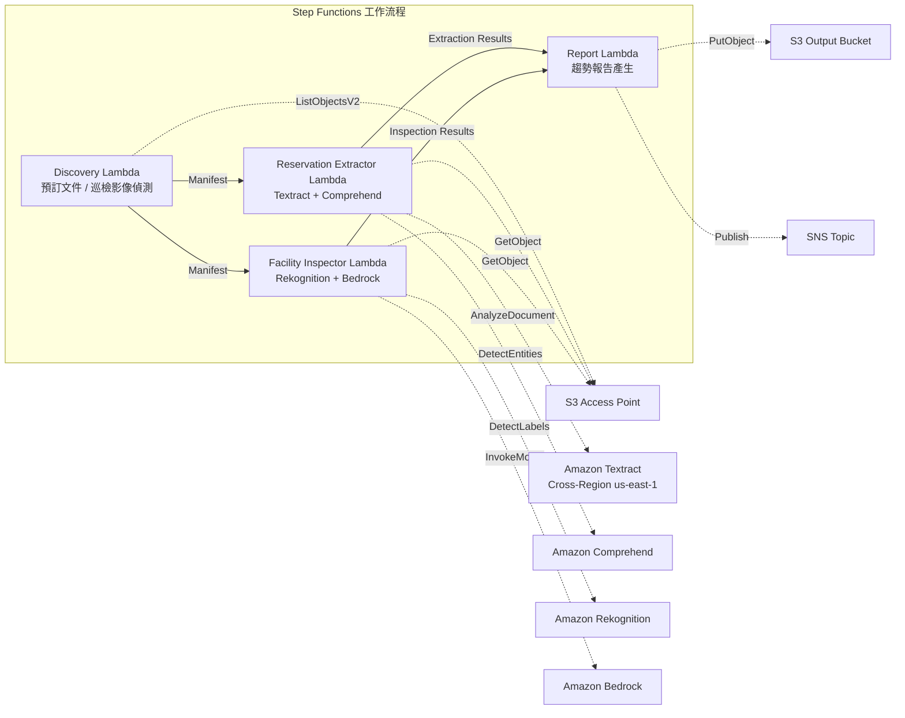

# UC20：旅行·飯店服務 — 預訂文件處理 / 設施巡檢影像分析

🌐 **Language / 言語**: [日本語](README.md) | [English](README.en.md) | [한국어](README.ko.md) | [简体中文](README.zh-CN.md) | 繁體中文 | [Français](README.fr.md) | [Deutsch](README.de.md) | [Español](README.es.md)

📚 **文件**: [架構圖](docs/architecture.zh-TW.md) | [示範指南](docs/demo-guide.zh-TW.md)

## 概述

運用 FSx for ONTAP 的 S3 Access Points，從飯店·旅館的預訂文件（PDF、掃描影像）中自動擷取結構化資料，並從設施巡檢影像自動產生狀態分析·維護建議的無伺服器工作流程。

### 適合此模式的情境

- 預訂確認書、取消通知、賓客往來文件已累積在 FSx for ONTAP 上
- 希望從預訂文件中自動擷取住客姓名、日期、房型、金額
- 希望以 AI 自動評估設施巡檢影像（客房、公共區域、外觀）的狀態
- 需要多語言支援（非日語的賓客文件）的自動處理
- 希望將設施狀態趨勢分析運用於預防性維護計畫

### 不適合此模式的情境

- 需要即時的預訂管理系統（PMS）
- 需要即時的入住/退房處理
- 需要完整的設施管理（CAFM）平台
- 無法確保連至 ONTAP REST API 的網路可達性的環境

### 主要功能

- 透過 S3 AP 自動偵測預訂文件（PDF、掃描影像）與設施巡檢影像
- 以 Textract + Comprehend 進行預訂資料結構化擷取（住客姓名、日期、房型、金額）
- 多語言支援（語言偵測 → Textract 提示 + Comprehend 模型自動選擇）
- 以 Rekognition 進行設施狀態分析（損壞偵測、清潔度評分 0–100）
- 以 Bedrock 產生維護建議
- 設施狀態趨勢報告 + 預訂處理摘要（JSON + 人類可讀格式）

## Success Metrics

### Outcome
透過預訂文件處理與設施巡檢影像分析的自動化，實現飯店連鎖的營運效率化與設施品質維持。

### Metrics
| 指標 | 目標值（範例） |
|-----------|------------|
| 預訂資料擷取精度 | ≥ 90% |
| 設施狀態偵測率 | ≥ 85% |
| 多語言支援涵蓋率 | ≥ 5 種語言 |
| 報告產生時間 | < 5 分鐘 / 批次 |
| 成本 / 每日執行 | < $2.00 |
| Human Review 必需率 | > 15%（偵測到損壞時全部確認） |

### Measurement Method
Step Functions 執行歷程、Textract/Comprehend 擷取結果、Rekognition 分析日誌、CloudWatch EMF Metrics（ProcessingDuration, SuccessCount, ErrorCount）。

### Human Review Requirements
- 偵測到設施損壞時由設施管理團隊確認·判斷因應措施
- 擷取精度較低的文件需人工確認
- 每月設施狀態趨勢報告由經營層審閱

## 架構



### 工作流程步驟

1. **Discovery**：從 S3 AP 偵測預訂文件與設施巡檢影像
2. **Reservation Extractor**：以 Textract 解析文件 + 以 Comprehend 擷取實體（多語言支援）
3. **Facility Inspector**：以 Rekognition 分析設施狀態 + 以 Bedrock 產生維護建議
4. **Report**：產生設施狀態趨勢報告 + 預訂處理摘要，傳送 SNS 通知

## 前提條件

> **S3 AP NetworkOrigin 注意**：Discovery Lambda 部署於 VPC 內。當 S3 Access Point 的 NetworkOrigin 為 `Internet` 時，無法透過 S3 Gateway VPC Endpoint 存取（因為不會路由至 FSx 資料平面）。請使用 NetworkOrigin=VPC 的 S3 AP，或設定透過 NAT Gateway 的存取。詳情請參閱 [S3AP Compatibility Notes](../docs/s3ap-compatibility-notes.md)。

- AWS 帳戶與適當的 IAM 權限
- FSx for ONTAP 檔案系統（ONTAP 9.17.1P4D3 以上）
- 已啟用 S3 Access Points 的磁碟區
- VPC、私有子網路
- 已啟用 Amazon Bedrock 模型存取（Claude / Nova）
- Amazon Textract — Cross-Region (us-east-1) 呼叫設定

## 部署步驟

### 1. 確認參數

事先確認預訂文件的路徑模式與設施巡檢影像目錄。

### 2. SAM 部署

```bash
# 前提：需要 AWS SAM CLI。sam build 會自動封裝程式碼與共用層。
sam build

sam deploy \
  --stack-name fsxn-travel-processing \
  --parameter-overrides \
    S3AccessPointAlias=<your-volume-ext-s3alias> \
    S3AccessPointName=<your-s3ap-name> \
    VpcId=<your-vpc-id> \
    PrivateSubnetIds=<subnet-1>,<subnet-2> \
    ScheduleExpression="cron(0 0 * * ? *)" \
    NotificationEmail=<your-email@example.com> \
    EnableVpcEndpoints=false \
    EnableCloudWatchAlarms=false \
  --capabilities CAPABILITY_NAMED_IAM \
  --resolve-s3 \
  --region ap-northeast-1
```

> **注意**：`template.yaml` 用於 SAM CLI（`sam build` + `sam deploy`）。
> 若使用 `aws cloudformation deploy` 命令直接部署，請使用 `template-deploy.yaml`（需要事先封裝 Lambda zip 檔案並上傳至 S3）。

## 設定參數一覽

| 參數 | 說明 | 預設值 | 必需 |
|-----------|------|----------|------|
| `S3AccessPointAlias` | FSx for ONTAP S3 AP Alias（輸入用） | — | ✅ |
| `S3AccessPointName` | S3 AP 名稱（用於授予 IAM 權限） | `""` | ⚠️ 建議 |
| `ScheduleExpression` | EventBridge Scheduler 排程運算式 | `cron(0 0 * * ? *)` | |
| `VpcId` | VPC ID | — | ✅ |
| `PrivateSubnetIds` | 私有子網路 ID 清單 | — | ✅ |
| `NotificationEmail` | SNS 通知目標電子郵件地址 | — | ✅ |
| `MapConcurrency` | Map 狀態並行執行數 | `10` | |
| `LambdaMemorySize` | Lambda 記憶體大小 (MB) | `512` | |
| `LambdaTimeout` | Lambda 逾時 (秒) | `300` | |
| `EnableVpcEndpoints` | 啟用 Interface VPC Endpoints | `false` | |
| `EnableCloudWatchAlarms` | 啟用 CloudWatch Alarms | `false` | |

## ⚠️ 效能相關注意事項

- FSx for ONTAP 的輸送量容量**在 NFS/SMB/S3 AP 之間共用**。以 MapConcurrency=10 進行並行處理時，可能會影響同一磁碟區上的其他工作負載。
- 進行大量檔案的批次處理時，請確認 FSx for ONTAP 的 Throughput Capacity (MBps)，並視需要調整 MapConcurrency。
- 建議：在正式環境中先以 MapConcurrency=5 開始，一邊監控 FSx for ONTAP 的 CloudWatch 指標（ThroughputUtilization），一邊逐步增加。

## 清理

```bash
aws s3 rm s3://fsxn-travel-processing-output-${AWS_ACCOUNT_ID} --recursive

aws cloudformation delete-stack \
  --stack-name fsxn-travel-processing \
  --region ap-northeast-1

aws cloudformation wait stack-delete-complete \
  --stack-name fsxn-travel-processing \
  --region ap-northeast-1
```

## Supported Regions

| 服務 | 區域限制 |
|---------|-------------|
| Amazon Textract | Cross-Region (us-east-1) 呼叫 |
| Amazon Comprehend | 於 ap-northeast-1 可用 |
| Amazon Rekognition | 於 ap-northeast-1 可用 |
| Amazon Bedrock | 確認支援的區域（[Bedrock 支援的區域](https://docs.aws.amazon.com/general/latest/gr/bedrock.html)） |

> UC20 僅將 Textract 以 Cross-Region (us-east-1) 呼叫。

## 成本估算（每月概算）

> **附註**：ap-northeast-1 區域的概算。實際成本依使用量而異。

| 服務 | 假定使用量 | 每月概算 |
|---------|-----------|---------|
| Lambda | 4 個函式 × 每日執行 | ~$1-3 |
| S3 API | ~3K requests/日 | ~$0.50 |
| Step Functions | ~300 transitions/日 | ~$0.25 |
| Textract | ~200 pages/日 | ~$3-8 |
| Comprehend | ~200 docs/日 | ~$1-3 |
| Rekognition | ~100 images/日 | ~$1-3 |
| Bedrock (Nova Lite) | ~20K tokens/執行 | ~$1-3 |

| 組態 | 每月概算 |
|------|---------|
| 最小組態（每日 1 次） | ~$8-20 |
| 標準組態 | ~$20-50 |

---

## Governance Note

> 本模式提供技術架構指引。並非法律·合規·法規方面的建議。包含住客個人資訊（姓名、聯絡方式等）的預訂文件的處理，必須遵循個人資訊保護法與旅館業法。

> **相關法規**: 旅行業法, 個人資訊保護法

---

## S3AP Compatibility

關於 S3 Access Points for FSx for ONTAP 的相容性限制、疑難排解與觸發模式，請參閱 [S3AP Compatibility Notes](../docs/s3ap-compatibility-notes.md)。
