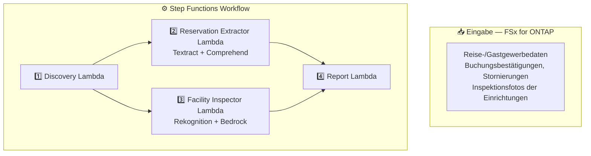

# UC20: Reise & Gastgewerbe — Architektur

🌐 **Language / 言語**: [日本語](architecture.md) | [English](architecture.en.md) | [한국어](architecture.ko.md) | [简体中文](architecture.zh-CN.md) | [繁體中文](architecture.zh-TW.md) | [Français](architecture.fr.md) | Deutsch | [Español](architecture.es.md)

## Architekturdiagramm

## Verwendete AWS-Services

| Service | Rolle |
|---------|-------|
| FSx for ONTAP | Speicher für Dokumente und Bilder |
| Amazon Textract | Dokumentenanalyse (Cross-Region us-east-1) |
| Amazon Comprehend | Entitätsextraktion und Spracherkennung |
| Amazon Rekognition | Bildanalyse des Einrichtungszustands |
| Amazon Bedrock | Wartungsempfehlungsgenerierung |

## Wichtige Entwurfsentscheidungen

1. **Parallelverarbeitung** — Reservierungsextraktion und Gebäudeinspektion laufen unabhängig
2. **Cross-Region Textract** — Nutzt us-east-1 für vollständige Funktionsverfügbarkeit
3. **Automatische Mehrspracherkennung** — Comprehend erkennt Sprache und wählt passende Modelle
4. **Sauberkeitsbewertung** — Rekognition-Labels werden von Bedrock in 0–100-Score umgewandelt
5. **Fehlerisolierung** — Einzelne Dokumentfehler stoppen nicht den gesamten Batch
