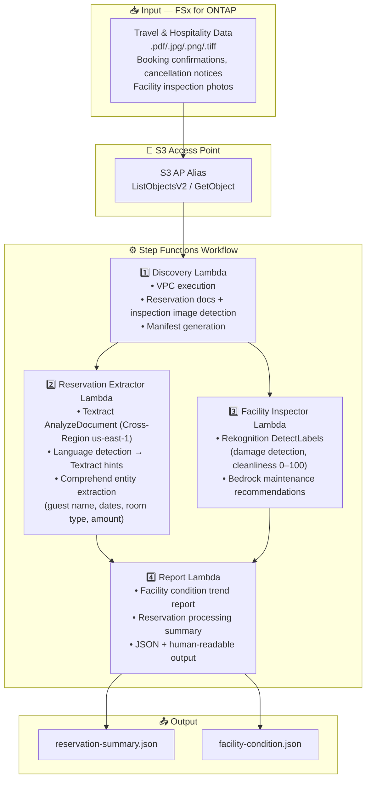

# UC20: Travel & Hospitality — Reservation Document Processing / Facility Inspection Architecture

🌐 **Language / 言語**: [日本語](architecture.md) | English | [한국어](architecture.ko.md) | [简体中文](architecture.zh-CN.md) | [繁體中文](architecture.zh-TW.md) | [Français](architecture.fr.md) | [Deutsch](architecture.de.md) | [Español](architecture.es.md)

## Architecture Diagram

## AWS Services Used

| Service | Role |
|---------|------|
| FSx for ONTAP | Storage for reservation documents and inspection images |
| S3 Access Points | Serverless access to ONTAP volumes |
| Amazon Textract | Document analysis (Cross-Region us-east-1) |
| Amazon Comprehend | Entity extraction and language detection |
| Amazon Rekognition | Facility condition image analysis |
| Amazon Bedrock | Maintenance recommendation generation |
| Step Functions | Workflow orchestration |
| EventBridge Scheduler | Daily trigger |

## Key Design Decisions

1. **Parallel processing** — Reservation extraction and facility inspection run independently
2. **Cross-Region Textract** — Uses us-east-1 for full Textract feature availability
3. **Multilingual auto-detection** — Comprehend detects language, selects appropriate models
4. **Cleanliness scoring** — Rekognition labels interpreted by Bedrock into 0–100 score
5. **Error isolation** — Individual document failures don't stop the batch
