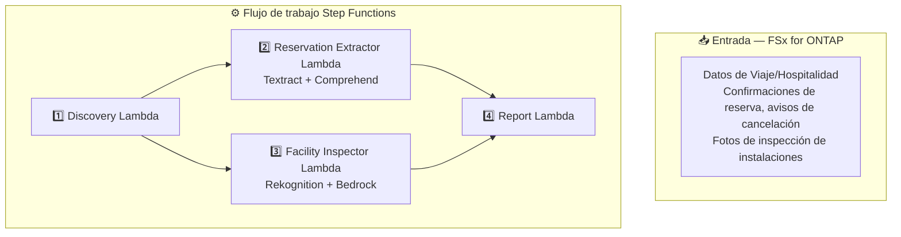

# UC20: Viajes y Hospitalidad — Arquitectura

🌐 **Language / 言語**: [日本語](architecture.md) | [English](architecture.en.md) | [한국어](architecture.ko.md) | [简体中文](architecture.zh-CN.md) | [繁體中文](architecture.zh-TW.md) | [Français](architecture.fr.md) | [Deutsch](architecture.de.md) | Español

## Diagrama de arquitectura

## Servicios AWS utilizados

| Servicio | Rol |
|----------|-----|
| FSx for ONTAP | Almacenamiento de documentos e imágenes |
| Amazon Textract | Análisis de documentos (Cross-Region us-east-1) |
| Amazon Comprehend | Extracción de entidades y detección de idioma |
| Amazon Rekognition | Análisis de imágenes del estado de instalaciones |
| Amazon Bedrock | Generación de recomendaciones de mantenimiento |

## Decisiones de diseño clave

1. **Procesamiento paralelo** — Extracción de reservas e inspección de instalaciones se ejecutan independientemente
2. **Cross-Region Textract** — Usa us-east-1 para disponibilidad completa de funciones
3. **Detección multilingüe automática** — Comprehend detecta el idioma y selecciona modelos apropiados
4. **Puntuación de limpieza** — Etiquetas Rekognition interpretadas por Bedrock en puntuación 0–100
5. **Aislamiento de errores** — Fallos individuales no detienen el lote completo
