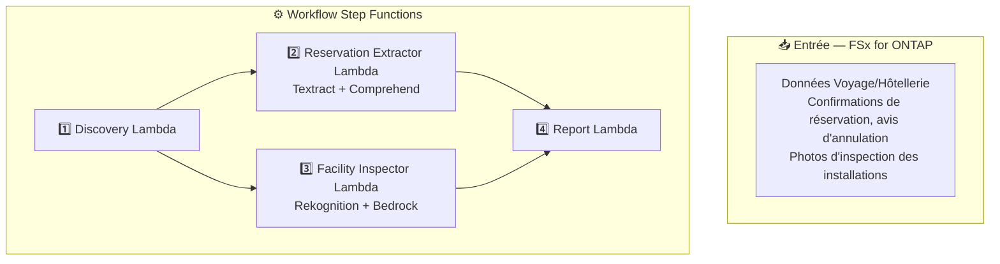

# UC20 : Voyage et Hôtellerie — Architecture

🌐 **Language / 言語**: [日本語](architecture.md) | [English](architecture.en.md) | [한국어](architecture.ko.md) | [简体中文](architecture.zh-CN.md) | [繁體中文](architecture.zh-TW.md) | Français | [Deutsch](architecture.de.md) | [Español](architecture.es.md)

## Diagramme d'architecture

## Services AWS utilisés

| Service | Rôle |
|---------|------|
| FSx for ONTAP | Stockage des documents et images |
| Amazon Textract | Analyse de documents (Cross-Region us-east-1) |
| Amazon Comprehend | Extraction d'entités et détection de langue |
| Amazon Rekognition | Analyse d'images de l'état des installations |
| Amazon Bedrock | Génération de recommandations de maintenance |

## Décisions de conception clés

1. **Traitement parallèle** — Extraction des réservations et inspection des installations exécutées indépendamment
2. **Cross-Region Textract** — Utilise us-east-1 pour la disponibilité complète des fonctionnalités
3. **Détection multilingue automatique** — Comprehend détecte la langue et sélectionne les modèles appropriés
4. **Score de propreté** — Labels Rekognition interprétés par Bedrock en score 0–100
5. **Isolation des erreurs** — Les échecs individuels n'arrêtent pas le lot
