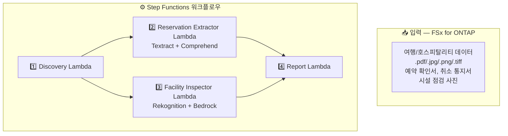

# UC20: 여행 및 호스피탈리티 — 예약 문서 처리 / 시설 점검 이미지 분석 아키텍처

🌐 **Language / 言語**: [日本語](architecture.md) | [English](architecture.en.md) | 한국어 | [简体中文](architecture.zh-CN.md) | [繁體中文](architecture.zh-TW.md) | [Français](architecture.fr.md) | [Deutsch](architecture.de.md) | [Español](architecture.es.md)

## 아키텍처 다이어그램

## 사용 AWS 서비스

| 서비스 | 역할 |
|--------|------|
| FSx for ONTAP | 예약 문서 및 점검 이미지 스토리지 |
| S3 Access Points | ONTAP 볼륨에 대한 서버리스 접근 |
| Amazon Textract | 문서 분석 (Cross-Region us-east-1) |
| Amazon Comprehend | 엔티티 추출 및 언어 감지 |
| Amazon Rekognition | 시설 상태 이미지 분석 |
| Amazon Bedrock | 유지보수 권장 사항 생성 |

## 주요 설계 결정

1. **병렬 처리** — 예약 추출과 시설 점검은 독립적으로 실행
2. **Cross-Region Textract** — 전체 기능 활용을 위해 us-east-1 사용
3. **다국어 자동 감지** — Comprehend로 언어 감지 후 적절한 모델 선택
4. **청결도 점수화** — Rekognition 레이블을 Bedrock로 0–100 점수로 변환
5. **오류 격리** — 개별 문서 실패가 배치 전체를 중단시키지 않음
