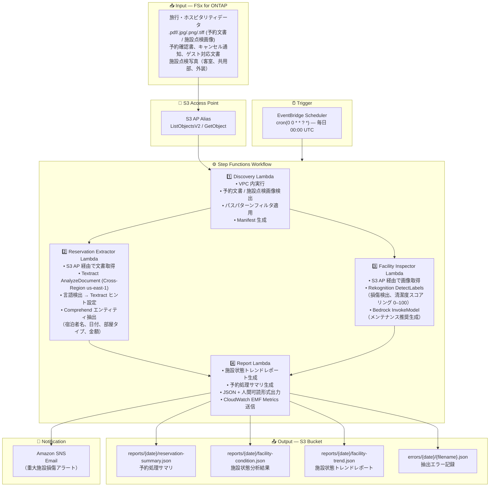

# UC20: 旅行・ホスピタリティ — 予約文書処理 / 施設点検画像分析 アーキテクチャ

🌐 **Language / 言語**: 日本語 | [English](architecture.en.md) | [한국어](architecture.ko.md) | [简体中文](architecture.zh-CN.md) | [繁體中文](architecture.zh-TW.md) | [Français](architecture.fr.md) | [Deutsch](architecture.de.md) | [Español](architecture.es.md)

## End-to-End Architecture (Input → Output)

---

## Architecture Diagram

---

## Data Flow Detail

### Input
| 項目 | 説明 |
|------|------|
| **ソース** | FSx for ONTAP ボリューム |
| **ファイル種別** | PDF、スキャン画像（予約文書）、JPEG/PNG/TIFF（施設点検画像） |
| **アクセス方法** | S3 Access Point（ListObjectsV2 + GetObject） |
| **読み取り戦略** | パスパターン + 拡張子フィルタ |

### Processing
| ステップ | サービス | 処理内容 |
|---------|---------|---------|
| Discovery | Lambda (VPC) | 予約文書・施設点検画像の検出、Manifest 生成 |
| Reservation Extractor | Lambda + Textract (Cross-Region) + Comprehend | 予約データ構造化抽出（多言語対応） |
| Facility Inspector | Lambda + Rekognition + Bedrock | 施設状態分析 + メンテナンス推奨 |
| Report | Lambda | トレンドレポート + サマリ生成 |

### Output
| アーティファクト | フォーマット | 説明 |
|--------------|---------|------|
| 予約処理サマリ | `reports/{date}/reservation-summary.json` | 宿泊者名、日付、部屋タイプ、金額 |
| 施設状態分析 | `reports/{date}/facility-condition.json` | 損傷検出結果、清潔度スコア (0–100) |
| 施設状態トレンド | `reports/{date}/facility-trend.json` | 経時変化分析、メンテナンス推奨 |
| 抽出エラー | `errors/{date}/{filename}.json` | ファイルパス、エラーカテゴリ、詳細 |

---

## Key Design Decisions

1. **予約文書と施設画像の並列処理** — Reservation Extractor と Facility Inspector は独立実行。Map State で並列化
2. **Cross-Region Textract** — ap-northeast-1 では Textract の一部機能が制限されるため us-east-1 を使用
3. **多言語自動検出** — 文書言語を Comprehend で検出し、Textract ヒント + 適切な Comprehend モデルを自動選択
4. **清潔度スコアリング** — Rekognition ラベルを Bedrock で解釈し、0–100 の数値スコアに変換
5. **エラー分離** — 文書抽出失敗は個別記録し、バッチ全体を停止させない
6. **ポーリングベース** — S3 AP はイベント通知非対応のため EventBridge Scheduler による日次実行

---

## AWS Services Used

| サービス | 役割 |
|---------|------|
| FSx for ONTAP | 予約文書・点検画像のストレージ |
| S3 Access Points | ONTAP ボリュームへのサーバーレスアクセス |
| EventBridge Scheduler | 日次トリガー |
| Step Functions | ワークフローオーケストレーション |
| Lambda | コンピュート（Discovery, Reservation Extractor, Facility Inspector, Report） |
| Amazon Textract | 文書解析・テキスト抽出（Cross-Region us-east-1） |
| Amazon Comprehend | エンティティ抽出・言語検出 |
| Amazon Rekognition | 施設状態画像分析 |
| Amazon Bedrock | メンテナンス推奨生成 |
| SNS | 重大損傷アラート通知 |
| Secrets Manager | ONTAP REST API 認証情報管理 |
| CloudWatch + X-Ray | オブザーバビリティ |
