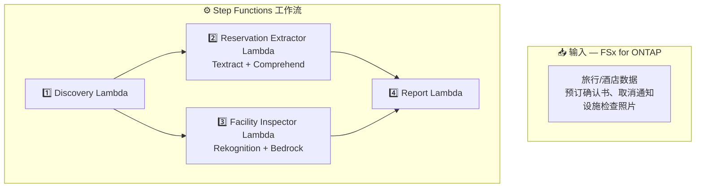

# UC20: 旅行与酒店业 — 预订文档处理 / 设施检查图像分析 架构

🌐 **Language / 言語**: [日本語](architecture.md) | [English](architecture.en.md) | [한국어](architecture.ko.md) | 简体中文 | [繁體中文](architecture.zh-TW.md) | [Français](architecture.fr.md) | [Deutsch](architecture.de.md) | [Español](architecture.es.md)

## 架构图

## 使用的 AWS 服务

| 服务 | 角色 |
|------|------|
| FSx for ONTAP | 预订文档和检查图像存储 |
| Amazon Textract | 文档分析（Cross-Region us-east-1） |
| Amazon Comprehend | 实体提取和语言检测 |
| Amazon Rekognition | 设施状态图像分析 |
| Amazon Bedrock | 维护建议生成 |

## 关键设计决策

1. **并行处理** — 预订提取和设施检查独立执行
2. **Cross-Region Textract** — 使用 us-east-1 获取完整功能
3. **多语言自动检测** — Comprehend 检测语言后选择适当模型
4. **清洁度评分** — Rekognition 标签由 Bedrock 转换为 0–100 分数
5. **错误隔离** — 单个文档失败不会中断整个批次
